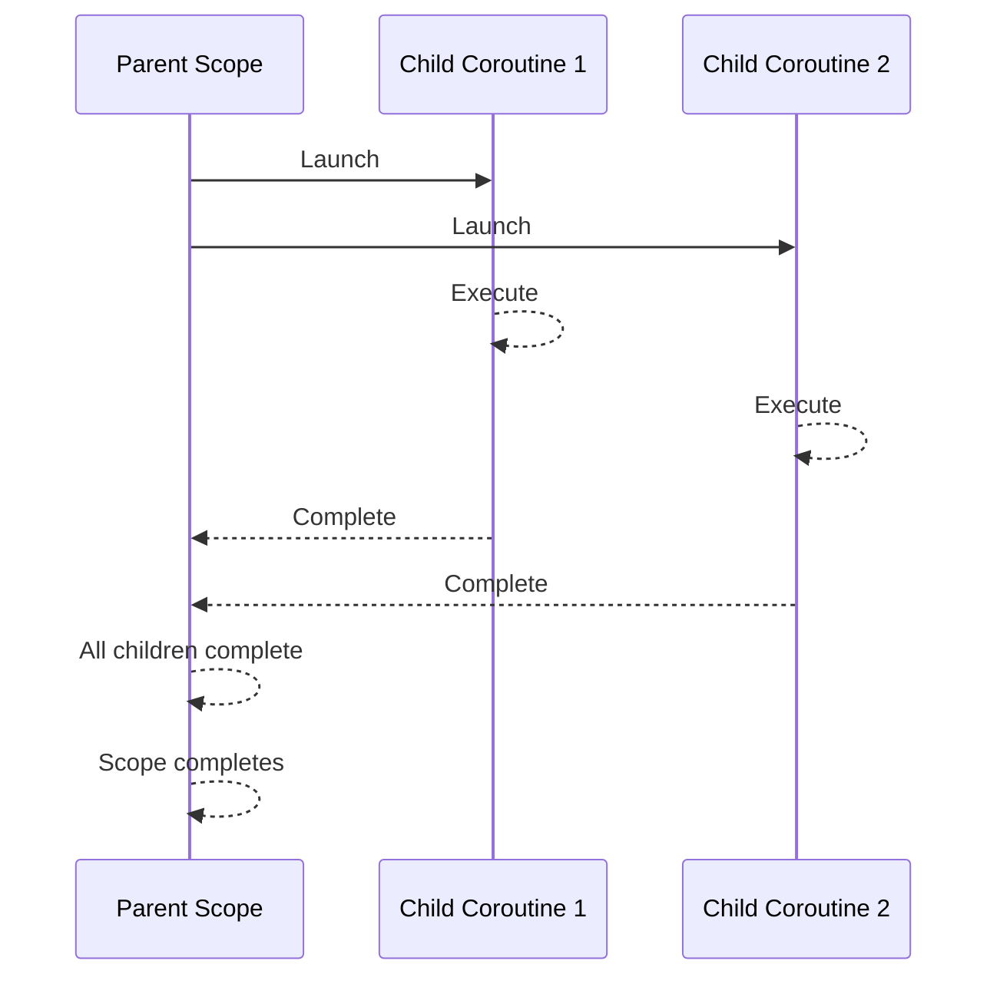

## refer

- [coroutine basic](https://kotlinlang.org/docs/coroutines-basics.html#structured-concurrency)


## 1-quick start

### 1-1 hello world

**1)-快速的 Hello World**

```kotlin
dependencies {  
//    runtimeOnly("org.jetbrains.kotlinx:kotlinx-coroutines-core:1.9.0")  
    implementation("org.jetbrains.kotlinx:kotlinx-coroutines-core:1.9.0")  
}
```

```kotlin
import kotlinx.coroutines.*  
  
fun main() = runBlocking { // this: CoroutineScope  
    launch { // launch a new coroutine and continue  
        delay(1000L) // non-blocking delay for 1 second (default time unit is ms)  
        println("World!") // print after delay  
    }  
    println("Hello") // main coroutine continues while a previous one is delayed  
}
```


- `runBlocking` 启动了一个 上下文. 只有这个 `Scope` 内部才能启动协程
- `launch` 则是启动协程的方法
- `delay` : `suspend` 方法, 把协程挂起,等待唤醒, 完全不会 `block` 底层的 `thread` , 这个 `thread` 会被其他的协程调度使用.

### 1-2 structured concurrency

**1)-Demo**

协程一定要在 `CoroutineScope` 中才能启动. 这是基于 `golang` 的  `routine` 的优缺点反复讨论之后的 协程范式, 结构化并发.


1. 协程的生命周期在 `Scope` 中会被明确的定义 ;
2. 协程可以有 **父子关系**,  父协程不会在 子协程完成之前结束 ;





```kotlin
fun main() = runBlocking {  
    try {  
        coroutineScope { // 创建一个协程作用域  
            launch {  
                delay(500L)  
                println("Task 1 完成")  
            }  
            launch {  
                delay(300L)  
                println("Task 2 完成")  
                throw RuntimeException("Task 2 出错")  
            }  
            launch {  
                delay(400L)  
                println("Task 3 完成")  
            }  
            println("等待所有任务完成")  
        }  
    } catch (e: Exception) {  
        println("捕获到异常: ${e.message}")  
    }  
    println("所有任务已完成或被取消")  
}
```


**2)-History**

结构化并发模式 的概念是 `2018` 年由 `Nathaniel J Smith` 提出.  理论基础:

1. 把并发程序的执行流程 组织为一个 树状结构， 让程序的执行路径更加的清晰和可以预测;
2. 解决资源泄露问题: 通过把并发操作限制在一个特殊的 作用域中，确保所有的子任务 在作用域结束的时候会被自动清理 ;
3. 解决错误问题的复杂性问题: 提供了 一种统一的 错误传播机制, 让错误可以 树状关系向上传播 ;
4. 把任务的 生命周期和创建它的作用域绑定，简化管理

**3) scope**

- The coroutine scope is responsible for the structure and parent-child relationships between different coroutines. New coroutines usually


### 1-3 Example

**1)-获取 repos 的 Contributors**

```kotlin
interface GitHubService {
    @GET("orgs/{org}/repos?per_page=100")
    fun getOrgReposCall(
        @Path("org") org: String
    ): Call<List<GithubRepo>>

    @GET("repos/{owner}/{repo}/contributors?per_page=100")
    fun getRepoContributorsCall(
        @Path("owner") owner: String,
        @Path("repo") repo: String
    ): Call<List<GithubUser>>
}
```


```kotlin
fun loadContributorsBlocking(
    service: GitHubService,
    req: RequestData
): List<User> {
    val repos = service
        .getOrgReposCall(req.org)   // #1. 发起 API, 获取所有的仓库
        .execute()                  // #2. 同步执行
        .also { logRepos(req, it) } // #3. 记录日志
        .body() ?: emptyList()      // #4. 获取响应体

    return repos.flatMap { repo ->
        service
            .getRepoContributorsCall(req.org, repo.name) // #1. 对每个仓库，获取 Contributors
            .execute()                                   // #2
            .also { logUsers(repo, it) }                 // #3
            .bodyList()                                  // #4
    }.aggregate()
}
```


结果如下:

```
1770 [AWT-EventQueue-0] INFO Contributors - kotlin: loaded 40 repos 2025 [AWT-EventQueue-0] INFO Contributors - kotlin-examples: loaded 23 contributors 2229 [AWT-EventQueue-0] INFO Contributors - kotlin-koans: loaded 45 contributors ...
```


```kotlin
when (getSelectedVariant()) {
    BLOCKING -> { // Blocking UI thread
        val users = loadContributorsBlocking(service, req)
        updateResults(users, startTime)
    }
}
```

**2)-异步化的方式**

```kotlin
fun loadContributorsBackground(
    service: GitHubService,
    req: RequestData,
    updateResults: (List<User>) -> Unit
) {
    thread {
        loadContributorsBlocking(service, req)
    }
}
```


**3)-callback 的方式**

```kotlin
fun loadContributorsCallbacks(
    service: GitHubService, req: RequestData,
    updateResults: (List<User>) -> Unit
) {
    service.getOrgReposCall(req.org).onResponse { responseRepos ->  // #1
        logRepos(req, responseRepos)
        val repos = responseRepos.bodyList()

        val allUsers = mutableListOf<User>()
        for (repo in repos) {
            service.getRepoContributorsCall(req.org, repo.name)
                .onResponse { responseUsers ->  // #2
                    logUsers(repo, responseUsers)
                    val users = responseUsers.bodyList()
                    allUsers += users
                }
            }
        }
        // TODO: Why doesn't this code work? How to fix that?
        updateResults(allUsers.aggregate())
    }
```

- 这里的 `onResponse` 是一个异步化的 `callback`. 但是 `updateResults` 会有问题 . **正确的时机是在所有的子任务都结束后，调用 `updateResults` **


```kotlin
val countDownLatch = CountDownLatch(repos.size)
for (repo in repos) {
    service.getRepoContributorsCall(req.org, repo.name)
        .onResponse { responseUsers ->
            // processing repository
            countDownLatch.countDown()
        }
}
countDownLatch.await()
updateResults(allUsers.aggregate())
```

- 一种姿势使用 `countDownLatch` 来解决问题.


**4)-使用 suspend 来解决问题**


```kotlin
interface GithubApiService {  
    @GET("mock/github/orgs/{org}/repos")  
    suspend fun getOrgRepos(@Path("org") org: String): Response<List<GithubRepo>>  
  
    @GET("mock/github/repos/{owner}/{repo}/contributors")  
    suspend fun getRepoContributors(  
        @Path("owner") owner: String, @Path("repo") repo: String  
    ): Response<List<GithubUser>>  
}
```

- 返回值变为 `Response` 这个应该是同步的, 之前的 `Call` 

```kotlin
suspend fun loadContributorsSuspend(req: RequestData): List<GithubUser> {  
    val repos = service  
        .getOrgRepos(req.org)  
        .also { logRepos(req, it) }  
        .body()!!  
  
  
    val users = repos.flatMap { repo ->  
        val contributors = service.getRepoContributors("carl", repo.name).also {  
            logUsers(repo, it)  
        }.body()!!  
  
        contributors  
    }  
  
    return users  
}
```


> [!NOTE] Tips
> 协程的 实现依赖于 协程库. 如果还是线程阻塞的调用，依旧会阻塞线程

- 此时，当前逻辑变为了 异步，类似上面 线程化方案的做法. 


**5)-嵌套协程实现并行**

```kotlin
suspend fun loadContributorsSuspend(req: RequestData): List<GithubUser> {  
    return coroutineScope {  
        val repos = service  
            .getOrgRepos(req.org)  
            .also { logRepos(req, it) }  
            .body()!!  
  
        val users = repos.flatMap { repo ->  
            val contributors = service.getRepoContributors("carl", repo.name).also {  
                logUsers(repo, it)  
            }.body()!!  
  
            contributors  
        }  
  
        val deferredUsers = repos.map { repo ->  
            async {  
                val contributors = service.getRepoContributors("carl", repo.name).also {  
                    logUsers(repo, it)  
                }.body()!!  
  
  
                contributors  
            }  
        }  
  
        deferredUsers.awaitAll().flatten()  
    }  
}
```

- 使用 `async` 而不是 `launch` 类似 `Callable` 可以接收返回值
- `Defered` 类似 `future` 或者 `promise`


> [!NOTE] Tips
> `Deferred` is a generic type that extends `Job`. An `async` call can returns a `Deferred<Int>` or a `Deferred<CustomType>`, depending on what the lambda returns (the last expression inside the lambda is the result).


## 2-Cancellation


**1)-What's cancel**


返回的 `Job` 对象就自然有 `Cancelled` 的能力.

首先要理解什么样的东西可以做到 取消. 取消机制的本质是**协作的**, 换句话说，要想取消，要靠 协程代码去主动的检查是否被取消.


**下面的代码不会主动取消**

```kotlin
while (true) {  
    println("still working")  
}
```


**可以使用 isActive 或者 ensureActive 来支持取消**


```kotlin
fun main() {  
    runBlocking(Dispatchers.Default) {  
  
        val job = launch {  
//            repeat(1000) { i ->  
//                println("job: I'm sleeping $i ...")  
//                delay(500L)  
//            }  
  
            while (true) {  
                ensureActive()  
                println("still working")  
            }  
        }  
  
  
//        delay(1300L)  
        println("main: I'm tired of waiting!")  
        job.cancel()  
        job.join()  
    }  
}
```


**delay 通过异常来触发协作取消.**

```kotlin
val job = launch(Dispatchers.Default) {
    repeat(5) { i ->
        try {
            // print a message twice a second
            println("job: I'm sleeping $i ...")
            delay(500)
        } catch (e: Exception) {
            // log the exception
            println(e)
        }
    }
}
delay(1300L) // delay a bit
println("main: I'm tired of waiting!")
job.cancelAndJoin() // cancels the job and waits for its completion
println("main: Now I can quit.")
```


- 由于异常被吃了导致 无法取消


**2)-Cancel 的2种姿势**

1. 使用一个 `suspend function`, 比如说 `yield` 就非常合适
2. 定时检查，类似上面的 `isActive`

**3)-Finally**


```kotlin
val job = launch {
    try {
        repeat(1000) { i ->
            println("job: I'm sleeping $i ...")
            delay(500L)
        }
    } finally {
        println("job: I'm running finally")
    }
}
delay(1300L) // delay a bit
println("main: I'm tired of waiting!")
job.cancelAndJoin() // cancels the job and waits for its completion
println("main: Now I can quit.")
```


- `cancelAndJoin` 这个方法


**4)-可以使用 NonCancellable 创建不可取消的代码块**

```kotlin
val job = launch {
    try {
        repeat(1000) { i ->
            println("job: I'm sleeping $i ...")
            delay(500L)
        }
    } finally {
        withContext(NonCancellable) {
            println("job: I'm running finally")
            delay(1000L)
            println("job: And I've just delayed for 1 sec because I'm non-cancellable")
        }
    }
}
delay(1300L) // delay a bit
println("main: I'm tired of waiting!")
job.cancelAndJoin() // cancels the job and waits for its completion
println("main: Now I can quit.")
```


**5)-Timeout 和资源泄露**


```kotlin
var acquired = 0

class Resource {
    init { acquired++ } // Acquire the resource
    fun close() { acquired-- } // Release the resource
}

fun main() {
    runBlocking {
        repeat(10_000) { // Launch 10K coroutines
            launch { 
                val resource = withTimeout(60) { // Timeout of 60 ms
                    delay(50) // Delay for 50 ms
                    Resource() // Acquire a resource and return it from withTimeout block     
                }
                resource.close() // Release the resource
            }
        }
    }
    // Outside of runBlocking all coroutines have completed
    println(acquired) // Print the number of resources still acquired
}
```


- 有可能资源泄露，应该用 try-finally 包装起来


