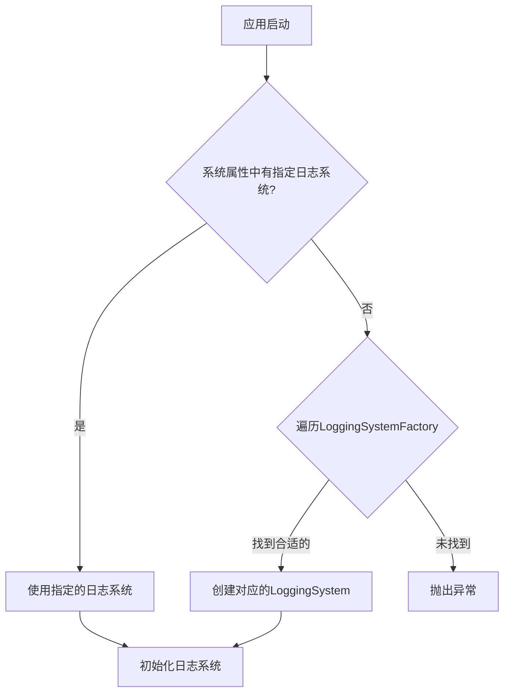
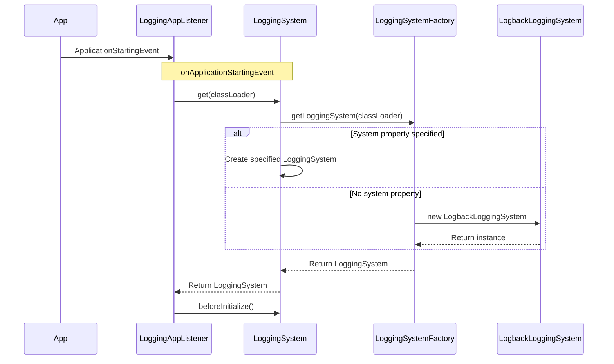
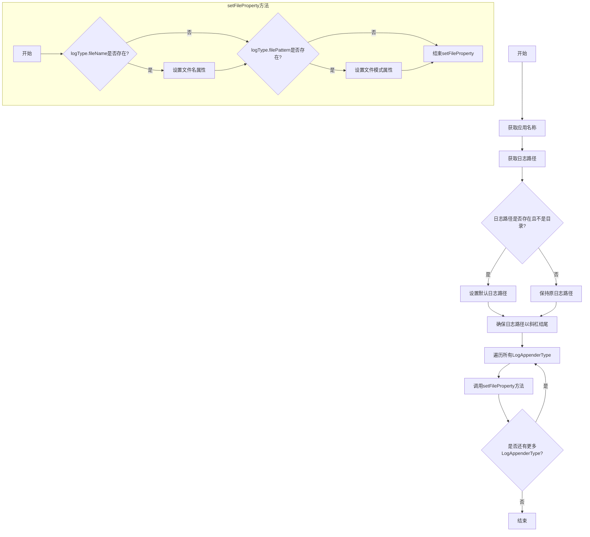

## refer

- [doc](https://bkdevops-projects.github.io/devops-framework/#/)
- [source](https://github.com/bkdevops-projects/devops-framework?tab=readme-ov-file)
- [springboot-logging](https://docs.spring.io/spring-boot/reference/features/logging.html)
- [log4j2 in Sbt3](https://medium.com/@bishalf98/log4j2-in-springboot3-095ab6f15763)

## 1-sbt-logging

### 1-1 Intro


**1)-约定 > 配置**

默认的配置基本够用.

1. 日期格式: 包含日期时间、日志级别、进程ID、应用名称、线程名、日志来源和消息内容 ;
2. 日志级别: 默认提供的是, `ERROR`, `WARN` , `INFO` , 使用 `--trace` 开启 `TRACE`, 使用 `--debug` 可以开启 `DEBUG` 级别 ;
	1. 没有 `FATAL` 级别的说法，会自动映射到 `ERROR` ;
3. 彩色控制: 需要终端支持 `ANSI` , 可以通过 `spring.output.ansi.enabled` 来控制 ;


**2)-这个多框架的抽象是比较好的**


- 基本能力的抽象: 
	- Log Format
	- Console Output
	- File Output
	- File rotation
	- Log Levels
	- Log Groups
	- Using a Log Shutdown Hook
	- Custom Log Configuration
- 基于扩展的封装
	- Logback-Extensions
		- Profile-Specific Configuration
		- Env Properties
	- Log4j2 Extensions
		- Profile-Specific Configuration
			- Env
			- Log4j2 System Properties


### 1-2 Default is logback


首先 日志系统集成的源码是在 `LoggingApplicationListener` 中. 

**流程如下:**





**源码时序图**





核心代码就是 `ClassUtils` 判断类是否存在.

```java
	@Order(Ordered.LOWEST_PRECEDENCE)
	public static class Factory implements LoggingSystemFactory {

		private static final boolean PRESENT = ClassUtils.isPresent("ch.qos.logback.classic.LoggerContext",
				Factory.class.getClassLoader());

		@Override
		public LoggingSystem getLoggingSystem(ClassLoader classLoader) {
			if (PRESENT) {
				return new LogbackLoggingSystem(classLoader);
			}
			return null;
		}
	}
```


### 1-3 Change to log4j2


```kotlin
dependencies {  
    implementation("org.springframework.boot:spring-boot-starter-web:")  
    implementation("org.springframework.boot:spring-boot-starter-aop:")  
    implementation("org.springframework.boot:spring-boot-starter-log4j2")  
}  
  
configurations.all {  
    exclude(group = "org.springframework.boot", module = "spring-boot-starter-logging")  
}
```


这个时候通过断点 发现生效的就是 `org.springframework.boot.logging.log4j2.Log4J2LoggingSystem.Factory` 了


### 1-4 Console is colored 

什么时候会触发 彩色机制. 根据如下配置:

```yaml
spring:  
  output:  
    ansi:  
      enabled: detected
```


默认就是 `detected`, 如下:

```java
private static Enabled enabled = Enabled.DETECT;
```


探测代码位于 `org.springframework.boot.ansi.AnsiOutput#detectIfAnsiCapable` .

- 一个关键点就是 `System.console() != null`， 这个就是 `jvm` 返回的 `console` 对象，如果存在就大概率支持 `ANSI`, 返回 `null` 也不能说明不支持，所以喜欢的话就强制, `colored` . *理想* 的情况是 `dev`  环境 `colored`, `online` 环境就算了，不要这些奇怪的乱码.


## 2-2 devops-logging




