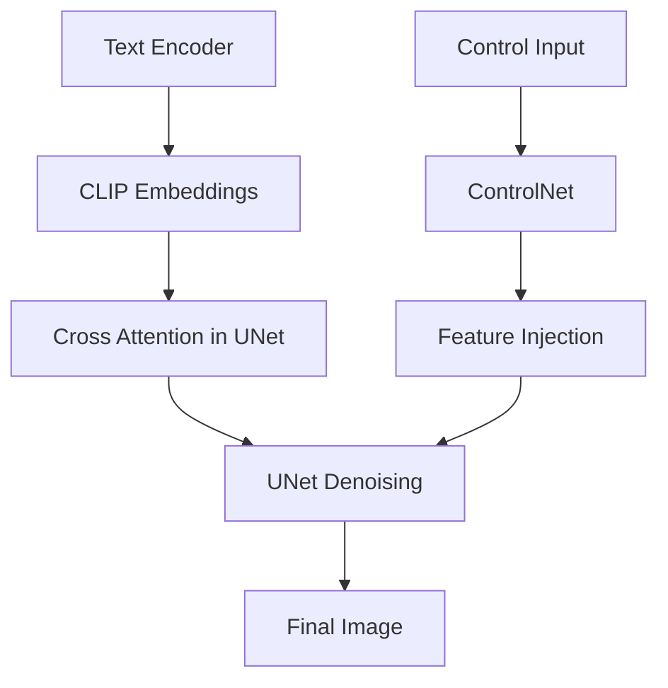
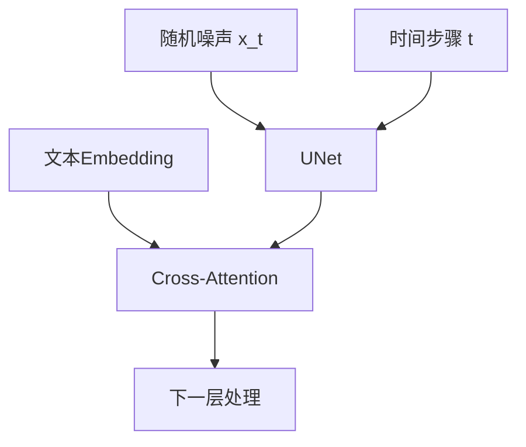
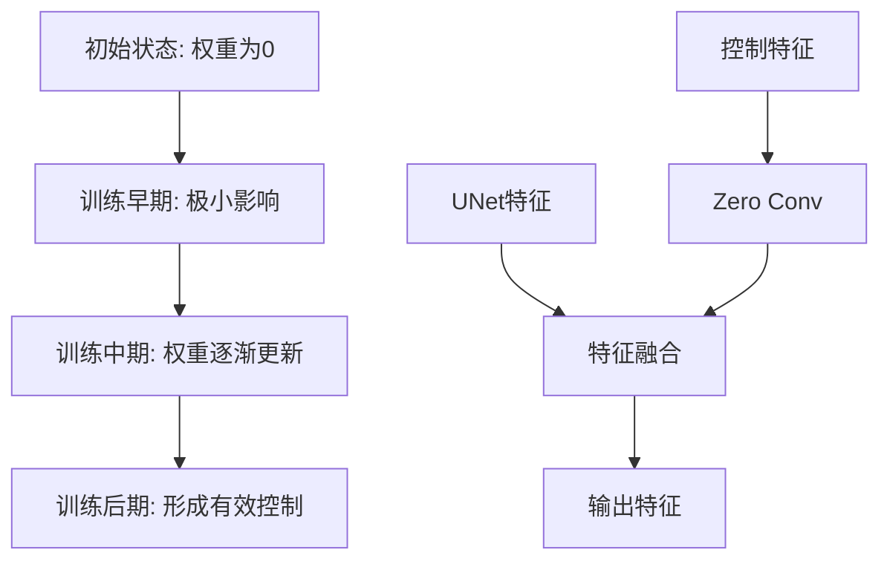
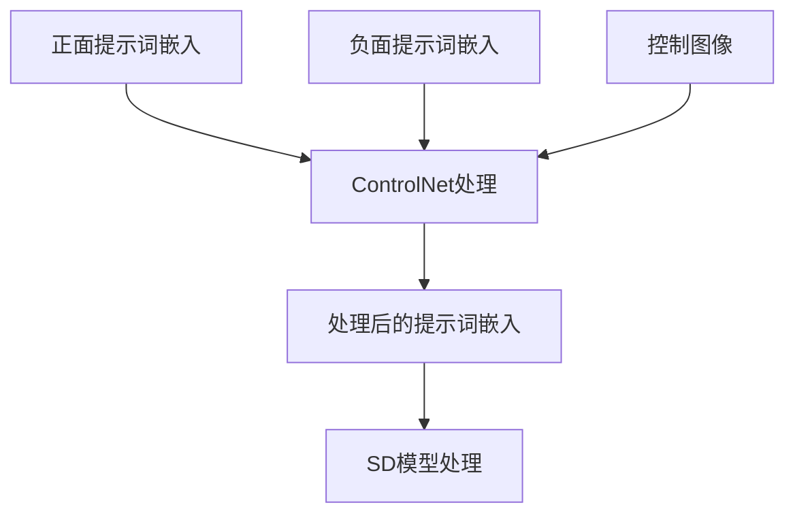

## 1-介绍

`MistoLine` 是一个 `SDXL-ControlNet` 模型. 可以 适用于:

1. 处理多种类型的线条输入
2. 输出的质量高: 支持 `1024px` 以上的高分辨率
3. 支持多种类型的输入风格: 手绘，预处理器生成，模型生成等等的 线条来源

同时引入了一个新的 `Preprossor` 算法:

一个新的 `Anyline` 的预处理算法.


**下面的图是使用不同的 PreProssor 的效果**


可以看到`Anyline` 捕获图片线条的能力确实不错.

**下面是使用不同 controlNet 的效果**


**ControlNet** 在 `T2i` 中推理的作用.

- `ControlNet` 是在原始的扩展模型基础上面 增加了一个新的 可以训练的副本. 
- 这个副本保持了和原始网络相同的结构
- 这个副本 是专门用来处理额外的条件输入的

输入层:
	- 接收文本提示 , `TEXT PROMPT`
	- 接收控制条件, 例如 线条图
处理层:
	- `ControlNet` 副本在这里处理上面的输入条件
	- 把生成的结果传递给 扩散模型 `UNet`
生成层:
	- 扩展模型会结合2种信息逐步去噪


更具体点, `ControlNet` 的设计是 `Zero convolution` 设计，在 `UNet` 的每个 `block` 层级都有对应的控制点.


在 `UNet` 的每个层级都有对应的控制点. 使用特征的注入方式.

```
在UNet的不同层级：
- Down Blocks（下采样）
- Mid Block（中间层）
- Up Blocks（上采样）
```

## 2-原理

### 2-1 推理原理简述

**1)-输入准备**



**2)-Cross-Attention 计算过程**

```python
# 简化的Cross-Attention实现
def cross_attention(x_noisy, text_embeddings):
    # x_noisy: 形状 [batch, channels, height, width]
    # text_embeddings: 形状 [batch, seq_len, embedding_dim]
    
    # 1. 将噪声特征转换为query
    query = linear_projection(x_noisy)  # [batch, hw, dim]
    
    # 2. 文本特征作为key和value
    key = linear_projection(text_embeddings)
    value = linear_projection(text_embeddings)
    
    # 3. 注意力计算
    attention_weights = softmax(query @ key.transpose(-2, -1))
    attended_features = attention_weights @ value
    
    return attended_features

```

**3)-简化的 step 处理**

```python
def unet_step(x_t, t, text_embeddings):
    # 1. 时间嵌入
    t_emb = get_timestep_embedding(t)
    
    # 2. 下采样阶段（Encoder）
    h = x_t
    for block in down_blocks:
        h = block(h, t_emb)
        if has_cross_attention:
            h = cross_attention(h, text_embeddings)
    
    # 3. 中间处理
    h = middle_block(h, t_emb)
    h = cross_attention(h, text_embeddings)
    
    # 4. 上采样阶段（Decoder）
    for block in up_blocks:
        h = block(h, t_emb)
        if has_cross_attention:
            h = cross_attention(h, text_embeddings)
    
    return h
```


**4)-ControlNet 的特征注入**

```python
def controlnet_feature_injection(unet_features, control_features, scale):
    # 在UNet的每个关键层注入控制特征
    enhanced_features = unet_features + scale * control_features
    return enhanced_features
```

这就是为什么ControlNet能够在保持文本到图像生成能力的同时，提供额外的精确控制。每个时间步都包含了噪声预测、文本引导和条件控制这三个关键要素。

### 2-2 训练原理简述

训练的原理是基于 `Zero-Conv` . 这里简单了解一下这个训练的套路:




`Zero Conv` 的核心作用是：
1. 安全起步：
	▪ 初始化为0确保不会破坏原始模型行为
	▪ 提供了一个安全的学习起点
2. 渐进学习：
	▪ 通过反向传播逐步学习权重
	▪ 从0开始逐渐适应到合适的控制强度
3. 稳定性保证：
	▪ 避免训练初期的剧烈波动
	▪ 确保生成质量的稳定性

这种设计使得 `ControlNet` 能够在训练过程中：
	• 安全地添加新的控制能力
	• 保持原始模型的生成质量
	• 实现平滑的控制效果过渡


**使用:**





## 3-Diffusers Demo

```bash
pip install accelerate transformers safetensors opencv-python diffusers
```

```python
from diffusers import ControlNetModel, StableDiffusionXLControlNetPipeline, AutoencoderKL
from diffusers.utils import load_image
from PIL import Image
import torch
import numpy as np
import cv2

prompt = "aerial view, a futuristic research complex in a bright foggy jungle, hard lighting"
negative_prompt = 'low quality, bad quality, sketches'

image = load_image("https://huggingface.co/datasets/hf-internal-testing/diffusers-images/resolve/main/sd_controlnet/hf-logo.png")

controlnet_conditioning_scale = 0.5

controlnet = ControlNetModel.from_pretrained(
    "TheMistoAI/MistoLine",
    torch_dtype=torch.float16,
    variant="fp16",
)
vae = AutoencoderKL.from_pretrained("madebyollin/sdxl-vae-fp16-fix", torch_dtype=torch.float16)
pipe = StableDiffusionXLControlNetPipeline.from_pretrained(
    "stabilityai/stable-diffusion-xl-base-1.0",
    controlnet=controlnet,
    vae=vae,
    torch_dtype=torch.float16,
)
pipe.enable_model_cpu_offload()

image = np.array(image)
image = cv2.Canny(image, 100, 200)
image = image[:, :, None]
image = np.concatenate([image, image, image], axis=2)
image = Image.fromarray(image)

images = pipe(
    prompt, negative_prompt=negative_prompt, image=image, controlnet_conditioning_scale=controlnet_conditioning_scale,
    ).images

images[0].save(f"hug_lab.png")

```

## refer

- [huggingface-TheMistoAI](https://huggingface.co/TheMistoAI/MistoLine)
- [Anyline-Prepossor](https://github.com/TheMistoAI/ComfyUI-Anyline)


