# LangGraph 完整指南

## 核心概念

### 整体架构

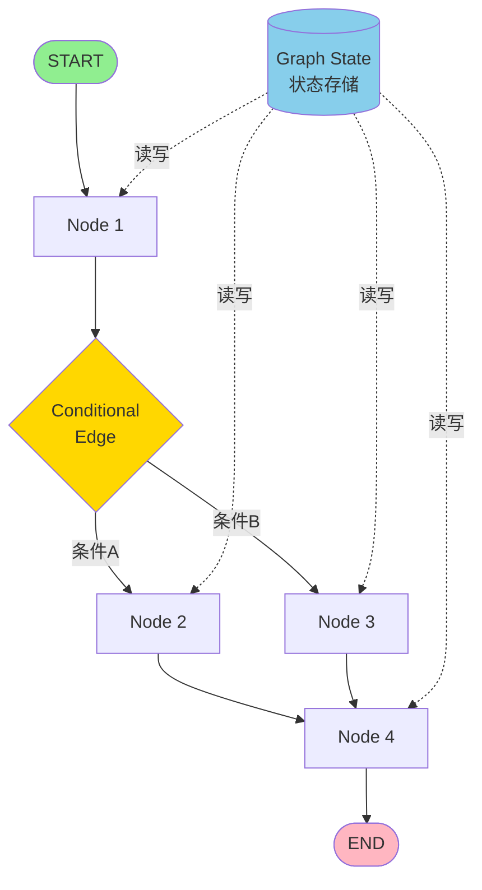

### 状态管理

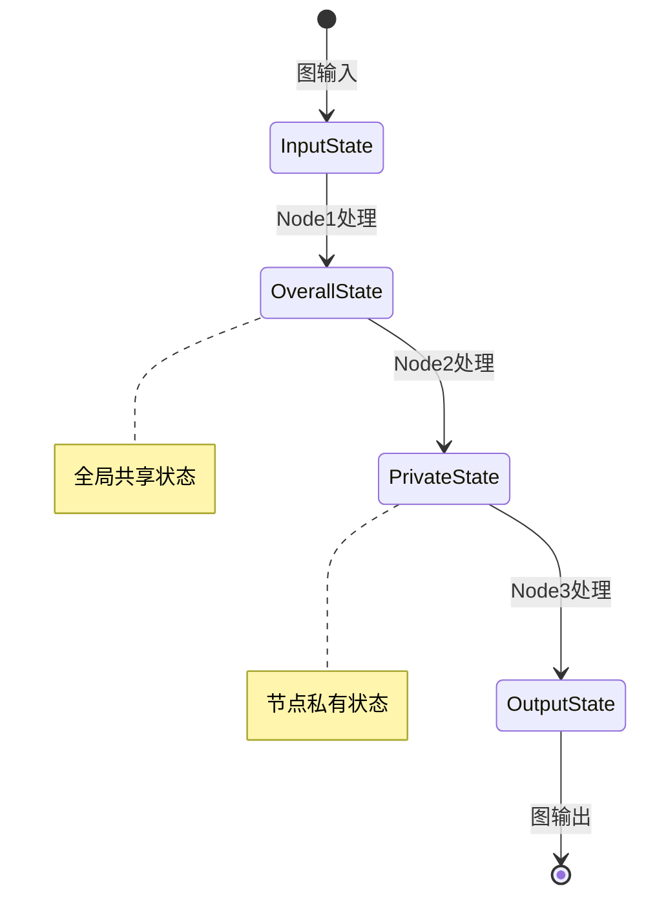

### 节点系统

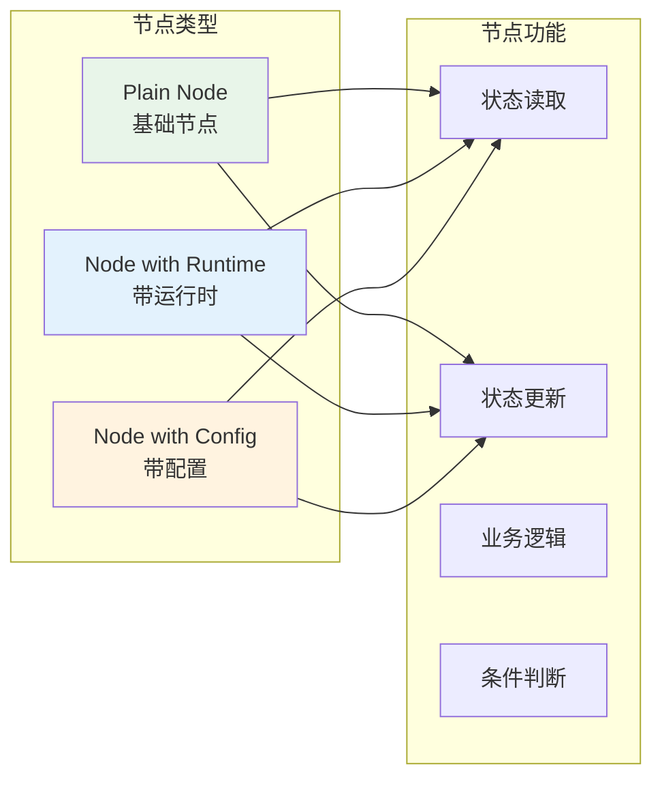

### 边与路由

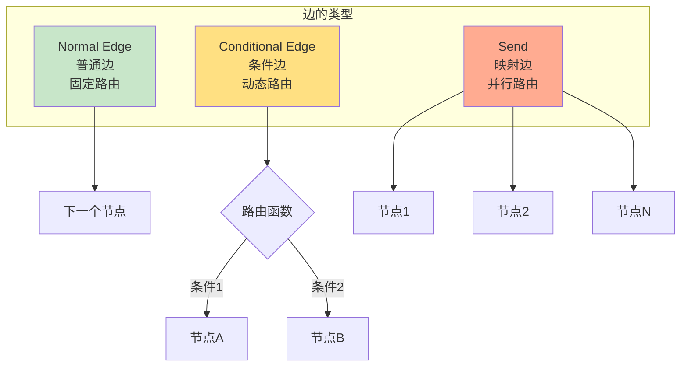

---

## 状态定义 (Schema)

### 基础 Schema

**核心思想：** Schema 定义了图中流转的数据结构。

#### 使用 TypedDict（推荐）

```python
from typing_extensions import TypedDict

class State(TypedDict):
    input: str
    output: str
    count: int
```

#### 使用 Dataclass（支持默认值）

```python
from dataclasses import dataclass

@dataclass
class State:
    input: str
    output: str = ""
    count: int = 0
```

#### 使用 Pydantic（需要数据验证）

```python
from pydantic import BaseModel

class State(BaseModel):
    input: str
    output: str
    count: int
```

> ⚠️ **性能提示：** TypedDict > Dataclass > Pydantic

---

### 多 Schema 模式

**使用场景：** 当你需要区分输入、输出和内部状态时。

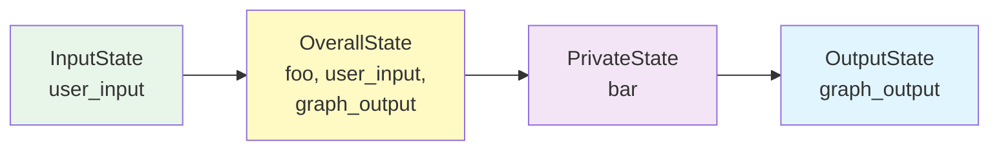

**完整示例：**

```python
from typing_extensions import TypedDict
from langgraph.graph import StateGraph, START, END

# 定义多个 Schema
class InputState(TypedDict):
    user_input: str

class OutputState(TypedDict):
    graph_output: str

class OverallState(TypedDict):
    foo: str
    user_input: str
    graph_output: str

class PrivateState(TypedDict):
    bar: str

# 定义节点函数
def node_1(state: InputState) -> OverallState:
    """读取输入，写入全局状态"""
    return {"foo": state["user_input"] + " name"}

def node_2(state: OverallState) -> PrivateState:
    """读取全局状态，写入私有状态"""
    return {"bar": state["foo"] + " is"}

def node_3(state: PrivateState) -> OutputState:
    """读取私有状态，写入输出"""
    return {"graph_output": state["bar"] + " Lance"}

# 构建图
builder = StateGraph(
    OverallState,
    input_schema=InputState,
    output_schema=OutputState
)

builder.add_node("node_1", node_1)
builder.add_node("node_2", node_2)
builder.add_node("node_3", node_3)
builder.add_edge(START, "node_1")
builder.add_edge("node_1", "node_2")
builder.add_edge("node_2", "node_3")
builder.add_edge("node_3", END)

graph = builder.compile()

# 执行
result = graph.invoke({"user_input": "My"})
# 输出: {'graph_output': 'My name is Lance'}
```

---

### Reducer 机制

**核心概念：** Reducer 决定如何合并节点返回的状态更新。

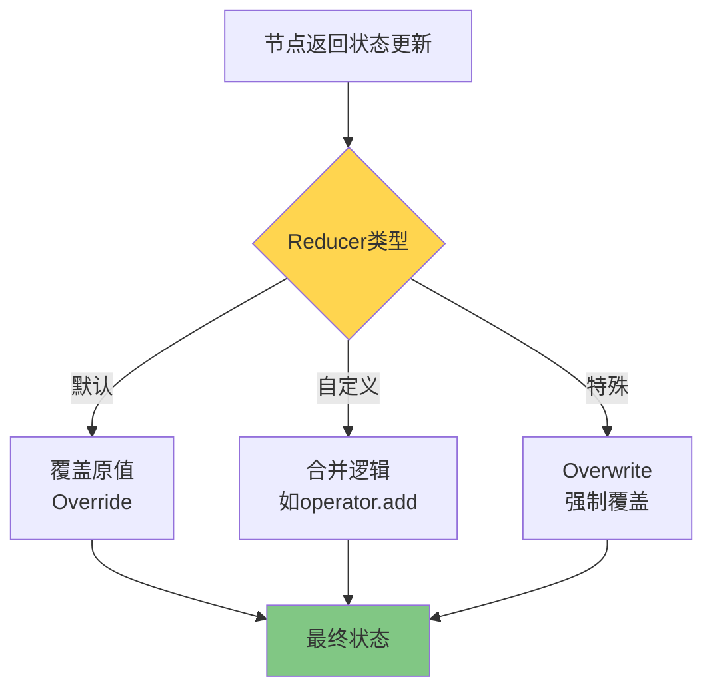

#### 1️⃣ 默认 Reducer（覆盖模式）

```python
from typing_extensions import TypedDict

class State(TypedDict):
    foo: int
    bar: list[str]

# 示例流程：
# 输入: {"foo": 1, "bar": ["hi"]}
# Node1 返回: {"foo": 2}
# 状态变为: {"foo": 2, "bar": ["hi"]}  ← foo 被覆盖
# Node2 返回: {"bar": ["bye"]}
# 状态变为: {"foo": 2, "bar": ["bye"]}  ← bar 被覆盖
```

#### 2️⃣ 自定义 Reducer（合并模式）

```python
from typing import Annotated
from typing_extensions import TypedDict
from operator import add

class State(TypedDict):
    foo: int
    bar: Annotated[list[str], add]  # 使用 add 作为 reducer

# 示例流程：
# 输入: {"foo": 1, "bar": ["hi"]}
# Node1 返回: {"foo": 2}
# 状态变为: {"foo": 2, "bar": ["hi"]}
# Node2 返回: {"bar": ["bye"]}
# 状态变为: {"foo": 2, "bar": ["hi", "bye"]}  ← bar 被合并！
```

#### 3️⃣ Overwrite（强制覆盖）

当你需要绕过 reducer 直接覆盖值时使用。

```python
from langgraph.types import Overwrite

def my_node(state: State):
    # 强制覆盖，忽略 reducer
    return {"bar": Overwrite(["new_value"])}
```

---

### 消息管理

**使用场景：** 构建对话系统、聊天机器人。

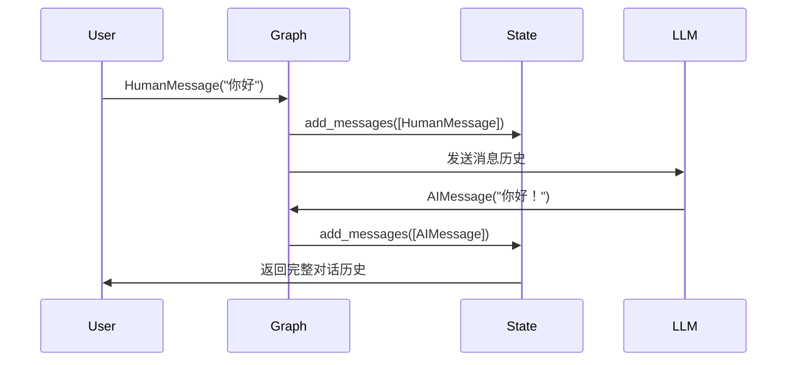

#### `add_messages` 的强大功能

1. **自动追踪消息 ID**
2. **支持消息更新**（而不是仅追加）
3. **自动反序列化**

```python
from langchain.messages import AnyMessage
from langgraph.graph.message import add_messages
from typing import Annotated
from typing_extensions import TypedDict

class GraphState(TypedDict):
    messages: Annotated[list[AnyMessage], add_messages]

# 支持两种输入格式：
# 方式1: LangChain Message 对象
{"messages": [HumanMessage(content="你好")]}

# 方式2: 字典格式（自动转换）
{"messages": [{"type": "human", "content": "你好"}]}
```

#### 访问消息内容

```python
# ✅ 正确：使用点号访问
state["messages"][-1].content

# ❌ 错误：不要使用字典方式
state["messages"][-1]["content"]
```

---

## 节点 (Nodes)

### 节点定义

**节点是 Python 函数**，可以接受以下参数：

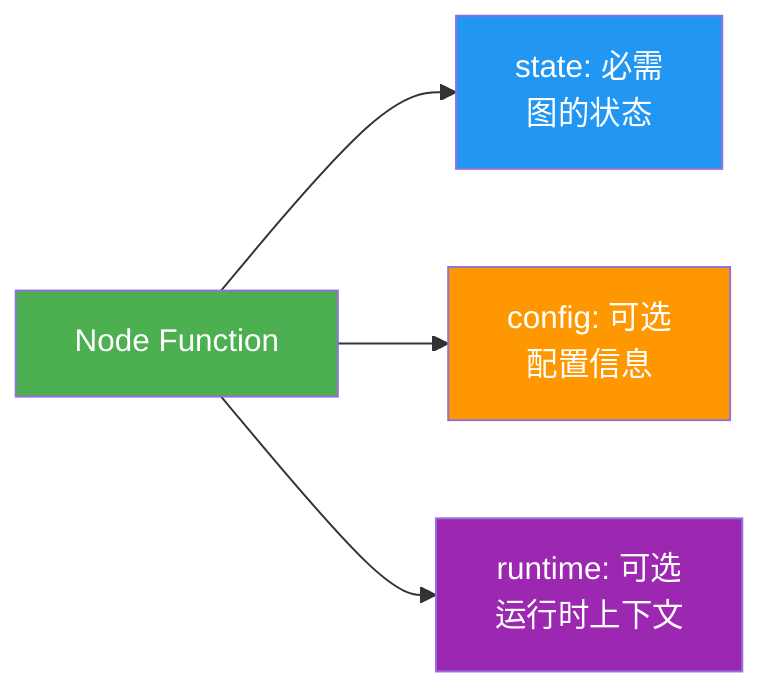

**完整示例：**

```python
from dataclasses import dataclass
from typing_extensions import TypedDict
from langchain_core.runnables import RunnableConfig
from langgraph.graph import StateGraph
from langgraph.runtime import Runtime

class State(TypedDict):
    input: str
    results: str

@dataclass
class Context:
    user_id: str

builder = StateGraph(State)

# 类型1: 基础节点
def plain_node(state: State):
    return {"results": state["input"].upper()}

# 类型2: 带运行时上下文
def node_with_runtime(state: State, runtime: Runtime[Context]):
    print(f"用户ID: {runtime.context.user_id}")
    return {"results": f"Hello, {state['input']}!"}

# 类型3: 带配置信息
def node_with_config(state: State, config: RunnableConfig):
    thread_id = config["configurable"]["thread_id"]
    print(f"线程ID: {thread_id}")
    return {"results": f"Hello, {state['input']}!"}

# 添加节点
builder.add_node("plain_node", plain_node)
builder.add_node("node_with_runtime", node_with_runtime)
builder.add_node("node_with_config", node_with_config)

# 也可以省略名称（使用函数名）
builder.add_node(plain_node)  # 节点名为 "plain_node"
```

---

### 特殊节点

#### START 节点

```python
from langgraph.graph import START

# START 表示图的入口
graph.add_edge(START, "first_node")
```

#### END 节点

```python
from langgraph.graph import END

# END 表示图的终点
graph.add_edge("last_node", END)
```


---

### 节点缓存

**使用场景：** 避免重复执行耗时的计算。

```python
import time
from typing_extensions import TypedDict
from langgraph.graph import StateGraph
from langgraph.cache.memory import InMemoryCache
from langgraph.types import CachePolicy

class State(TypedDict):
    x: int
    result: int

builder = StateGraph(State)

def expensive_node(state: State) -> dict[str, int]:
    """耗时计算"""
    time.sleep(2)
    return {"result": state["x"] * 2}

# 设置缓存策略：TTL=3秒
builder.add_node(
    "expensive_node", 
    expensive_node, 
    cache_policy=CachePolicy(ttl=3)
)
builder.set_entry_point("expensive_node")
builder.set_finish_point("expensive_node")

# 编译时指定缓存
graph = builder.compile(cache=InMemoryCache())

# 第一次调用：耗时 2 秒
print(graph.invoke({"x": 5}, stream_mode='updates'))
# [{'expensive_node': {'result': 10}}]

# 第二次调用：命中缓存，立即返回
print(graph.invoke({"x": 5}, stream_mode='updates'))
# [{'expensive_node': {'result': 10}, '__metadata__': {'cached': True}}]
```

**缓存配置选项：**

- `key_func`: 自定义缓存键生成函数（默认使用 pickle hash）
- `ttl`: 缓存过期时间（秒），不指定则永不过期

---

## 边 (Edges)

### 边的类型对比

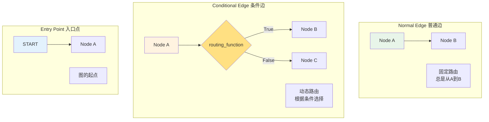

---

### 普通边

**固定路由**：总是从节点 A 到节点 B。

```python
graph.add_edge("node_a", "node_b")
```

---

### 条件边

**动态路由**：根据状态决定下一个节点。

```python
def routing_function(state: State) -> str:
    """返回下一个节点的名称"""
    if state["score"] > 0.8:
        return "high_quality_node"
    else:
        return "low_quality_node"

# 方式1: 直接使用返回值作为节点名
graph.add_conditional_edges("node_a", routing_function)

# 方式2: 使用映射字典
graph.add_conditional_edges(
    "node_a", 
    routing_function,
    {
        True: "node_b",
        False: "node_c"
    }
)
```

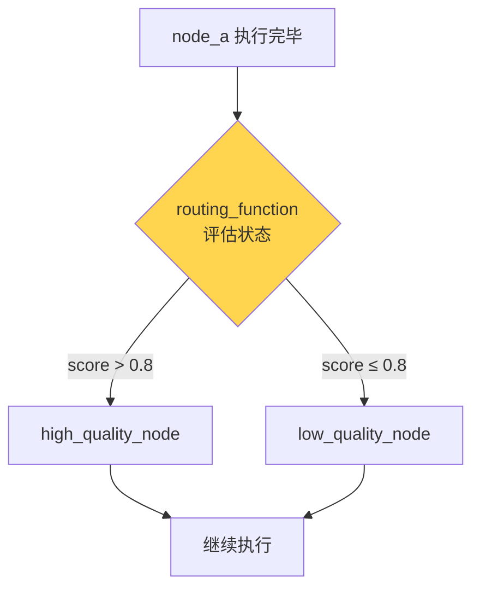

---

### 入口点

#### 固定入口点

```python
from langgraph.graph import START

graph.add_edge(START, "node_a")
```

#### 条件入口点

**根据输入动态选择起始节点。**

```python
def entry_routing(state: State) -> str:
    if state["user_type"] == "premium":
        return "premium_flow"
    else:
        return "standard_flow"

graph.add_conditional_edges(START, entry_routing)

# 或使用映射
graph.add_conditional_edges(
    START,
    entry_routing,
    {
        "premium": "premium_flow",
        "standard": "standard_flow"
    }
)
```

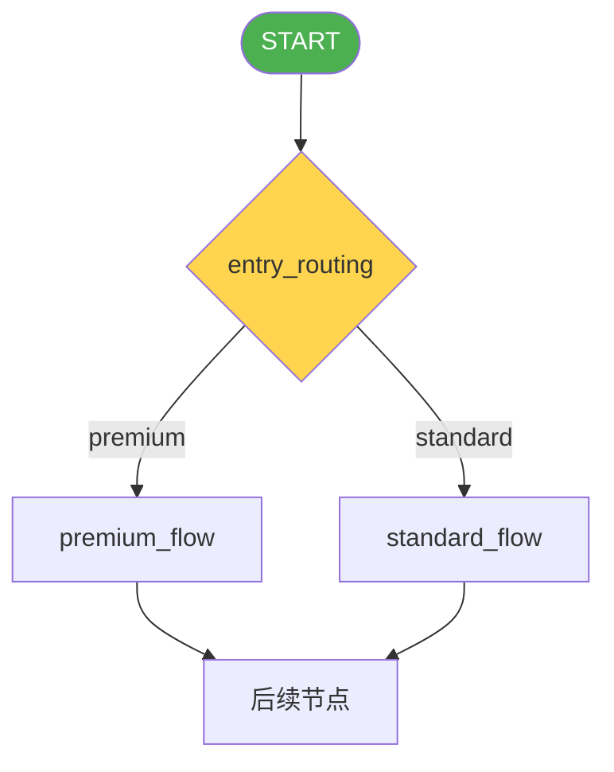

---

## 高级特性

### Command 对象

**核心价值：** 在一个节点中同时完成**状态更新**和**路由决策**。

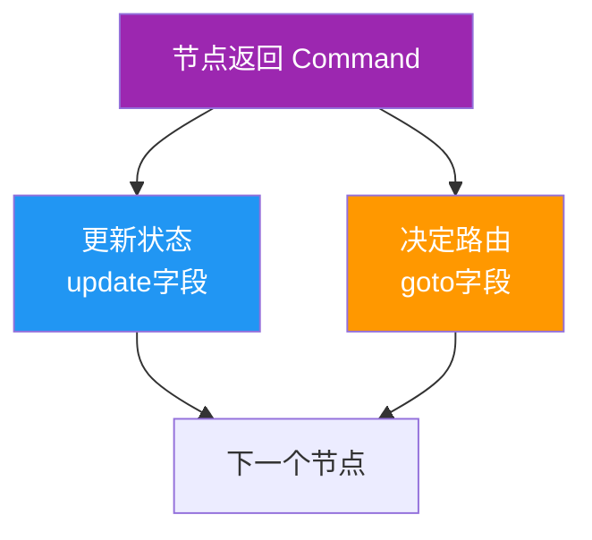

#### 基础用法

```python
from langgraph.types import Command
from typing import Literal

def my_node(state: State) -> Command[Literal["my_other_node"]]:
    return Command(
        # 状态更新
        update={"foo": "bar", "count": state["count"] + 1},
        # 路由决策
        goto="my_other_node"
    )
```

#### 动态路由（类似条件边）

```python
def my_node(state: State) -> Command[Literal["node_b", "node_c"]]:
    if state["foo"] == "bar":
        return Command(
            update={"foo": "baz"},
            goto="node_b"
        )
    else:
        return Command(
            update={"foo": "qux"},
            goto="node_c"
        )
```

> ⚠️ **重要：** 使用 Command 时必须添加类型注解 `Command[Literal["node_name"]]`，否则图无法正确渲染。

#### 何时使用 Command？

| 场景 | 使用 Command | 使用条件边 |
|------|--------------|------------|
| 需要同时更新状态和路由 | ✅ | ❌ |
| 多智能体切换 | ✅ | ❌ |
| 仅需路由，不更新状态 | ❌ | ✅ |
| 纯状态更新 | ❌ | 普通节点 |

---

### Send 对象

**使用场景：** Map-Reduce 模式，并行处理多个对象。

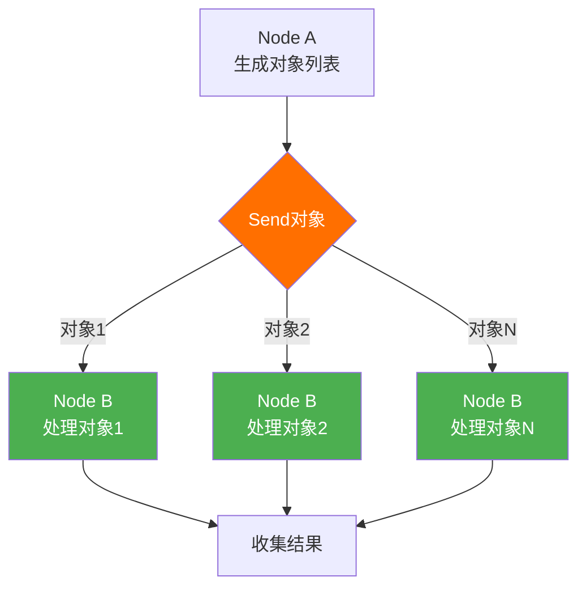

**示例：生成多个笑话**

```python
from langgraph.types import Send
from typing_extensions import TypedDict

class OverallState(TypedDict):
    subjects: list[str]
    jokes: list[str]

class JokeState(TypedDict):
    subject: str

def generate_subjects(state: OverallState):
    """生成笑话主题"""
    return {"subjects": ["猫", "狗", "鸟"]}

def continue_to_jokes(state: OverallState):
    """为每个主题创建一个 Send 对象"""
    return [
        Send("generate_joke", {"subject": s}) 
        for s in state['subjects']
    ]

def generate_joke(state: JokeState):
    """生成单个笑话（并行执行）"""
    joke = f"关于{state['subject']}的笑话..."
    return {"jokes": [joke]}

# 构建图
builder = StateGraph(OverallState)
builder.add_node("generate_subjects", generate_subjects)
builder.add_node("generate_joke", generate_joke)

# 使用条件边 + Send 实现并行
builder.add_conditional_edges("generate_subjects", continue_to_jokes)
```

**Send 的特点：**
- ✅ 动态并行：运行时确定并行数量
- ✅ 独立状态：每个并行节点接收不同的状态
- ✅ 自动收集：结果通过 reducer 合并

---

### 运行时上下文

**使用场景：** 传递不属于图状态的信息（如配置、依赖）。

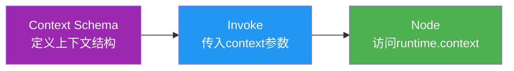

**完整示例：**

```python
from dataclasses import dataclass
from langgraph.graph import StateGraph
from langgraph.runtime import Runtime

# 1. 定义上下文结构
@dataclass
class ContextSchema:
    llm_provider: str = "openai"
    api_key: str = ""
    temperature: float = 0.7

# 2. 创建图时指定
graph = StateGraph(State, context_schema=ContextSchema)

# 3. 在节点中使用
def node_a(state: State, runtime: Runtime[ContextSchema]):
    provider = runtime.context.llm_provider
    temperature = runtime.context.temperature
    
    llm = get_llm(provider, temperature)
    # ... 业务逻辑
    return {"result": "processed"}

# 4. 调用时传入
graph.invoke(
    inputs={"input": "hello"},
    context={
        "llm_provider": "anthropic",
        "api_key": "sk-...",
        "temperature": 0.9
    }
)
```

---

### 递归限制

**概念：** 防止图无限循环的安全机制。

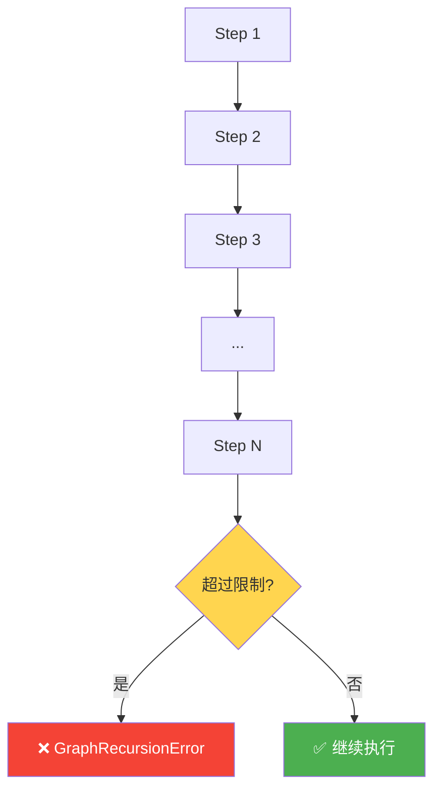

#### 设置递归限制

```python
# 默认值：25 步
graph.invoke(inputs)

# 自定义限制
graph.invoke(
    inputs,
    config={"recursion_limit": 100},  # 注意：不在 configurable 中
    context={"llm": "anthropic"}
)
```

#### 主动监控递归步数

```python
from langchain_core.runnables import RunnableConfig

def reasoning_node(state: dict, config: RunnableConfig) -> dict:
    # 获取当前步数
    current_step = config["metadata"]["langgraph_step"]
    recursion_limit = config["recursion_limit"]  # 总是可用
    
    # 检查是否接近限制（80% 阈值）
    if current_step >= recursion_limit * 0.8:
        return {
            **state,
            "route_to": "fallback",
            "reason": "接近递归限制，启动降级方案"
        }
    
    # 正常处理
    return {"messages": state["messages"] + ["思考中..."]}
```

#### 两种处理策略

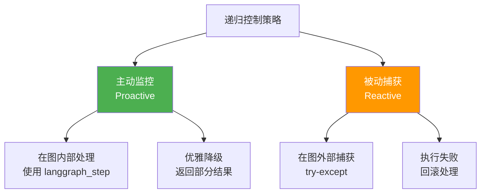

**主动监控（推荐）：**

```python
def agent_with_monitoring(state: dict, config: RunnableConfig) -> dict:
    """在图内部主动处理"""
    current_step = config["metadata"]["langgraph_step"]
    recursion_limit = config["recursion_limit"]
    
    # 提前2步检测
    if current_step >= recursion_limit - 2:
        return {
            **state,
            "status": "recursion_limit_approaching",
            "final_answer": "达到迭代限制，返回部分结果"
        }
    
    return {"messages": state["messages"] + [f"Step {current_step}"]}
```

**被动捕获（后备方案）：**

```python
from langgraph.errors import GraphRecursionError

try:
    result = graph.invoke(initial_state, {"recursion_limit": 10})
except GraphRecursionError as e:
    # 在图外部处理失败
    result = fallback_handler(initial_state)
```

| 对比项 | 主动监控 | 被动捕获 |
|--------|----------|----------|
| 检测时机 | 到达限制前 | 到达限制后 |
| 处理位置 | 图内部 | 图外部 |
| 控制流 | 正常完成 | 抛出异常 |
| 用户体验 | ✅ 优雅降级 | ⚠️ 突然终止 |
| 中间状态 | ✅ 可保存 | ❌ 可能丢失 |

#### 其他可用的元数据

```python
def inspect_metadata(state: dict, config: RunnableConfig) -> dict:
    metadata = config["metadata"]
    
    print(f"当前步数: {metadata['langgraph_step']}")
    print(f"当前节点: {metadata['langgraph_node']}")
    print(f"触发节点: {metadata['langgraph_triggers']}")
    print(f"执行路径: {metadata['langgraph_path']}")
    print(f"检查点命名空间: {metadata['langgraph_checkpoint_ns']}")
    
    return state
```

---

## 📊 核心概念对比表

| 概念 | 用途 | 使用场景 | 示例 |
|------|------|----------|------|
| **Schema** | 定义状态结构 | 所有图 | `TypedDict`, `dataclass` |
| **Reducer** | 状态合并逻辑 | 需要累积数据 | `add`, `Overwrite` |
| **Node** | 业务逻辑单元 | 所有处理步骤 | 函数 |
| **Normal Edge** | 固定路由 | 确定性流程 | `add_edge()` |
| **Conditional Edge** | 动态路由 | 需要条件判断 | `add_conditional_edges()` |
| **Command** | 状态+路由 | 智能体切换 | `Command(update, goto)` |
| **Send** | 并行执行 | Map-Reduce | `Send(node, state)` |
| **Runtime Context** | 外部依赖 | 配置、API密钥 | `Runtime[Context]` |

---

## 🎯 最佳实践

### 1. Schema 设计

```python
# ✅ 好的做法
class State(TypedDict):
    # 使用清晰的类型注解
    user_input: str
    messages: Annotated[list[Message], add_messages]
    score: float
    metadata: dict[str, Any]

# ❌ 避免
class State(TypedDict):
    data: Any  # 类型太宽泛
    x: str     # 名称不清晰
```

### 2. 节点设计

```python
# ✅ 单一职责
def validate_input(state: State) -> dict:
    """只做验证"""
    if not state["input"]:
        raise ValueError("输入不能为空")
    return {}

def process_data(state: State) -> dict:
    """只做处理"""
    result = complex_processing(state["input"])
    return {"result": result}

# ❌ 职责混乱
def validate_and_process(state: State) -> dict:
    """验证+处理混在一起"""
    if not state["input"]:
        raise ValueError("...")
    result = complex_processing(state["input"])
    return {"result": result}
```

### 3. 边的选择

- **固定流程** → Normal Edge
- **条件路由** → Conditional Edge
- **状态+路由** → Command
- **并行处理** → Send

### 4. 错误处理

```python
def robust_node(state: State) -> dict:
    try:
        result = risky_operation(state["input"])
        return {"result": result, "error": None}
    except Exception as e:
        # 在状态中记录错误
        return {
            "result": None,
            "error": str(e),
            "status": "failed"
        }
```

---

## 🔗 快速参考

### 图构建模板

```python
from langgraph.graph import StateGraph, START, END
from typing_extensions import TypedDict

# 1. 定义状态
class State(TypedDict):
    input: str
    output: str

# 2. 创建构建器
builder = StateGraph(State)

# 3. 添加节点
def node_a(state: State) -> dict:
    return {"output": state["input"].upper()}

builder.add_node("node_a", node_a)

# 4. 添加边
builder.add_edge(START, "node_a")
builder.add_edge("node_a", END)

# 5. 编译
graph = builder.compile()

# 6. 执行
result = graph.invoke({"input": "hello"})
```

### 常用导入

```python
# 核心
from langgraph.graph import StateGraph, START, END
from typing_extensions import TypedDict
from typing import Annotated

# 消息
from langchain.messages import HumanMessage, AIMessage, AnyMessage
from langgraph.graph.message import add_messages

# 高级特性
from langgraph.types import Command, Send, CachePolicy, Overwrite
from langgraph.runtime import Runtime
from langchain_core.runnables import RunnableConfig

# 错误处理
from langgraph.errors import GraphRecursionError
```

---

## 📚 相关文档

- [LangGraph 官方文档](https://langchain-ai.github.io/langgraph/)
- [LangChain 消息对象](https://python.langchain.com/docs/modules/model_io/messages)
- [TypedDict 文档](https://docs.python.org/3/library/typing.html#typing.TypedDict)

---