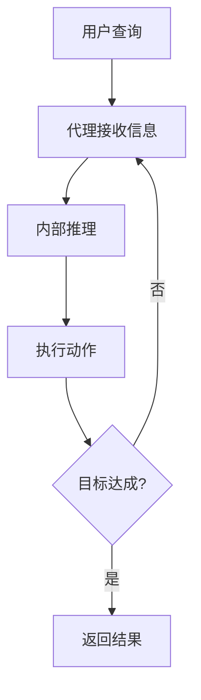
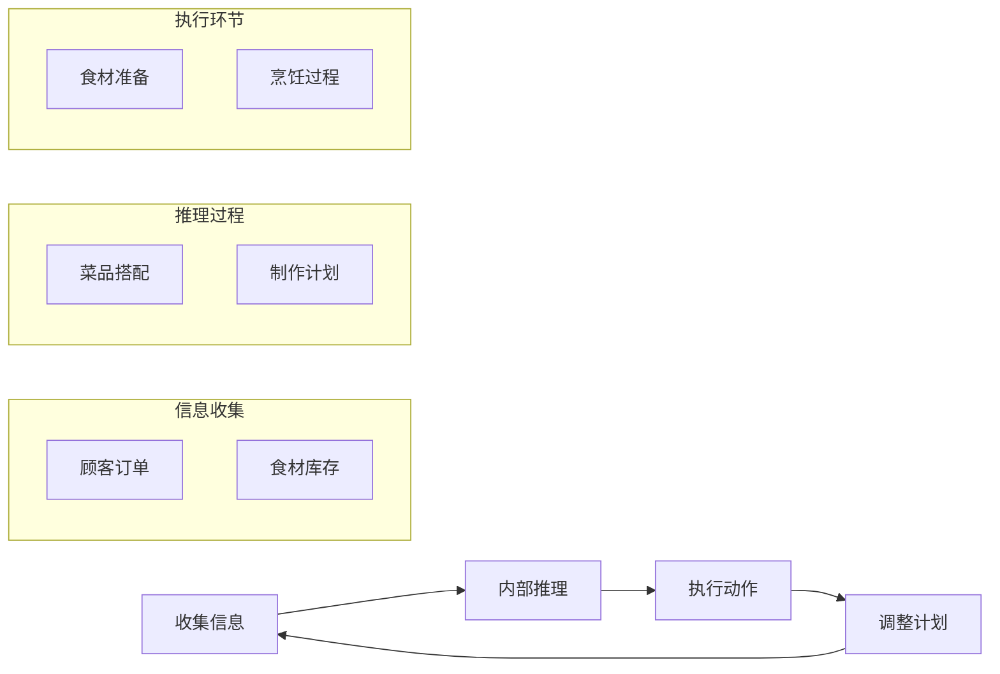
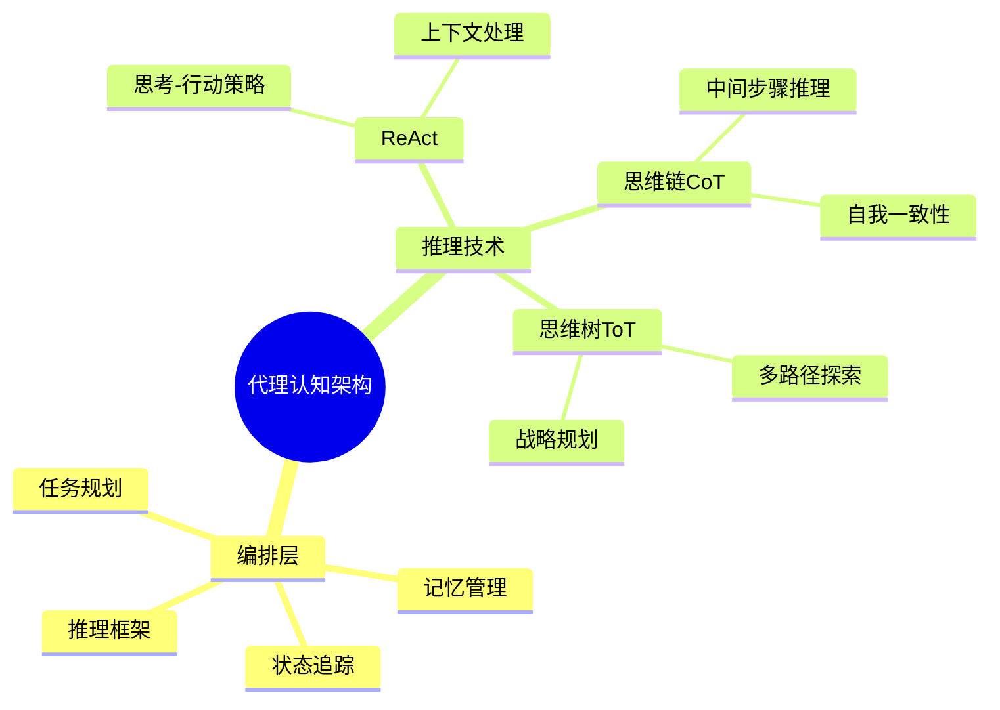
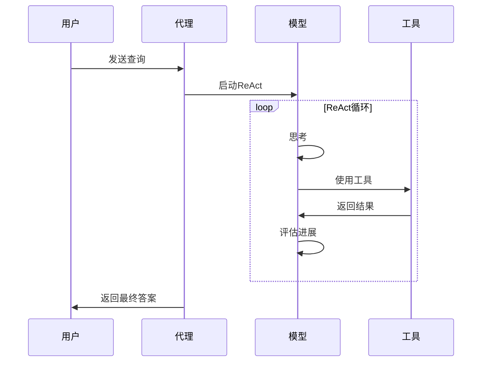
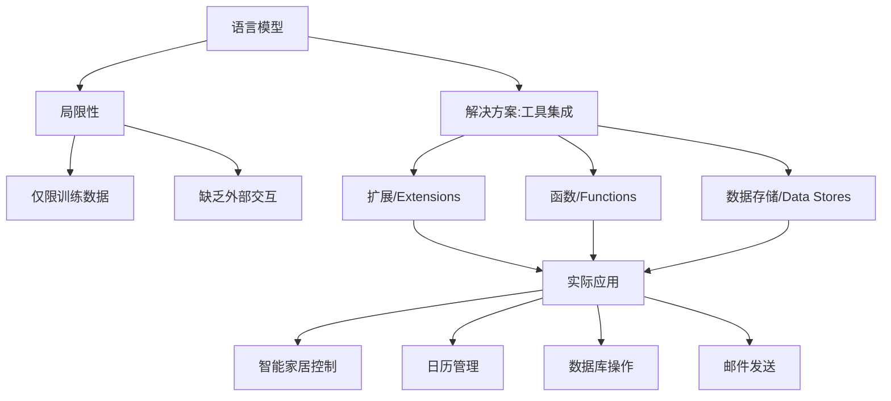
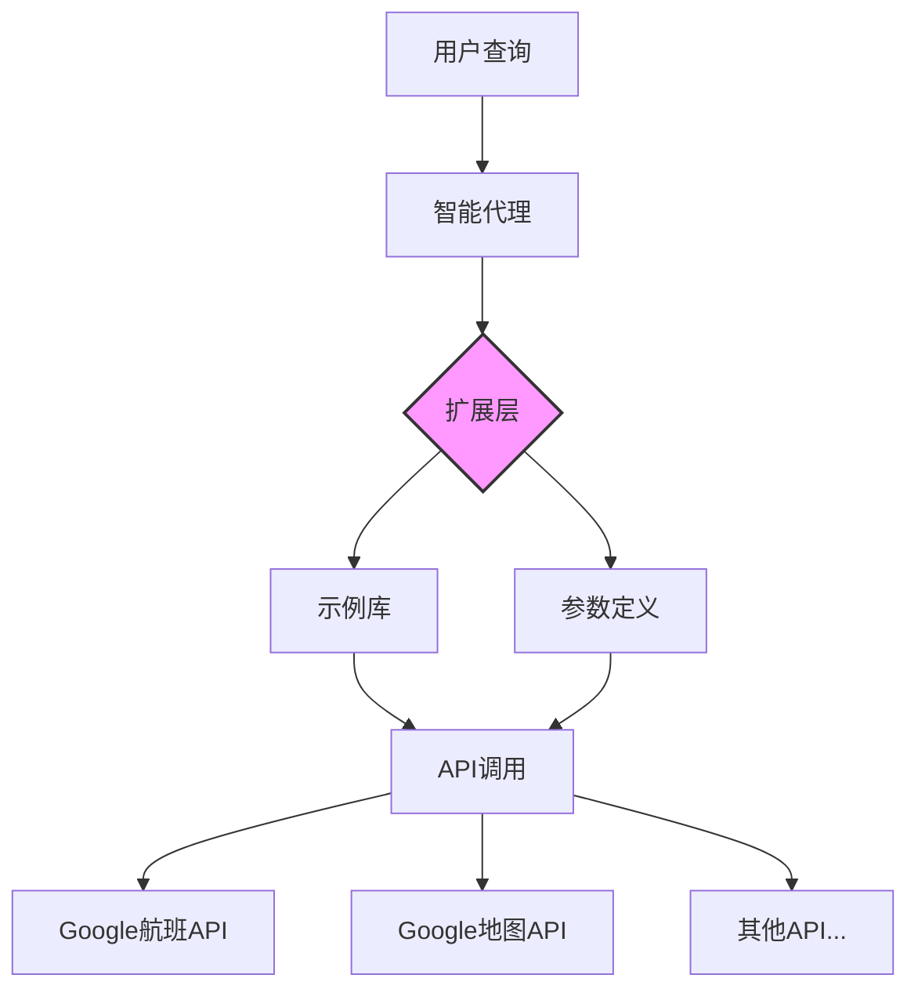
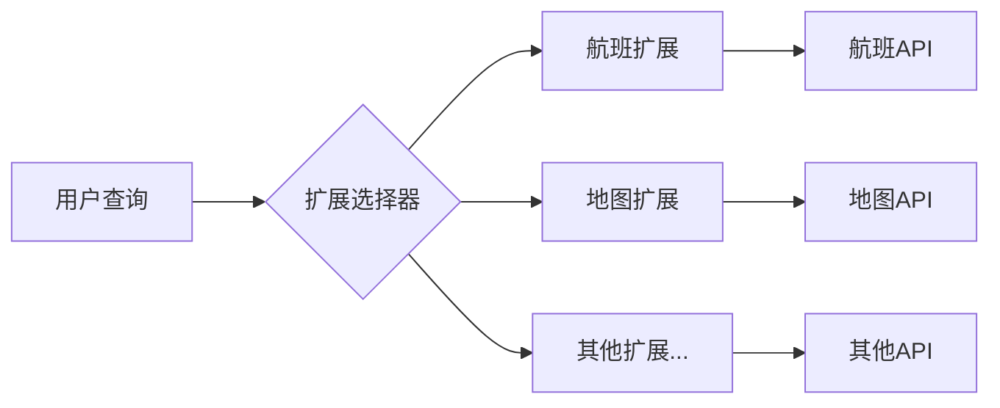
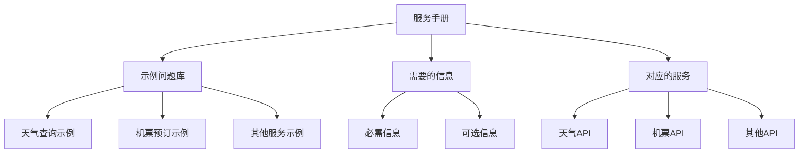

## 1-介绍

1. 人类 通常借助工具, 例如 书籍，`Google搜索` 等等来 处理 *混乱的模式识别任务* ;
2. 参考上面的范式, 模型也要能 *访问外部的 API 或者工具*, 更要能 *自主计划，执行任务* ;

**1)-架构图如下**

**2)-核心组件-Model**

> [!NOTE] What's a model ?
> A model refers to the language model (LM) that will be utilized as the centralized decision maker for agent processes.

基于当前出色的 生成式 `AI` 能力. 核心组件 就是语言模型:

1. 语言模型会作为中央的决策单元
2. 支持单个模型或者多个模型的协作
3. 这些模型能够遵循 基于指令的推理和逻辑框架，例如 `ReAct` , `Chain-of-Thought` 或者 `Tree-of-Thgouhts` .
	1. `ReAct`: 主要是强化了 工具的使用能力
	2. `COT`: 链式思想推理
	3. `Tree-Of-Thoughts` : 树状思想推理，在某些任务上笔 `Cot` 提升了 `32%` 的性能

> [!NOTE] Finetune is important
> 模型可以是通用型、多模态的，或根据特定代理架构需求进行微调的。为了获得最佳生产效果，你应该使用最适合目标应用的模型，理想情况下，该模型应该在与你计划在认知架构中使用的工具相关的数据特征上进行过训练

**3)-核心组件-Tools**

工具一般是都 `API` 实现，和 `GET`, `POST`, `PATCH` 和 `DELETE` 保持一致.

例如，一个工具可以在数据库中更新客户信息，或者获取天气数据来影响代理向用户提供的旅行建议。有了工具，代理可以访问和处理现实世界的信息。这使它们能够支持更专业的系统，如检索增强生成（RAG），这大大扩展了代理的能力，超出了基础模型单独所能实现的范围。我们将在下面更详细地讨论工具，但最重要的是要理解，*工具弥合了代理内部能力与外部世界之间的差距*，解锁了更广泛的可能性。

**4)-核心组件-编排层**

目前类似 `dify` 的 `chatflow` `agent` 都是基于 `flow` 的编排层.

1. 编排层的本质
	- 循环处理机制
	- 信息-推理-决策流程
	- 目标导向的运行方式

2. 运行特征
	- 持续性循环过程
	- 明确的终止条件
	- 自适应决策机制

**5)-Models vs Agents**

| 特性        | 模型（Models）              | 代理（Agents）           |
| --------- | ----------------------- | -------------------- |
| **知识范围**  | 仅限于训练数据中的知识             | 通过工具连接外部系统扩展知识       |
| **推理方式**  | 单次推理/预测，基于用户查询          | 管理会话历史，支持多轮推理和预测     |
| **上下文管理** | 除非特别实现，否则无法管理会话历史或持续上下文 | 原生支持会话历史管理，可追踪对话上下文  |
| **工具使用**  | 无原生工具实现能力               | 工具在代理架构中原生实现         |
| **逻辑层**   | 无原生逻辑层，需通过提示词引导         | 具有原生认知架构，内置推理框架      |
| **推理框架**  | 需要用户构建复杂提示来引导推理         | 原生支持CoT、ReAct等推理框架   |
| **交互模式**  | 单次问答模式                  | 多轮对话模式（一轮=一次查询+一次响应） |
| **扩展能力**  | 受限于训练时的数据               | 可通过工具实时扩展能力          |

1. **知识获取**
   - 模型：静态知识库，依赖训练数据
   - 代理：动态知识获取，可实时访问外部资源
2. **交互能力**
   - 模型：单向输入输出
   - 代理：双向交互，可持续对话
3. **推理框架支持**
   - 模型：需要手动构建推理提示
   - 代理：内置多种推理框架，如：
     * `Chain-of-Thought` (CoT)
     * `ReAct`
     * `LangChain` 等
4. **应用场景**
   - 模型：适合单次查询和生成任务
   - 代理：适合复杂交互和持续对话场景

## 2-架构认知

**1)-Agent 的基本流程**

`AI 代理` 的工作方式就像一个永不停止的循环，从接收用户的输入开始， 经过思考，然后行动，然后根据结果是否要继续.

**2)-人类厨师工作也类似**

**3)-就像人类的大脑不同区域负责不同的功能一样, `AI` 代理也有专门负责 记忆、思考、规划的模块.** 

1. ReAct，这是一种提示工程框架，为语言模型提供了一种思考过程策略，使其能够对用户查询进行推理和采取行动，无论是否提供上下文示例。ReAct 提示已被证明优于多个最先进的基线，并提高了大型语言模型的人机交互性和可信度。
2. 思维链（CoT），这是一种提示工程框架，通过中间步骤实现推理能力。CoT 有各种子技术，包括自我一致性、主动提示和多模态 CoT，每种技术都有其特定应用中的优势和劣势。
3. 思维树（ToT），这是一种提示工程框架，非常适合于探索或战略性前瞻任务。它对思维链提示进行了概括，并允许模型探索各种思维链，这些思维链作为使用语言模型进行一般问题解决的中间步骤。

| 框架    | 主要特点         | 适用场景        |
| ----- | ------------ | ----------- |
| ReAct | 思考-行动结合，动态规划 | 需要工具使用的复杂任务 |
| CoT   | 步骤化推理，中间过程可见 | 数学问题，逻辑推理   |
| ToT   | 多路径探索，策略规划   | 决策树，策略游戏    |

**4)-代理使用 ReActs  的Demo**

**5)-Agent 协同的 demo**

如上图所示，模型、工具和代理配置协同工作，根据用户的原始查询向用户提供一个切实、简洁的回应。虽然模型本可以基于其先前的知识猜测一个答案（幻觉），但它反而使用了一个工具（航班）来搜索实时的外部信息。这些额外的信息被提供给了模型，使其能够基于真实的数据做出更明智的决策，并将这些信息总结后反馈给用户。

总结来说，代理回应的质量可以直接与模型对这些各种任务的推理和行动能力相关联，包括选择正确工具的能力以及工具定义的完善程度。就像厨师用新鲜食材制作菜肴并关注顾客反馈一样，代理依靠合理的推理和可靠的信息来提供最佳结果

## 3-工具: 通往外部世界的钥匙

**1)-语言模型本身的局限性**

- 微软的 `Semantic Kernel` 工具包: [semantic-kernel](https://github.com/microsoft/semantic-kernel) ;
- `Google` 模型可以和三种主要工具进行交互: 扩展，函数和数据存储
- ....
 
**2)-扩展: 桥接 API 和智能体之间的鸿沟**

举个例子: 用户说 "我想预订飞往苏黎世的航班” 而从未提供出发城市怎么办". 

- 没有数据，`API` 会失败, 并且需要更多的代码来捕获这样的边缘案例 ;
- 这种方法不可扩展, 在任何超出实现自定义代码 范围的情况中 都容易出错 ;

一种更有弹性的方式是使用扩展， 扩展通过以下方式弥合代理与 `API` 之间的差距:

- 使用示例教代理如何使用 `API` 端点 ;
- 教代理成功调用 `API` 端点所需哪些参数或参数 ;
- ... ;

使用文本去教 `AI` 使用 `API` :

## refer

- [原文](https://archive.org/details/google-ai-agents-whitepaper)
- [翻译版本](https://www.oschina.net/news/329273)
- [微软 Semantic Kernel](https://learn.microsoft.com/en-us/semantic-kernel/overview/)