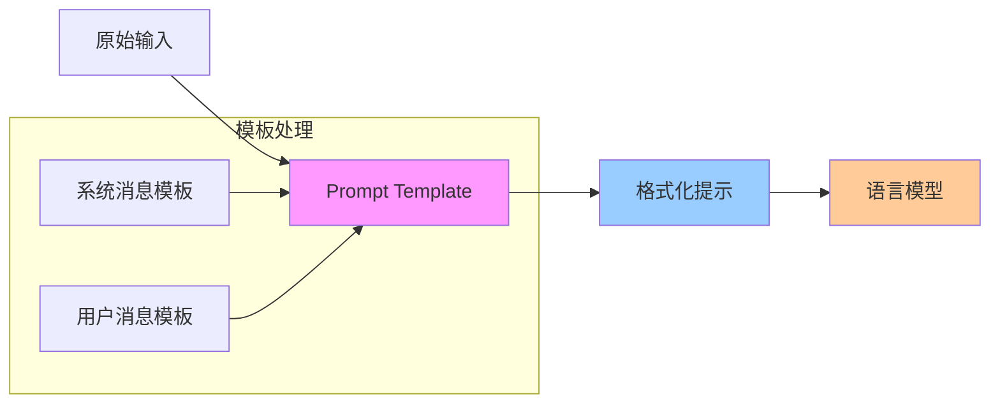
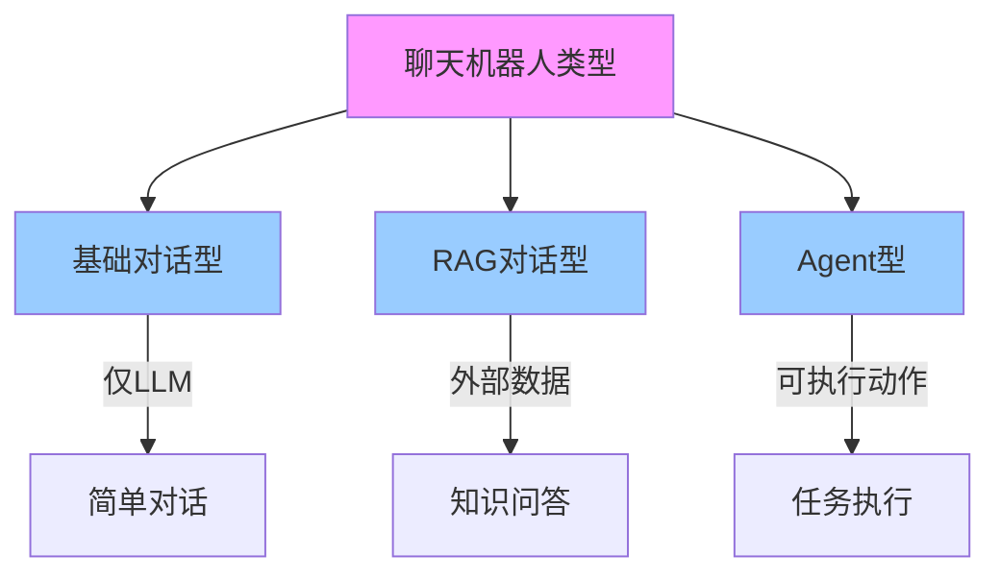

## 1-介绍

**1)-如下图所示, 提供了在 `llm` 应用的 开发-产品-部署 阶段的工具链.**

1. Development:
	- 提供开源组件库，可以快速搭建 LLM 应用
	- 通过 `LangGraph` 构建有状态的 AI 代理，支持流式处理和人机交互
2. Productionization
	1. 使用 `LangSmith` 工具进行应用检查、监控和评估
	2. 持续优化应用性能
	3. 提供可视化的调试和分析功能
3. Deployment
	1. 将 LangGraph 应用转换为生产就绪的 API
	2. 支持构建 AI 助手应用
	3. 提供完整的部署解决方案


**2)-Hello world**

```python
from langchain_openai import ChatOpenAI  
  
from langchain_core.messages import HumanMessage, SystemMessage  
  
model = ChatOpenAI(  
    model="${YOUR_MODEL_NAME}",  
    base_url="....",  
    api_key="....",  
    temperature=0.2,  
    top_p=0.9  
)  
  
  
def test_invoke():  
    """  
    测试基础的能力  
    :return:  
    """    messages = [  
        SystemMessage("Translate the following from English into Italian"),  
        HumanMessage("hi!"),  
    ]  
  
    print(model.invoke(messages))  
  
  
def test_streaming():  
    """  
    测试流式传输能力  
    :return:  
    """    messages = [  
        SystemMessage("Translate the following from English into Italian"),  
        HumanMessage("hi!"),  
    ]  
  
    for token in model.stream(messages):  
        print(token.content, end="|")
```


**3)-Prompt Templates**

```python
# 1. 定义模板
from langchain_core.prompts import ChatPromptTemplate

system_template = "Translate the following from English into {language}"
prompt_template = ChatPromptTemplate.from_messages([
    ("system", system_template),
    ("user", "{text}")
])

# 2. 使用模板
prompt = prompt_template.invoke({
    "language": "Italian", 
    "text": "hi!"
})

# 3. 获取消息
messages = prompt.to_messages()

# 4. 调用模型
response = model.invoke(prompt)

```

最基本的模版能力，也就是文本渲染.




## 2-ChatBot 能力


> [!NOTE] 关于管理 Memory
>  关于管理 `Memory`, `langchain` 在 `v0.3` 之后推荐使用 `LangGraph` 的持久化能力来管理 `Memory` .
之前的版本则可以 直接使用 `RunableWithMessageHistory` 来管理.


常见的 `ChatBot` 一般分为3类:



// wait to learn

...

## refer

- [introduction](https://python.langchain.com/docs/introduction/)