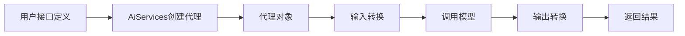

## 1-Intro


高层服务. 专注于业务逻辑，而不是低层细节. 类似 `Spring Data JPA`, `Retrofit` 这样的框架.

- 采用声明式的接口 来定义 ;
- 使用代理的模式实现接口 ;
- 作为服务层的一个组件 ;

同时支持 `LLM` 的常见升天, `Chat Memory`, `Tools`, `RAG` 这种。

原理，就是用反射创建一个 动态实现, 属于初级使用.




## 2-Quick start

**1)-组装**

```kotlin
@Bean  
open fun chatLanguageModel(llmConfigProps: LlmConfigProps): ChatLanguageModel {  
    val supplierType = llmConfigProps.active  
    return when (supplierType) {  
        LlmSupplierType.AZURE -> AzureOpenAiChatModel.builder()  
            .apiKey(llmConfigProps.activeConfig.appKey)  
            .endpoint(llmConfigProps.activeConfig.endpoint)  
            .deploymentName(llmConfigProps.activeConfig.modelName)  
            .logRequestsAndResponses(true)  
            .build()  
  
        else -> throw IllegalArgumentException("Unknown LLM supplier type: $supplierType")  
    }  
}  
  
@Bean  
open fun assistant(  
    chatLanguageModel: ChatLanguageModel,  
    chatSessionDao: IChatSessionDao,  
    redisChatMemoryStore: RedisChatMemoryStore  
): Assistant {  
    return AiServices.builder(Assistant::class.java)  
        .systemMessageProvider {  
            chatSessionDao.findById(it.toString().toInt()).map(ChatSession::systemMessage).orElse(null)  
        }.chatMemoryProvider {  
            MessageWindowChatMemory.builder()  
                .id(it)  
                .maxMessages(30)  
                .chatMemoryStore(redisChatMemoryStore)  
                .build()  
        }  
        .chatLanguageModel(chatLanguageModel)  
        .build()  
}
```

**2)-定义基本的 chat 函数**

```kotlin
  
interface Assistant {  
  
    fun chat(@MemoryId memoryId: Int, @UserMessage userMessage: String): String  
}
```


**3)-实现 redis chat memory**

```kotlin
@Component  
open class RedisChatMemoryStore(  
    private val redisTemplate: RedisTemplate<String, String>,  
    @Value("\${chat.memory.prefix}")  
    private val prefix: String  
) : ChatMemoryStore, ILogging {  
  
    fun key(memoryId: Any): String {  
        return "$prefix$memoryId"  
    }  
  
    override fun getMessages(memoryId: Any): List<ChatMessage> {  
        val key = key(memoryId)  
        logger.info("Retrieving messages from Redis, key:{}", key)  
        val json = redisTemplate.opsForValue().get(key)  
        return ChatMessageDeserializer.messagesFromJson(json)  
    }  
  
    override fun updateMessages(  
        memoryId: Any,  
        messages: List<ChatMessage>  
    ) {  
        val key = key(memoryId)  
        logger.info("Updating messages in Redis, key: {}, size:{}", key, messages.size)  
        val json = ChatMessageSerializer.messagesToJson(messages)  
        /*默认保留30天*/  
        redisTemplate.opsForValue().set(key, json, 30L, TimeUnit.DAYS)  
    }  
  
    override fun deleteMessages(memoryId: Any) {  
        val key = key(memoryId)  
        logger.info("Deleting messages from Redis, key : {}", key)  
        redisTemplate.opsForValue().getOperations().delete(key)  
    }  
}
```

## refer

- [ai-services](https://docs.langchain4j.dev/tutorials/ai-services)


