## 1-介绍

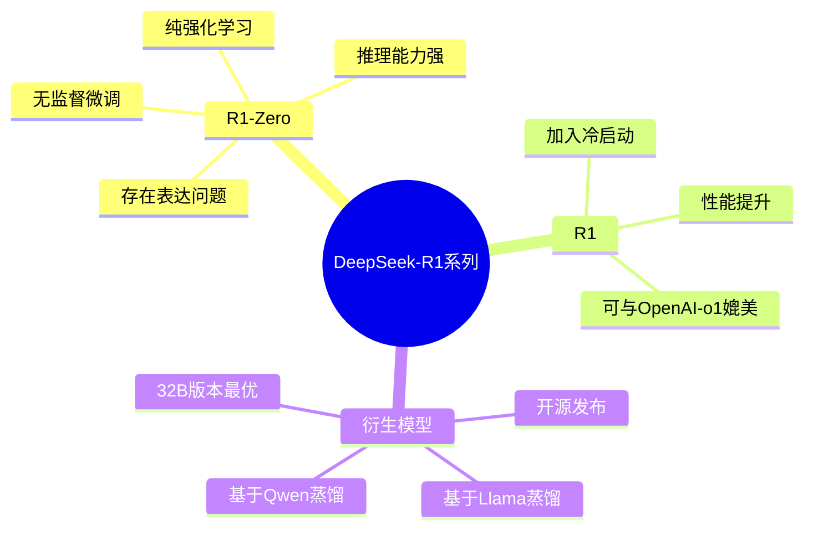


1. `Post-Training` 被证明可以提高 推理性能， `OpenAI` 的 `O1`  首次通过 *scaling by increasing the length of the Chain-of-Thought reasoning process* , 这种方法在数学，编程和各种推理任务中都取得了显著的改进. 
2. 这里开始的第一步是通过 纯`RL` 来提高语言模型推理能力的第一步, 专注于纯 `RL` 过程的自我进化.  使用 `DeepSeek-V3-Base` 作为基础模型, 采用 `GRPO` 作为 `RL` 框架来提高模型的推理性能. 在训练过程中， `DeepSeek-R1-Zero` 产生了许多强大和有趣的推理行为. 经过 **数千次** `RL` 步骤, 在推理的基准测试上都表现出色 !
3. `DeepSeek-R1-Zero` 面临可读性差和语言的混杂的挑战, `DeepSeek-R1` 为了解决这个问题，则包含了少量的 冷启动数据和多阶段训练流程。 具体来说:
	- 首先收集了 数千条冷启动数据来微调 `Base` 模型 ;
	- 然后和 `DeepSeek-R1-Zero` 一样来执行面向推理的 `RL` ;
	- 在 `RL`过程接近收敛的时候，通过对 `RL` 检查点进行拒绝采样创建新的 `SFT` 数据, 并结合 `DeepSeek-V3` 在协作，事实QA 和自我认知等领域的监督数据，然后重新训练 `DeepSeek-V3-Base` 模型, 微调新的数据后，检查点会经历额外的 `RL` 过程, 考虑所有场景的提示
	- 得到了 `DeepSeek-R1` 的检查点
4. 然后, 这里做了进一步开始做 `R1` 的 `Distill`


### 1-1 RL 基本概念

**1)-RL 的基本概念**

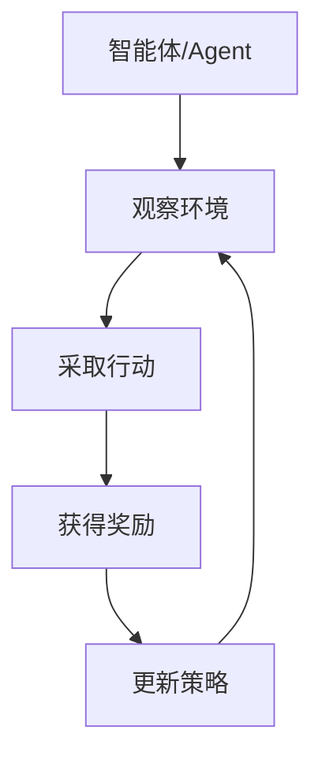


- 就像教小孩学说话：
	- 小孩(Agent)说了一句话(Action)
	- 大人给予反馈(Reward)
	- 小孩根据反馈调整说话方式(Policy Update)


**2)-LLM 中的描述**

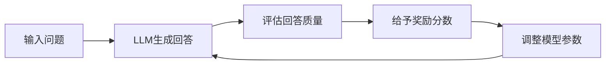


```python
# 以数学问题为例
Input: "计算 13 x 24"

# LLM的思考过程
思考1: "让我一步步计算"
行动1: "13 x 20 = 260"
行动2: "13 x 4 = 52"
行动3: "260 + 52 = 312"

# 奖励机制
if 答案正确:
    reward = 1.0
else:
    reward = -1.0
```


**3)-三个核心组件**


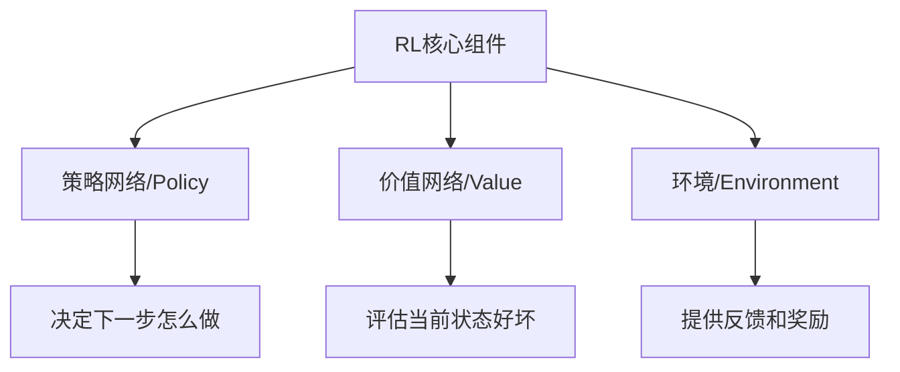


```python
# 简化的训练循环
for episode in range(num_episodes):
    # 1. 收集经验
    question = "计算 13 x 24"
    response = model.generate(question)
    
    # 2. 评估结果
    reward = evaluate_response(response)
    
    # 3. 更新模型
    model.update(reward)

```


```python
class R1ZeroModel:
    def __init__(self, base_model):
        self.llm = base_model
        self.value_head = ValueHead()  # 新增
        self.policy_head = PolicyHead()  # 新增

```

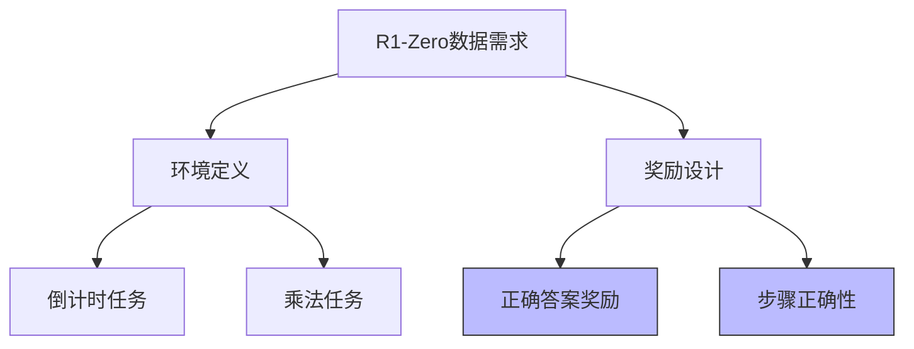


[verl](https://github.com/volcengine/verl?tab=readme-ov-file) 则是基于论文 [HybirdFlow:A Flexible and Efficient RLHF Framework](https://arxiv.org/abs/2409.19256v2)  专门用来强化学习

## 2-Tiny Zero

[https://github.com/Jiayi-Pan/TinyZero](https://github.com/Jiayi-Pan/TinyZero) 中复现了 `R1-ZERO` 的步骤.

```shell
conda create -n zero python=3.9
# install torch [or you can skip this step and let vllm to install the correct version for you]
pip install torch==2.4.0 --index-url https://download.pytorch.org/whl/cu121
# install vllm
pip3 install vllm==0.6.3 # or you can install 0.5.4, 0.4.2 and 0.3.1
pip3 install ray

# verl
pip install -e .

# flash attention 2
pip3 install flash-attn --no-build-isolation
# quality of life
pip install wandb IPython matplotlib
```


### 2-1 DataSet preparation


```bash
python ./examples/data_preprocess/countdown.py --local_dir /home/carl/train/zero/ds
```


```python
import pandas as pd

# 读取训练的数据集合样本
train_df = pd.read_parquet("/home/carl/train/zero/ds/train.parquet")

print("训练集合的结结构:")
print(train_df.head())

print("\n数据集信息:")
print(train_df.info())

# 显示几条完整示例
print("详细数据示例:")
for i in range(3):
    print(f"\n示例 {i + 1}:")
    row = train_df.iloc[i]
    print(f"目标数字 (target): {row['target']}")
    print(f"数字序列 (nums): {row['nums']}")
    print(f"提示语 (prompt): {row['prompt']}")
    print(f"能力类型 (ability): {row['ability']}")
    print(f"奖励模型 (reward_model): {row['reward_model']}")
    print(f"额外信息 (extra_info): {row['extra_info']}")
```


```
/home/carl/miniconda3/envs/zero/bin/python /home/carl/projects/TinyZero/itests/1_dataset_test.py 
训练集合的结结构:
   target  ...                      extra_info
0      98  ...  {'index': 0, 'split': 'train'}
1      64  ...  {'index': 1, 'split': 'train'}
2      28  ...  {'index': 2, 'split': 'train'}
3      48  ...  {'index': 3, 'split': 'train'}
4      17  ...  {'index': 4, 'split': 'train'}

[5 rows x 7 columns]

数据集信息:
<class 'pandas.core.frame.DataFrame'>
RangeIndex: 327680 entries, 0 to 327679
Data columns (total 7 columns):
 #   Column        Non-Null Count   Dtype 
---  ------        --------------   ----- 
 0   target        327680 non-null  int64 
 1   nums          327680 non-null  object
 2   data_source   327680 non-null  object
 3   prompt        327680 non-null  object
 4   ability       327680 non-null  object
 5   reward_model  327680 non-null  object
 6   extra_info    327680 non-null  object
dtypes: int64(1), object(6)
memory usage: 17.5+ MB
None
详细数据示例:

示例 1:
目标数字 (target): 98
数字序列 (nums): [44 19 35]
提示语 (prompt): [{'content': 'A conversation between User and Assistant. The user asks a question, and the Assistant solves it. The assistant first thinks about the reasoning process in the mind and then provides the user with the answer.\nUser: Using the numbers [44, 19, 35], create an equation that equals 98. You can use basic arithmetic operations (+, -, *, /) and each number can only be used once. Show your work in <think> </think> tags. And return the final answer in <answer> </answer> tags, for example <answer> (1 + 2) / 3 </answer>.\nAssistant: Let me solve this step by step.\n<think>', 'role': 'user'}]
能力类型 (ability): math
奖励模型 (reward_model): {'ground_truth': {'numbers': array([44, 19, 35]), 'target': 98}, 'style': 'rule'}
额外信息 (extra_info): {'index': 0, 'split': 'train'}

示例 2:
目标数字 (target): 64
数字序列 (nums): [63 95 96]
提示语 (prompt): [{'content': 'A conversation between User and Assistant. The user asks a question, and the Assistant solves it. The assistant first thinks about the reasoning process in the mind and then provides the user with the answer.\nUser: Using the numbers [63, 95, 96], create an equation that equals 64. You can use basic arithmetic operations (+, -, *, /) and each number can only be used once. Show your work in <think> </think> tags. And return the final answer in <answer> </answer> tags, for example <answer> (1 + 2) / 3 </answer>.\nAssistant: Let me solve this step by step.\n<think>', 'role': 'user'}]
能力类型 (ability): math
奖励模型 (reward_model): {'ground_truth': {'numbers': array([63, 95, 96]), 'target': 64}, 'style': 'rule'}
额外信息 (extra_info): {'index': 1, 'split': 'train'}

示例 3:
目标数字 (target): 28
数字序列 (nums): [95 11 56]
提示语 (prompt): [{'content': 'A conversation between User and Assistant. The user asks a question, and the Assistant solves it. The assistant first thinks about the reasoning process in the mind and then provides the user with the answer.\nUser: Using the numbers [95, 11, 56], create an equation that equals 28. You can use basic arithmetic operations (+, -, *, /) and each number can only be used once. Show your work in <think> </think> tags. And return the final answer in <answer> </answer> tags, for example <answer> (1 + 2) / 3 </answer>.\nAssistant: Let me solve this step by step.\n<think>', 'role': 'user'}]
能力类型 (ability): math
奖励模型 (reward_model): {'ground_truth': {'numbers': array([95, 11, 56]), 'target': 28}, 'style': 'rule'}
额外信息 (extra_info): {'index': 2, 'split': 'train'}
```


### 2-2 start training

```bash
export N_GPUS=1
export BASE_MODEL=/home/carl/storage/Qwen/Qwen2.5-0.5B
export DATA_DIR=/home/carl/train/zero/ds
export ROLLOUT_TP_SIZE=1
export EXPERIMENT_NAME=countdown-qwen2.5-0.5b
export VLLM_ATTENTION_BACKEND=XFORMERS

bash ./scripts/train_tiny_zero.sh
```

```bash
/home/carl/projects/TinyZero/scripts/train_tiny_zero.sh 
```


## 3-Verl 框架基础

### 3-1 Core Components

`Verl` 是字节的强化学习训练平台. 

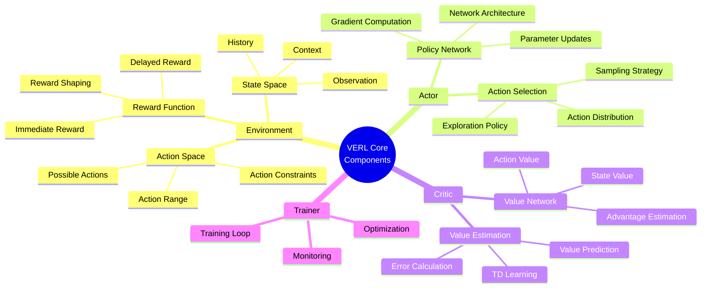


强化学习:

- 一种通用的 `Post-Training` 范式.
- 类比 人类学习中 使用 `Reward` 机制去 奖励模型. 类如 `Reward Function` 去演进

使用人类学习的方式类比如下:

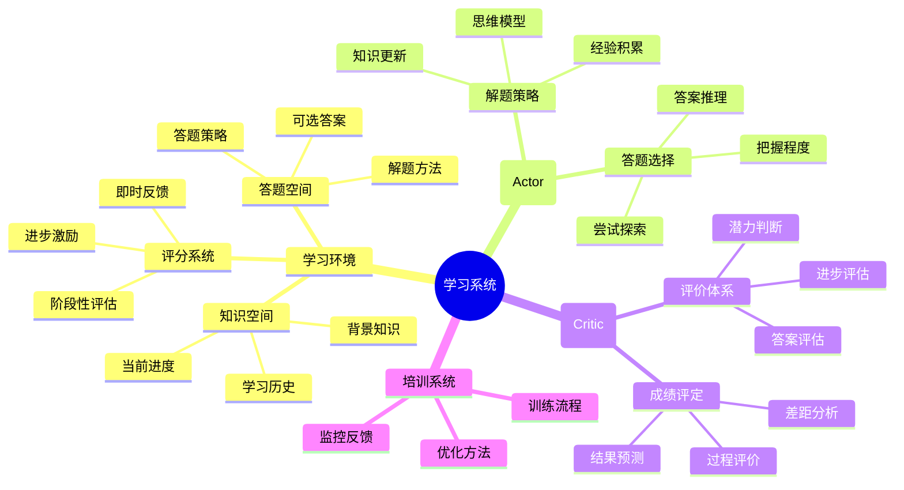


### 3-2 分布实现 `RL` 代码.

**1)-Environment-环境**

类似人类学习中 给一个考试环境， 考场/训练场

```python
# 基础环境类
class BaseEnvironment:
    def __init__(self, config):
        self.config = config
        self.model = None
        self.tokenizer = None
        
    def reset(self):
        """环境重置"""
        # 返回初始状态
        return initial_state
        
    def step(self, action):
        """执行一步交互"""
        # 1. 根据动作生成响应
        # 2. 计算奖励
        # 3. 判断是否结束
        # 4. 收集信息
        return next_state, reward, done, info
```

例如:

```python
class LLMEnvironment(BaseEnvironment):
    def __init__(self, config):
        super().__init__(config)
        self.model = load_language_model(config)
        self.tokenizer = load_tokenizer(config)
        
    def step(self, action):
        # 生成响应
        response = self.generate_response(action)
        # 计算奖励
        reward = self.compute_reward(response)
        # 更新状态
        next_state = self.update_state(response)
        return next_state, reward, done, info
```

**2)-Actor**

```python
class BaseActor:
    def __init__(self, config):
        self.config = config
        self.policy_network = None
        
    def forward(self, state):
        """根据状态选择动作"""
        # 1. 通过策略网络处理状态
        # 2. 生成动作分布
        # 3. 采样动作
        return action, log_prob
        
    def evaluate_actions(self, state, action):
        """评估动作的价值"""
        # 返回动作的对数概率和熵
        return log_prob, entropy
```

- 策略网络, 也就是我们的目标 模型
- Actor 会根据当前的状态 去选择动作

例如:

```python
class CustomActor(BaseActor):
    def __init__(self, config):
        super().__init__(config)
        self.policy_network = TransformerModel(config)
        
    def forward(self, state):
        # 处理输入状态
        encoded_state = self.encode_state(state)
        # 生成动作分布
        action_logits = self.policy_network(encoded_state)
        # 采样动作
        action = self.sample_action(action_logits)
        return action, self.compute_log_prob(action_logits, action)
```

**3)-Critic**

- 价值网络， 去评估状态的价值

```python
class BaseCritic:
    def __init__(self, config):
        self.config = config
        self.value_network = None
        
    def forward(self, state):
        """评估状态价值"""
        # 返回状态的价值估计
        return value
        
    def evaluate_value(self, state):
        """计算状态的价值"""
        # 返回具体的价值数值
        return value_estimate
```

```python
class CustomCritic(BaseCritic):
    def __init__(self, config):
        super().__init__(config)
        self.value_network = ValueNetwork(config)
        
    def forward(self, state):
        # 编码状态
        encoded_state = self.encode_state(state)
        # 估计价值
        value = self.value_network(encoded_state)
        return value
```


**4)-组合起来**

```python
# 组件之间如何协同工作
class RLSystem:
    def __init__(self, config):
        self.env = BaseEnvironment(config)
        self.actor = BaseActor(config)
        self.critic = BaseCritic(config)
        
    def training_step(self):
        # 1. 获取当前状态
        state = self.env.reset()
        
        # 2. Actor选择动作
        action, log_prob = self.actor(state)
        
        # 3. 环境交互
        next_state, reward, done, info = self.env.step(action)
        
        # 4. Critic评估价值
        value = self.critic(state)
        
        return {
            'state': state,
            'action': action,
            'reward': reward,
            'value': value,
            'log_prob': log_prob
        }
```


## 4-Tiny-ZERO PPO 源码分析


### 4-1 训练整体代码

源码入口位于 [main_ppo.py](https://github.com/Jiayi-Pan/TinyZero/blob/main/verl/trainer/main_ppo.py)

**1)-整体训练的流程**

训练使用的是 [RAY](https://github.com/ray-project/ray), 存储基本都在 `HDFS` 上

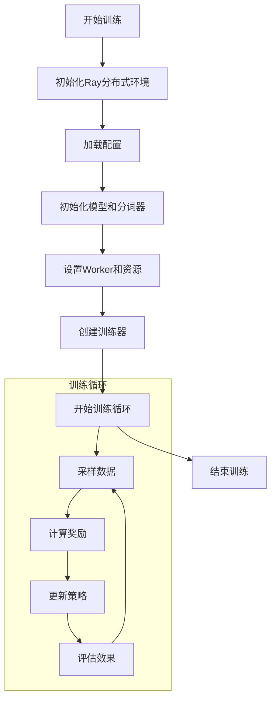

```python
@ray.remote
def main_task(config):
    """主训练任务"""
    # 1. 初始化模型和分词器
    tokenizer = hf_tokenizer(local_path)
    
    # 2. 选择训练策略
    if config.actor_rollout_ref.actor.strategy == 'fsdp':
        # FSDP策略（分片数据并行）
        worker_group_cls = RayWorkerGroup
    elif config.actor_rollout_ref.actor.strategy == 'megatron':
        # Megatron策略（模型并行）
        worker_group_cls = NVMegatronRayWorkerGroup
    ...
```


**2)-RewardManager 的工作流程**


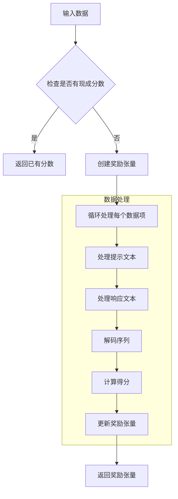

核心代码如下.

```python
class RewardManager():
    """
    奖励管理器：负责计算和管理训练过程中的奖励
    """
    def __init__(self, tokenizer, num_examine) -> None:
        self.tokenizer = tokenizer  # 用于解码模型输出的分词器
        self.num_examine = num_examine  # 需要打印到控制台的解码响应批次数

    def __call__(self, data: DataProto):
        """
        计算奖励值
        根据可用数据集逐步扩展此函数
        """
        # 如果已有奖励分数，直接返回
        if 'rm_scores' in data.batch.keys():
            return data.batch['rm_scores']

        # 创建奖励张量，与响应形状相同
        reward_tensor = torch.zeros_like(data.batch['responses'], dtype=torch.float32)
        
        # 记录已打印的数据源
        already_print_data_sources = {}

        for i in range(len(data)):
            data_item = data[i]  # 获取单个数据项

            # 处理提示部分
            prompt_ids = data_item.batch['prompts']
            prompt_length = prompt_ids.shape[-1]
            valid_prompt_length = data_item.batch['attention_mask'][:prompt_length].sum()
            valid_prompt_ids = prompt_ids[-valid_prompt_length:]

            # 处理响应部分
            response_ids = data_item.batch['responses']
            valid_response_length = data_item.batch['attention_mask'][prompt_length:].sum()
            valid_response_ids = response_ids[:valid_response_length]

            # 解码完整序列
            sequences = torch.cat((valid_prompt_ids, valid_response_ids))
            sequences_str = self.tokenizer.decode(sequences)

            # 获取真实答案
            ground_truth = data_item.non_tensor_batch['reward_model']['ground_truth']

            # 选择并计算奖励分数
            data_source = data_item.non_tensor_batch['data_source']
            compute_score_fn = _select_rm_score_fn(data_source)
            score = compute_score_fn(solution_str=sequences_str, ground_truth=ground_truth)
            reward_tensor[i, valid_response_length - 1] = score

            # 打印样例（如果需要）
            if data_source not in already_print_data_sources:
                already_print_data_sources[data_source] = 0

            if already_print_data_sources[data_source] < self.num_examine:
                already_print_data_sources[data_source] += 1
                print(sequences_str)

        return reward_tensor
```

其中，根据不同的 数据集类型，使用不同的 `score_fn`

```python
def _select_rm_score_fn(data_source):
    """
    根据数据源选择对应的奖励计算函数
    """
    if data_source == 'openai/gsm8k':
        return gsm8k.compute_score  # GSM8K数学题评分
    elif data_source == 'lighteval/MATH':
        return math.compute_score   # MATH数据集评分
    elif "multiply" in data_source or "arithmetic" in data_source:
        return multiply.compute_score  # 乘法/算术评分
    elif "countdown" in data_source:
        return countdown.compute_score  # 倒计时任务评分
    else:
        raise NotImplementedError
```


**3)-Ray Worker 系统**

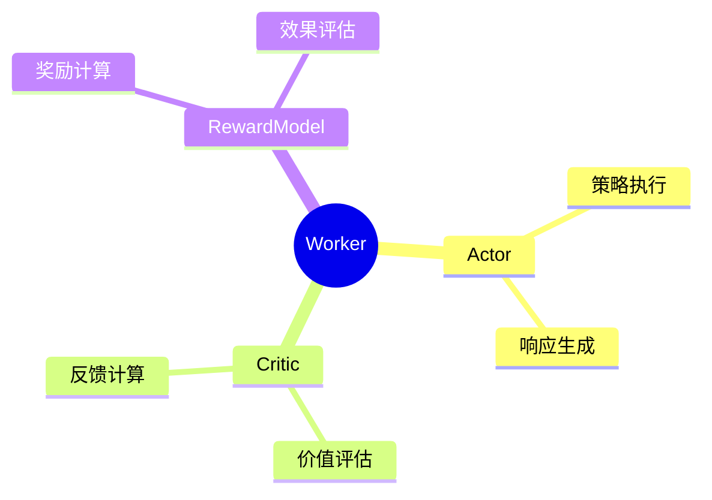

代码:

```python
role_worker_mapping = {
    Role.ActorRollout: ray.remote(ActorRolloutRefWorker),
    Role.Critic: ray.remote(CriticWorker),
    Role.RefPolicy: ray.remote(ActorRolloutRefWorker)
}
```


**4)-奖励计算流程**

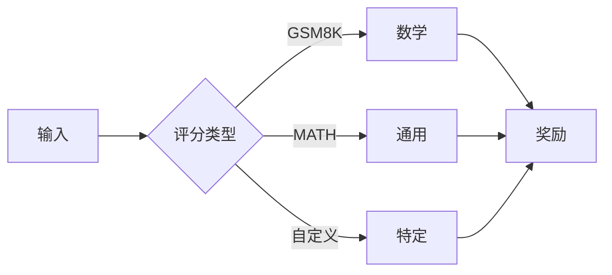


```python
class RewardManager:
    def __call__(self, data: DataProto):
        """计算奖励值"""
        if 'rm_scores' in data.batch.keys():
            return data.batch['rm_scores']
            
        reward_tensor = torch.zeros_like(...)
        # 计算奖励...
        return reward_tensor
```

**5)-PPO 训练循环**

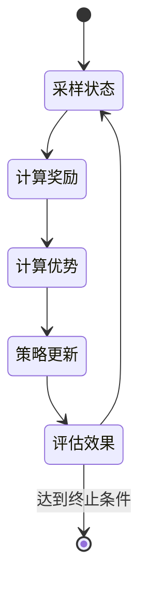


### 4-2 结构目录理解

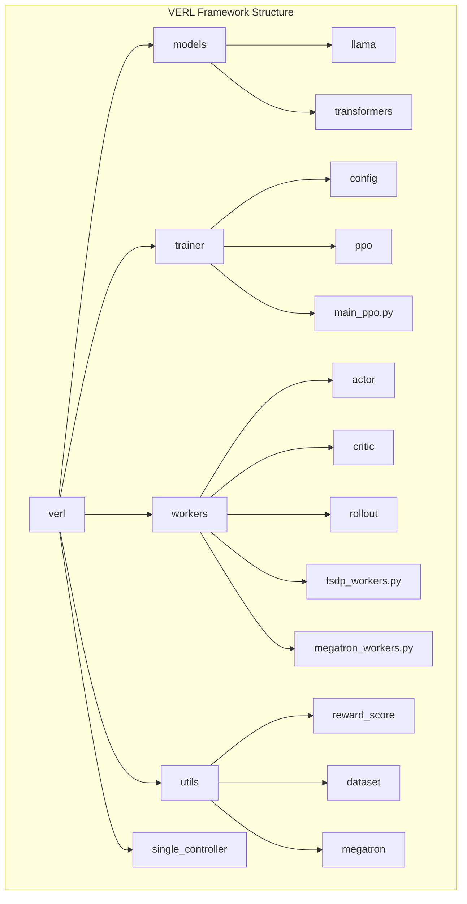

比较核心的功能梳理如下:

1. 模型系统 (models/)
   - llama/: LLaMA模型实现
   - transformers/: transformer架构实现
   - registry.py: 模型注册管理
   - weight_loader_registry.py: 权重加载管理

2. 训练系统 (trainer/)
   - config/: 训练配置文件
   - ppo/: PPO算法实现
   - main_ppo.py: 主训练入口
   - main_eval.py: 评估入口
   - main_generation.py: 生成任务入口
   - fsdp_sft_trainer.py: FSDP微调训练器

3. Worker系统 (workers/)
   - actor/: 策略网络实现
   - critic/: 价值网络实现
   - rollout/: 采样实现
   - reward_model/: 奖励模型
   - fsdp_workers.py: FSDP并行策略
   - megatron_workers.py: Megatron并行策略

4. 工具系统 (utils/)
   - reward_score/: 奖励计算实现
   - dataset/: 数据处理工具
   - megatron/: Megatron相关工具
   - distributed.py: 分布式训练工具
   - fsdp_utils.py: FSDP工具函数
   - memory_buffer.py: 内存管理
   - tracking.py: 训练追踪
   - tokenizer.py: 分词器工具

5. 控制系统 (single_controller/)
   - base/: 基础控制器实现
   - ray/: Ray分布式控制
   - version/: 版本管理

6. 第三方集成 (third_party/)
   - vllm/: vLLM集成
   - 其他第三方库集成

### 4-3 rollout 源码

// wait


## REFER

- [github](https://github.com/deepseek-ai/DeepSeek-R1)
- [Paper](https://ar5iv.org/html/2501.12948v1#:~:text=%3E%20Abstract%253AWe%20introduce%20our%20first,1217%20on%20reasoning)
- [trl](https://github.com/huggingface/trl)


