## 1-Intro

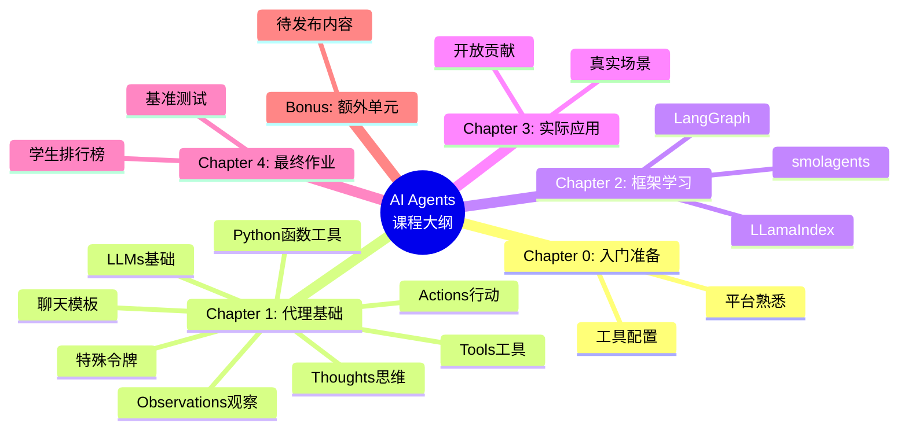


## 2-Introduction to Agents

### 2-1 What is an Agent?

> [!NOTE] Afred is An Agent
> Imagine Alfred **receives a command**, such as: “Alfred, I would like a coffee please.”


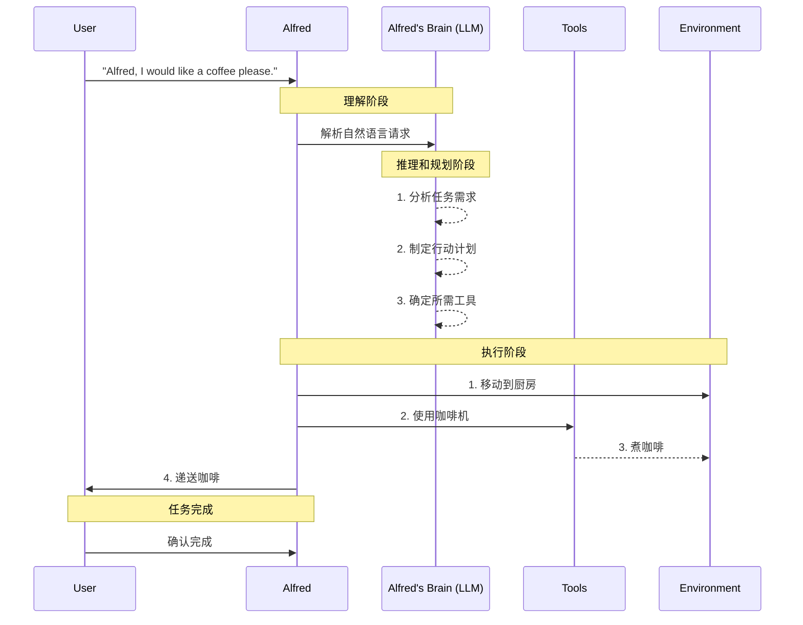


We call it Agent because it has *agency* , aka it has the ability to interact with the environment.


> [!NOTE] Agent 的定义
> An Agent is a system that leverages an AI model to interact with its environment in order to achieve a user-defined objective. It combines reasoning, planning, and the execution of actions (often via external tools) to fulfill tasks.

核心 通过大脑和身体的协调 ， 有能力去跟环境交互. 

`Agent` 是有能力边界的, 他的边界 取决于我们的 `agent` 等价于什么， 如果是一个 `human`, 那边就不能 `fly` .


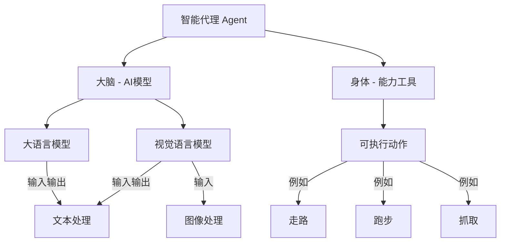


> [!NOTE]  What type of tasks can an Agent do?


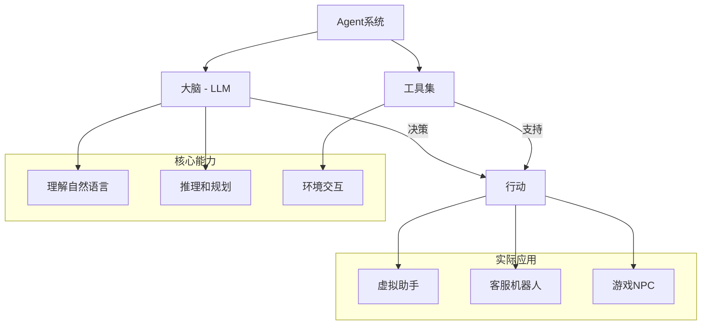


- `LLM` 提供了理解 和 决策的 能力
- `Tools` 提供了执行的能力
- `Actions` 则是把决策执行的桥梁


> [!NOTE] Notes
> Note that **Actions are not the same as Tools**. An Action, for instance, can involve the use of multiple Tools to complete.


## 3 What are LLMs?

### 3-1 What is large language model?

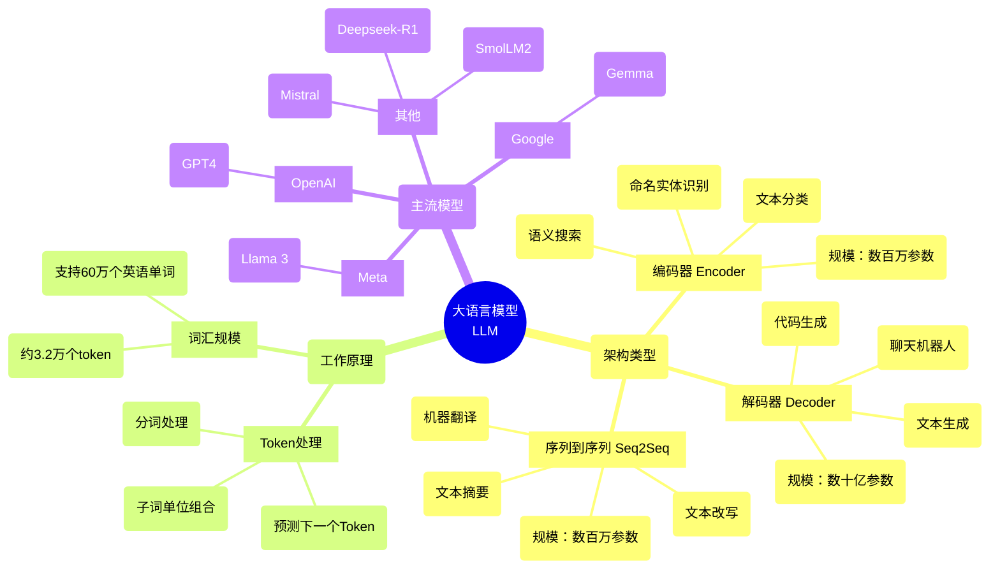


**主流LLM模型及提供商：**

| 类型 | 描述 | 示例 | 应用场景 | 典型参数规模 |
|------|------|------|----------|--------------|
| Encoders (编码器) | 将文本（或其他数据）作为输入，输出文本的密集表示（嵌入） | BERT (Google) | • 文本分类<br>• 语义搜索<br>• 命名实体识别 | 数百万级 |
| Decoders (解码器) | 专注于逐个生成新token来完成序列 | Llama (Meta) | • 文本生成<br>• 聊天机器人<br>• 代码生成 | 数十亿级 (10^9) |
| Seq2Seq (序列到序列) | 结合编码器和解码器，编码器首先将输入序列处理成上下文表示，然后解码器生成输出序列 | • T5<br>• BART | • 机器翻译<br>• 文本摘要<br>• 释义 | 数百万级 |


• Deepseek-R1 (DeepSeek)
• GPT4 (OpenAI)
• Llama 3 (Meta)
• SmolLM2 (Hugging Face)
• Gemma (Google)
• Mistral (Mistral)

**什么是 Token?**

语言到计算机的桥梁:

1. 首先, 计算机只能处理数字. 每个 `Token` 被设计为对应一个为一个数字 `ID` ;
2. 其次是 词汇表的限制, 自然语言的词汇量非常的巨大， 光是英语就有 60W， 而 `Token` 的系统仅仅用 `3.2W` 个基本单位就能组合出来更多的词
3. 处理效率的考虑: 比较小的词汇表， 则意味着更少的参数, 训练和推理的速度更快, 内存的占用也更少.

**token 的一般规则:**

1.	英文
-	一个单词通常是1-2个token
-	较长或罕见的词可能是3-4个token
-	专业术语可能被分解为更多token
2.	中文
-	通常每个汉字是一个token
-	常用词组可能作为整体是一个token
-	标点符号各占一个token
3.	数字和特殊字符
-	连续的数字可能被组合成一个token
-	特殊字符通常单独成token
-	空格也计入token数量


### 3-2 理解 next token 的 precition


LLM 一般称为自回归的:

1. 一次预测的输出会成为下一次预测的输入 ;
2. 这个循环会持续到 预测出 `EOS` 

| Model | Provider | EOS Token | Functionality |
|-------|----------|-----------|---------------|
| GPT4 | OpenAI | `<\|endoftext\|>` | End of message text |
| Llama 3 | Meta (Facebook AI Research) | `<\|eot_id\|>` | End of sequence |
| Deepseek-R1 | DeepSeek | `<\|end_of_sentence\|>` | End of message text |
| SmolLM2 | Hugging Face | `<\|im_end\|>` | End of instruction or message |
| Gemma | Google | `<end_of_turn>` | End of conversation turn |

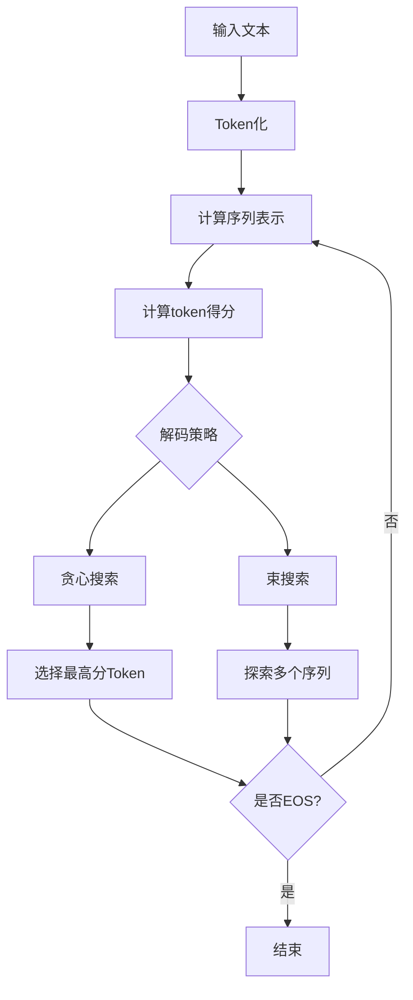


> [!NOTE] 贪心比较简单，但是容易错过全局的最优解
> `Beam` Search 则是更高级的策略，会同时探索多个候选队列，寻找总分最高的序列，即使某些 token 分数低也有更能被选择


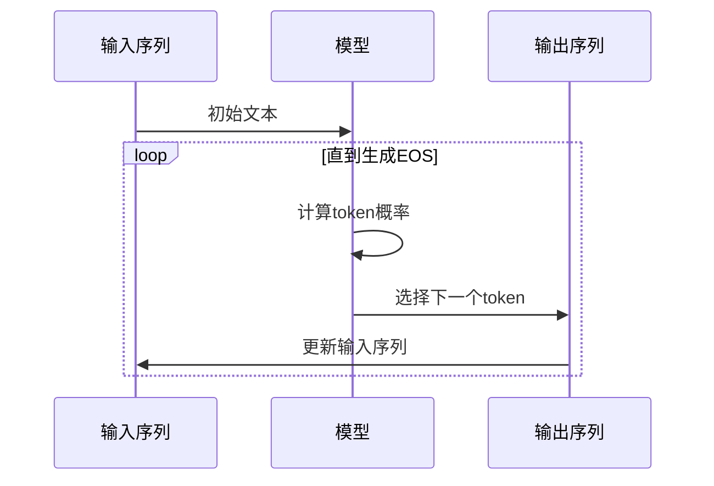

### 3-3 Attention is all your need


- `Attention is all you need` - Transformer 架构的核心
- 在预测下一个词的时候， 每个词的重要性是不一样的
- 例如: `The capital of France is ...` 中, "France" 和 "Capital" 携带了最重要的信息


## 4-Messages and Special Tokens

### 4-1 Messages: 对话管理

理解 LLM 的对话管理机制.

1. 用户看到的是: 聊天界面的对话形式
2. 实际处理: 所有消息被合并为单一提示词
3. 模型特点: 无 "记忆", 每次都完整读取对话的历史

`ChatTemplate`  的作用:


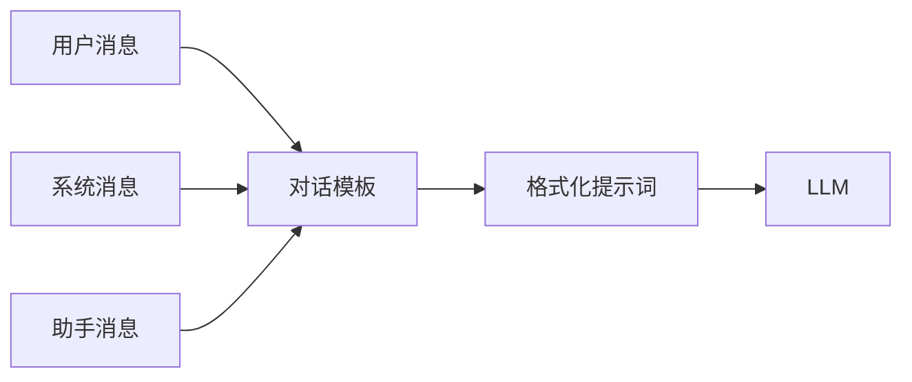


> [!NOTE] 有2种类型的消息, 系统消息和对话消息

```python
system_message = {
    "role": "system",
    "content": "You are a professional customer service agent. Always be polite, clear, and helpful."
}

```

对话消息.

```python
conversation = [
    {"role": "user", "content": "I need help with my order"},
    {"role": "assistant", "content": "I'd be happy to help. Could you provide your order number?"},
    {"role": "user", "content": "It's ORDER-123"},
]
```


系统消息也叫做系统提示词 定义了模型应该如何表现，作为持久性指令指导后续的所有交互.

而且在使用 `Agents` 的时候, 系统消息同样要提供 工具的信息: 

1. avaiable tools
2. instructions to the model on how to format the actions to take 
3. guidelines on how the thought process should be segmented.

大致如下:

```
system_message = {
    "role": "system",
    "content": """
    你是一个智能助手，具备以下能力和要求：

    1. 可用工具：
       - web_search: 网络搜索
       - calculator: 数学计算
       - weather_api: 天气查询

    2. 动作格式：
       执行工具时使用如下格式：
       <action>
       tool: [工具名称]
       params: {
           "query": "搜索内容"
       }
       </action>

    3. 思维过程：
       请按以下步骤思考：
       - Thought: 理解需求
       - Action: 选择工具
       - Observation: 分析结果
       - Plan: 规划下一步
       - Response: 生成答案

    注意：
    - 每个工具调用必须遵循格式规范
    - 清晰记录每个思维步骤
    - 确保回答准确且有帮助
    """
}
```

**)-聊天模版通过保存对话历史来维护上下文**

```
conversation = [
    {"role": "user", "content": "I need help with my order"},
    {"role": "assistant", "content": "I'd be happy to help. Could you provide your order number?"},
    {"role": "user", "content": "It's ORDER-123"},
]
```

*SmoILM2*

```
<|im_start|>system
You are a helpful AI assistant named SmolLM, trained by Hugging Face<|im_end|>
<|im_start|>user
I need help with my order<|im_end|>
<|im_start|>assistant
I'd be happy to help. Could you provide your order number?<|im_end|>
<|im_start|>user
It's ORDER-123<|im_end|>
<|im_start|>assistant
```

*Llama 3.2*

```
<|begin_of_text|><|start_header_id|>system<|end_header_id|>

Cutting Knowledge Date: December 2023
Today Date: 10 Feb 2025

<|eot_id|><|start_header_id|>user<|end_header_id|>

I need help with my order<|eot_id|><|start_header_id|>assistant<|end_header_id|>

I'd be happy to help. Could you provide your order number?<|eot_id|><|start_header_id|>user<|end_header_id|>

It's ORDER-123<|eot_id|><|start_header_id|>assistant<|end_header_id|>
```

对话模版的作用:

▪ 维护对话上下文
▪ 确保格式一致性
▪ 支持多轮交互


### 4-2 Chat Templates

**)-Instruct Model 和 Base Model**

| 特性 | 基础模型 | 指令模型 |
|------|----------|----------|
| 训练数据 | 原始文本 | 指令数据集 |
| 主要用途 | token预测 | 指令执行 |
| 交互能力 | 需要格式化 | 原生支持 |
| 使用难度 | 较高 | 较低 |
| 模板要求 | 严格 | 灵活 |


> [!NOTE] Notes
> 基础模型可以在不同的聊天模板上进行微调，所以当我们使用指令模型时，需要确保使用正确的聊天模板


**)-聊天模板的主要作用是将结构化的JSON消息转换为模型可以理解的文本格式**

例如 `SmoLM2-135M-Instruct` 聊天模版的简化版本如下:

```jinjia


<|im_start|>system
You are a helpful AI assistant named SmolLM, trained by Hugging Face
<|im_end|>

<|im_start|>{{ message['role'] }}
{{ message['content'] }}<|im_end|>


```

用户只需要传递聊天记录即可:

```python
messages = [
    {"role": "system", "content": "You are a helpful assistant focused on technical topics."},
    {"role": "user", "content": "Can you explain what a chat template is?"},
    {"role": "assistant", "content": "A chat template structures conversations between users and AI models..."},
    {"role": "user", "content": "How do I use it ?"},
]
```


给 模型则是如下内容:

```python
<|im_start|>system
You are a helpful assistant focused on technical topics.<|im_end|>
<|im_start|>user
Can you explain what a chat template is?<|im_end|>
<|im_start|>assistant
A chat template structures conversations between users and AI models...<|im_end|>
<|im_start|>user
How do I use it ?<|im_end|>
```

而 `transformers` 的库则会在 分词的过程中自动的处理 聊天模版.

可以用 [Chat Template Viewer](https://huggingface.co/spaces/Jofthomas/Chat_template_viewer) 去体验各种模型


## 5-What are Tools?

`Tools` 是 `LLM` 的能力扩展.

常见的4种 `Tool` .

- Web Search
- Image generation
- Retrieval
- Api interface


> [!NOTE] Tips
> LLM 只能 text2Text, 我们说的 `Tools`, 其实是 providing Tools to an Agent, 其实也是通过文本的方式告诉 `LLM` 工具的存在.

代码由 `Agent` 去调用.


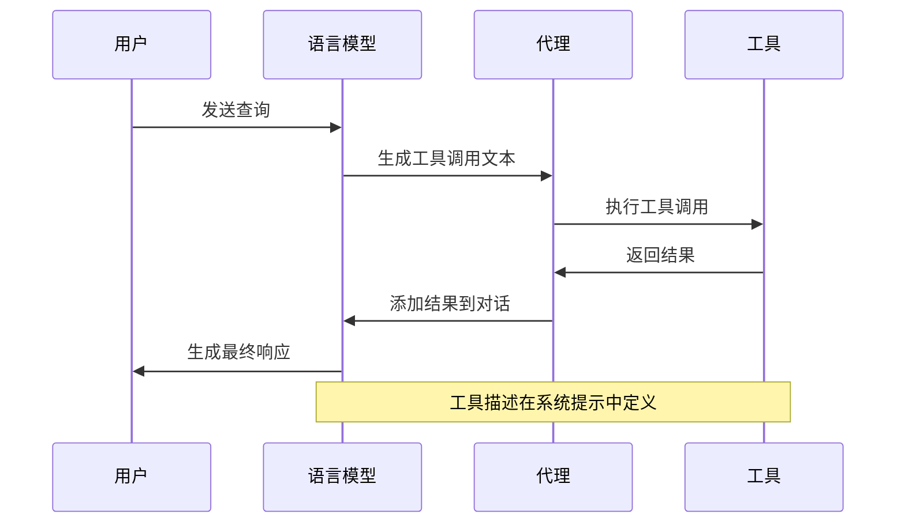


**1)-如何 告诉 LLM 我们的工具** 

一个例子，我们希望告诉 `LLM` 我们有一个简单的计算器. 

```python
def calculator(a: int, b: int) -> int:
    """Multiply two integers."""
    return a * b

print(calculator.to_string())
```

我们把 `Function Call` 的所有信息都合成一个字符串 ，因为 LLM 只能理解文本.

```
Tool Name: calculator, Description: Multiply two integers., Arguments: a: int, b: int, Outputs: int
```

这个时候模型就会识别为工具， 知道需要传递设么输入以及从输出中期望得到什么!

这个文本描述是我们 `LLM` 了解的工具信息.额外的工具也必须保持一致，并且使用相同的格式, 这个过程可能会脆弱， 可能会意外的忽略掉细节.

有一些更好的方式:


**2)-Auto-formating Tool Sections**

最后的目标是 名称， 功能， 期望的输入和提供的输出. 

那分别就是 函数的名称，函数的注释，函数的输入，函数的输出.

```python
@tool
def calculator(a: int, b: int) -> int:
    """Multiply two integers."""
    return a * b

print(calculator.to_string())
```

同样会得到上面的结果。

```
Tool Name: calculator, Description: Multiply two integers., Arguments: a: int, b: int, Outputs: int
```

**3)-Generic Tool implementation**

通用工具实现.


> [!NOTE] 免责声明：
> 这个示例实现是虚构的，但与大多数库中的实际实现非常相似。

```python
class Tool:
    """
    表示一个可重用代码片段（工具）的类。
    
    属性：
        name (str): 工具名称。
        description (str): 工具功能的文本描述。
        func (callable): 此工具包装的函数。
        arguments (list): 参数列表。
        outputs (str or list): 包装函数的返回类型。
    """
    def __init__(self, 
                 name: str, 
                 description: str, 
                 func: callable, 
                 arguments: list,
                 outputs: str):
        self.name = name
        self.description = description
        self.func = func
        self.arguments = arguments
        self.outputs = outputs

    def to_string(self) -> str:
        """
        返回工具的字符串表示，
        包括其名称、描述、参数和输出。
        """
        args_str = ", ".join([
            f"{arg_name}: {arg_type}" for arg_name, arg_type in self.arguments
        ])
        
        return (
            f"Tool Name: {self.name},"
            f" Description: {self.description},"
            f" Arguments: {args_str},"
            f" Outputs: {self.outputs}"
        )

    def __call__(self, *args, **kwargs):
        """
        使用提供的参数调用底层函数（callable）。
        """
        return self.func(*args, **kwargs)
```

- `name (str)`：工具名称
- `description (str)`：工具功能的简要描述
- `function (callable)`：工具执行的函数
- `arguments (list)`：预期的输入参数
- `outputs (str or list)`：工具的预期输出
- **call**()：当工具实例被调用时执行函数
- `to_string()`：将工具的属性转换为文本表示

```python
calculator_tool = Tool(
    "calculator",                   # name
    "Multiply two integers.",       # description
    calculator,                     # function to call
    [("a", "int"), ("b", "int")],   # inputs (names and types)
    "int",                          # output
)
```


## 6-TOB 设计模式

代理 会在 思考 -> 行动 -> 观察的持续循环中工作, 每个组件的功能不同.

- Thought : 代理的 `LLM` 部分决定了下一步行动 ;
- Action: 代理通过调用相关参数的工具来执行操作 ;
- Observation: 模型对工具的响应进行反思 ;

规则和 `guideline` 会直接嵌入到 `system prompt`


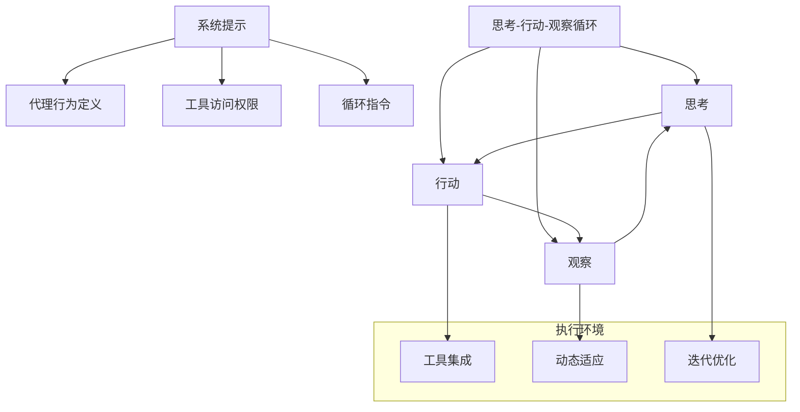
官网给了一个 `Alfred` 的天气工作流:

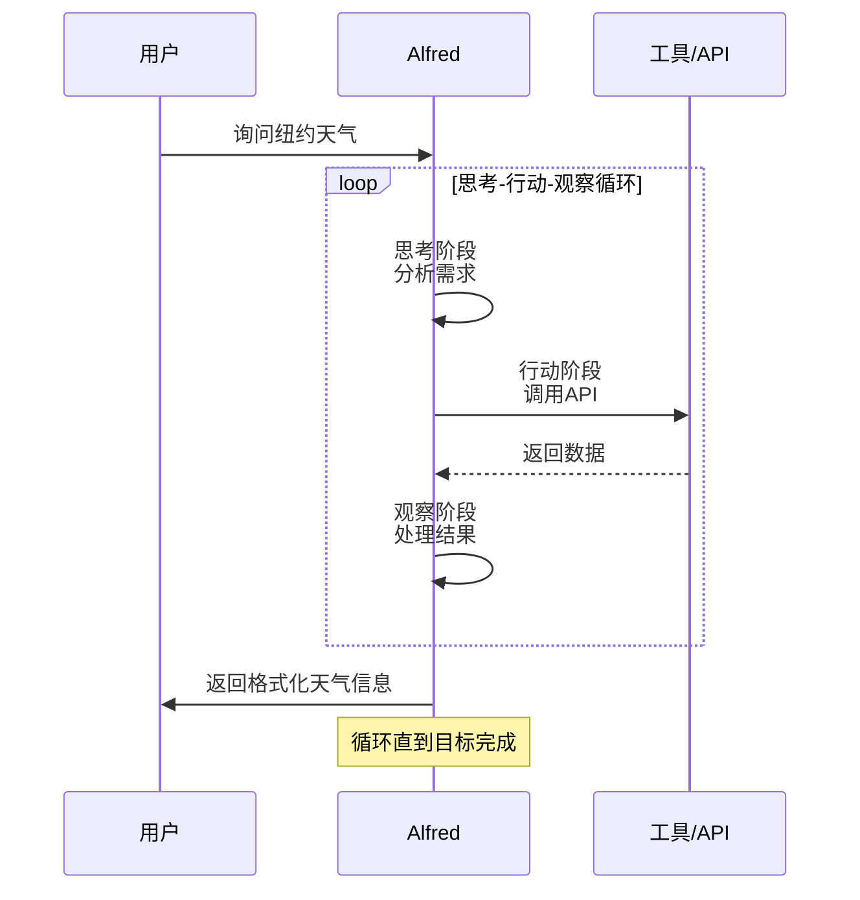

总结, T-A-O 使用一种和 `LLM` 的设计模式， `LLM` 只能理解文本， 一般是作为 `system prompt` 的方式使用的.

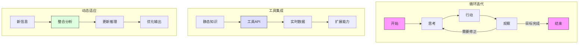

## 7-Re-Act Approach

我们深入探讨 `AI` 代理的内部工作机制 - reason and plan . 我们会探索如果利用 用内部的对话来分析信息， 将复杂的问题分解为可管理的步骤, 并决定下一步采取什么行动. 

而 `Re-Act` 是则是鼓励模型在 行动之前逐步思考的 prompting technique.

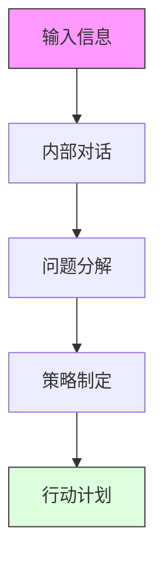


**1)-一些通用的话术**

|Type of Thought|Example|
|---|---|
|Planning|“I need to break this task into three steps: 1) gather data, 2) analyze trends, 3) generate report”|
|Analysis|“Based on the error message, the issue appears to be with the database connection parameters”|
|Decision Making|“Given the user’s budget constraints, I should recommend the mid-tier option”|
|Problem Solving|“To optimize this code, I should first profile it to identify bottlenecks”|
|Memory Integration|“The user mentioned their preference for Python earlier, so I’ll provide examples in Python”|
|Self-Reflection|“My last approach didn’t work well, I should try a different strategy”|
|Goal Setting|“To complete this task, I need to first establish the acceptance criteria”|
|Prioritization|“The security vulnerability should be addressed before adding new features”|

**2)-对于函数调用进行微调的 LLM, 思考的过程是可选的， 如果你不熟悉函数调用，那么在 Actions 部分会有更多的详细信息**

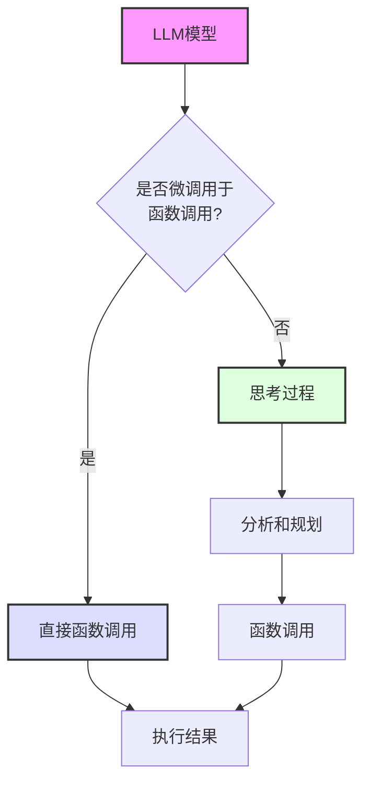


**3)-ReAct 只是一个提示技术， 但是提示 模型去 逐步的思考这个方向是非常 OK 的**

DeepSeek R1 和 OpenAi o1 后面的原理是这样的东西， 这些模型已经被 微调为 在回答之前进行思考 这些模型被训练为 始终包含特定的思考部分 (在 `<think>` 和 `</think>`) 特殊标记之间, 这不是 `ReACT` 这样的提示技术， 而是一种训练方法， 模型通过分析 数千个展示我们期望它做什么的例子来学习生成这些部分.


**4)-ReAct 的工作原理**

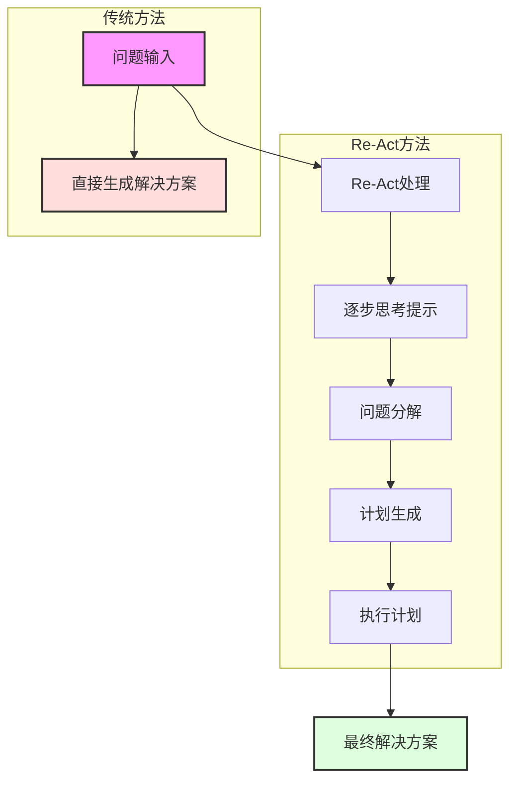


**5)-Re-Act 方法的演进**

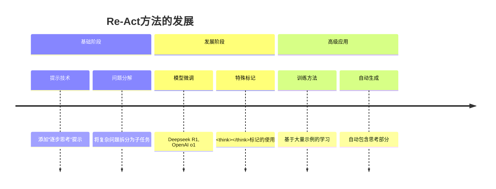


## 8-Actions: Enabling the Agent to Engage with Its Environment


> [!NOTE] Define
> Actions are concrete steps an AI agent to interact with its env.


`Agent Types` 类型区分: 

| Agent类型                | 描述              | 处理方式          | 输出格式      | 适用场景          |
| ---------------------- | --------------- | ------------- | --------- | ------------- |
| JSON Agent             | 以JSON格式指定行动     | 解析JSON后执行相应操作 | 结构化JSON数据 | 标准化接口调用、API交互 |
| Code Agent             | 生成可执行代码块        | 外部解释器执行代码     | 可执行代码块    | 复杂计算、自定义逻辑处理  |
| Function-calling Agent | 经过微调的JSON Agent | 直接调用预定义函数     | 函数调用格式    | 高频固定操作、性能敏感场景 |

`Action Types` 区分:

| Action类型 | 目的      | 交互对象     | 操作范围     | 示例         |
| -------- | ------- | -------- | -------- | ---------- |
| 信息收集     | 获取和处理数据 | 数据源、数据库  | 搜索、查询、检索 | 网页搜索、数据库查询 |
| 工具使用     | 执行特定功能  | API、计算工具 | 调用、计算、执行 | API调用、数学计算 |
| 环境交互     | 操作外部系统  | 设备、接口    | 控制、操作、监控 | 设备控制、界面操作  |
| 通信       | 信息交换    | 用户、其他代理  | 对话、协作、反馈 | 用户聊天、代理协作  |


**)-The Stop And Parse Approach**

`STOP` 机制的作用: 类似一个句号，控制边界.  


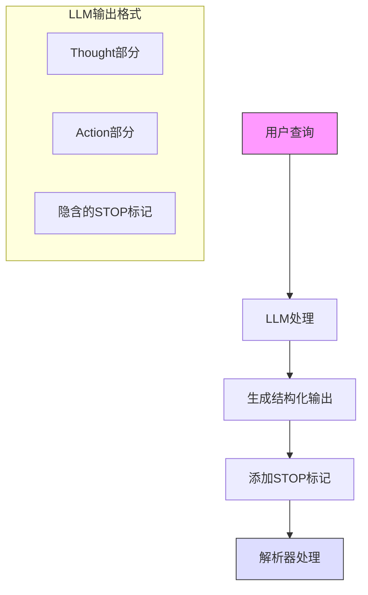


这种方法让 `Agent's` 的输出是格式化而且可以预测的, `<STOP>` 标记底层原理没有详细说明的. 这里仅仅描述了他的作用:

1. Generation is a Structured Format
2. Halting Further Generation
3. Paring the Output

**Code Agents: 直接生成代码**

对应的是另一种方式, `Code Agents`.


这个想法是: 代替输出简单的 `JSON` 对象， `Code Agent` 会直接生成一个可执行的代码块- `Python` 语言 .

能有一些明显的优势:

1. 表达能力: 代码可以自然地表示复杂逻辑，包括循环、条件和嵌套函数，提供比JSON更大的灵活性 ;
2. 模块化和可重用性: 生成的代码可以包含在 不同操作或任务中可重用的函数和模块 ;
3. 增强的可调试性: 使用明确定义的编程语法, 代码错误通常更容易检测和纠正 ;
4. 直接集成: `Code Agent` 可以直接与外部库和 `API` 集成, 实现更复杂的操作, 例如数据处理或者实时决策

```python
# Code Agent Example: Retrieve Weather Information
def get_weather(city):
    import requests
    api_url = f"https://api.weather.com/v1/location/{city}?apiKey=YOUR_API_KEY"
    response = requests.get(api_url)
    if response.status_code == 200:
        data = response.json()
        return data.get("weather", "No weather information available")
    else:
        return "Error: Unable to fetch weather data."

# Execute the function and prepare the final answer
result = get_weather("New York")
final_answer = f"The current weather in New York is: {result}"
print(final_answer)
```


| 特性   | Code Agent         | JSON Agent |
| ---- | ------------------ | ---------- |
| 表达能力 | 可以表达复杂逻辑（循环、条件、嵌套） | 仅限于数据结构描述  |
| 模块化  | 支持函数和模块复用          | 较难实现代码复用   |
| 调试能力 | 完整的编程语法，易于调试       | 仅限于数据验证    |
| 集成能力 | 可直接集成外部库和API       | 需要额外的集成层   |


## refer

- [Agents-Course](https://github.com/huggingface/agents-course?tab=readme-ov-file) 