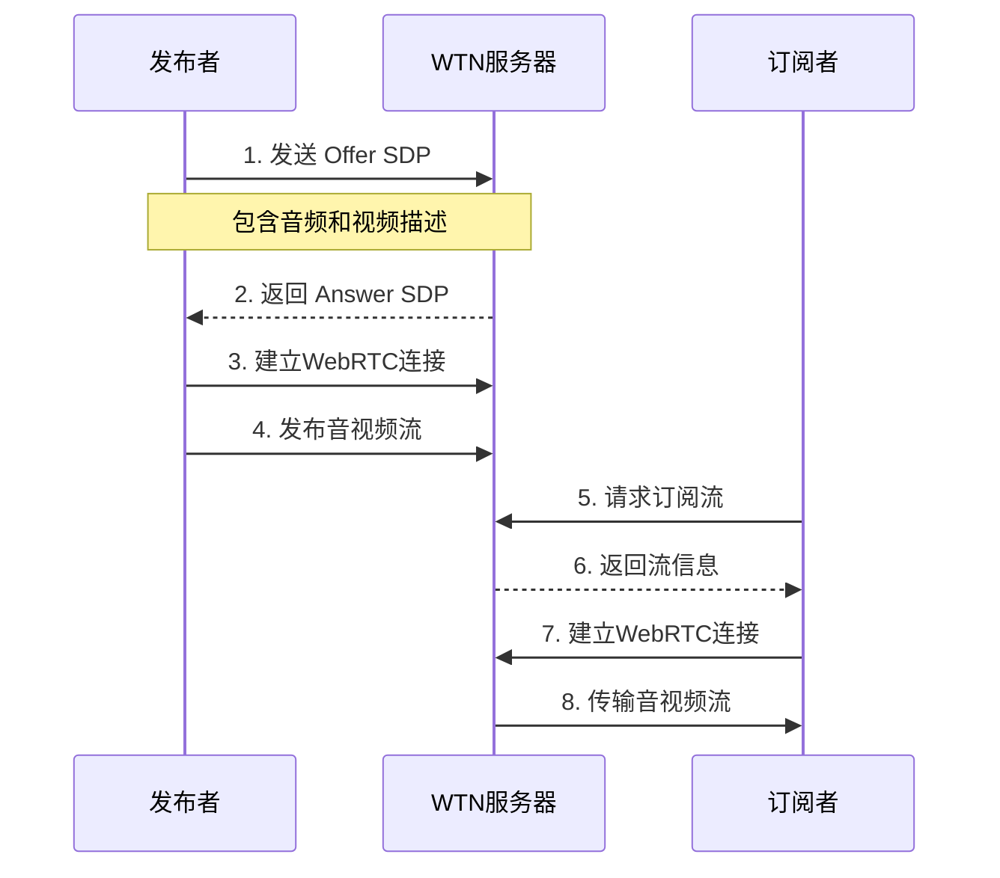
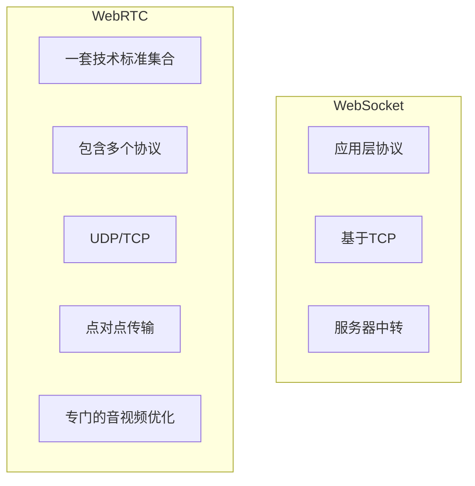
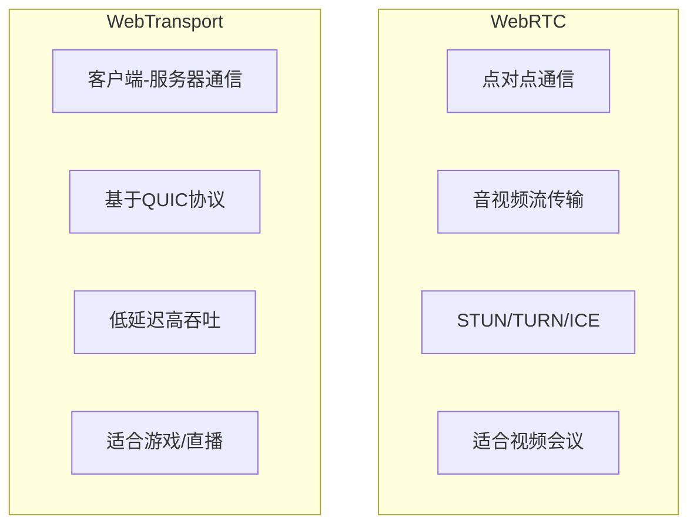

## 1-介绍

来面来自于 火山引擎 rtc 页面的流程, 用了一个 `WTN 服务器` 做中转, 一样是全双工双向协议的还有 `WebSocket` 和 `WebTransport` ;

> [!NOTE]  WebRTC vs WebSocket vs WebTransport

可以看出来 由于直播行业等等的发展 , `WebRTC` 则专门为音视频定制:
- 专门针对音视频 ;
- 内置功能: 音视频采集, 编解码, 网络传输, 回音消除 ;

音视频优化:

1. 自动码率适应: 视频会议自动的调整清晰度 ;
2. 丢包补偿: 即使网络不稳定，声音也不会断断续续 ;
3. 回音消除: 解决串音问题 ;
4. 噪声抑制: 自动过滤背景噪音, 开会对方也听不到周围的嘈杂声 ;
5. 自动增益控制: 声音太大自动降低， 声音太小自动提高 ;

网络传输优化:

1. `NACK`: 丢包重传, 发现数据包丢失后立即要求重发 ;
2. `FEC`: 前向纠错, 丢失了部分数据页能还原完整画面 ;
3. `RTX`: 选择性重传, 优先保证关键画面的传输 ;
4. `PLI`: 关键帧请求, 视频花屏快速的恢复清晰画面 ;

## 2-产品关系

看了一个火山引擎的 音视频集成的姿势.

## refer

- [webrtc vs webtransport](https://www.videosdk.live/developer-hub/webtransport/webrtc-vs-webtransport)
- [火山实时音视频](https://www.volcengine.com/docs/6348/66812)
- [WebRTC 传输网络](https://www.volcengine.com/docs/6752/122560)

