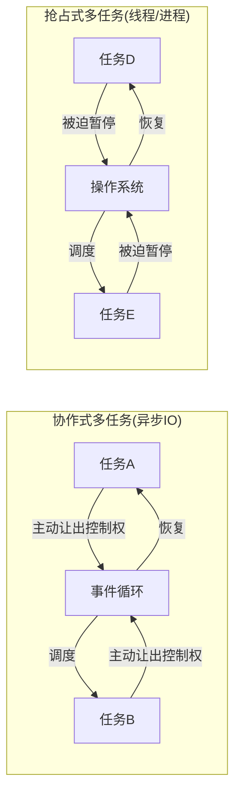
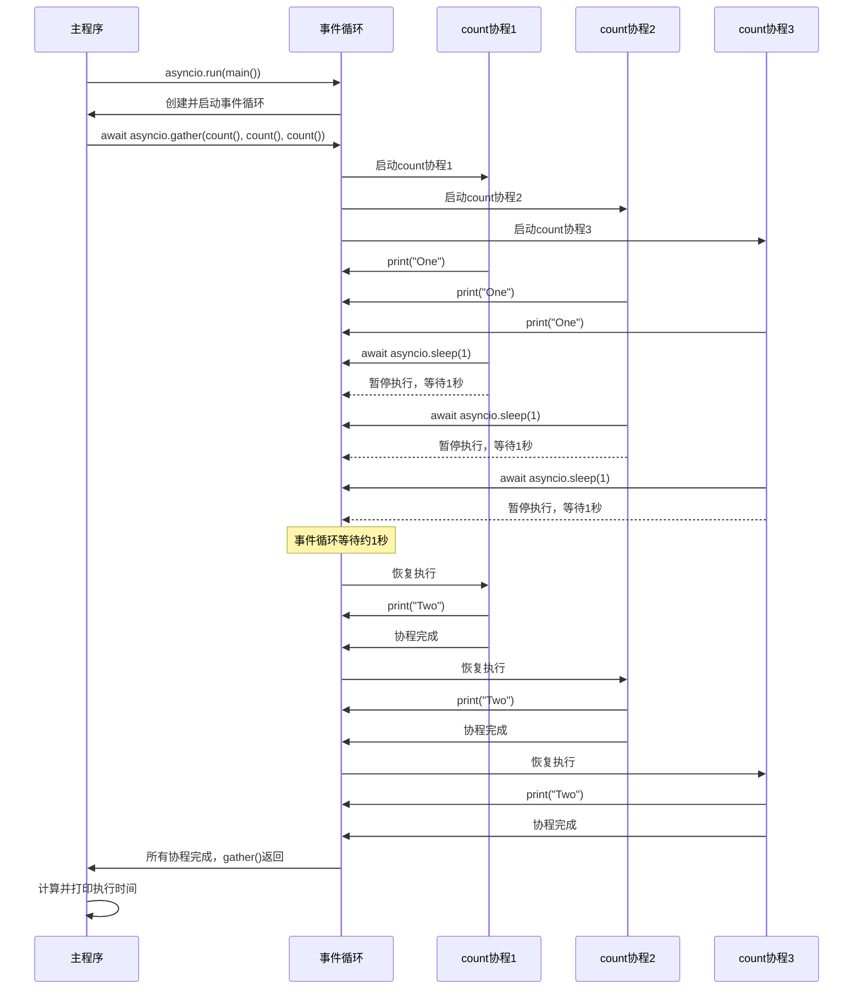
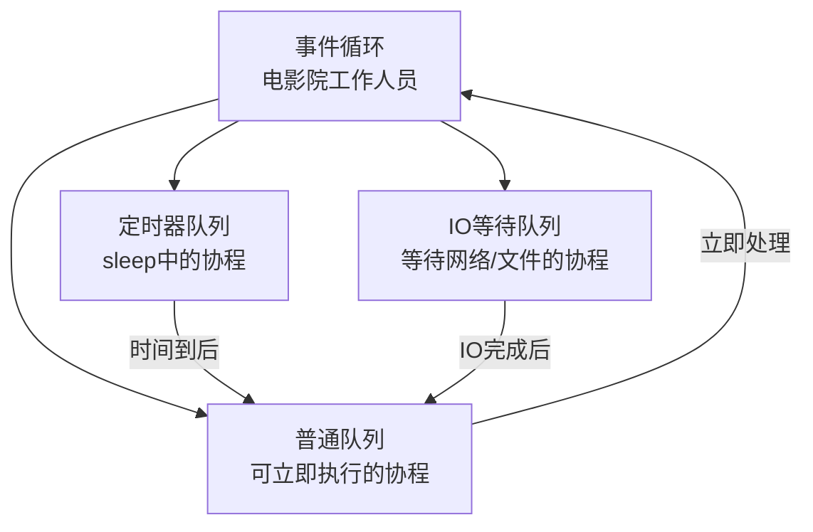
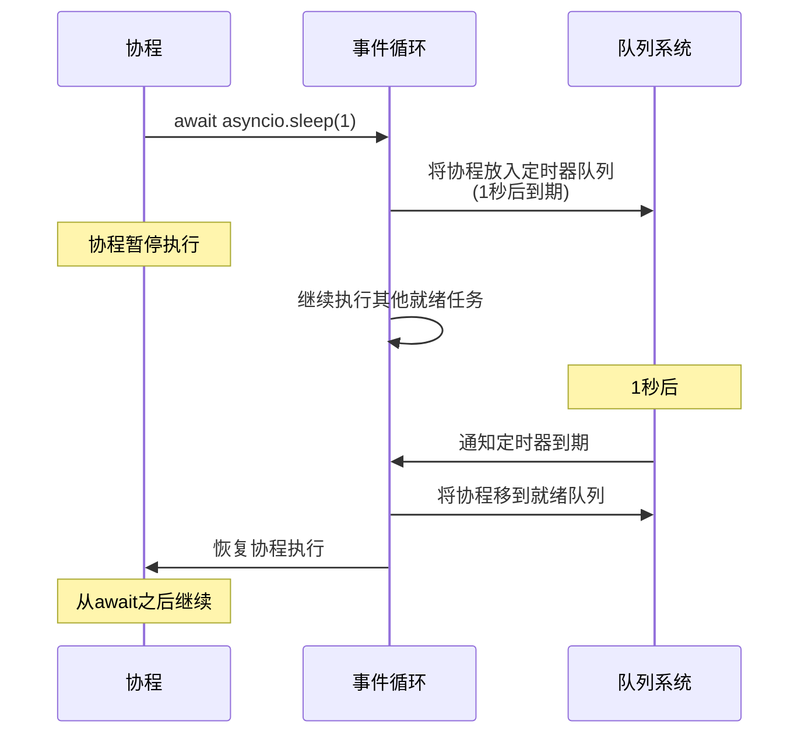

## 1-Intro

**1)-What?**

异步编程是一个单线程的设计， 是一种编程的风格, 是一种编程范式，用来 *协作* 多任务. 

**异步IO的关键特性**

1. **非阻塞操作**：在等待IO操作完成时不会阻塞整个程序
2. **单线程设计**：避免了线程切换的开销和多线程的复杂性
3. **协作调度**：任务通过await主动让出控制权
4. **事件驱动**：基于事件循环来协调任务执行



**2)-example-国际象棋比赛**

```mermaid
gantt
    title 同步vs异步国际象棋表演赛
    dateFormat  s
    axisFormat %H:%M:%S
    
    section 同步方式
    棋局1 : 0, 1800s
    棋局2 : 1800, 1800s
    棋局3 : 3600, 1800s
    ...其他棋局... : 5400, 37800s
    
    section 异步方式
    所有棋局第1回合 : 0, 120s
    所有棋局第2回合 : 120, 120s
    所有棋局第3回合 : 240, 120s
    ...其他回合... : 360, 3240s

```




**3)-Async IO is Not Easy**

虽然异步 `IO` 可以避免 多线程代码的一些困难. 但是 异步模型本身围绕着 `callback`, `event`, `transport`, `protocol`, `features` 设计. 也挺麻烦的. 

主要还是看生态.

`coroutine` 是一种特殊 特殊 `Python generator function`.  可以在 `return` 之间暂停，把当前的执行权让给其他的 `coroutine`

**4)-E1**

```python
#!/usr/bin/env python3
# countasync.py

import asyncio  # 导入asyncio库，这是Python的异步IO标准库

async def count():  # 定义一个协程函数
    print("One")  # 打印"One"
    await asyncio.sleep(1)  # 异步等待1秒，这里会暂停当前协程但不阻塞事件循环
    print("Two")  # 1秒后继续执行，打印"Two"

async def main():  # 定义主协程函数
    # asyncio.gather()并发运行多个协程，并等待它们全部完成
    await asyncio.gather(count(), count(), count())

if __name__ == "__main__":  # 程序入口点
    import time
    s = time.perf_counter()  # 记录开始时间
    asyncio.run(main())  # 运行主协程
    elapsed = time.perf_counter() - s  # 计算经过的时间
    print(f"{__file__} executed in {elapsed:0.2f} seconds.")  # 打印执行时间
```





**5)-可以类比为有多种队列. **

- **就绪队列**：可以立即入场的观众（可立即执行的协程）
	- 存放可以立即执行的协程
	- 事件循环会依次取出并执行这些任务
- **定时器队列**：预约了特定时间的观众（sleep中的协程）
	- 按触发时间排序的最小堆结构
	- `⁠asyncio.sleep()` 会将任务放入这个堆中
	- 事件循环会检查堆顶元素，如果时间到了，就将任务移到就绪队列
- **IO等待队列**：等待朋友带票来的观众（等待IO完成的协程）
	- 使用操作系统的IO多路复用机制（如 `epoll`、`kqueue`）
	- 监控多个IO源（文件描述符、`socket`等）
	- 当IO事件发生时，将相关任务移到就绪队列



**6)-再次类比 await的工作流*




## 2-Rules of Async IO

- The syntax `async def` introduces either a **native coroutine** or an **asynchronous generator**. The expressions `async with` and `async for` are also valid, and you’ll see them later on.
- The keyword `await` passes function control back to the event loop. (It suspends the execution of the surrounding coroutine.) If Python encounters an `await f()` expression in the scope of `g()`, this is how `await` tells the event loop, “Suspend execution of `g()` until whatever I’m waiting on—the result of `f()`—is returned. In the meantime, go let something else run.”


关键语法:

1.	协程定义：
	- 使用⁠async def定义协程函数
	- 协程可以包含⁠await、⁠return或⁠yield语句（都是可选的）
	- 空的协程定义⁠async def noop(): pass也是有效的
2.	`await` 关键字：
	- 只能在协程函数内部使用
	- 用于暂停当前协程，将控制权交回事件循环
	- 等待的必须是"可等待对象"（另一个协程或实现⁠.__await__()方法的对象）
3.	`yield` 在异步中的使用:
	- 在⁠ `async def` 中使用 `⁠yield` 创建异步生成器
	- 异步生成器需要通过⁠ `async for` 迭代
	- 不能在⁠ `async def` 中使用 `⁠yield from`（会引发语法错误）
4.	调用规则：
	- 协程函数调用返回协程对象，不会立即执行
	- 必须使用⁠`await`、⁠`asyncio.run()` 或其他调度方法来执行协程

下面是一些例子:


```python
async def f(x):
    y = await z(x)  # OK - `await` and `return` allowed in coroutines
    return y

async def g(x):
    yield x  # OK - this is an async generator

async def m(x):
    yield from gen(x)  # No - SyntaxError

def m(x):
    y = await z(x)  # Still no - SyntaxError (no `async def` here)
    return y
```


注意一下老的语法已经废弃:

```python
import asyncio

@asyncio.coroutine
def py34_coro():
    """基于生成器的协程，旧语法"""
    yield from stuff()

async def py35_coro():
    """原生协程，现代语法"""
    await stuff()

```


// todo