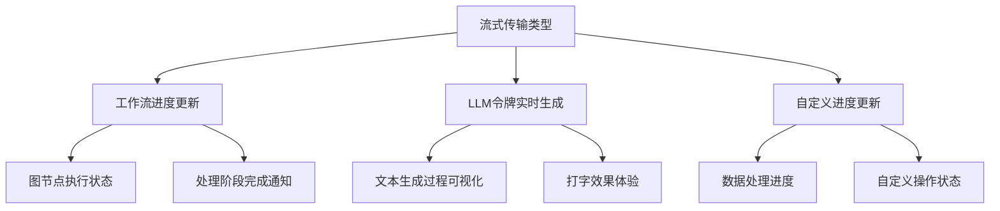

## 1-Intro

在 `langgraph` 中有 三种类型的数据 我们可能需要流式传输:

1. 整个工作流的进度, 例如每个节点执行后就 更新状态 ;
2. `LLM` (大语言模型) 生成的令牌 (`tokens` ) 实时传输 ;
3. 自定义更新 , 例如: (10/100) 条记录 ;




配套的， 在 `.stream` 和 `.astream` 的时候可以 在运行图的时候返回输出.

- `values` : 在图中的每个 步骤后流式传输状态的完整值
- `updates`: This streams the updates to the state after each step of the graph. If multiple updates are made in the same step (e.g. multiple nodes are run) then those updates are streamed separately.
- `custom`: 在图节点内部流式传输 自定义的数据
- `messages`: 为调用 `LLM` 的图节点流式传输 `LLM` 令牌和元数据
- `debug`:  测试模式.


> [!NOTE] values vs updates
> `values`：每次返回整个状态对象，包括未更改的部分, 但是 ⁠`updates`：只返回每步中发生变化的部分，更节省带宽


一些简单的 `demo`. 

```python
# 单模式流式传输
for update in graph.stream(inputs, stream_mode="updates"):
    print(f"收到更新: {update}")

# 多模式流式传输
for mode, data in graph.stream(inputs, stream_mode=["updates", "messages"]):
    if mode == "updates":
        print(f"状态更新: {data}")
    elif mode == "messages":
        print(f"LLM生成: {data[0].content}")
        
# 异步流式传输
async for update in graph.astream(inputs, stream_mode="values"):
    print(f"当前状态: {update}")
```


云平台的能力, `langGraph` 平台也提供了端到端的 `stream` 模式


|                |           |            |     |
| -------------- | --------- | ---------- | --- |
| 模式             | 用途        | 适用场景       | 数据量 |
| values         | 获取完整状态快照  | 需要完整上下文的应用 | 较大  |
| messages-tuple | 实时显示LLM输出 | 聊天界面、文本生成  | 适中  |
| updates        | 高效传输状态变化  | 带宽敏感场景     | 较小  |
| debug          | 详细调试信息    | 开发与测试阶段    | 很大  |
| events         | 全面事件流     | LCEL应用迁移   | 最大  |


## 2-quick start


下面使用 `Messages` 的 `mode`  实现了一个流.

```Python
class SimpleChatState(TypedDict):
    """对话状态定义"""
    messages: Annotated[list, add_messages]


class SimpleChatWorkflow(BaseWorkflow):
    """简单对话工作流实现"""

    def __init__(self):
        super().__init__(name="simple_chat", description="简单对话工作流")
        self.checkpointer = MemorySaver()
        # self.checkpointer = checkpointer_setup.async_saver
        self.llm: ChatOpenAI = model_manager.get_model('doubao')
        self.setup()

    def prefix_node(self, state: SimpleChatState) -> Dict[str, Any]:
        """前置节点，返回固定内容A"""
        # 创建一个AI消息，内容为A
        prefix_message = AIMessage(content="这是前置节点返回的内容A。\n\n接下来是AI助手的回答：\n")
        return {"messages": [prefix_message]}

    def chatbot(self, state: SimpleChatState) -> Dict[str, Any]:
        """对话节点处理函数"""
        response = self.llm.invoke(state["messages"])
        return {"messages": [response]}

    def setup(self) -> None:
        """初始化对话图"""
        builder = StateGraph(SimpleChatState)
        builder.add_node("chatbot", self.chatbot)
        builder.add_node("prefix_node", self.prefix_node)
        # builder.add_edge("chatbot", END)
        builder.set_entry_point("prefix_node")
        builder.add_edge("prefix_node", "chatbot")
        builder.set_finish_point("chatbot")
        self.graph = builder.compile(
            # checkpointer=self.checkpointer
        )
```


```python
from app.agents.workflows.simple_chat import SimpleChatWorkflow  
  
flow = SimpleChatWorkflow()  
  
# 准备输入  
inputs = {  
    "messages": [  
        {"role": "user", "content": "请解释量子计算的基本原理"}  
    ]  
}  
  
# 使用messages模式（适合聊天应用）  
print("使用messages模式的流式输出:")  
for chunk in flow.graph.stream(inputs, stream_mode="messages"):  
    # 在messages模式下，chunk通常是一个元组，包含消息块和元数据  
    if isinstance(chunk, tuple):  
        message_chunk, metadata = chunk  
        if hasattr(message_chunk, 'content') and message_chunk.content:  
            print(message_chunk.content, end="", flush=True)  
    else:  
        # 单一消息块的情况  
        if hasattr(chunk, 'content') and chunk.content:  
            print(chunk.content, end="", flush=True)
```


## 3-What'more . 

### 3-1 custom

最宽松的范式.. 

```python
def chatbot(self, state: SimpleChatState, stream_writer: StreamWriter = None) -> Dict[str, Any]:
"""对话节点处理函数，支持流式输出"""
messages = state["messages"]
# 如果提供了 stream_writer，使用流式输出
if stream_writer:
    # 创建一个空的 AIMessage 用于收集完整响应
    full_response = ""
    
    # 使用 LLM 的流式调用
    for chunk in self.llm.stream(messages):
        # 提取 token
        if hasattr(chunk, "content"):
            token = chunk.content
        else:
            token = chunk  # 根据您的 LLM 实现可能需要调整
        
        # 将 token 添加到完整响应中
        full_response += token
        
        # 使用 StreamWriter 输出当前 token
        stream_writer.write({
            "messages": [AIMessage(content=full_response)]
        })
    
    # 返回完整响应
    return {"messages": [AIMessage(content=full_response)]}
else:
    # 如果没有 stream_writer，使用原来的非流式方法
    response = self.llm.invoke(messages)
    return {"messages": [response]}
```


按照自己的想法来定制 `Stream output`

返回一个 `AsyncGenerator` :

```python
    async def stream_execute_by_message_model(
            self, inputs: Dict[str, Any], config: Optional[Dict[str, Any]] = None
    ) -> AsyncGenerator[Dict[str, Any], None]:
        """
        使用messages模式执行流式异步任务，适合聊天应用

        Args:
            inputs: 工作流输入参数
            config: 可选的配置参数

        Yields:
            Dict[str, Any]: 包含消息内容的字典

        Raises:
            ValueError: 如果graph未初始化
            Exception: 执行过程中的其他错误
        """
        if not self.graph:
            logger.error("Graph not initialized")
            raise ValueError("Graph not initialized. Make sure setup() is called.")

        try:
            logger.info(f"Starting message-mode streaming workflow: {self.name}")
            logger.debug(f"Workflow inputs: {inputs}")

            runnable_config = RunnableConfig(**(config or {}))
            logger.info("Starting graph.astream with messages mode")

            # 使用messages模式进行流式传输
            async for chunk in self.graph.astream(
                    inputs,
                    stream_mode="messages",
                    config=runnable_config
            ):
                logger.debug(f"Received message chunk type: {type(chunk)}")
                logger.debug(f"Received message chunk: {chunk}")

                # 处理消息块
                message_chunk = None
                metadata = None

                # 在messages模式下，chunk可能是元组(消息块, 元数据)或直接是消息块
                if isinstance(chunk, tuple) and len(chunk) >= 2:
                    message_chunk, metadata = chunk
                    logger.debug(f"Extracted message chunk: {message_chunk}")
                    logger.debug(f"Metadata: {metadata}")
                else:
                    message_chunk = chunk
                    logger.debug(f"Direct message chunk: {message_chunk}")

                # 从消息块中提取内容
                content = None
                if hasattr(message_chunk, 'content') and message_chunk.content:
                    content = message_chunk.content
                    logger.debug(f"Extracted content: {content}")
                elif isinstance(message_chunk, dict) and "content" in message_chunk:
                    content = message_chunk["content"]
                    logger.debug(f"Extracted content from dict: {content}")

                # 如果有内容，以统一格式返回
                if content:
                    result = {"messages": [{"role": "assistant", "content": content}]}
                    logger.debug(f"Yielding result: {result}")
                    yield result
                else:
                    logger.warning(f"No content found in message chunk: {message_chunk}")

            logger.info(f"Message-mode streaming workflow {self.name} completed successfully")
        except Exception as e:
            logger.error(
                f"Error in message-mode streaming workflow {self.name}: {str(e)}",
                exc_info=True
            )
            # 返回错误信息
            yield {"messages": [{"role": "assistant", "content": f"处理过程中出现错误: {str(e)}"}]}
            raise
```


### 3-2 Streaming Send Event

```python
@router.post("/mic_task/stream")
async def execute_stream(request: ExecuteRequest):
    """流式执行工作流的API端点"""
    try:
        start_time = time.time()
        workflow, inputs, config = await _prepare_workflow_execution(request)

        # 创建异步生成器函数
        async def generate():
            try:
                first_chunk = True
                # 流式执行工作流
                async for chunk in workflow.stream_execute_by_message_model(inputs, config):
                    if first_chunk:
                        first_chunk_time = time.time()
                        latency = first_chunk_time - start_time
                        # Record the latency in Prometheus histogram
                        MIC_TASK_FIRST_PACKET_LATENCY.observe(latency)
                        logger.info(f"First packet latency for memory_id {request.memory_id}: {latency:.3f} seconds")
                        first_chunk = False
                    
                    # 将完整的chunk内容格式化为JSON
                    data = json.dumps({"content": chunk})
                    yield f"data: {data}\n\n"
            except Exception as e:
                logger.error(f"Error in stream generation: {str(e)}", exc_info=True)
                error_data = json.dumps({"error": "处理请求时发生错误"})
                yield f"data: {error_data}\n\n"

        # 返回流式响应
        return StreamingResponse(
            generate(),
            media_type="text/event-stream",
            headers={
                "Cache-Control": "no-cache",
                "Connection": "keep-alive",
                "X-Accel-Buffering": "no"  # 禁用Nginx缓冲
            }
        )

    except Exception as e:
        logger.error(f"Chat error: {str(e)}", exc_info=True)
        raise HTTPException(
            status_code=500,
            detail=f"Error processing chat: {str(e)}"
        )
```

