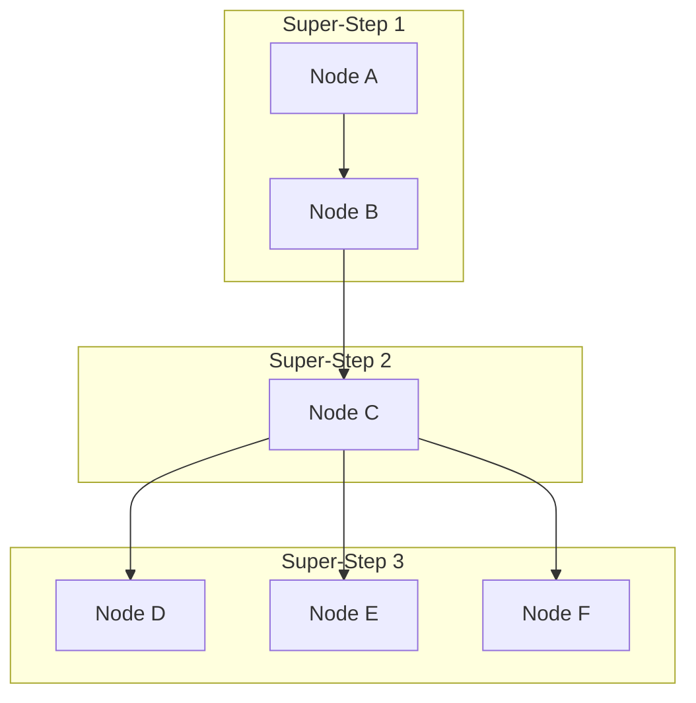
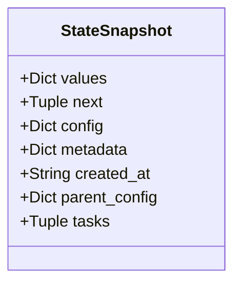
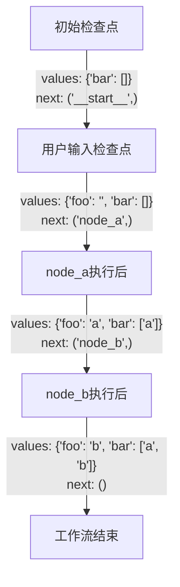
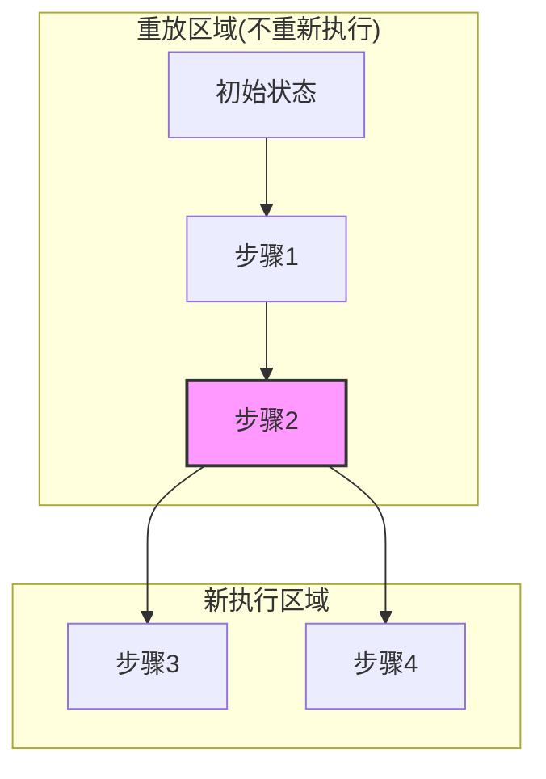
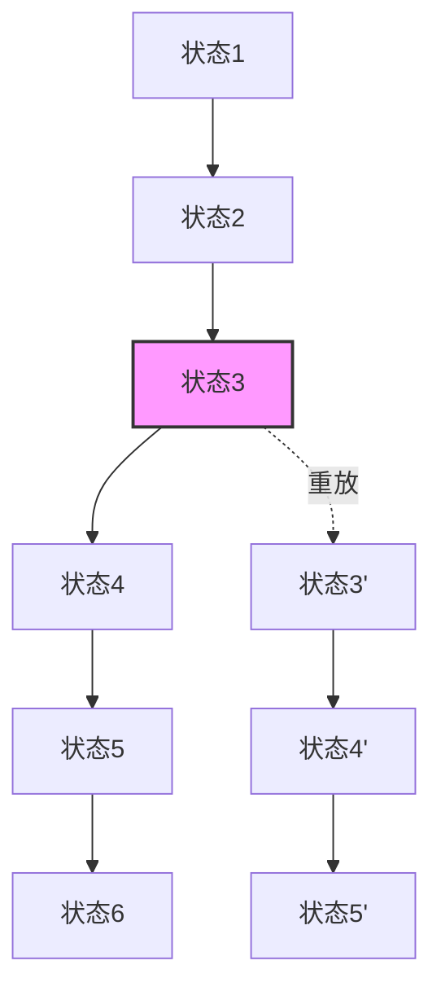

## 1-Intro


> [!NOTE] Tips
> LangGraph 的 checkpoints 机制是核心的功能点, 能让复杂的工作流保持状态, 暂停执行并在需要的恢复


> [!NOTE] What
> Super Step 是什么?





1. 是一个执行的逻辑单元
2. **顺序节点**: 代表一个执行单元
3. **并行节点**: 多个并行节点 共享一个 `Super-Step` .


> [!NOTE] Definition
> 什么是 Thread? 用来关联一系列的检查点: `checkpoints`

## 2-Checkpoints

**1)-StateSnapshot** : 检查点快照



- `values`: 当前状态值，如⁠{'foo': 'b', 'bar': ['a', 'b']}
- `next`: 下一步要执行的节点名称元组，如⁠('node_b',)
- `config`: 配置信息，包含thread_id和checkpoint_id
- `metadata`: 元数据，包含来源、写入信息和步骤编号
- `created_at`: 创建时间戳
- `parent_config`: 父检查点的配置信息
- `tasks`: 下一步任务的详细信息


**2)-Workflow 中生成 checkpoints 的流程**



- 可以通过 `Get State` 拿到最新的状态
- 可以通过 `Get State History` 拿到所有的 `stateHistory` , 根据根据条件优化查询.


## 3-Reply 能力



- 从指定的检查点(checkpoint_id)开始恢复工作流
- 检查点之前的步骤只会被"重放"，不会重新执行
- 检查点之后的步骤会被重新执行，创建新的执行分支



 我们用代码来验证一下: 
```python
from langchain_openai import ChatOpenAI
from langchain_core.tools import tool
from langgraph.graph import MessagesState, START
from langgraph.prebuilt import ToolNode
from langgraph.graph import END, StateGraph
from langgraph.checkpoint.memory import MemorySaver

from app.agents.models.model_manager import model_manager


@tool
def play_song_on_spotify(song: str):
    """Play a song on Spotify"""
    # Call the spotify API ...
    return f"Successfully played {song} on Spotify!"


@tool
def play_song_on_apple(song: str):
    """Play a song on Apple Music"""
    # Call the apple music API ...
    return f"Successfully played {song} on Apple Music!"


tools = [play_song_on_apple, play_song_on_spotify]
tool_node = ToolNode(tools)

# Set up the model

model = model_manager.get_model("qwen-max")
model = model.bind_tools(tools, parallel_tool_calls=False)


# Define nodes and conditional edges


# Define the function that determines whether to continue or not
def should_continue(state):
    messages = state["messages"]
    last_message = messages[-1]
    # If there is no function call, then we finish
    if not last_message.tool_calls:
        return "end"
    # Otherwise if there is, we continue
    else:
        return "continue"


# Define the function that calls the model
def call_model(state):
    messages = state["messages"]
    response = model.invoke(messages)
    # We return a list, because this will get added to the existing list
    return {"messages": [response]}


# Define a new graph
workflow = StateGraph(MessagesState)

# Define the two nodes we will cycle between
workflow.add_node("agent", call_model)
workflow.add_node("action", tool_node)

# Set the entrypoint as `agent`
# This means that this node is the first one called
workflow.add_edge(START, "agent")

# We now add a conditional edge
workflow.add_conditional_edges(
    # First, we define the start node. We use `agent`.
    # This means these are the edges taken after the `agent` node is called.
    "agent",
    # Next, we pass in the function that will determine which node is called next.
    should_continue,
    # Finally we pass in a mapping.
    # The keys are strings, and the values are other nodes.
    # END is a special node marking that the graph should finish.
    # What will happen is we will call `should_continue`, and then the output of that
    # will be matched against the keys in this mapping.
    # Based on which one it matches, that node will then be called.
    {
        # If `tools`, then we call the tool node.
        "continue": "action",
        # Otherwise we finish.
        "end": END,
    },
)

# We now add a normal edge from `tools` to `agent`.
# This means that after `tools` is called, `agent` node is called next.
workflow.add_edge("action", "agent")

# Set up memory
memory = MemorySaver()

# Finally, we compile it!
# This compiles it into a LangChain Runnable,
# meaning you can use it as you would any other runnable

# We add in `interrupt_before=["action"]`
# This will add a breakpoint before the `action` node is called
app = workflow.compile(checkpointer=memory)

if __name__ == '__main__':
    from langchain_core.messages import HumanMessage

    def print_state_tree(states):
        """使用简单的ASCII字符打印状态树"""
        # 创建checkpoint_id到state的映射
        id_to_state = {state.config['configurable']['checkpoint_id']: state for state in states}
        
        # 找到根节点（parent_config 为 None 或 parent_id 不在状态列表中的节点）
        root_states = [
            state for state in states 
            if state.parent_config is None 
            or state.parent_config.get('configurable', {}).get('checkpoint_id') not in id_to_state
        ]
        
        def print_node(state, prefix="", is_last=True):
            """递归打印节点"""
            checkpoint_id = state.config['configurable']['checkpoint_id']
            next_state = state.next
            
            # 打印当前节点
            branch = "└── " if is_last else "├── "
            print(f"{prefix}{branch}Checkpoint: {checkpoint_id} -> Next: {next_state}")
            
            # 查找子节点
            children = [
                s for s in states 
                if s.parent_config is not None 
                and s.parent_config.get('configurable', {}).get('checkpoint_id') == checkpoint_id
            ]
            
            # 打印子节点
            for i, child in enumerate(children):
                new_prefix = prefix + ("    " if is_last else "│   ")
                print_node(child, new_prefix, i == len(children) - 1)

        print("\nState Tree:")
        print("==========")
        for i, root_state in enumerate(root_states):
            print_node(root_state, "", i == len(root_states) - 1)

    def print_state_details(state):
        """打印状态详细信息"""
        print("\nState Details:")
        print("=============")
        print(f"Checkpoint ID: {state.config['configurable']['checkpoint_id']}")
        parent_id = state.parent_config.get('configurable', {}).get('checkpoint_id', 'None') if state.parent_config else 'None'
        print(f"Parent ID: {parent_id}")
        print(f"Next State: {state.next}")

    # 主程序开始
    config = {"configurable": {"thread_id": "1"}}
    input_message = HumanMessage(content="Can you play Taylor Swift's most popular song?")
    
    print("\nRunning Stream...")
    print("================")
    for event in app.stream({"messages": [input_message]}, config, stream_mode="values"):
        event["messages"][-1].pretty_print()

    print("\nOriginal State History:")
    print("=====================")
    all_states = []
    for state in app.get_state_history(config):
        all_states.append(state)
    
    # 打印状态树
    print_state_tree(all_states)
    
    # 选择要回放的状态
    to_replay = all_states[2]
    print_state_details(to_replay)
    
    print("\nReplay Values:")
    print("=============")
    print(to_replay.values)

    print("\nReplaying State...")
    print("================")
    for event in app.stream(None, to_replay.config):
        for v in event.values():
            print(v)

    print("\nState History After Replay:")
    print("=========================")
    replay_states = list(app.get_state_history(config))
    print_state_tree(replay_states)

```


通过观察输出，确实这样的.

```python
State Tree:
==========
└── Checkpoint: 1effc197-48db-61cc-bfff-699489816d75 -> Next: ('__start__',)
    └── Checkpoint: 1effc197-48de-646c-8000-d002075a15a0 -> Next: ('agent',)
        └── Checkpoint: 1effc197-5a46-6704-8001-ec4fb10473e4 -> Next: ('action',)
            ├── Checkpoint: 1effc197-6b10-6274-8002-7557e74701d0 -> Next: ('agent',)
            │   └── Checkpoint: 1effc197-7e1e-63a2-8003-ca33b65a041a -> Next: ()
            └── Checkpoint: 1effc197-5a4e-6652-8002-0336140a12ed -> Next: ('agent',)
                └── Checkpoint: 1effc197-6aff-69b0-8003-5c329a4c6dcd -> Next: ()
```

## 4-Update state

### 4-1 参数

**1)-update_state 方法介绍**

```python
graph.update_state(config, values, as_node=None)
```

- `config`:
	- `thread_id`: 必需参数, 指定要更新哪个线程的状态
	- `checkpoint_id`: 可选参数， 指定从哪个检查点 fork
		- 如果不提供， 从最新的 `checkpoint` `fork`

**2)-values 参数的理解**

`values` 参数包含了 要更新的状态值, 但是更新行为会受到. `State` 也就是状态定义中 `reducer` 的影响.

```python
class State(TypedDict):
    foo: int
    bar: Annotated[list[str], add]
```

- 可以看到 `bar` 中有 `reducer` 也就是 `add` .

```python
# 当前状态
current_state = {"foo": 1, "bar": ["a"]}

# 更新状态
graph.update_state(config, {"foo": 2, "bar": ["b"]})

# 结果状态
new_state = {"foo": 2, "bar": ["a", "b"]}
```


**3)-as_node 参数**

- 如果提供了， 更新就来自指定的节点
- 如果不提供，就是最后更新状态的节点

这个参数决定了更新工作流后走的 `path` 

```python
# 指定更新来自"agent"节点
graph.update_state(config, {"result": "success"}, as_node="agent")

# 这会影响下一步执行，可能触发从"agent"出发的边
```


### 4-2 应用

**1)-状态修正**

```python
# 检测并修正错误状态
def detect_and_fix_errors(thread_id):
    # 获取当前状态
    config = {"configurable": {"thread_id": thread_id}}
    current_state = graph.get_state(config)
    
    # 检查错误
    if "error" in current_state.values:
        # 修正错误
        fixed_values = {
            "error": None,
            "messages": current_state.values["messages"] + [
                {"role": "system", "content": "错误已自动修正"}
            ]
        }
        
        # 更新状态
        graph.update_state(config, fixed_values, as_node="error_handler")
        
        print("错误已修正，工作流将继续")
```

**2)-根据外部的工作流来影响**

```python
# 根据外部条件动态修改工作流方向
def update_workflow_direction(thread_id, condition):
    config = {"configurable": {"thread_id": thread_id}}
    
    if condition == "urgent":
        # 修改状态，使工作流走快速路径
        graph.update_state(config, {"priority": "high"}, as_node="router")
    elif condition == "complex":
        # 修改状态，使工作流走详细分析路径
        graph.update_state(config, {"analysis_depth": "deep"}, as_node="router")

```


**3)-用户反馈的整合**

```python
# 整合用户反馈到当前状态
def incorporate_user_feedback(thread_id, feedback):
    config = {"configurable": {"thread_id": thread_id}}
    current_state = graph.get_state(config)
    
    # 添加用户反馈到消息历史
    messages = current_state.values.get("messages", [])
    messages.append({"role": "user", "content": feedback})
    
    # 更新状态
    graph.update_state(config, {"messages": messages}, as_node="user_input")
    
    # 继续执行工作流
    return graph.invoke(None, config)
```

## 5-Memory Store

一种机制可以 跨 `thread` 管理，可以和 `checkpoints` 协同工作


## refer

- [How to guide](https://langchain-ai.github.io/langgraph/how-tos/persistence/)
- [persistence](https://langchain-ai.github.io/langgraph/concepts/persistence/)
- [timetravel](https://langchain-ai.github.io/langgraph/how-tos/human_in_the_loop/time-travel/#branch-off-a-past-state)
