#blog #reading

## 1-Intro

**1)-Workflows vs Agents**

工作流是通过预定义的代码路径编排LLM和工具的系统。
代理则是LLM动态指导自己的流程和工具使用的系统，保持对如何完成任务的控制。

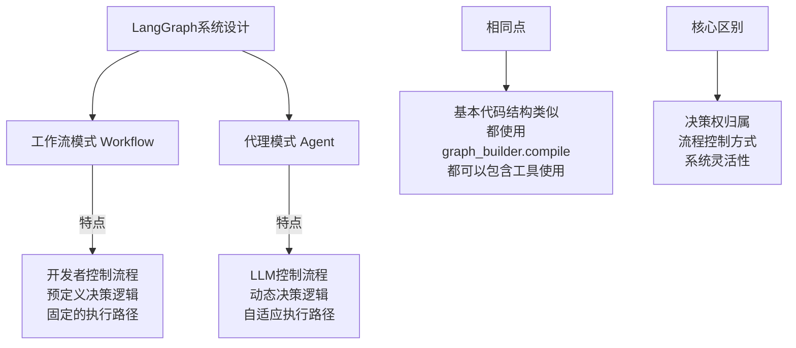

- 实际中: 一般都是混合2种模式，有的地方让 `LLM` 动态决策， 有的地方由 `Workflow` 定义编排

**2)-Selection**

- `LangGraph` - ...
- `Amazon Bedrock` 的 `AI` 代理系统 ;
- `Rivet`: 一个拖放式 `GUI` `LLM` 工作流构建器 ;
- `Vellum`: 另一个用于构建和测试复杂任务工作流的 `GUI` 工具 ;

## 2-Pattern

### 2-1 LLM 增强

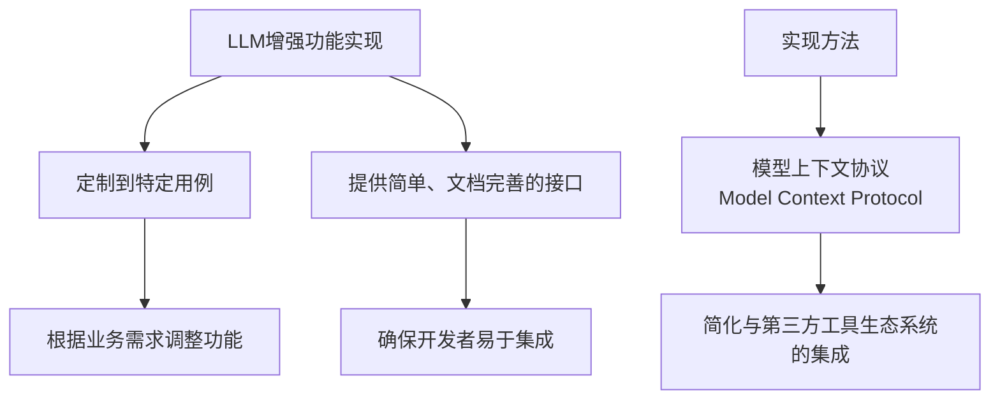

`Model Context Protocol` 是 `Anthropic` 提供的一种实现方式, 具有如下的优势:

1. 简化集成的流程 - 通过简单的客户端实现即可 连接各种工具;
2. 生态系统接入 - 可以与不断增长的第三方工具生态系统无缝连接 ;
3. 标准化接口 - 提供统一的方式来增强 `LLM` 的能力;

### 2-2 Workflow: Prompt chaining

提示链 是一种把复杂任务分解为连续步骤的工作流模式, 每个步骤由单独的 `LLM` 调用完成, 形成一个处理链.

**优势**:
• 提高复杂任务的准确性
• 每个步骤可以专注于特定目标
• 便于在中间步骤进行质量控制
• 流程更可预测和可控

**局限性**:

• 增加总体延迟（多次LLM调用）
• 可能增加成本
• 需要明确的任务分解
• 不适合需要整体思考的任务

> [!NOTE] Tips
> 提示链代表了工作流模式（而非代理模式）的典型应用，因为执行路径是预定义的，每个步骤有明确的目标和检查点。这种模式在需要高质量、可控输出的企业应用中特别有价值

### 2-3 Routing

路由对输入进行分类并将其引导到专门的后续任务。这种工作流允许关注点分离，并构建更专业化的提示。如果没有这种工作流，为一种输入类型优化可能会损害对其他输入的性能.

**优势**:
- 每个专门流程可以针对特定类型输入优化
- 可以根据需求分配不同资源（如不同模型）
- 提高整体系统的性能和效率
• 便于模块化开发和维护

**局限性**:
- 依赖于分类准确性
- 增加系统复杂性
- 可能增加初始延迟（需要先分类）
- 需要维护多个专门处理流程

路由的实现方式:

- `LLM` 分类: 使用 `LLM` 判断输入类型
- 传统分类器: 使用机器学习分类模型
- 规则引擎: 基于关键词或者模式的 规则系统
- 混合方法: 结合上述的方式来提供性能

> [!NOTE] Tips
> 路由工作流是工作流模式的典型应用，通过预定义的决策树结构来处理不同类型的输入，实现系统性能和资源利用的优化

### 2-4 Workflow: Parallelization

当分割的子任务可以并行处理以提高速度，或者需要多种视角或尝试以获得更高置信度的结果时，并行化是有效的。对于具有多种考虑因素的复杂任务，当每个考虑因素由单独的LLM调用处理时，LLM通常表现更好，允许对每个特定方面进行集中注意

并行化工作流通过同时执行多个LLM调用并聚合结果来提高性能或准确性，主要有两种实现模式：分段和投票. 

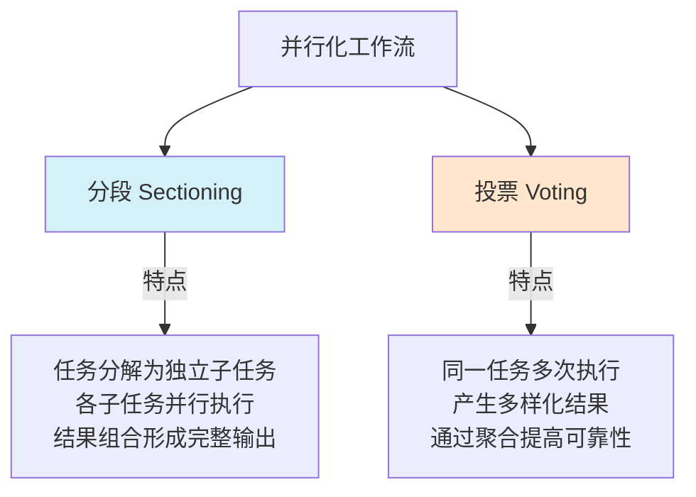

**核心优势**
1. **性能提升**：通过并行处理减少总体延迟
2. **准确性提高**：多视角或多次尝试提高结果可靠性
3. **关注点分离**：每个LLM可以专注于特定方面
4. **资源优化**：可以根据子任务复杂度分配不同资源

**实施考量**
• **任务分解策略**：如何有效拆分任务至关重要
• **结果聚合机制**：需要设计合适的聚合或投票机制
• **资源消耗**：并行调用会增加总体资源使用
• **一致性管理**：确保各并行任务使用一致的上下文

> [!NOTE] Tips
> 并行化工作流代表了现代LLM应用中的高级模式，通过智能分解和并行执行，在保持或提高质量的同时优化性能，特别适合需要多角度分析或高可靠性的场景

### 2-5 Orchestrator-workers

这种工作流非常适合那些无法预测所需子任务的复杂任务（例如，在编码中，需要更改的文件数量和每个文件中更改的性质可能取决于具体任务）。虽然在拓扑结构上与并行化相似，但关键区别在于其灵活性——子任务不是预定义的，而是由编排器根据特定输入确定的

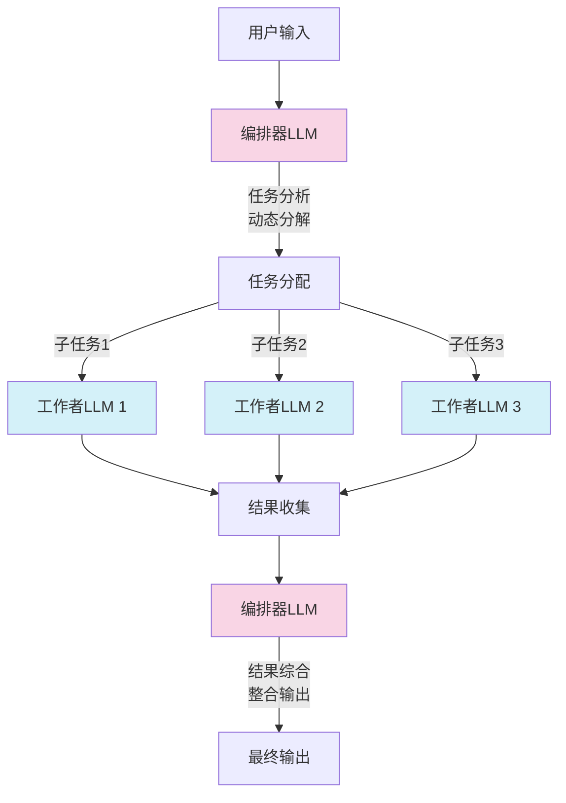

**核心特点**
1. **动态任务分解**：编排器根据输入动态决定需要哪些子任务
2. **灵活的工作分配**：子任务不是预定义的，而是根据具体情况确定
3. **层级结构**：明确的指挥与执行层级
4. **结果综合**：编排器负责整合各工作者的输出

和 并行化工作流的区别.

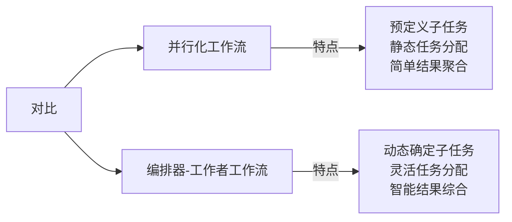
**优势**:
• 适应复杂且不可预测的任务
• 更智能的任务分解和资源分配
• 可以处理需要多步骤、多角度思考的问题
• 结果综合考虑整体一致性

**挑战**:

• 实现复杂度高
• 可能增加总体延迟（多轮LLM调用）
• 需要有效的任务分解和结果整合策略
• 资源消耗较大

> [!NOTE] Tips
> 编排器-工作者工作流代表了一种更高级的工作流模式，特别适合那些需要动态规划和执行的复杂任务。它结合了工作流的结构化优势和代理的灵活性，在复杂系统开发和信息处理任务中特别有价值

**Examples1-复杂代码修改:**

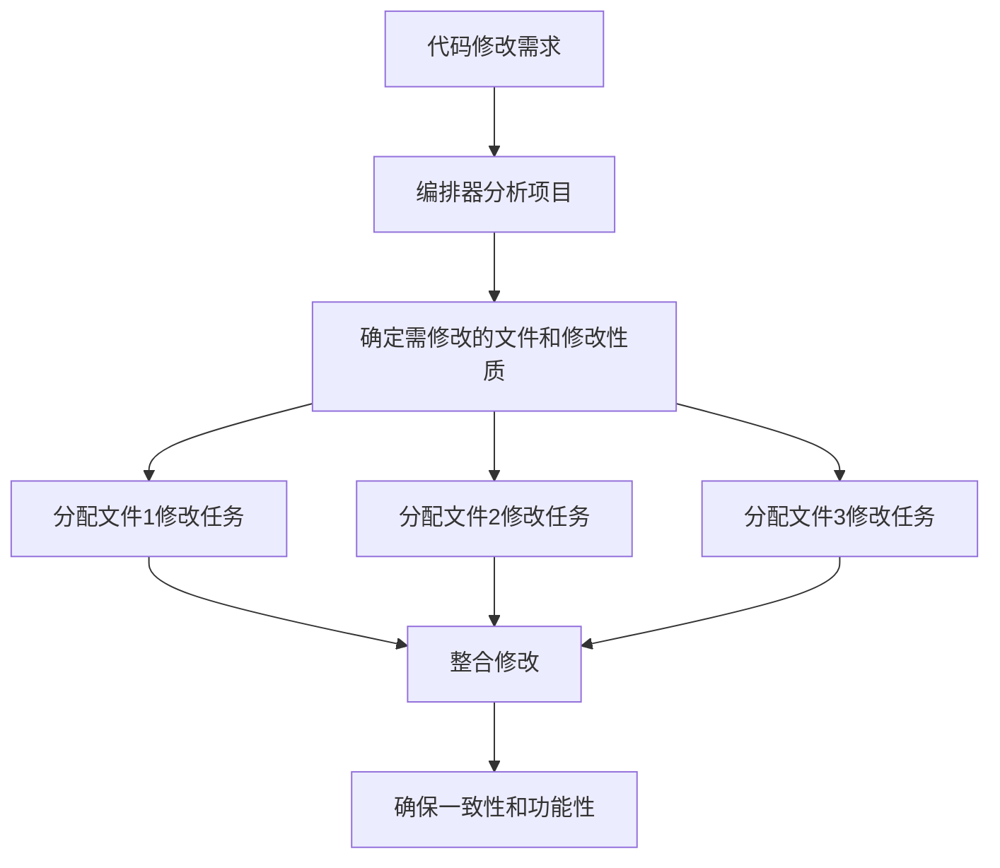

**Examples2-多源信息搜索和分析**

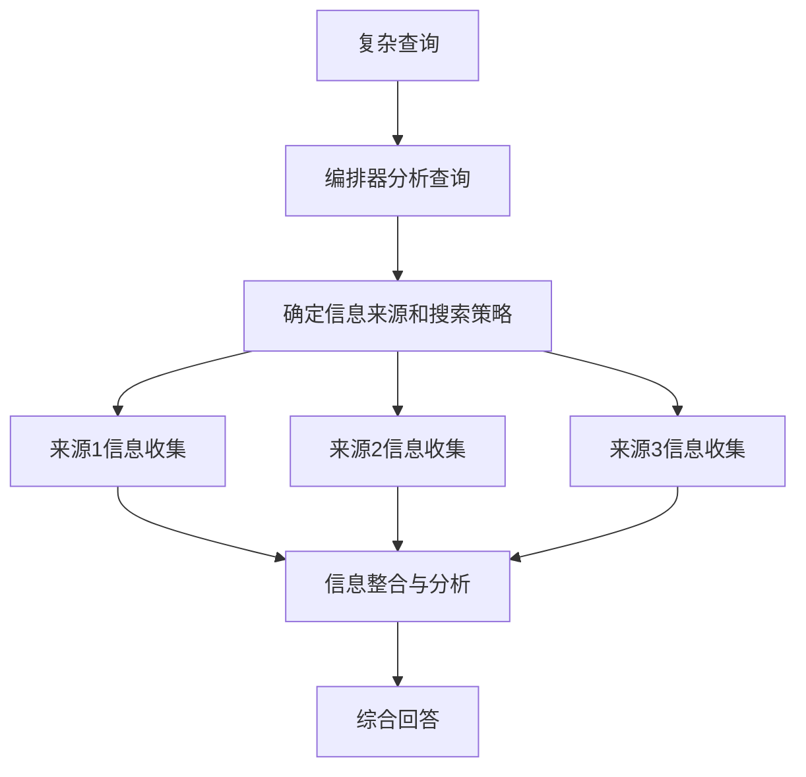

### 2-6 Evaluator-optimizer

评估器-优化器工作流是一种迭代改进模式，通过一个LLM生成内容，另一个LLM评估并提供反馈，形成闭环优化过程.

何时使用此工作流：当我们有明确的评估标准，且迭代改进能提供可衡量的价值时，这种工作流特别有效。适合使用的两个标志是：首先，当人类明确表达他们的反馈时，LLM响应可以明显改进；其次，LLM能够提供这样的反馈。这类似于人类作家在创作精细文档时可能经历的迭代写作过程。

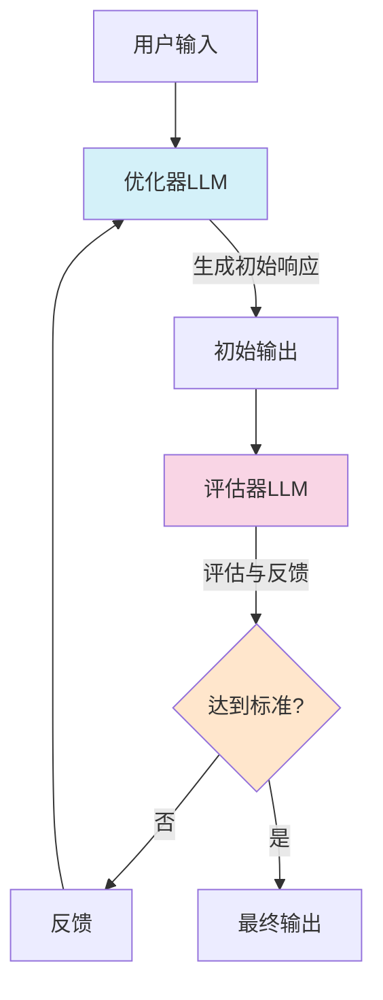

**核心特点**
1. **双角色协作**：优化器负责生成，评估器负责评价
2. **迭代改进**：通过多轮反馈循环提升质量
3. **明确标准**：基于明确的评估标准进行判断
4. **自主优化**：系统能自我改进，减少人工干预

**适用条件:** 评估器-优化器工作流在满足以下条件时特别有效：

1. **明确的评估标准**：能够清晰定义什么是"好"的输出
2. **可迭代改进**：内容能通过多轮修改明显提升质量
3. **LLM能提供有效反馈**：评估LLM能识别问题并提出有意义的改进建议
4. **价值大于成本**：迭代改进带来的质量提升值得额外的计算成本

例子1: 文学翻译，其中有一些微妙之处，翻译LLM最初可能无法捕捉，但评估器LLM可以提供有用的批评

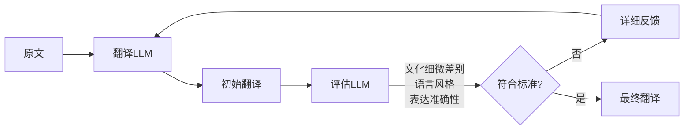

例子2: 复杂的搜索任务，需要多轮搜索和分析来收集全面信息，评估器决定是否需要进一步搜索

**优势**:

• 显著提高输出质量
• 减少人工审核需求
• 适应复杂、主观的任务
• 模拟人类创作过程中的自我修改

**挑战**:

• 增加延迟和计算成本
• 需要精心设计评估标准
• 可能在某些情况下陷入循环
• 评估器的质量直接影响最终结果

思想来自于人类的创作过程:

1. **草稿创作**（优化器初次生成）
2. **自我审视**（评估器评价）
3. **修改完善**（基于反馈改进）
4. **最终定稿**（达到标准后输出）

### 2-7 Agents

代理开始工作时，要么接收来自人类用户的命令，要么与人类用户进行交互讨论

一旦任务明确，代理会独立规划和操作，可能会返回人类获取更多信息或判断。在执行过程中，代理在每一步获取环境中的"基本事实"（如工具调用结果或代码执行）来评估其进展至关重要。代理可以在检查点或遇到阻碍时暂停以获取人类反馈。任务通常在完成时终止，但也常常包括停止条件（如最大迭代次数）以保持控制

1. **自主性**：能够独立规划和执行任务
2. **环境感知**：通过工具调用获取"基本事实"
3. **适应性**：能够根据反馈调整策略
4. **人机协作**：在关键点与人类交互
5. **实现简洁**：本质上是"在循环中基于环境反馈使用工具的LLM

例如 `coding-agent`: 一个解决SWE-bench任务的编码代理，这些任务涉及基于任务描述对多个文件进行编辑

## 3-Summary

上面的设计模式 不是什么 `Rules` , 只是一些经验的东西， 你可以灵活组装, 最重要的一点: 应该在明确能改善结果的时候才考虑增加复杂性.  **跟所有的系统一样，好的东西是演进而非来自于一次性的设计**

`Claude` 有三个核心的原则:

1. Maintain **simplicity** in your agent's design
2. Prioritize **transparency** by explicitly showing the agent’s planning steps
3. Carefully craft your agent-computer interface (ACI) through thorough tool **documentation and testing**

一些框架可以帮助我们快速入门，例如 `dify`, 实践的时候, 不要犹豫减少抽象层并使用基本组件进行构建.

总结要点如下. 

**1.灵活的去取组合各种模式**:

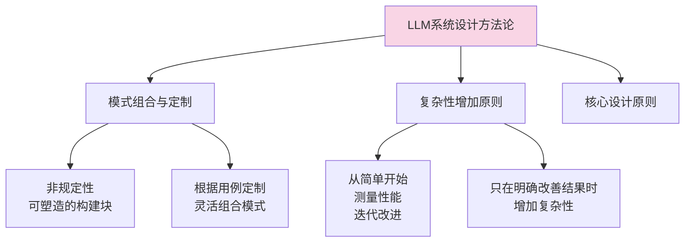

**2. 成功的构建 LLM 系统的路径**

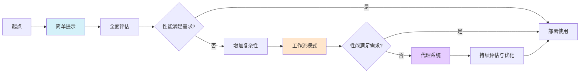

**3. 代理系统的三大设计原则**

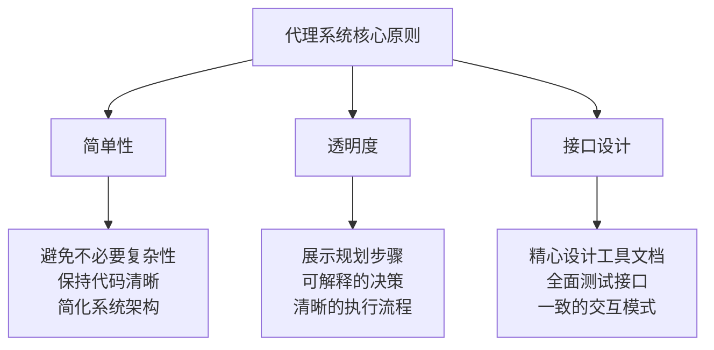

## 4-Appendix

### 4-1 examples

Customer support

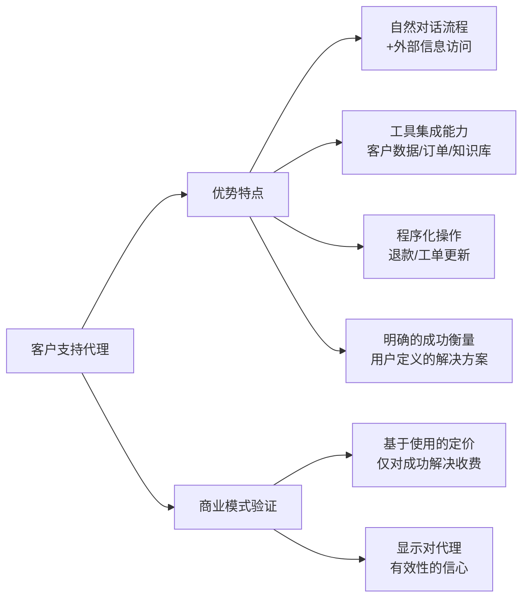

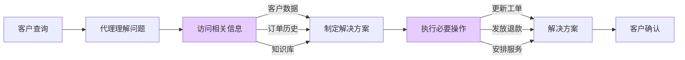

Coding Agent:

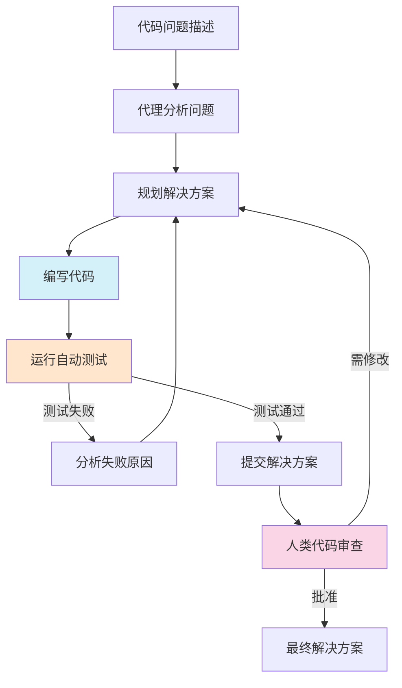

**价值体现**

• **可验证性**：通过自动化测试客观验证解决方案
• **迭代改进**：利用测试结果作为反馈循环
• **结构化环境**：代码领域的明确规则和约束
• **实际应用**：已能解决SWE-bench Verified基准中的真实GitHub问题
• **人机协作**：自动测试验证功能，人类审查确保系统一致性

**共同特征:**

1. **明确的成功标准**：可以客观衡量代理是否完成任务
2. **反馈循环机制**：代理可以根据结果调整行动
3. **结构化但开放的问题空间**：既有规则约束又有创新空间
4. **人类适当监督**：保持人类在关键决策点的参与
5. **工具集成能力**：与外部系统和数据源无缝交互

### 4-2 tools is important

> [!NOTE] Tips
> 工具设计的小改动可以显著提高代理系统的可靠性。在构建SWE-bench代理时，团队发现优化工具设计比优化整体提示更重要

正如人机界面(`HCI`)设计至关重要，代理-计算机接口同样需要精心设计.

工具设计是代理系统成功的关键因素，良好的工具定义和规范需要与整体提示同等重视。本附录提供了工具提示工程的核心原则和最佳实践。

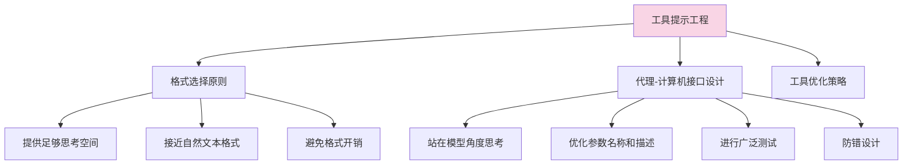

工具格式的考虑和设计.

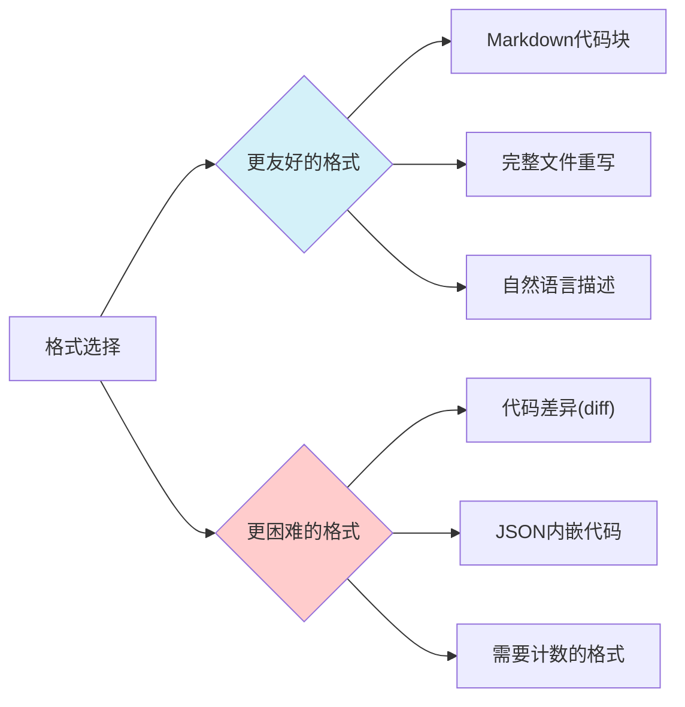

**关键原则**

1. **提供足够思考空间**：给模型足够的令牌来规划和思考，避免陷入格式困境
2. **接近自然文本**：选择接近模型在训练数据中见过的格式
3. **避免格式开销**：避免需要精确计数、特殊转义或复杂格式规则的输出

## refer

- [https://www.anthropic.com/engineering/building-effective-agents](https://www.anthropic.com/engineering/building-effective-agents)