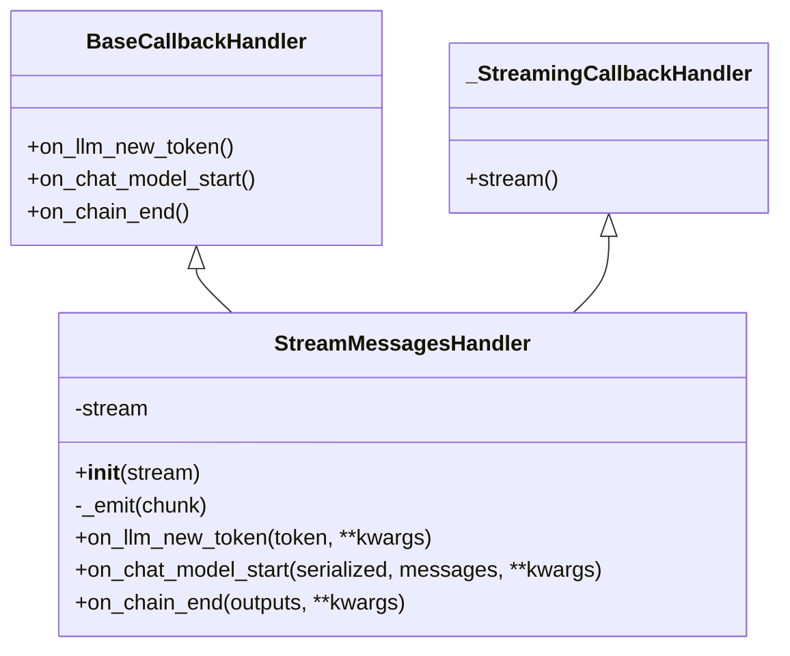
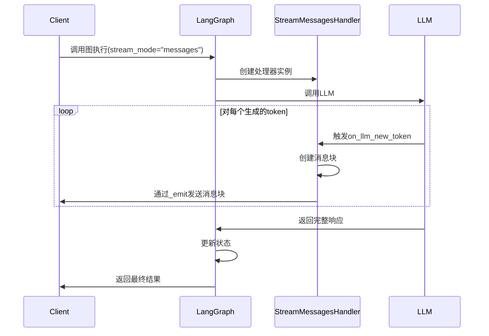
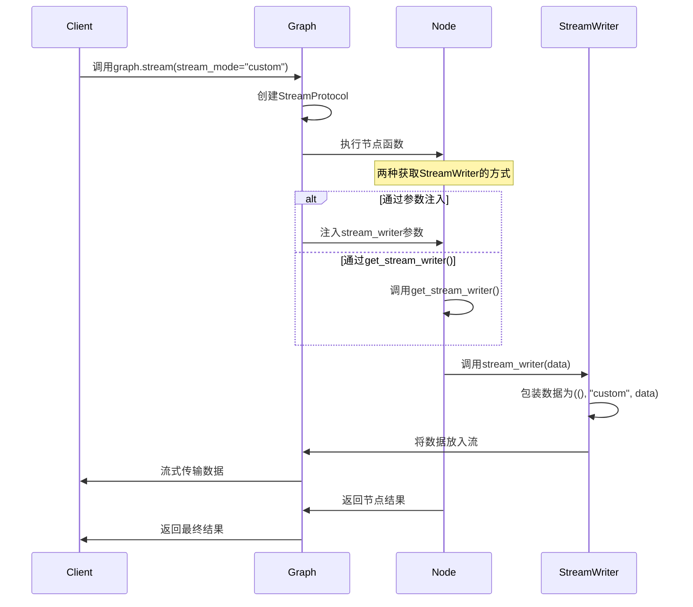
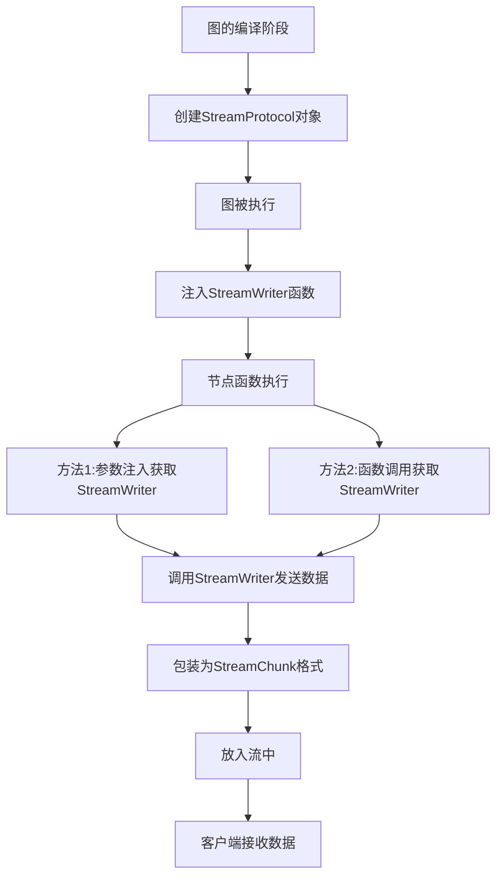

## 1-Intro

`StreamMode` 的枚举定义. 

在 `langgraph/types.py` 的源码中, `StreamMode` 被定义为了一个字面量类型， 包含了几种不同的流模式.

```python
StreamMode = Literal["values", "updates", "debug", "messages", "custom"]
```

根据解释:

- `"values"`: Emit all values in the state after each step.
- `"updates"`: Emit only the node names and updates returned by the nodes after each step. If multiple updates are made in the same step (e.g. multiple nodes are run) then those updates are emitted separately.
- `"custom"`: Emit custom data from inside nodes using `StreamWriter`.
- [`"messages"`](https://langchain-ai.github.io/langgraph/how-tos/streaming-tokens): Emit LLM messages token-by-token together with metadata for any LLM invocations inside nodes.
- `"debug"`: Emit debug events with as much information as possible for each step.

前面2个都是关注于 `state` 的全局值还是变化值， 有点用，但是不大， 用的多的还是 `custom` 和 `messages`

## 2-Message Mode 源码


### 2-1 源码

- `messages` : 这个模式的代码注释是, *Emit LLM messages token-by-token together with metadata for any LLM invocations inside nodes or tasks.*

从字面上理解的话，就是说这个模式专门用来 一个 `token` 一个 `token` 的发送 `LLM` 消息.

其核心的实现是 `StreamMessagesHandler`, 源码如下:


```python
class StreamMessagesHandler(BaseCallbackHandler, _StreamingCallbackHandler):
    """A callback handler that implements stream_mode=messages.
    Collects messages from (1) chat model stream events and (2) node outputs."""

    run_inline = True
    """We want this callback to run in the main thread, to avoid order/locking issues."""

    def __init__(self, stream: Callable[[StreamChunk], None]):
        self.stream = stream
        self.metadata: dict[UUID, Meta] = {}
        self.seen: set[Union[int, str]] = set()

    def _emit(self, meta: Meta, message: BaseMessage, *, dedupe: bool = False) -> None:
        if dedupe and message.id in self.seen:
            return
        else:
            if message.id is None:
                message.id = str(uuid4())
            self.seen.add(message.id)
            self.stream((meta[0], "messages", (message, meta[1])))

    def tap_output_aiter(
        self, run_id: UUID, output: AsyncIterator[T]
    ) -> AsyncIterator[T]:
        return output

    def tap_output_iter(self, run_id: UUID, output: Iterator[T]) -> Iterator[T]:
        return output

    def on_chat_model_start(
        self,
        serialized: dict[str, Any],
        messages: list[list[BaseMessage]],
        *,
        run_id: UUID,
        parent_run_id: Optional[UUID] = None,
        tags: Optional[list[str]] = None,
        metadata: Optional[dict[str, Any]] = None,
        **kwargs: Any,
    ) -> Any:
        if metadata and (not tags or TAG_NOSTREAM not in tags):
            self.metadata[run_id] = (
                tuple(cast(str, metadata["langgraph_checkpoint_ns"]).split(NS_SEP)),
                metadata,
            )

    def on_llm_new_token(
        self,
        token: str,
        *,
        chunk: Optional[ChatGenerationChunk] = None,
        run_id: UUID,
        parent_run_id: Optional[UUID] = None,
        tags: Optional[list[str]] = None,
        **kwargs: Any,
    ) -> Any:
        if not isinstance(chunk, ChatGenerationChunk):
            return
        if meta := self.metadata.get(run_id):
            filtered_tags = [t for t in (tags or []) if not t.startswith("seq:step")]
            if filtered_tags:
                meta[1]["tags"] = filtered_tags
            self._emit(meta, chunk.message)

    def on_llm_end(
        self,
        response: LLMResult,
        *,
        run_id: UUID,
        parent_run_id: Optional[UUID] = None,
        **kwargs: Any,
    ) -> Any:
        self.metadata.pop(run_id, None)

    def on_llm_error(
        self,
        error: BaseException,
        *,
        run_id: UUID,
        parent_run_id: Optional[UUID] = None,
        **kwargs: Any,
    ) -> Any:
        self.metadata.pop(run_id, None)

    def on_chain_start(
        self,
        serialized: Dict[str, Any],
        inputs: Dict[str, Any],
        *,
        run_id: UUID,
        parent_run_id: Optional[UUID] = None,
        tags: Optional[List[str]] = None,
        metadata: Optional[Dict[str, Any]] = None,
        **kwargs: Any,
    ) -> Any:
        if (
            metadata
            and kwargs.get("name") == metadata.get("langgraph_node")
            and (not tags or TAG_HIDDEN not in tags)
        ):
            self.metadata[run_id] = (
                tuple(cast(str, metadata["langgraph_checkpoint_ns"]).split(NS_SEP)),
                metadata,
            )
            if isinstance(inputs, dict):
                for key, value in inputs.items():
                    if isinstance(value, BaseMessage):
                        if value.id is not None:
                            self.seen.add(value.id)
                    elif isinstance(value, Sequence) and not isinstance(value, str):
                        for item in value:
                            if isinstance(item, BaseMessage):
                                if item.id is not None:
                                    self.seen.add(item.id)

    def on_chain_end(
        self,
        response: Any,
        *,
        run_id: UUID,
        parent_run_id: Optional[UUID] = None,
        **kwargs: Any,
    ) -> Any:
        if meta := self.metadata.pop(run_id, None):
            if isinstance(response, BaseMessage):
                self._emit(meta, response, dedupe=True)
            elif isinstance(response, Sequence):
                for value in response:
                    if isinstance(value, BaseMessage):
                        self._emit(meta, value, dedupe=True)
            elif isinstance(response, dict):
                for value in response.values():
                    if isinstance(value, BaseMessage):
                        self._emit(meta, value, dedupe=True)
                    elif isinstance(value, Sequence):
                        for item in value:
                            if isinstance(item, BaseMessage):
                                self._emit(meta, item, dedupe=True)
            elif hasattr(response, "__dir__") and callable(response.__dir__):
                for key in dir(response):
                    try:
                        value = getattr(response, key)
                        if isinstance(value, BaseMessage):
                            self._emit(meta, value, dedupe=True)
                        elif isinstance(value, Sequence):
                            for item in value:
                                if isinstance(item, BaseMessage):
                                    self._emit(meta, item, dedupe=True)
                    except AttributeError:
                        pass

    def on_chain_error(
        self,
        error: BaseException,
        *,
        run_id: UUID,
        parent_run_id: Optional[UUID] = None,
        **kwargs: Any,
    ) -> Any:
        self.metadata.pop(run_id, None)
```


分析这个类:




其中的关键方法如下:

- __init__: 初始化处理器，接收一个 stream 回调函数，用于发送消息块
- _emit: 发送消息到流
- on_llm_new_token: 当 LLM 生成新 token 时被调用，将 token 作为消息块发送
- on_chat_model_start: 当 LLM 开始生成时被调用，记录元数据
- on_chain_end: 当链执行结束时被调用，处理返回的消息


通过 `debug` 能解释之前的2个问题.

1)-没有调用 `LLM`, 为什么还能 `stream` 返回.

```python
    def prefix_node(self, state: SimpleChatState) -> Dict[str, Any]:
        """前置节点，返回固定内容A"""
        # 创建一个AI消息，内容为A
        prefix_message = AIMessage(content="这是前置节点返回的内容A。\n\n接下来是AI助手的回答：\n")
        return {"messages": [prefix_message]}
```


因为在 每个 `Node` 的结束的时候会触发函数.

```python
    def on_chain_end(
        self,
        response: Any,
        *,
        run_id: UUID,
        parent_run_id: Optional[UUID] = None,
        **kwargs: Any,
    ) -> Any:
        if meta := self.metadata.pop(run_id, None):
            if isinstance(response, BaseMessage):
                self._emit(meta, response, dedupe=True)
                ...
```


- 只要是 `BaseMessage` 的实例就会触发 `_emit` 机制

**2)-llm 调用 invoke 不是 stream 函数也会触发流式返回 ** 

因为都会 触发的函数是`on_llm_new_token 函数回调. 


### 2-2 分析


集成流程:




当使用 `stream_mode=messages` 的时候, `langGraph` 会:

1. 创建一个 `StreamMessagesHandler` 实例, 并且添加到 回调管理器中
2. 当 `LLM` 被调用的时候， `StreamMessageHandler` 会捕获每个生成的 `token`
3. 对于每个 `token`, `StreamMessageHandler` 会创建一个消息块，并且通过 `_emit` 方法发送.
4. 消息块的格式，`(meta[0], "messages", (message_chunk, meta[1]))` . 其中:
	- `meta[0]` 是命名空间路径
	- "messages" 是流类型
	- `message_chunk` 是消息块
	- `meta[1]` 是元数据


### 2-3 与 LLM 的集成


在 `LLM` 调用的时候, 如果使用了 `stream_mode="messages"` , `LangGraph` 会:

1. 在 `RunnableConfig` 中添加 `StreamMessageHandler` 回调 ;
2. `LLM` 调用 `invoke()` 或者 `stream()` 方法的时候, 会使用这个回调 ;
3. 当 `LLM` 生成 `token` 的时候, 会触发 `on_llm_new_token` 回调 ;
4. `StreamMessageHandler` 会捕获这些 `token` 并作为消息块发送 ;


### 2-4 如何控制消息流

默认 `messages` 的时候都会触发消息流的回调. 通过源码可以发现:

1. 使用标签：在 LangGraph 中，可以使用 `TAG_NOSTREAM` 标签来标记不应该被流式返回的消息
2. 自定义消息类型：创建一个不继承自 `BaseMessage` 的自定义消息类型，这样 `StreamMessagesHandler` 就不会识别它
3. 后处理：在客户端接收到消息后，根据某些条件过滤掉不需要的消息


## 3-Custom mode 源码


> [!NOTE] 总结
> stream_mode="custom" 是 LangGraph 提供的一种灵活的流式处理模式，允许开发者在节点函数内部自定义流式数据的发送。它通过 StreamWriter 函数实现，该函数将用户提供的数据包装为 StreamChunk 并放入流中。这种模式提供了更细粒度的控制，可以在节点函数的任何位置发送任何类型的数据，非常适合需要实时反馈的应用场景


### 3-1 分析

使用非常简单.

```python
from langgraph.types import StreamWriter


def generate_joke(state: State, writer: StreamWriter):
    writer({"custom_key": "Writing custom data while generating a joke"})
    return {"joke": f"This is a joke about {state['topic']}"}


graph = (
    StateGraph(State)
    .add_node(refine_topic)
    .add_node(generate_joke)
    .add_edge(START, "refine_topic")
    .add_edge("refine_topic", "generate_joke")
    .compile()
)
```


其中核心是在 `langgraph/types.py` 中有个 `StreamWriter` 的定义, 一个 `Callable` 对象, 也就是接收任意的数据并且写入到输出流的函数.

```python
StreamWriter = Callable[[Any], None]
"""Callable that accepts a single argument and writes it to the output stream.
Always injected into nodes if requested as a keyword argument, but it's a no-op
when not using stream_mode="custom"."""
```


当使用 stream_mode="custom" 时，LangGraph 会在 RunnableConfig 中注入一个 StreamWriter 函数：

```python
# 同步版本
if "custom" in stream_modes:
    config[CONF][CONFIG_KEY_STREAM_WRITER] = lambda c: stream.put(
        ((), "custom", c)
    )

# 异步版本
if "custom" in stream_modes:
    config[CONF][CONFIG_KEY_STREAM_WRITER] = (
        lambda c: aioloop.call_soon_threadsafe(
            stream.put_nowait, ((), "custom", c)
        )
    )
```

- 这个函数接受用户提供的数据 c，并将其包装为 ((), "custom", c) 格式的 StreamChunk，然后放入流中。


### 3-2 使用

有2种的姿势可以使用. 


1. 在 `node` 的定义中， 通过参数注入的方式.

```python
def my_node(state, stream_writer):
    # 处理状态
    result = process_state(state)
    
    # 发送自定义数据到流
    stream_writer({"custom_data": "Hello!"})
    
    return result
```

2. 通过 `get_stream_writer` 函数.

```python
from langgraph.config import get_stream_writer

def my_node(state):
    # 获取 StreamWriter
    stream_writer = get_stream_writer()
    
    # 处理状态
    result = process_state(state)
    
    # 发送自定义数据到流
    stream_writer({"custom_data": "Hello!"})
    
    return result
```




### 3-3 机制.

当使用 stream_mode="custom" 时，LangGraph 的流式处理机制如下：

1. 在图的编译阶段，LangGraph 会创建一个 StreamProtocol 对象，用于处理流式数据
2. 当图被执行时，LangGraph 会在 RunnableConfig 中注入一个 StreamWriter 函数
3. 节点函数可以通过参数注入或 get_stream_writer() 函数获取 StreamWriter
4. 节点函数调用 StreamWriter 发送自定义数据
5. StreamWriter 将数据包装为 ((), "custom", data) 格式的 StreamChunk，并放入流中
6. 客户端通过 graph.stream() 或 graph.astream() 方法接收这些数据




stream_mode="custom" 与其他流模式的主要区别在于：

1. 主动性：其他流模式（如 "values" 或 "messages"）是被动的，由 LangGraph 自动捕获和发送数据；而 "custom" 模式是主动的，由开发者决定何时发送什么数据
2. 灵活性："custom" 模式允许发送任何类型的数据，而不仅仅是状态或消息
3. 控制粒度："custom" 模式提供了更细粒度的控制，可以在节点函数的任何位置发送数据


## refer

- [how to stream](https://langchain-ai.github.io/langgraph/how-tos/streaming/)