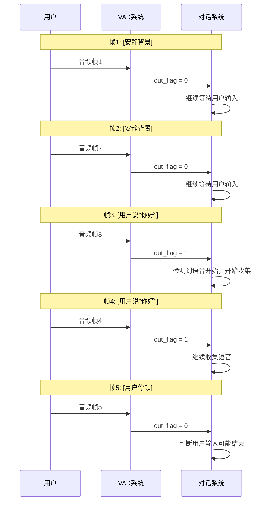
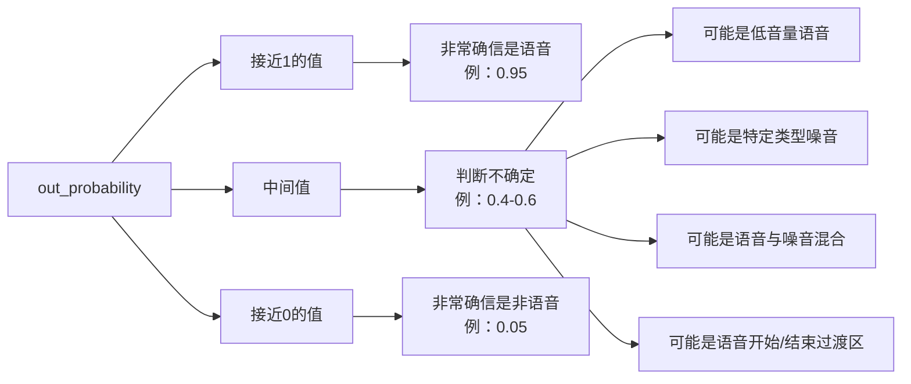
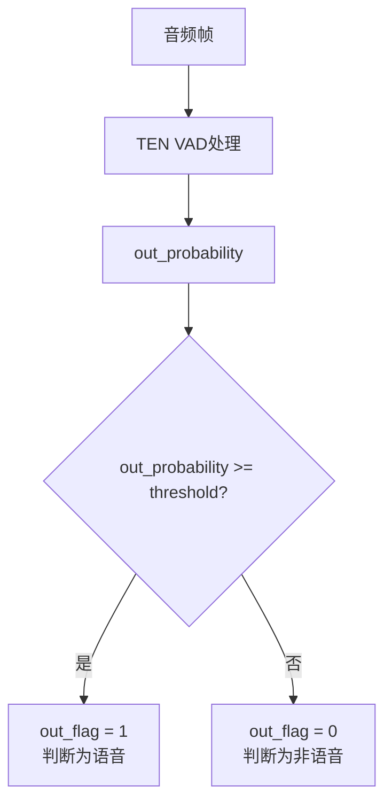
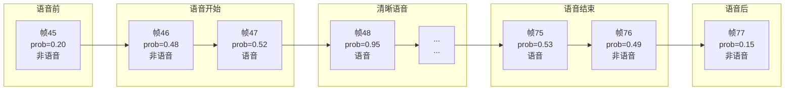
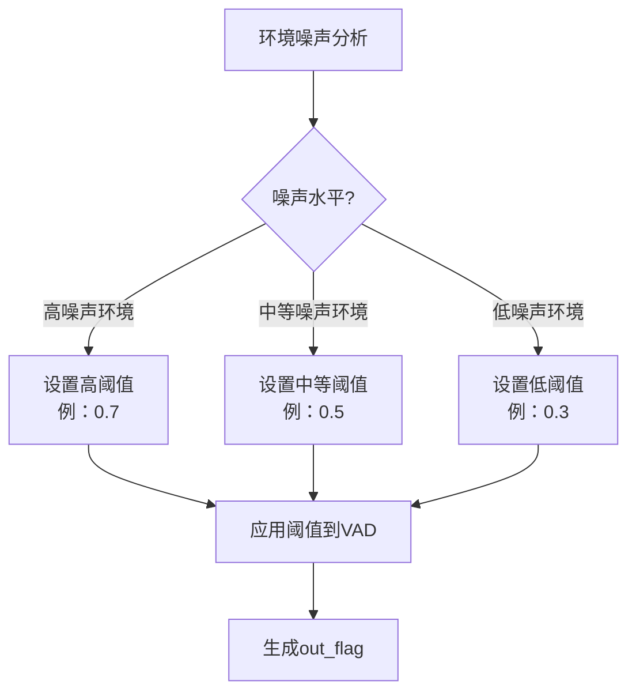
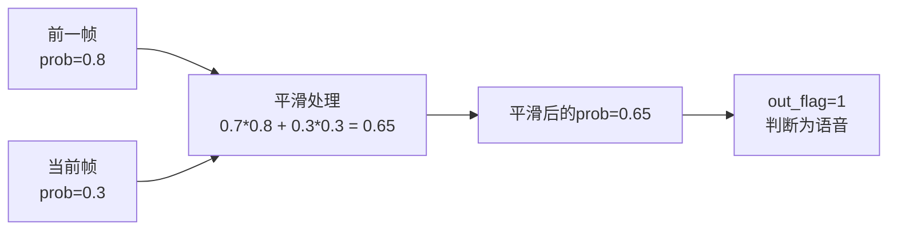
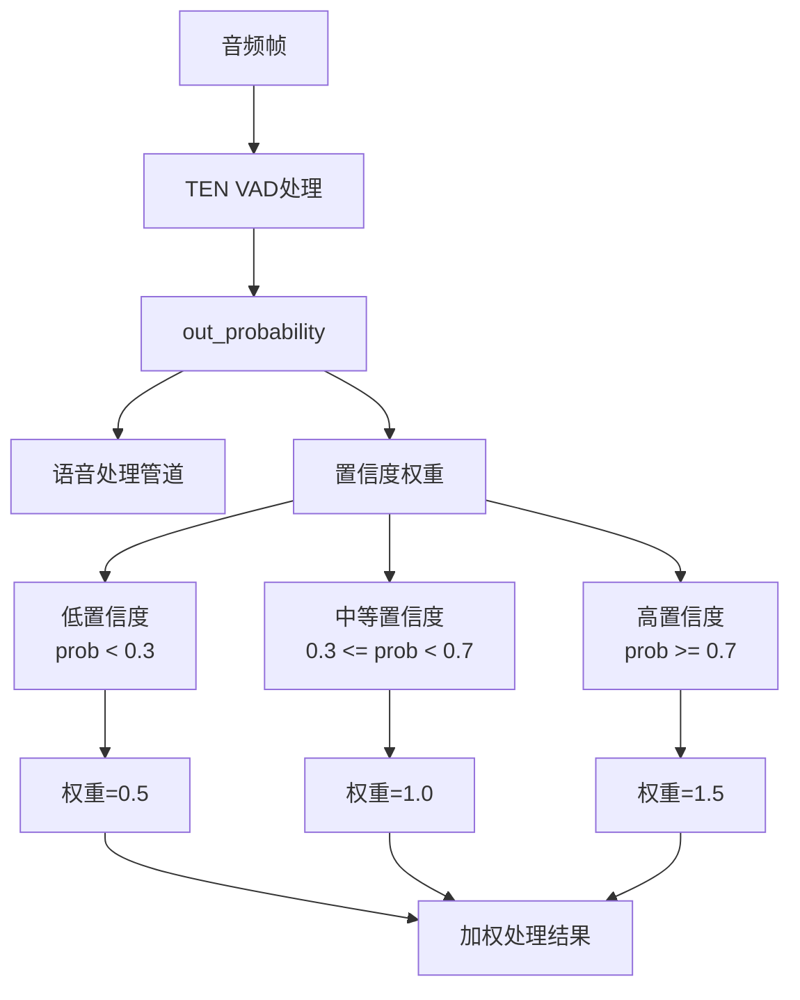

## 1-intro

TEN VAD 是一个为企业级应用设计的实时语音活动检测系统，它提供了精确的帧级语音活动检测功能。根据您提供的信息，TEN VAD 具有以下特点和优势：

**主要特点**
• **高精度检测**：与行业常用的 WebRTC VAD 和 Silero VAD 相比，TEN VAD 提供了更高的检测精度
• **低计算复杂度**：相比 Silero VAD，TEN VAD 需要的计算资源更少
• **内存占用优化**：比 Silero VAD 具有更低的内存使用率
• **时间效率**：架构设计注重时间效率，能够实现快速的语音活动检测


## 2-Key Features

### 2-1 High Performance


可以看出来 召回率和精确率都是 `TEN-VAD` 更高.

默认的 `threshold` 是 `0.5` .
- 0 代表没有信号
- 1 代表有信号

调整阈值非常重要:
- 提高阈值会增加精确率但是降低召回率 (减少误报, 但是会增加漏报)
- 降低阈值会增加召回率但是降低精确率 (增加误报, 但是会减少漏报)

**四种可能的判断结果**

在VAD系统中，对每个音频帧的判断可能有四种结果：
1. **真正例(True Positive, TP)**：
▪ 实际是语音，系统判断为语音
▪ 例如：用户说话时，系统正确识别为语音

2. **假正例(False Positive, FP)**：
▪ 实际是非语音，系统误判为语音
▪ 例如：背景噪音被错误地识别为语音

3. **真负例(True Negative, TN)**：
▪ 实际是非语音，系统判断为非语音
▪ 例如：安静片段被正确识别为非语音

4. **假负例(False Negative, FN)**：
▪ 实际是语音，系统误判为非语音
▪ 例如：用户轻声说话被错误地识别为非语音

举个例子: 

• **提高阈值(如从0.5提高到0.7)**：
▪ 系统更"严格"，只有更确定的语音才会被判定为语音
▪ 精确率↑：误报减少，系统很少将噪音判断为语音
▪ 召回率↓：漏报增加，可能会漏掉一些轻声或不清晰的语音

• **降低阈值(如从0.5降低到0.3)**：
▪ 系统更"宽松"，更多的音频片段会被判定为语音
▪ 精确率↓：误报增加，可能会将一些噪音判断为语音
▪ 召回率↑：漏报减少，能捕捉到更多实际的语音片段


### 2-2 Agent-Friendly

敏捷的捕获到语音到非语音的检测


如图：

1. 从有声音到没有声音的捕获. `Selero VAD` 是有不少误差的, 在 `2.0s` 到 `3.0s` 的时候, `Silero VAD` 有几百毫秒的延迟
2. 从 `6.0s` 到 `7.0s` , 前者还发生了 失误.


总结就是:

**TEN VAD 与 Silero VAD 在转换检测方面的对比**


**语音到非语音转换的检测速度**
• **TEN VAD**：能够快速检测语音到非语音的转换
• **Silero VAD**：存在几百毫秒的延迟

**实际影响**
这种延迟差异在人机交互系统中产生的影响非常显著：

1. **端到端延迟**：Silero VAD 的检测延迟会直接增加整个人机交互系统的端到端响应时间
2. **用户体验**：更快的检测能力使 TEN VAD 支持的系统能提供更自然流畅的对话体验
3. **轮次交替**：快速准确的语音结束检测对于对话系统中的轮次管理至关重要

**短暂静音段的识别能力**

您还提到了在 6.5s-7.0s 音频段中观察到的另一个关键差异：

• **TEN VAD**：能够识别相邻语音段之间的短暂静音
• **Silero VAD**：无法识别这些短暂的静音段

**这一能力的重要性**

识别短暂静音段的能力对以下方面非常重要：

1. **语义分割**：帮助系统更准确地分割不同的语义单元
2. **句子边界检测**：有助于确定自然语言处理中的句子边界
3. **打断处理**：在允许打断的对话系统中，能够更精确地识别适合系统回应的时机
4. **多说话人场景**：在多人对话中，有助于区分不同说话人的语音段

### 2-3 Light Weighted

**实时因子(RTF)详解**

**RTF 基本概念**

**实时因子(Real-Time Factor, RTF)** 是评估音频处理系统性能的关键指标，特别是在语音识别、语音活动检测(VAD)等需要实时处理的应用中。

**定义**

RTF 是处理音频所需的时间与音频实际持续时间的比率：


$[RTF = \frac{处理时间}{音频持续时间}]$


实时因子(RTF)是衡量处理速度的重要指标，数值越低表示处理速度越快。

|         |                                          |             |                |
| ------- | ---------------------------------------- | ----------- | -------------- |
| 平台      | CPU                                      | TEN VAD RTF | Silero VAD RTF |
| Linux   | AMD Ryzen 9 5900X 12-Core                | 0.0150      | /              |
| Linux   | Intel(R) Xeon(R) Platinum 8253           | 0.0136      | /              |
| Linux   | Intel(R) Xeon(R) Gold 6348 CPU @ 2.60GHz | 0.0086      | 0.0127         |
| Windows | Intel i7-10710U                          | 0.0150      | /              |
| macOS   | M1                                       | 0.0160      | /              |
| Android | Galaxy J6+ (32bit, 425)                  | 0.0570      | /              |
| Android | Oppo A3s (450)                           | 0.0490      | /              |
| iOS     | iPhone6 (A8)                             | 0.0210      | /              |
| iOS     | iPhone8 (A11)                            | 0.0050      | /<br>          |
|         |                                          |             |                |

数据比较: 

• 在 `Intel Xeon Gold 6348` CPU 上，`TEN VAD` 的 RTF 为 0.0086，而 Silero VAD 为 0.0127，表明 TEN VAD 处理速度约快 32%
• `TEN VAD` 在各种平台上都表现出色，从高端服务器 CPU 到移动设备都能高效运行
• 在 `iPhone8 (A11)` 上，TEN VAD 达到了惊人的 0.0050 RTF，显示其在现代移动处理器上的极高效率


## 3-Usage

```python
if __name__ == "__main__":
    input_file, out_path = sys.argv[1], sys.argv[2]
    sr, data = Wavfile.read(input_file)
    hop_size = 256  # 16 ms per frame
    threshold = 0.5
    ten_vad_instance = TenVad(hop_size, threshold)  # Create a TenVad instance
    num_frames = data.shape[0] // hop_size
    # Streaming inference
    with open(out_path, "w") as f:
        for i in range(num_frames):
            audio_data = data[i * hop_size: (i + 1) * hop_size]
            out_probability, out_flag = ten_vad_instance.process(audio_data) #  Out_flag is speech indicator (0 for non-speech signal, 1 for speech signal)
            print("[%d] %0.6f, %d" % (i, out_probability, out_flag))
            f.write("[%d] %0.6f, %d\n" % (i, out_probability, out_flag))
```


### 3-1 hop-size

越小越精确， 越小越敏感.


### 3-2 理解 out-flag

**TEN VAD 输出详解：**out_flag **与** `out_probability`

`out_flag` 是 `TEN VAD` 系统对当前音频帧的二元分类结果，表示系统对"当前帧是否包含语音"的最终判断：
• **0（非语音）**：系统判定当前帧主要包含非语音信号（如背景噪音、沉默等）
• **1（语音）**：系统判定当前帧主要包含人类语音

out_flag **的实际应用示例**

对话系统中的应用流程：



`⁠out_probability` 是一个浮点数值（0到1之间），表示当前帧包含语音的概率或置信度。这个值提供了比二元结果更丰富的信息：



⁠out_probability **与** ⁠out_flag **的关系**



语音边界:




自适应阈值:




平滑处理:



置信度加权处理:




## refer
- [homepage](https://github.com/TEN-framework/ten-vad?tab=readme-ov-file#welcome-to-ten)
- 可以关注的项目: https://github.com/k2-fsa/sherpa-onnx


