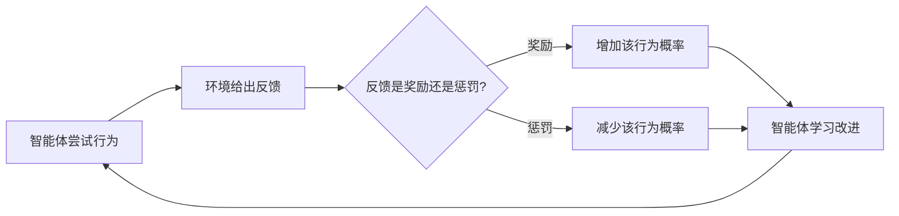
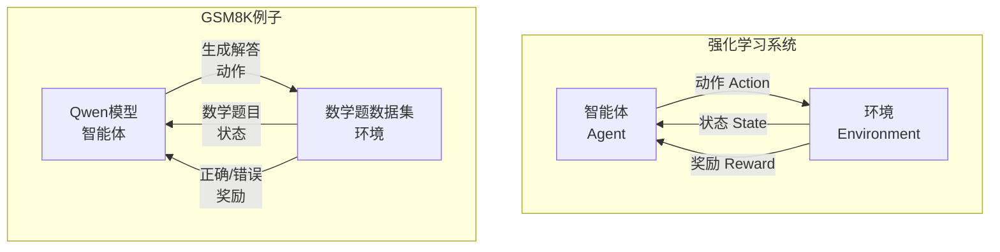
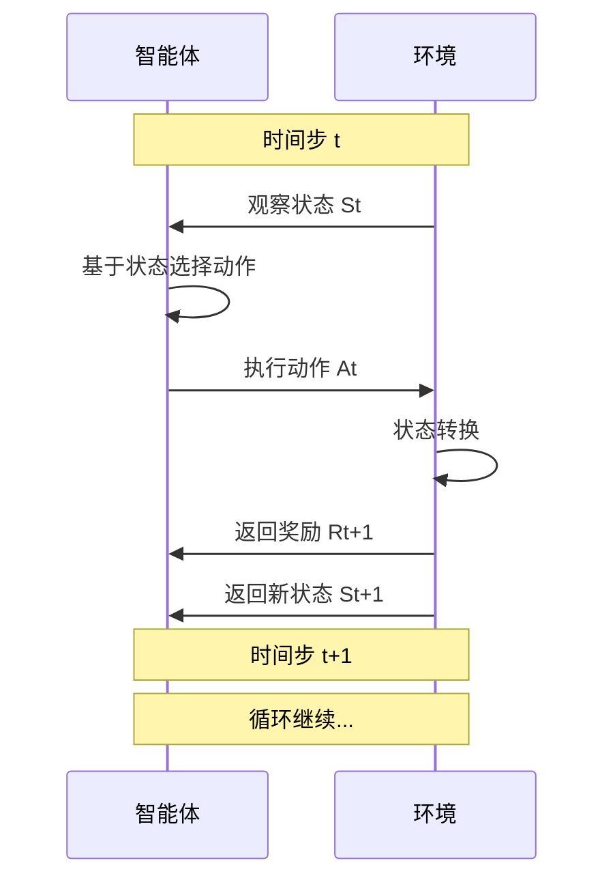
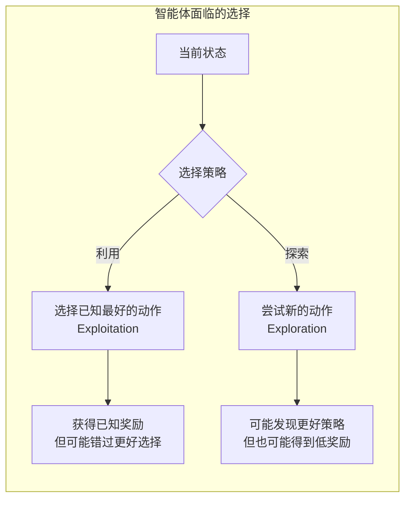

## 1-Intro

`VERL` 是一个字节的 开源强化学习库, 专门用于大 语言的训练库. 

- 是 `HybirdFlow` 的开源实现版本 .


## 2-Key concepts of RL

### 2-1 Agent And Env




强化学习中的主要角色是: `Agent` 和 `Environment`

1. `Agent` 
	- 定义: 做决策的实体
	- `GSM8K` 中的例子: `QWen2.5-0.5B-Instruct` 模型

2. `Environment`
	- 智能体生活和交互的世界
	- `GSM8K` 例子: 数学题目数据集




伪代码和基本的流程图如下:



```python
# 强化学习循环的具体实现
class GSM8KRLLoop:
    def __init__(self):
        self.agent = "Qwen2.5-0.5B-Instruct"  # 智能体
        self.environment = "GSM8K Dataset"     # 环境
        self.current_problem = None            # 当前状态
        
    def step(self):
        """执行一个完整的RL步骤"""
        
        # 1. 环境提供状态（数学题目）
        state = self.get_current_problem()
        print(f"状态: {state}")
        # "Katy makes coffee using teaspoons of sugar and cups of water in the ratio of 7:13..."
        
        # 2. 智能体观察状态并选择动作（生成解答）
        action = self.agent_generate_response(state)
        print(f"动作: {action}")
        # "The total ratio is 7+13=20. She used 7/20*120=42 #### 42"
        
        # 3. 环境根据动作给出奖励
        reward = self.compute_reward(action, self.correct_answer)
        print(f"奖励: {reward}")
        # 1.0 (正确) 或 0.0 (错误)
        
        # 4. 环境转换到新状态（下一道题）
        next_state = self.get_next_problem()
        
        return state, action, reward, next_state
    
    def compute_reward(self, response, correct_answer):
        """奖励函数：检查答案是否正确"""
        model_answer = self.extract_answer(response)
        return 1.0 if model_answer == correct_answer else 0.0

```




伪代码如下:

```python
# 探索 vs 利用的例子
class ExplorationExample:
    def choose_action(self, state, epsilon=0.1):
        """
        epsilon-贪心策略
        """
        if random.random() < epsilon:
            # 探索：随机选择动作
            action = self.random_response(state)
            print("选择探索：尝试新的解题方法")
        else:
            # 利用：选择当前最好的动作
            action = self.best_known_response(state)
            print("选择利用：使用已知最好的解题方法")
        
        return action

```

## refer


- [HybirdFlow](https://arxiv.org/abs/2409.19256v2) : A flexible and Efficient RLHF Framework
- [github](https://github.com/volcengine/verl/tree/main?tab=readme-ov-file)
- [openai-rl-basic](https://spinningup.openai.com/en/latest/)


