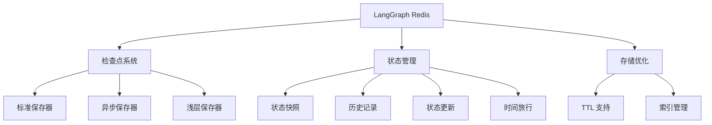
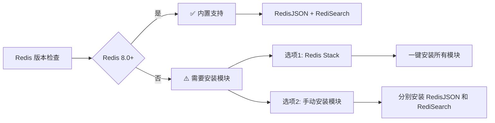
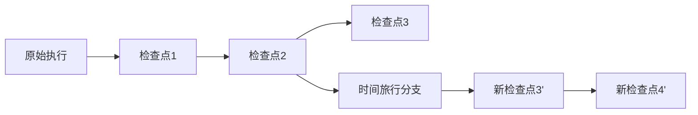
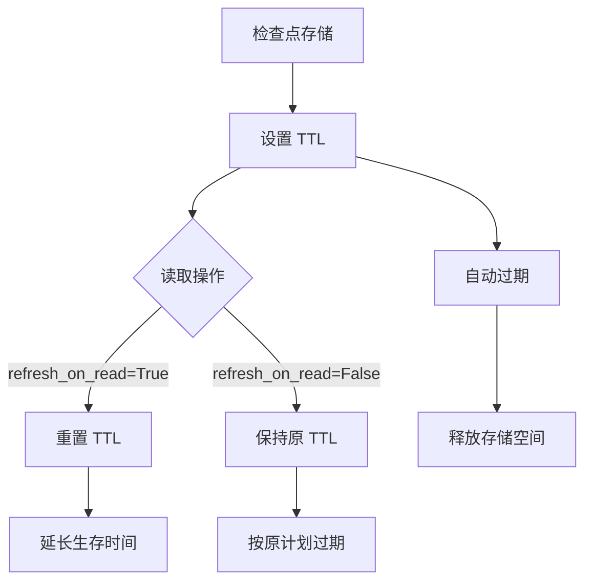
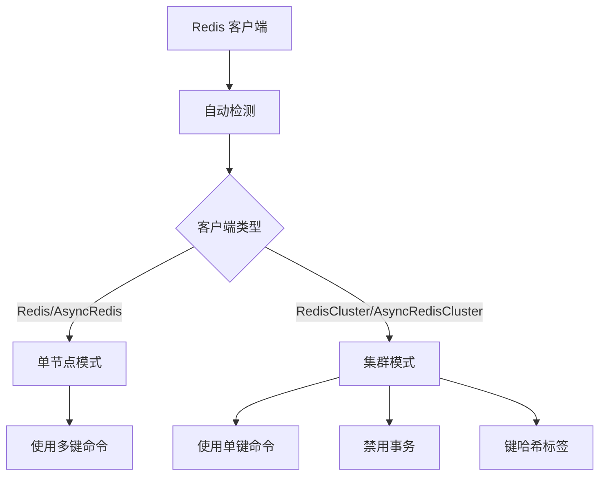

## 概述

LangGraph Redis 为 LangGraph 提供基于 Redis 的检查点存储和状态管理功能，支持持久化图执行状态、时间旅行操作和多线程状态管理。



## 核心概念

### Threads（线程）
线程是分配给检查点保存器保存的每个检查点的唯一标识符。每个线程代表一个独立的执行上下文：

```python
# 基本线程配置
{"configurable": {"thread_id": "1"}}

# 带命名空间的线程配置
{"configurable": {"thread_id": "1", "checkpoint_ns": "namespace"}}

# 指定特定检查点的配置
{"configurable": {"thread_id": "1", "checkpoint_id": "specific-checkpoint-id"}}
```

### Checkpoints（检查点）
检查点是在每个超级步骤保存的图状态快照，由 `StateSnapshot` 对象表示：

| 属性 | 类型 | 描述 |
|:---|:---|:---|
| `config` | `RunnableConfig` | 与此检查点关联的配置信息 |
| `metadata` | `dict` | 检查点元数据，包含步骤信息和写入记录 |
| `values` | `dict` | 此时间点的状态通道值 |
| `next` | `tuple` | 图中下一个要执行的节点名称元组 |
| `tasks` | `tuple[PregelTask]` | 包含下一个任务信息的 PregelTask 对象元组 |
| `created_at` | `str` | 检查点创建时间戳 |
| `parent_config` | `RunnableConfig` | 父检查点配置（用于追踪历史） |

## 环境要求与安装

### Redis 模块要求



**必需的 Redis 模块：**
- **RedisJSON**: 用于存储和操作 JSON 数据
- **RediSearch**: 用于搜索和索引功能

**版本要求：**
- **Redis 8.0+**: 内置 RedisJSON 和 RediSearch 模块，无需额外安装
- **Redis < 8.0**: 需要使用 Redis Stack 或手动安装模块

### Python 依赖

```bash
# 主要依赖
redis>=5.2.1
redisvl>=0.5.1
langgraph-checkpoint>=2.0.24

# 安装
pip install langgraph-checkpoint-redis
```

## 检查点保存器实现

### Setup 方法说明

**关于 `setup()` 方法的重要说明：**

✅ **`setup()` 方法是幂等的，可以安全地多次调用**

- 首次调用时创建必要的 Redis 索引
- 后续调用会检查索引是否已存在，如果存在则跳过创建
- 不会重复创建或覆盖现有索引
- 建议在每次应用启动时调用以确保索引存在

```python
# 安全的多次调用示例
checkpointer.setup()  # 创建索引
checkpointer.setup()  # 检查索引存在，跳过创建
checkpointer.setup()  # 再次调用，依然安全
```

### 1. 标准同步实现

```python
from langgraph.checkpoint.redis import RedisSaver

# 基本用法
with RedisSaver.from_conn_string("redis://localhost:6379") as checkpointer:
    # 创建必要的索引（幂等操作）
    checkpointer.setup()
    
    # 配置
    write_config = {"configurable": {"thread_id": "1", "checkpoint_ns": ""}}
    read_config = {"configurable": {"thread_id": "1"}}
    
    # 创建示例检查点
    checkpoint = {
        "v": 1,
        "ts": "2024-07-31T20:14:19.804150+00:00",
        "id": "1ef4f797-8335-6428-8001-8a1503f9b875",
        "channel_values": {
            "my_key": "meow",
            "node": "node"
        },
        "channel_versions": {
            "__start__": 2,
            "my_key": 3,
            "start:node": 3,
            "node": 3
        },
        "versions_seen": {
            "__input__": {},
            "__start__": {"__start__": 1},
            "node": {"start:node": 2}
        },
        "pending_sends": [],
    }
    
    # 基本操作
    checkpointer.put(write_config, checkpoint, {}, {})  # 存储检查点
    loaded_checkpoint = checkpointer.get(read_config)   # 检索检查点
    checkpoints = list(checkpointer.list(read_config))  # 列出所有检查点

# 使用自定义连接参数
checkpointer = RedisSaver(
    host="localhost",
    port=6379,
    db=0,
    password="your_password"
)
```

### 2. 异步实现

```python
from langgraph.checkpoint.redis.aio import AsyncRedisSaver
import asyncio

async def main():
    write_config = {"configurable": {"thread_id": "1", "checkpoint_ns": ""}}
    read_config = {"configurable": {"thread_id": "1"}}

    async with AsyncRedisSaver.from_conn_string("redis://localhost:6379") as checkpointer:
        # 异步初始化索引
        await checkpointer.asetup()
        
        checkpoint = {
            "v": 1,
            "ts": "2024-07-31T20:14:19.804150+00:00",
            "id": "1ef4f797-8335-6428-8001-8a1503f9b875",
            "channel_values": {"my_key": "meow", "node": "node"},
            "channel_versions": {"__start__": 2, "my_key": 3, "start:node": 3, "node": 3},
            "versions_seen": {
                "__input__": {},
                "__start__": {"__start__": 1},
                "node": {"start:node": 2}
            },
            "pending_sends": [],
        }

        # 异步操作
        await checkpointer.aput(write_config, checkpoint, {}, {})
        loaded_checkpoint = await checkpointer.aget(read_config)
        checkpoints = [c async for c in checkpointer.alist(read_config)]

# 运行异步函数
asyncio.run(main())
```

### 3. 浅层实现

浅层实现仅存储最新检查点，适用于不需要完整历史记录的场景：

```python
from langgraph.checkpoint.redis.shallow import ShallowRedisSaver
# 异步版本: from langgraph.checkpoint.redis.ashallow import AsyncShallowRedisSaver

write_config = {"configurable": {"thread_id": "1", "checkpoint_ns": ""}}
read_config = {"configurable": {"thread_id": "1"}}

with ShallowRedisSaver.from_conn_string("redis://localhost:6379") as checkpointer:
    checkpointer.setup()
    
    # 使用方式与标准实现相同，但只保留最新状态
    checkpointer.put(write_config, checkpoint, {}, {})
    latest_checkpoint = checkpointer.get(read_config)
    
    # 注意：list() 只会返回最新的检查点
    checkpoints = list(checkpointer.list(read_config))  # 只有一个元素
```

## 状态管理操作

### 图执行示例

```python
from langgraph.graph import StateGraph, START, END
from langgraph.checkpoint.redis import RedisSaver
from typing import Annotated
from typing_extensions import TypedDict
from operator import add

class State(TypedDict):
    foo: str
    bar: Annotated[list[str], add]  # 使用 add reducer

def node_a(state: State):
    return {"foo": "a", "bar": ["a"]}

def node_b(state: State):
    return {"foo": "b", "bar": ["b"]}

# 构建图
workflow = StateGraph(State)
workflow.add_node(node_a)
workflow.add_node(node_b)
workflow.add_edge(START, "node_a")
workflow.add_edge("node_a", "node_b")
workflow.add_edge("node_b", END)

# 使用 Redis 检查点
checkpointer = RedisSaver.from_conn_string("redis://localhost:6379")
checkpointer.setup()
graph = workflow.compile(checkpointer=checkpointer)

# 执行图
config = {"configurable": {"thread_id": "1"}}
result = graph.invoke({"foo": ""}, config)
```

执行后会产生 4 个检查点：
1. 空检查点，下一个节点为 START
2. 用户输入后的检查点，下一个节点为 node_a
3. node_a 执行后的检查点，下一个节点为 node_b
4. node_b 执行后的最终检查点，无下一个节点

### 获取当前状态

```python
# 获取最新状态快照
config = {"configurable": {"thread_id": "1"}}
current_state = graph.get_state(config)

print(f"当前状态值: {current_state.values}")
print(f"下一个节点: {current_state.next}")
print(f"元数据: {current_state.metadata}")

# 获取特定检查点的状态
config = {"configurable": {
    "thread_id": "1", 
    "checkpoint_id": "1ef663ba-28fe-6528-8002-5a559208592c"
}}
specific_state = graph.get_state(config)
```

### 获取状态历史

```python
config = {"configurable": {"thread_id": "1"}}
history = list(graph.get_state_history(config))

# 历史记录按时间倒序排列（最新的在前）
for i, snapshot in enumerate(history):
    print(f"检查点 {i}:")
    print(f"  值: {snapshot.values}")
    print(f"  下一步: {snapshot.next}")
    print(f"  步骤: {snapshot.metadata.get('step', 'N/A')}")
    print(f"  创建时间: {snapshot.created_at}")
    print("---")
```

### 状态回放（时间旅行）

通过指定 `checkpoint_id` 可以从特定检查点重新开始执行：

```python
# 从特定检查点重新执行
config = {"configurable": {
    "thread_id": "1", 
    "checkpoint_id": "target-checkpoint-id"
}}

# 这将：
# 1. 重放到指定检查点之前的所有步骤（不重新执行）
# 2. 从指定检查点开始重新执行后续步骤
result = graph.invoke(None, config=config)
```



### 状态更新

使用 `update_state()` 可以手动修改图状态：

```python
config = {"configurable": {"thread_id": "1"}}

# 基本状态更新
graph.update_state(config, {"foo": "updated_value"})

# 指定更新来源节点
graph.update_state(config, {"foo": "updated_value"}, as_node="node_a")

# 从特定检查点更新（创建分支）
config_with_checkpoint = {"configurable": {
    "thread_id": "1", 
    "checkpoint_id": "specific-checkpoint-id"
}}
graph.update_state(config_with_checkpoint, {"foo": "branched_value"})
```

**状态更新规则：**

假设状态定义为：
```python
class State(TypedDict):
    foo: int                           # 无 reducer
    bar: Annotated[list[str], add]     # 有 add reducer
```

当前状态：`{"foo": 1, "bar": ["a"]}`

执行更新：`graph.update_state(config, {"foo": 2, "bar": ["b"]})`

结果状态：`{"foo": 2, "bar": ["a", "b"]}`

- `foo` 通道：直接覆盖（无 reducer）
- `bar` 通道：应用 add reducer，追加新值

## TTL（生存时间）支持

自动过期和存储管理功能：

```python
# TTL 配置选项
ttl_config = {
    "default_ttl": 60,        # 默认 TTL（分钟）
    "refresh_on_read": True,  # 读取时刷新 TTL
}

# 应用 TTL 配置
with RedisSaver.from_conn_string("redis://localhost:6379", ttl=ttl_config) as checkpointer:
    checkpointer.setup()
    
    # 所有存储的检查点将在 60 分钟后自动过期
    # 读取检查点时会重置过期时间
```



## 高级功能

### 命名空间支持

使用命名空间可以在同一个线程中组织不同类型的检查点：

```python
config_ns1 = {"configurable": {"thread_id": "1", "checkpoint_ns": "workflow_a"}}
config_ns2 = {"configurable": {"thread_id": "1", "checkpoint_ns": "workflow_b"}}

# 同一线程，不同命名空间的检查点互不干扰
checkpointer.put(config_ns1, checkpoint_a, {}, {})
checkpointer.put(config_ns2, checkpoint_b, {}, {})
```

### 批量操作

```python
# 批量获取多个线程的状态
threads = ["thread_1", "thread_2", "thread_3"]
states = {}

for thread_id in threads:
    config = {"configurable": {"thread_id": thread_id}}
    try:
        state = graph.get_state(config)
        states[thread_id] = state
    except Exception as e:
        print(f"获取线程 {thread_id} 状态失败: {e}")
```

### 错误处理和重试

```python
from redis.exceptions import ConnectionError, TimeoutError
import time

def robust_checkpoint_operation(checkpointer, config, checkpoint, max_retries=3):
    for attempt in range(max_retries):
        try:
            checkpointer.put(config, checkpoint, {}, {})
            return True
        except (ConnectionError, TimeoutError) as e:
            if attempt < max_retries - 1:
                wait_time = 2 ** attempt  # 指数退避
                print(f"连接失败，{wait_time}秒后重试... (尝试 {attempt + 1}/{max_retries})")
                time.sleep(wait_time)
            else:
                print(f"所有重试失败: {e}")
                return False
        except Exception as e:
            print(f"未知错误: {e}")
            return False
```

## 性能优化

### 连接池配置

```python
import redis

# 自定义连接池
pool = redis.ConnectionPool(
    host='localhost',
    port=6379,
    db=0,
    max_connections=20,
    retry_on_timeout=True,
    socket_timeout=5,
    socket_connect_timeout=5
)

# 使用连接池创建 RedisSaver
checkpointer = RedisSaver(connection_pool=pool)
```

### 索引优化

```python
# 对于大量数据，可以考虑定期重建索引
def maintain_indices(checkpointer):
    """定期维护索引性能"""
    try:
        # 重新设置索引（幂等操作）
        checkpointer.setup()
        print("索引维护完成")
    except Exception as e:
        print(f"索引维护失败: {e}")

# 可以设置定时任务调用此函数
```

## 功能对比表

| 特性 | 标准实现 | 异步实现 | 浅层实现 |
|:---|:---:|:---:|:---:|
| 完整历史记录 | ✅ | ✅ | ❌ |
| 异步操作支持 | ❌ | ✅ | ✅ |
| TTL 自动过期 | ✅ | ✅ | ✅ |
| 存储效率 | 中等 | 中等 | 高 |
| 时间旅行功能 | ✅ | ✅ | ❌ |
| 状态回放 | ✅ | ✅ | ❌ |
| 并发性能 | 中等 | 高 | 高 |
| 内存使用 | 高 | 高 | 低 |
| 适用场景 | 需要完整历史 | 高并发异步 | 只需最新状态 |

## 最佳实践

### 1. 初始化和设置

```python
# ✅ 推荐：应用启动时调用 setup
def initialize_checkpointer():
    checkpointer = RedisSaver.from_conn_string("redis://localhost:6379")
    checkpointer.setup()  # 幂等操作，安全多次调用
    return checkpointer

# ✅ 推荐：使用上下文管理器
def process_with_checkpointer():
    with RedisSaver.from_conn_string("redis://localhost:6379") as checkpointer:
        checkpointer.setup()
        # 执行操作...
```

### 2. 线程 ID 管理

```python
import uuid

# ✅ 推荐：使用 UUID 作为线程 ID
def create_unique_thread():
    thread_id = str(uuid.uuid4())
    return {"configurable": {"thread_id": thread_id}}

# ✅ 推荐：使用有意义的线程 ID
def create_user_thread(user_id, session_id):
    thread_id = f"user_{user_id}_session_{session_id}"
    return {"configurable": {"thread_id": thread_id}}
```

### 3. 错误处理

```python
# ✅ 推荐：完善的错误处理
def safe_checkpoint_operation(graph, config, input_data):
    try:
        result = graph.invoke(input_data, config)
        return {"success": True, "result": result}
    except Exception as e:
        return {"success": False, "error": str(e)}
```

### 4. 资源管理

```python
# ✅ 推荐：合理配置 TTL
ttl_config = {
    "default_ttl": 1440,      # 24小时
    "refresh_on_read": True,  # 活跃会话延长生存时间
}

# ✅ 推荐：定期清理
def cleanup_old_threads(checkpointer, days_old=7):
    """清理指定天数之前的线程"""
    # 实现清理逻辑
    pass
```

### 5. 监控和日志

```python
import logging

logging.basicConfig(level=logging.INFO)
logger = logging.getLogger(__name__)

def monitored_checkpoint_operation(checkpointer, config, checkpoint):
    start_time = time.time()
    try:
        checkpointer.put(config, checkpoint, {}, {})
        duration = time.time() - start_time
        logger.info(f"检查点保存成功，耗时: {duration:.2f}秒")
    except Exception as e:
        logger.error(f"检查点保存失败: {e}")
        raise
```

## 故障排除

### 常见问题

1. **索引创建失败**
   ```python
   # 确保 Redis 模块已安装
   import redis
   r = redis.Redis()
   try:
       r.execute_command("FT.INFO", "some_index")
   except redis.exceptions.ResponseError as e:
       if "Unknown Index name" in str(e):
           print("索引不存在，需要调用 setup()")
       elif "unknown command" in str(e):
           print("RediSearch 模块未安装")
   ```

2. **连接超时**
   ```python
   # 增加超时时间
   checkpointer = RedisSaver(
       host='localhost',
       port=6379,
       socket_timeout=10,
       socket_connect_timeout=10
   )
   ```

3. **内存使用过高**
   ```python
   # 使用浅层实现或配置 TTL
   checkpointer = ShallowRedisSaver.from_conn_string(
       "redis://localhost:6379",
       ttl={"default_ttl": 60}
   )
   ```


### setup() 方法的幂等性

**问题**: `setup()` 方法可以反复调用吗？

**答案**: ✅ **是的，`setup()` 方法是幂等的，可以安全地多次调用**

```python
# 安全的多次调用示例
checkpointer.setup()  # 首次调用：创建索引
checkpointer.setup()  # 第二次调用：检查索引存在，跳过创建
checkpointer.setup()  # 后续调用：依然安全，不会重复创建
```

**工作原理**：
- 首次调用时创建必要的 Redis 索引
- 后续调用会检查索引是否已存在，如果存在则跳过创建
- 不会重复创建或覆盖现有索引
- 建议在每次应用启动时调用以确保索引存在

**最佳实践**：
```python
# ✅ 推荐：应用启动时调用 setup
def initialize_checkpointer():
    checkpointer = RedisSaver.from_conn_string("redis://localhost:6379")
    checkpointer.setup()  # 幂等操作，安全多次调用
    return checkpointer

# ✅ 推荐：使用上下文管理器
def process_with_checkpointer():
    with RedisSaver.from_conn_string("redis://localhost:6379") as checkpointer:
        checkpointer.setup()
        # 执行操作...
```

###  Redis Cluster 支持

**问题**: 开发环境使用单节点 Redis，生产环境使用 Redis Cluster，需要区分处理吗？

**答案**: ✅ **不需要手动区分，LangGraph Redis 已支持自动检测和适配**

#### 自动集群检测

参考 ISSUE: https://github.com/redis-developer/langgraph-redis/pull/35



#### 统一代码实现

```python
import os
from redis import Redis, RedisCluster
from redis.asyncio import Redis as AsyncRedis, RedisCluster as AsyncRedisCluster
from langgraph.checkpoint.redis import RedisSaver
from langgraph.checkpoint.redis.aio import AsyncRedisSaver

def create_redis_checkpointer():
    """创建 Redis 检查点保存器，自动适配集群模式"""
    
    if os.getenv('REDIS_CLUSTER_NODES'):
        # 生产环境 - 集群模式
        nodes = []
        for node in os.getenv('REDIS_CLUSTER_NODES').split(','):
            host, port = node.split(':')
            nodes.append({"host": host, "port": port})
        
        redis_client = RedisCluster(
            startup_nodes=nodes,
            password=os.getenv('REDIS_PASSWORD'),
            decode_responses=True,
            skip_full_coverage_check=True  # 容错处理
        )
    else:
        # 开发环境 - 单节点模式
        redis_client = Redis(
            host=os.getenv('REDIS_HOST', 'localhost'),
            port=int(os.getenv('REDIS_PORT', '6379')),
            password=os.getenv('REDIS_PASSWORD'),
            db=int(os.getenv('REDIS_DB', '0')),
            decode_responses=True
        )
    
    # 自动检测集群模式，无需手动指定
    checkpointer = RedisSaver(redis_client=redis_client)
    checkpointer.setup()  # 幂等操作
    
    return checkpointer

# 异步版本
async def create_async_redis_checkpointer():
    """创建异步 Redis 检查点保存器"""
    
    if os.getenv('REDIS_CLUSTER_NODES'):
        nodes = []
        for node in os.getenv('REDIS_CLUSTER_NODES').split(','):
            host, port = node.split(':')
            nodes.append({"host": host, "port": port})
        
        redis_client = AsyncRedisCluster(
            startup_nodes=nodes,
            password=os.getenv('REDIS_PASSWORD'),
            decode_responses=True
        )
    else:
        redis_client = AsyncRedis(
            host=os.getenv('REDIS_HOST', 'localhost'),
            port=int(os.getenv('REDIS_PORT', '6379')),
            password=os.getenv('REDIS_PASSWORD'),
            db=int(os.getenv('REDIS_DB', '0')),
            decode_responses=True
        )
    
    checkpointer = AsyncRedisSaver(redis_client=redis_client)
    await checkpointer.asetup()
    
    return checkpointer
```

#### 集群模式的自动优化

LangGraph Redis 在检测到集群模式时会自动：

1. **使用单键命令**: 避免跨分片的多键操作
2. **禁用事务**: 集群模式下自动禁用不支持的 MULTI/EXEC 事务
3. **键哈希标签**: 使用 `{namespace}key` 格式确保相关键在同一分片
4. **TTL 优化**: 使用单键 EXPIRE 命令替代管道操作

#### 手动指定集群模式（代理场景）

```python
# 通过代理连接集群时，可能需要手动指定
redis_client = Redis(host='proxy-host', port=6379)  # 通过代理连接
checkpointer = RedisSaver(
    redis_client=redis_client,
    cluster_mode=True  # 手动启用集群模式行为
)
```

#### 环境配置示例

```bash
# 开发环境 (.env.dev)
REDIS_HOST=localhost
REDIS_PORT=6379
REDIS_DB=0

# 生产环境 (.env.prod)
REDIS_CLUSTER_NODES=node1:6379,node2:6379,node3:6379
REDIS_PASSWORD=your_password
```

#### 集群模式影响

| 操作类型 | 单节点模式 | 集群模式 | 影响 |
|:---|:---|:---|:---|
| 检查点存储 | 多键事务 | 单键操作 | 性能略降，但更可靠 |
| 检查点检索 | 直接查询 | 分片查询 | 透明处理 |
| 索引创建 | 单节点索引 | 集群索引 | 自动处理 |
| TTL 设置 | 管道操作 | 单键 EXPIRE | 兼容性更好 |
| 搜索操作 | 单节点搜索 | 跨分片搜索 | 可能需要多次查询 |


## refer

- [https://github.com/redis-developer/langgraph-redis](https://github.com/redis-developer/langgraph-redis)