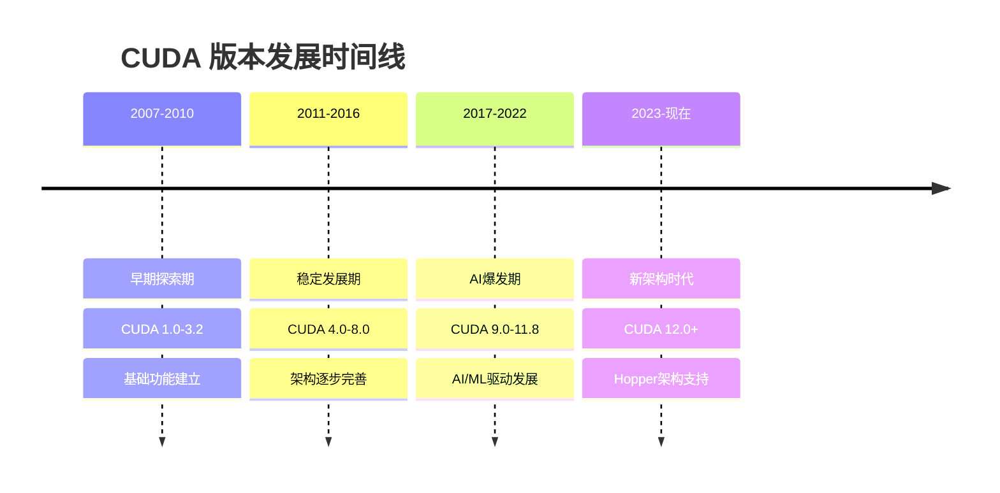
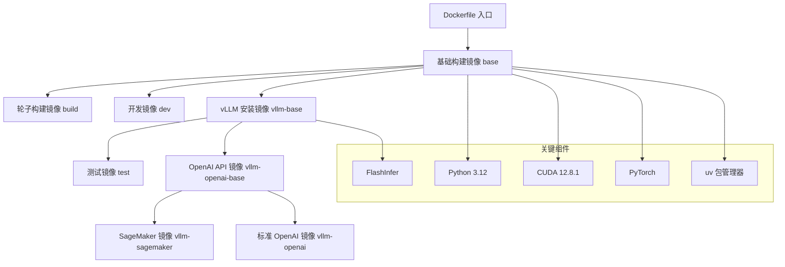
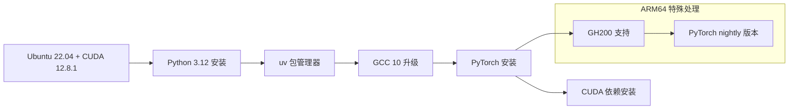
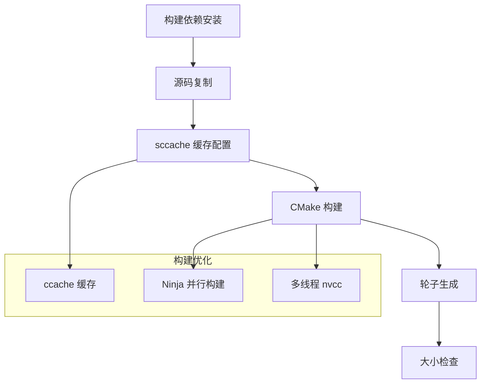
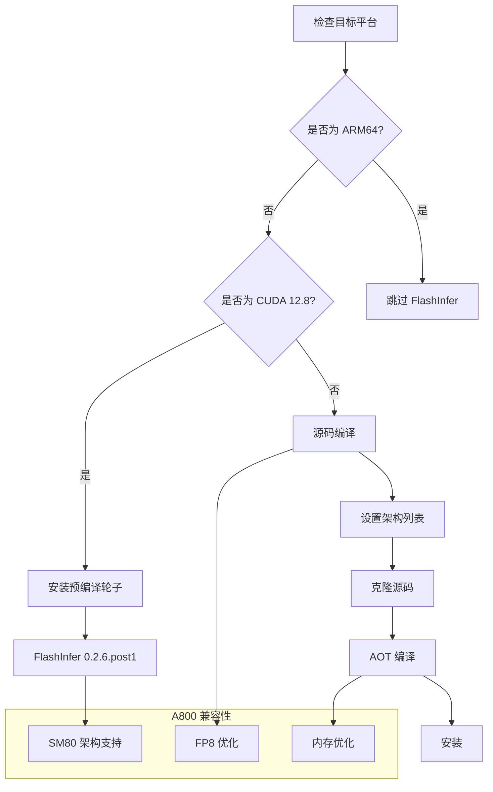
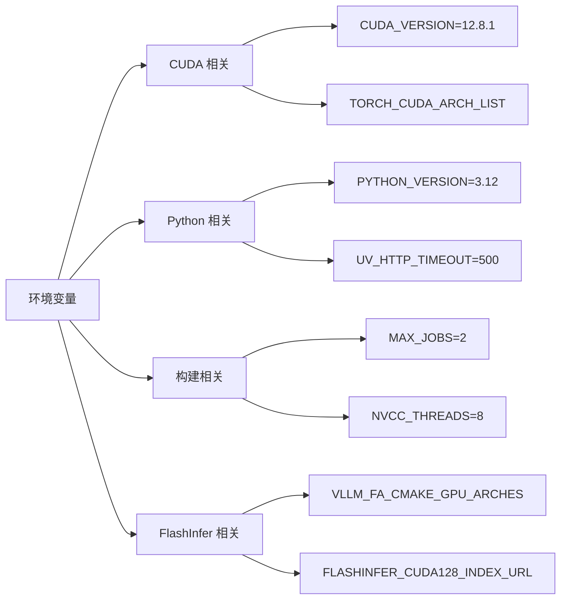
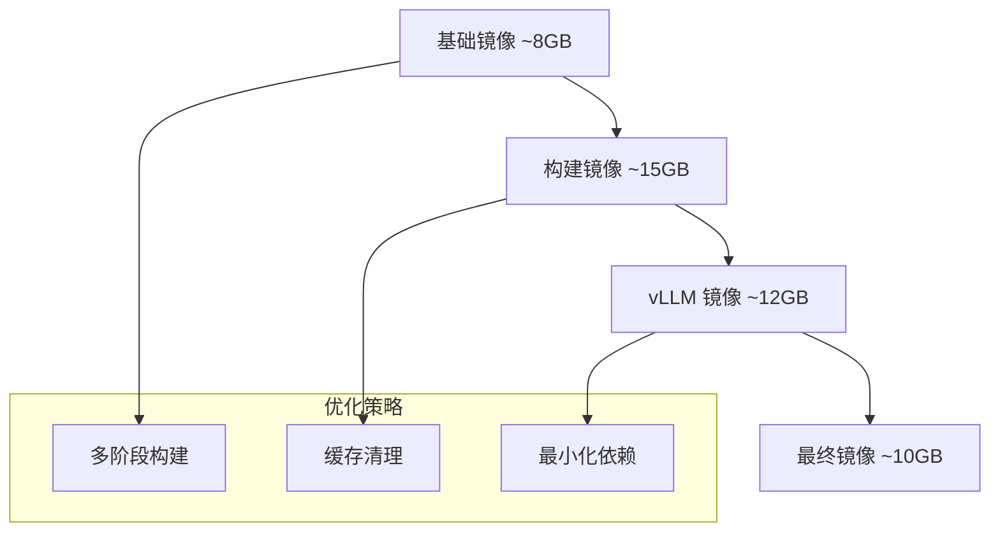

## 介绍

`flash infer` 专为性能的优化推理. 但是 各个版本号的问题还是比较麻烦. 比如说参考下面这个 [issue](https://github.com/flashinfer-ai/flashinfer/issues/1139)


# CUDA 版本历史完整指南

## 概述

CUDA (Compute Unified Device Architecture) 是 NVIDIA 开发的并行计算平台和编程模型，自 2007 年首次发布以来，已经经历了多个重大版本更新。本文档详细记录了 CUDA 的完整版本历史。

## CUDA 完整版本历史

### 早期版本 (2007-2010)

| 版本 | 发布年份 | 主要特性 | 备注 |
|:-----|:---------|:---------|:-----|
| CUDA 1.0 | 2007 | 基础并行计算框架 | 首个公开版本 |
| CUDA 1.1 | 2007 | 原子操作支持 | 增强并发能力 |
| CUDA 2.0 | 2008 | 共享内存，调试工具 | 重大性能提升 |
| CUDA 2.1 | 2008 | 性能改进 | 优化版本 |
| CUDA 2.2 | 2009 | 新GPU架构支持 | 扩展硬件兼容性 |
| CUDA 2.3 | 2009 | OpenCL互操作 | 跨平台兼容 |
| CUDA 3.0 | 2010 | C++支持，新编译器 | 编程语言扩展 |
| CUDA 3.1 | 2010 | 性能优化 | 稳定性改进 |
| CUDA 3.2 | 2010 | Fermi架构支持 | 支持新一代GPU |

### 中期发展 (2011-2016)

| 版本 | 发布年份 | 主要特性 | GPU架构支持 |
|:-----|:---------|:---------|:------------|
| CUDA 4.0 | 2011 | 统一虚拟地址空间 | Fermi优化 |
| CUDA 4.1 | 2011 | GPU直接通信 | P2P通信 |
| CUDA 4.2 | 2011 | 性能改进 | 稳定性提升 |
| CUDA 5.0 | 2012 | 动态并行，Kepler支持 | **Kepler架构** |
| CUDA 5.5 | 2013 | ARM支持 | 移动平台扩展 |
| CUDA 6.0 | 2014 | 统一内存 | 内存管理革新 |
| CUDA 6.5 | 2014 | 性能优化 | Maxwell准备 |
| CUDA 7.0 | 2015 | C++11支持 | 现代C++特性 |
| CUDA 7.5 | 2015 | Maxwell架构优化 | **Maxwell架构** |
| CUDA 8.0 | 2016 | Pascal架构支持 | **Pascal架构** |

### 现代版本 (2017-至今)

| 版本 | 发布年份 | 主要特性 | GPU架构支持 | 重要性 |
|:-----|:---------|:---------|:------------|:-------|
| CUDA 9.0 | 2017 | Volta架构，Tensor Core | **Volta架构** | AI/ML突破 |
| CUDA 9.1 | 2018 | 性能优化 | Volta优化 | 稳定性提升 |
| CUDA 9.2 | 2018 | 稳定性改进 | 错误修复 | 生产就绪 |
| CUDA 10.0 | 2018 | Turing架构支持 | **Turing架构** | RTX系列支持 |
| CUDA 10.1 | 2019 | 性能优化 | Turing优化 | 游戏性能提升 |
| CUDA 10.2 | 2019 | 新特性添加 | 功能扩展 | 开发者工具 |
| **CUDA 11.0** | **2020** | **Ampere架构，重大更新** | **Ampere架构** | **重大里程碑** |
| CUDA 11.1 | 2020 | 性能改进 | Ampere优化 | RTX 30系列 |
| CUDA 11.2 | 2021 | 新功能 | 功能增强 | 开发体验 |
| CUDA 11.3 | 2021 | 优化更新 | 性能调优 | 稳定性 |
| CUDA 11.4 | 2021 | 稳定性改进 | 错误修复 | 生产环境 |
| CUDA 11.5 | 2021 | 性能优化 | 算法优化 | 计算效率 |
| CUDA 11.6 | 2022 | 新特性 | 功能扩展 | 开发工具 |
| CUDA 11.7 | 2022 | 改进更新 | 性能提升 | 用户体验 |
| CUDA 11.8 | 2022 | 最后的11.x版本 | 完善版本 | 版本完结 |
| **CUDA 12.0** | **2023** | **Hopper架构，重大架构更新** | **Hopper架构** | **新时代开始** |
| CUDA 12.1 | 2023 | 性能优化 | Hopper优化 | H100支持 |
| CUDA 12.2 | 2023 | 新功能 | 功能增强 | 企业级特性 |
| CUDA 12.3 | 2023 | 稳定性改进 | 错误修复 | 生产稳定 |
| CUDA 12.4 | 2024 | 性能优化 | 算法改进 | 计算性能 |
| CUDA 12.5 | 2024 | 新特性 | 功能扩展 | 开发者支持 |
| CUDA 12.6 | 2024 | LTS版本 | 长期支持 | 企业级稳定 |
| CUDA 12.7 | 2024 | 性能改进 | 优化更新 | 效率提升 |
| CUDA 12.8 | 2024 | 稳定性更新 | 错误修复 | 可靠性 |
| CUDA 12.9 | 2024 | 当前最新版本 | 最新特性 | 前沿技术 |

## 版本跳跃分析

### 主要跳跃点



### 版本跳跃的原因

1. **架构驱动的更新**
   - 每当 NVIDIA 推出新的 GPU 架构时，通常伴随大版本号跳跃
   - CUDA 11.0 ↔ Ampere 架构 (RTX 30系列)
   - CUDA 12.0 ↔ Hopper 架构 (H100等数据中心GPU)

2. **发布策略演变**
   - **早期** (2007-2016): 版本更新较慢，主要跟随硬件发布
   - **中期** (2017-2022): AI/ML需求爆发，更新频率加快
   - **现代** (2023+): 小版本号更新更频繁，快速迭代

3. **市场需求推动**
   - AI和深度学习的爆发式增长
   - 企业级应用对稳定性的要求
   - 开发者对新特性的需求

4. **技术发展里程碑**
   - **CUDA 9.0**: Tensor Core 引入，AI计算革命
   - **CUDA 11.0**: Ampere架构，消费级AI普及
   - **CUDA 12.0**: Hopper架构，企业级AI基础设施

## GPU 架构对应关系

| CUDA版本范围 | GPU架构 | 代表产品 | 发布年份 |
|:-------------|:--------|:---------|:---------|
| 3.2+ | Fermi | GTX 400/500系列 | 2010-2012 |
| 5.0+ | Kepler | GTX 600/700系列 | 2012-2014 |
| 7.5+ | Maxwell | GTX 900系列 | 2014-2016 |
| 8.0+ | Pascal | GTX 10系列 | 2016-2018 |
| 9.0+ | Volta | Tesla V100 | 2017-2018 |
| 10.0+ | Turing | RTX 20系列 | 2018-2020 |
| 11.0+ | Ampere | RTX 30/40系列 | 2020-2022 |
| 12.0+ | Hopper | H100, H200 | 2023+ |

---


# vLLM Dockerfile 深度解析

## 1. 整体架构概览



## 2. 多阶段构建详解

### 2.1 基础构建镜像 (base)



**关键配置：**
- **CUDA 版本**: 12.8.1 (支持最新的 GPU 架构)
- **Python 版本**: 3.12 (最新稳定版)
- **GCC 版本**: 10 (避免编译问题)
- **CUDA 架构列表**: `7.0 7.5 8.0 8.9 9.0 10.0 12.0`

### 2.2 轮子构建镜像 (build)



## 3. FlashInfer (PythonInfer) 深度分析

### 3.1 FlashInfer 安装流程



### 3.2 FlashInfer 在 vLLM 中的应用

**核心功能：**
1. **注意力机制优化**: 使用 FlashInfer 的 paged KV cache 实现
2. **采样优化**: Top-K 和 Top-P 采样的 GPU 加速
3. **内存管理**: 高效的分页内存管理

**关键代码位置：**
- `vllm/attention/backends/flashinfer.py` - 注意力后端
- `vllm/v1/sample/ops/topk_topp_sampler.py` - 采样优化
- `vllm/model_executor/layers/sampler.py` - 采样器集成

### 3.3 A800 GPU 兼容性分析

**A800 规格：**
- **计算能力**: SM80 (Ampere 架构)
- **内存**: 80GB HBM2e
- **带宽**: 2039 GB/s

**Dockerfile 中的 A800 优化：**

```dockerfile
# CUDA 架构列表包含 SM80
ARG torch_cuda_arch_list='7.0 7.5 8.0 8.9 9.0 10.0 12.0'
ENV TORCH_CUDA_ARCH_LIST=${torch_cuda_arch_list}

# FlashInfer 架构优化
ARG vllm_fa_cmake_gpu_arches='80-real;90-real'
ENV VLLM_FA_CMAKE_GPU_ARCHES=${vllm_fa_cmake_gpu_arches}
```

**A800 特定优化：**
1. **SM80 架构支持**: 确保所有 CUDA 内核针对 SM80 优化
2. **内存带宽优化**: 利用 HBM2e 高带宽特性
3. **FP8 支持**: A800 支持 FP8 数据类型，提升性能

## 4. 环境变量和配置

### 4.1 关键环境变量



### 4.2 包管理器配置

**uv 包管理器优势：**
- 更快的依赖解析
- 更好的缓存机制
- 支持自定义索引

## 5. 镜像层次结构

### 5.1 镜像大小优化



### 5.2 缓存策略

**构建缓存：**
- `--mount=type=cache,target=/root/.cache/uv` - uv 缓存
- `--mount=type=cache,target=/root/.cache/ccache` - ccache 缓存
- `--mount=type=cache,target=/root/.cache/pip` - pip 缓存

## 6. A800 特定优化建议

### 6.1 构建参数优化

```bash
# 针对 A800 的构建命令
docker build \
  --build-arg CUDA_VERSION=12.8.1 \
  --build-arg torch_cuda_arch_list="8.0" \
  --build-arg vllm_fa_cmake_gpu_arches="80-real" \
  --build-arg max_jobs=8 \
  --build-arg nvcc_threads=16 \
  -t vllm-a800 .
```

### 6.2 运行时优化

**环境变量设置：**
```bash
export CUDA_VISIBLE_DEVICES=0
export VLLM_USE_FLASHINFER_SAMPLER=1
export VLLM_ATTENTION_BACKEND=flashinfer
export TORCH_CUDA_ARCH_LIST="8.0"
```

### 6.3 内存优化

**A800 80GB 内存配置：**
```python
# vLLM 配置
model_config = {
    "max_model_len": 32768,
    "gpu_memory_utilization": 0.9,
    "tensor_parallel_size": 1,
    "block_size": 16,
    "swap_space": 4,  # GB
}
```

## 7. 故障排除指南

### 7.1 常见问题

1. **FlashInfer 编译失败**
   - 检查 CUDA 版本兼容性
   - 确认 SM80 架构支持
   - 验证内存充足

2. **内存不足**
   - 调整 `gpu_memory_utilization`
   - 减少 `max_model_len`
   - 启用 `swap_space`

3. **性能问题**
   - 启用 FlashInfer 采样器
   - 使用 FlashInfer 注意力后端
   - 优化批处理大小

### 7.2 调试命令

```bash
# 检查 GPU 信息
nvidia-smi

# 检查 CUDA 版本
nvcc --version

# 检查 FlashInfer 安装
python -c "import flashinfer; print(flashinfer.__version__)"

# 检查 vLLM 环境
python -c "from vllm import collect_env; collect_env.main()"
```

## 8. 总结

这个 Dockerfile 展现了现代深度学习框架构建的最佳实践：

1. **多阶段构建**: 优化镜像大小和构建速度
2. **FlashInfer 集成**: 提供高性能的注意力机制和采样
3. **A800 优化**: 充分利用 Ampere 架构特性
4. **灵活配置**: 支持多种部署场景

对于 A800 用户，建议：
- 使用 SM80 特定的构建参数
- 启用 FlashInfer 优化
- 合理配置内存使用
- 监控性能指标
