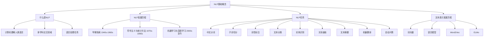
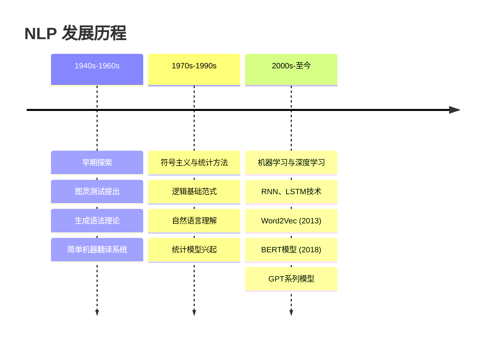
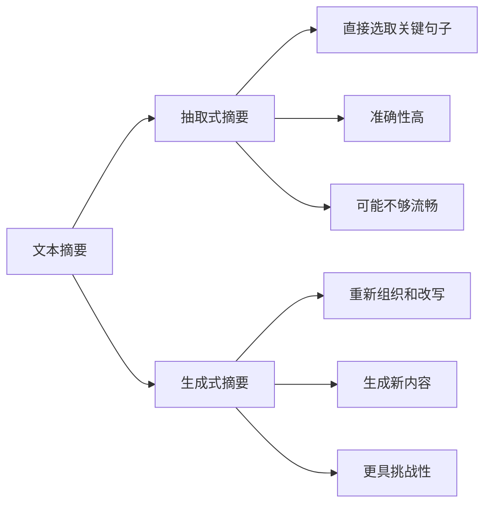
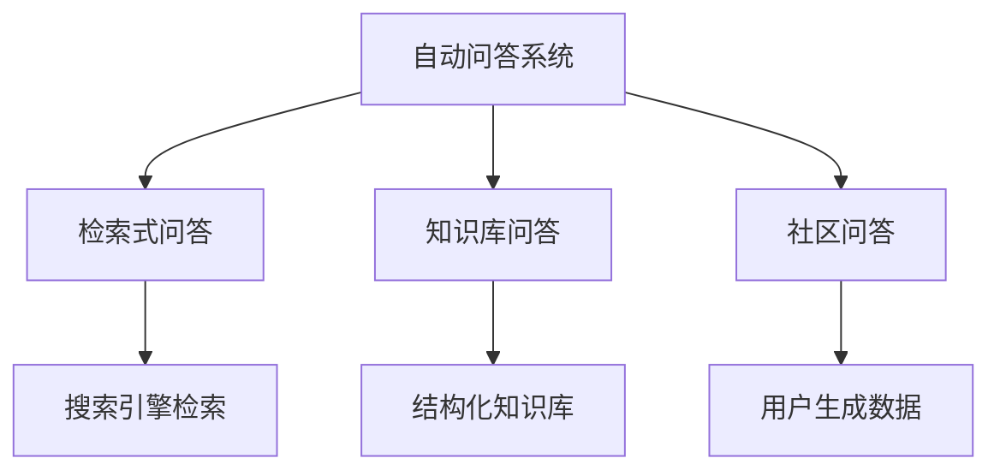
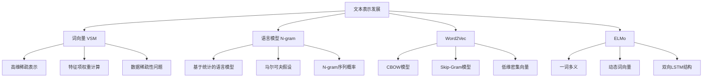
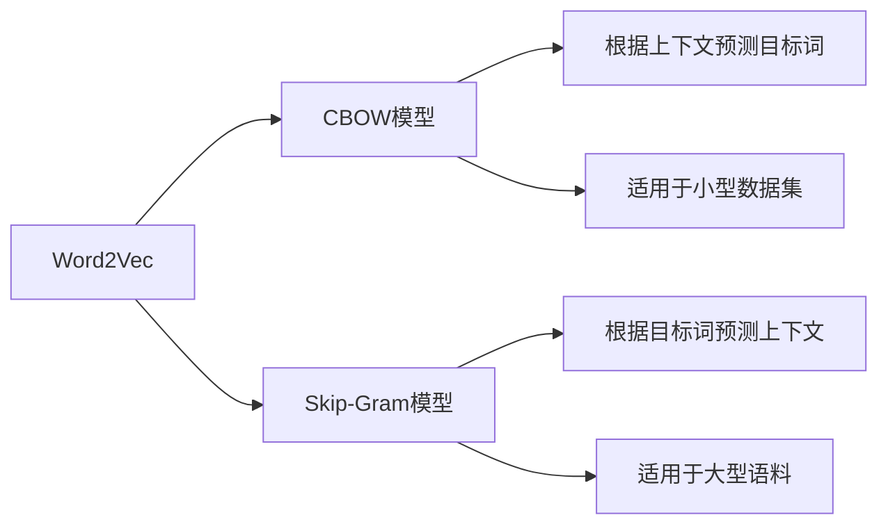

## 第一章 NLP 基础概念

### 概述

自然语言处理（Natural Language Processing，NLP）作为人工智能领域的一个重要分支，旨在使计算机能够理解和处理人类语言，实现人机之间的自然交流。随着信息技术的飞速发展，文本数据已成为我们日常生活中不可或缺的一部分，NLP技术的进步为我们从海量文本中提取有用信息、理解语言的深层含义提供了强有力的工具。



## 1.1 什么是 NLP

NLP 是一种让计算机理解、解释和生成人类语言的技术。它是人工智能领域中一个极为活跃和重要的研究方向，其核心任务是通过计算机程序来模拟人类对语言的认知和使用过程。

### 特点
- 结合计算机科学、人工智能、语言学和心理学等多个学科
- 旨在打破人类语言和计算机语言之间的障碍
- 实现无缝的交流与互动

### 主要任务
NLP技术使得计算机能够执行各种复杂的语言处理任务：
- 中文分词
- 子词切分
- 词性标注
- 文本分类
- 实体识别
- 关系抽取
- 文本摘要
- 机器翻译
- 自动问答

## 1.2 NLP 发展历程



### 早期探索（1940年代 - 1960年代）
- 1950年：艾伦·图灵提出图灵测试
- 诺姆·乔姆斯基提出生成语法理论
- 简单的机器翻译系统，主要依赖字典查找

### 符号主义与统计方法（1970年代 - 1990年代）
- 探索逻辑基础的范式和自然语言理解
- 研究者分为符号主义和统计方法两大阵营
- 1980年代：统计模型开始取代复杂的"手写"规则

### 机器学习与深度学习（2000年代至今）
- 深度学习技术的发展带来显著进步
- 2013年：Word2Vec模型开创词向量表示新时代
- 2018年：BERT模型引领预训练语言模型新浪潮
- GPT-3等大型模型实现高质量文本生成

## 1.3 NLP 任务

### 1.3.1 中文分词

中文分词（Chinese Word Segmentation, CWS）是NLP领域中的一个基础任务。

**示例：**
```
输入：今天天气真好，适合出去游玩.
输出：["今天", "天气", "真", "好", "，", "适合", "出去", "游玩", "。"]
```

### 1.3.2 子词切分

子词切分（Subword Segmentation）将词汇进一步分解为更小的单位。

**示例：**
```
输入：unhappiness
不使用子词切分：整个单词作为一个单位："unhappiness"
使用子词切分（BPE算法）：单词被分割为："un"、"happi"、"ness"
```

### 1.3.3 词性标注

词性标注（Part-of-Speech Tagging，POS Tagging）为文本中的每个单词分配词性标签。

**示例：**
```
句子：She is playing the guitar in the park.
标注结果：
- She (代词，PRP)
- is (动词，VBZ)
- playing (动词现在分词，VBG)
- the (限定词，DT)
- guitar (名词，NN)
- in (介词，IN)
- the (限定词，DT)
- park (名词，NN)
```

### 1.3.4 文本分类

文本分类（Text Classification）将给定文本自动分配到预定义类别中。

**示例：**

| 文本                            | 类别  |
| ----------------------------- | --- |
| NBA季后赛将于下周开始，湖人和勇士将在首轮对决。     | 体育  |
| 美国总统宣布将提高关税，引发国际贸易争端。         | 政治  |
| 苹果公司发布了新款 Macbook，配备了最新的m3芯片。 | 科技  |

### 1.3.5 实体识别

实体识别（Named Entity Recognition, NER）识别文本中具有特定意义的实体。

**示例：**
```
输入：李雷和韩梅梅是北京市海淀区的居民，他们计划在2024年4月7日去上海旅行。
输出：[("李雷", "人名"), ("韩梅梅", "人名"), ("北京市海淀区", "地名"), 
       ("2024年4月7日", "日期"), ("上海", "地名")]
```

### 1.3.6 关系抽取

关系抽取（Relation Extraction）识别实体之间的语义关系。

**示例：**
```
输入：比尔·盖茨是微软公司的创始人。
输出：[("比尔·盖茨", "创始人", "微软公司")]
```

### 1.3.7 文本摘要

文本摘要（Text Summarization）生成简洁准确的摘要概括原文主要内容。



### 1.3.8 机器翻译

机器翻译（Machine Translation, MT）将一种自然语言自动翻译成另一种自然语言。

**示例：**
```
源语言：今天天气很好。
目标语言：The weather is very nice today.
```

### 1.3.9 自动问答

自动问答（Automatic Question Answering, QA）使计算机理解自然语言问题并提供准确答案。



## 1.4 文本表示的发展历程

文本表示的目的是将人类语言的自然形式转化为计算机可以处理的形式，也就是将文本数据数字化。



### 1.4.1 词向量（向量空间模型）

向量空间模型（Vector Space Model, VSM）通过将文本转换为高维空间中的向量来实现文本的数学化表示。

**特点：**
- 每个维度代表一个特征项
- 向量元素值代表特征项权重
- 广泛应用于文本相似度计算、文本分类等

**问题：**
- 数据稀疏性和维数灾难
- 忽略词序和上下文信息
- 特征项独立性假设的局限

### 1.4.2 语言模型（N-gram）

N-gram模型是基于统计的语言模型，核心思想是基于马尔可夫假设。

**类型：**
- N=1：unigram（单个词概率）
- N=2：bigram（考虑前一个词）
- N=3：trigram（考虑前两个词）

**优缺点：**
- ✅ 实现简单、容易理解
- ❌ 数据稀疏性问题
- ❌ 无法捕捉复杂结构和语义信息

### 1.4.3 Word2Vec

Word2Vec是2013年提出的流行词嵌入技术，基于神经网络学习词的密集向量表示。



**优势：**
- 低维密集向量表示
- 捕捉词间语义关系
- 良好的泛化能力

**局限：**
- 基于局部上下文
- 无法捕捉长距离依赖
- 缺乏整体词关系理解

### 1.4.4 ELMo

ELMo（Embeddings from Language Models）实现了从静态词向量到动态词向量的跨越。

**特点：**

- 一词多义处理
- 双向LSTM结构
- 预训练+微调的两阶段过程
- 捕捉上下文信息

**优势：**
- 生成更丰富准确的词向量
- 适用于多种NLP任务
- 解决词汇多义性问题

**挑战：**
- 模型复杂度高
- 训练时间长
- 计算资源消耗大


## refer

- [https://datawhalechina.github.io/happy-llm/#/./chapter1/%E7%AC%AC%E4%B8%80%E7%AB%A0%20NLP%E5%9F%BA%E7%A1%80%E6%A6%82%E5%BF%B5](https://datawhalechina.github.io/happy-llm/#/./chapter1/%E7%AC%AC%E4%B8%80%E7%AB%A0%20NLP%E5%9F%BA%E7%A1%80%E6%A6%82%E5%BF%B5)

