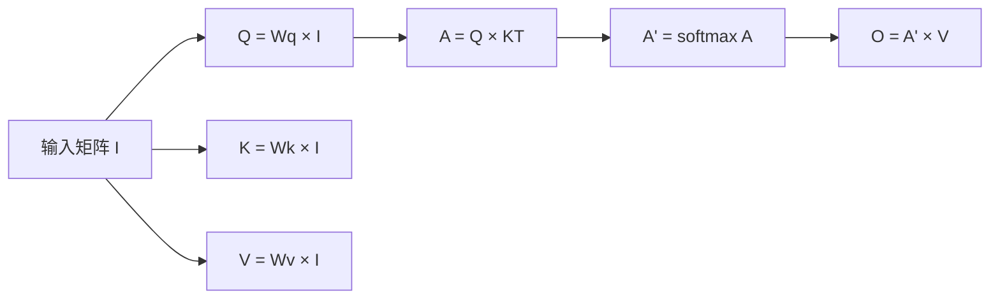

## 概述

本文档基于李宏毅教授的Self-attention教学材料，详细介绍了自注意力机制的原理、应用和相关技术。

## 1. 输入类型与问题定义

### 1.1 复杂输入类型
- **向量输入**: 输入是单个向量 → 输出标量或类别
- **向量集合输入**: 输入是向量集合 → 输出标量集合或类别集合（长度可变）

### 1.2 向量集合作为输入的应用场景

#### 文本处理
- **One-hot编码**: 每个词用独热向量表示
- **词嵌入**: 将词映射到连续向量空间

#### 语音处理
- 1秒音频 → 100帧（10ms间隔）
- 每帧包含400个采样点（16KHz）
- 特征提取：39维MFCC或80维滤波器组输出

#### 图结构处理
- 社交网络：每个用户档案作为向量
- 分子结构：每个原子作为向量

## 2. 输出类型与应用

### 2.1 三种主要输出类型

### 2.2 应用实例
- **序列标注**: 词性标注（POS tagging）
- **序列分类**: 情感分析
- **序列生成**: 机器翻译

## 3. Self-Attention机制

### 3.1 动机
传统全连接层的局限性：
- 只能考虑局部窗口
- 难以处理整个序列的上下文信息

### 3.2 Self-Attention核心思想

### 3.3 计算步骤

#### 步骤1: 计算Query、Key、Value
$$q_i = W^q a_i$$
$$k_i = W^k a_i$$
$$v_i = W^v a_i$$

#### 步骤2: 计算注意力分数
**点积方式**:
$$\alpha_{i,j} = q_i \cdot k_j$$

**加性方式**:
$$\alpha_{i,j} = W \tanh(W^q q_i + W^k k_j)$$

#### 步骤3: Softmax归一化
$$\alpha'_{i,j} = \frac{\exp(\alpha_{i,j})}{\sum_k \exp(\alpha_{i,k})}$$

#### 步骤4: 加权求和
$$b_i = \sum_j \alpha'_{i,j} v_j$$

### 3.4 矩阵形式表示

关键公式：
$$O = \text{softmax}(QK^T)V$$

其中：
- $Q = W^q I$ (Query矩阵)
- $K = W^k I$ (Key矩阵)  
- $V = W^v I$ (Value矩阵)
- $I$ 为输入矩阵

## 4. Multi-Head Self-Attention

### 4.1 多头注意力的动机
- 不同类型的相关性
- 并行计算多种注意力模式

### 4.2 计算过程

每个头的计算：
$$q_{i,h} = W^q_h q_i$$
$$k_{i,h} = W^k_h k_i$$
$$v_{i,h} = W^v_h v_i$$

最终输出：
$$b_i = W^O [b_{i,1}; b_{i,2}; ...; b_{i,h}]$$

## 5. 位置编码 (Positional Encoding)

### 5.1 问题
Self-attention本身不包含位置信息. 对于 每个 `Vector` 来说， 天涯若比邻.

### 5.2 解决方案
为每个位置添加唯一的位置向量 $e_i$：
$$a'_i = a_i + e_i$$

位置编码可以是：
- 手工设计的
- 从数据中学习的

## 6. Self-Attention vs 其他架构

### 6.1 Self-Attention vs CNN

### 6.2 Self-Attention vs RNN

| 特性 | Self-Attention | RNN |
|------|----------------|-----|
| 并行性 | 并行计算 | 顺序计算 |
| 长距离依赖 | 容易捕获 | 难以捕获 |
| 计算复杂度 | $O(n^2)$ | $O(n)$ |
| 内存需求 | 高 | 低 |

## 7. 应用领域

### 7.1 自然语言处理
- **Transformer**: "Attention is All You Need"
- **BERT**: 双向编码器表示

### 7.2 计算机视觉
- **Vision Transformer (ViT)**: 图像分类
- **DETR**: 目标检测
- **Self-Attention GAN**: 图像生成

### 7.3 语音处理
- 截断自注意力（Truncated Self-attention）
- 范围内注意力机制

### 7.4 图神经网络
- 基于连接关系的注意力
- 只对相连节点计算注意力

## 8. 进一步学习资源

- **长距离任务基准**: Long Range Arena
- **高效Transformer综述**: Efficient Transformers Survey
- **相关论文**:
  - Attention is All You Need
  - BERT: Pre-training of Deep Bidirectional Transformers
  - An Image is Worth 16x16 Words

---

## refer

- [lhy](https://www.bilibili.com/video/BV1Xp4y1b7ih/?spm_id_from=333.1391.0.0&p=2&vd_source=d031d052cab79c94967e0b0922e4a956)