# vLLM 文档

## 概述

vLLM 是一个快速且易于使用的大语言模型推理和服务库。

最初由加州大学伯克利分校的 Sky Computing Lab 开发，vLLM 现已发展成为一个社区驱动的项目，汇集了来自学术界和工业界的贡献。

## 基础概念详解

### 注意力机制与 KV Cache

#### 什么是注意力机制中的 Q、K、V？

在 Transformer 的注意力机制中，每个输入都会被转换成三个向量：

- **Q (Query)**：查询向量，表示"我想要什么信息"
- **K (Key)**：键向量，表示"我有什么信息"  
- **V (Value)**：值向量，表示"具体的信息内容"

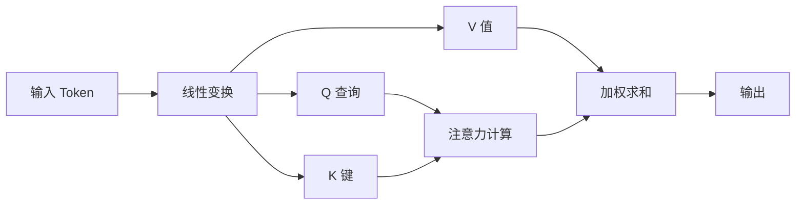

#### 注意力计算过程

注意力的计算公式：
$$\text{Attention}(Q, K, V) = \text{softmax}\left(\frac{QK^T}{\sqrt{d_k}}\right)V$$

**步骤解析**：
1. **计算相似度**：$QK^T$ - Q 与所有 K 的点积，得到注意力分数
2. **归一化**：除以 $\sqrt{d_k}$ 防止梯度消失
3. **概率化**：softmax 将分数转换为概率分布
4. **加权求和**：用概率权重对 V 进行加权平均

#### 什么是 KV Cache？

**KV Cache 就是缓存的 K（键）和 V（值）向量**

在文本生成过程中：

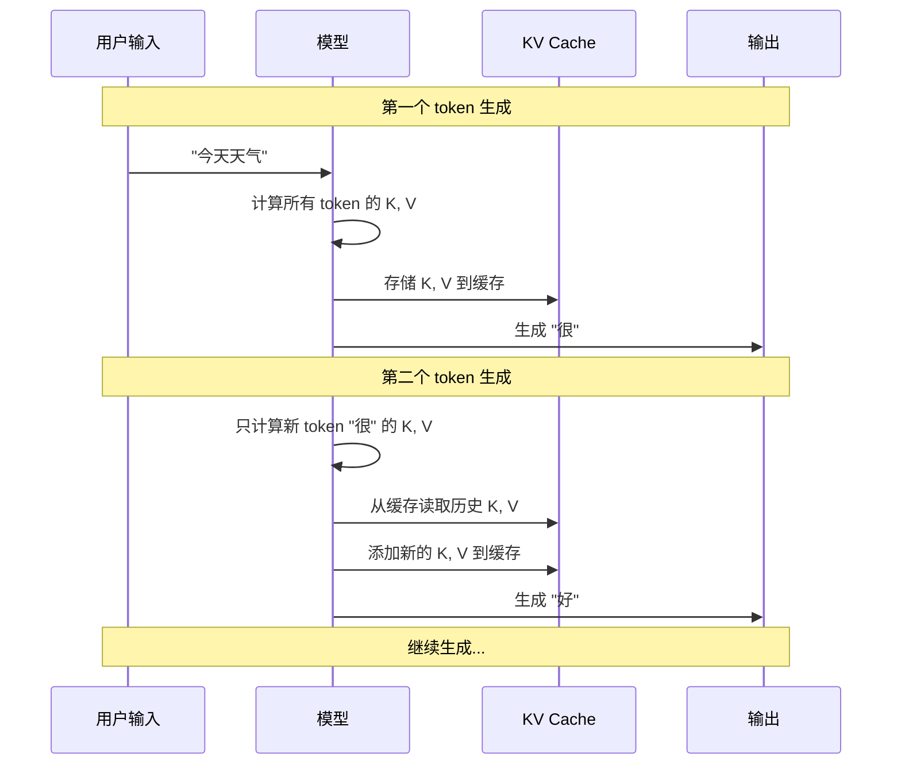

#### 为什么需要 KV Cache？

**没有 KV Cache 的问题**：
```python
# 伪代码示例
输入序列 = ["今天", "天气"]
生成第1个词 "很":
  - 需要计算 ["今天", "天气"] 的 K, V
  
生成第2个词 "好":  
  - 需要重新计算 ["今天", "天气", "很"] 的 K, V  # 重复计算！
  
生成第3个词:
  - 需要重新计算 ["今天", "天气", "很", "好"] 的 K, V  # 又是重复计算！
```

**使用 KV Cache 的优化**：
```python
# 伪代码示例
输入序列 = ["今天", "天气"]
生成第1个词 "很":
  - 计算 ["今天", "天气"] 的 K, V
  - 存储到 KV Cache

生成第2个词 "好":
  - 从 KV Cache 读取 ["今天", "天气"] 的 K, V  # 无需重新计算！
  - 只计算新词 "很" 的 K, V
  - 更新 KV Cache

生成第3个词:
  - 从 KV Cache 读取历史所有 K, V  # 无需重新计算！
  - 只计算新词 "好" 的 K, V
```

#### KV Cache 的内存问题

**传统 KV Cache 的内存分配**：

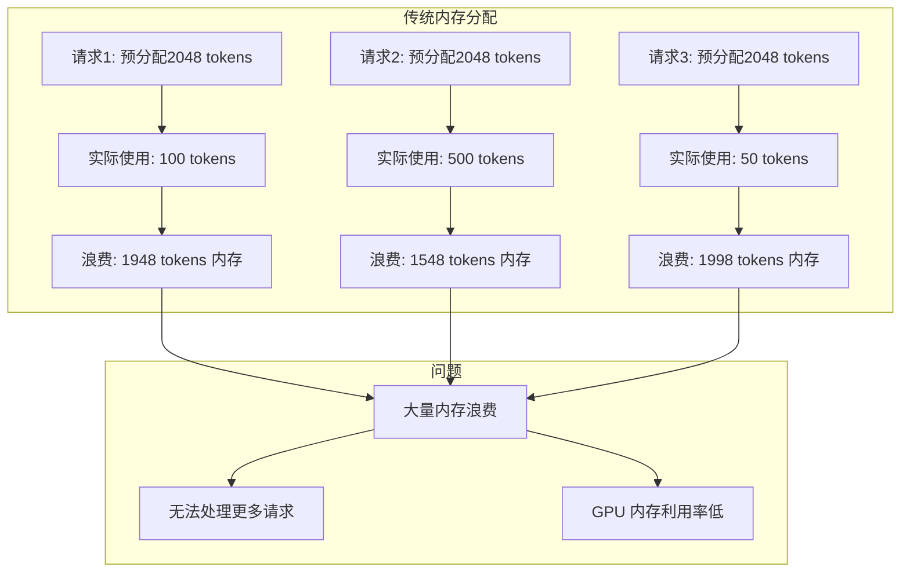

### 为什么 K、V 可以缓存，Q 不能缓存？

#### K、V 的特性

**K 和 V 是根据确定的输入计算的**：
- **K（键）**：基于 `token_embedding + position_encoding` 计算，表示"我在特定位置提供什么信息"
- **V（值）**：同样基于确定的输入计算，表示"我在特定位置的具体内容"
- 一旦某个位置的 token 确定，其 K 和 V 就固定不变

```python
# K, V 的计算方式
input_0 = embedding("今天") + position_encoding[0]
K₀ = Linear_K(input_0)  # "位置0的'今天'提供什么信息？" - 固定不变
V₀ = Linear_V(input_0)  # "位置0的'今天'的具体内容" - 固定不变

input_1 = embedding("天气") + position_encoding[1]  
K₁ = Linear_K(input_1)  # "位置1的'天气'提供什么信息？" - 固定不变
V₁ = Linear_V(input_1)  # "位置1的'天气'的具体内容" - 固定不变
```

#### Q 的特性

**Q 是基于当前 decoder_state 计算的**：
- **Q（查询）**：基于当前的 `decoder_state_at_position` 计算，表示"我在当前位置想要什么信息"
- 每个新位置的 Q 都代表全新的查询需求
- Q 必须基于当前的生成上下文重新计算

```python
# Q 的计算方式
Q₁ = Linear_Q(decoder_state_at_position_1)  # "基于当前状态，我想表达什么？"
Q₂ = Linear_Q(decoder_state_at_position_2)  # "基于新的状态，我想表达什么？"
Q₃ = Linear_Q(decoder_state_at_position_3)  # "基于更新的状态，我想表达什么？"
```

#### 详细的生成过程对比

让我们用生成句子"今天天气很好"的例子来详细看看：

**第1步：生成 "天气"**
```python
# 状态：已有 ["今天"]，要生成下一个token

# 输入准备
input_0 = embedding("今天") + position_encoding[0]

# 计算 Q,K,V
Q₀ = Linear_Q(decoder_state_0)  # "在位置0，基于'今天'，我想表达什么？"
K₀ = Linear_K(input_0)          # "位置0的'今天'提供什么信息？"  
V₀ = Linear_V(input_0)          # "位置0的'今天'的具体内容"

# 注意力计算（自注意力）
attention_0 = softmax(Q₀ @ K₀ᵀ) @ V₀

# 通过后续层处理，最终输出概率分布
# 采样得到：下一个token = "天气"

# 缓存策略
KV_Cache = {position_0: (K₀, V₀)}  # 缓存位置0的K,V
```

**第2步：生成 "很"**
```python
# 状态：已有 ["今天", "天气"]，要生成下一个token

# 新输入准备  
input_1 = embedding("天气") + position_encoding[1]

# 计算新的 K,V（位置1）
K₁ = Linear_K(input_1)  # "位置1的'天气'提供什么信息？"
V₁ = Linear_V(input_1)  # "位置1的'天气'的具体内容"

# 计算新的 Q（当前生成位置）
Q₂ = Linear_Q(decoder_state_at_position_2)  # "在位置2，基于前面的内容，我想表达什么？"

# 从缓存读取历史 K,V
K_history = [K₀, K₁]  # 从缓存读取 + 新计算的
V_history = [V₀, V₁]  # 从缓存读取 + 新计算的

# 注意力计算（因果注意力）
attention_scores = Q₂ @ [K₀, K₁]ᵀ  # Q₂与所有历史K计算相似度
attention_weights = softmax(attention_scores)
attention_output = attention_weights @ [V₀, V₁]

# 输出下一个token = "很"

# 更新缓存
KV_Cache = {
    position_0: (K₀, V₀),  # 保持不变
    position_1: (K₁, V₁)   # 新增
}
```

**第3步：生成 "好"**
```python
# 状态：已有 ["今天", "天气", "很"]，要生成下一个token

# 新输入准备
input_2 = embedding("很") + position_encoding[2]

# 计算新的 K,V（位置2）
K₂ = Linear_K(input_2)  # "位置2的'很'提供什么信息？"
V₂ = Linear_V(input_2)  # "位置2的'很'的具体内容"

# 计算新的 Q（位置3的查询）
Q₃ = Linear_Q(decoder_state_at_position_3)  # "在位置3，基于'今天天气很'，我想表达什么？"

# 从缓存读取所有历史 K,V
K_history = [K₀, K₁, K₂]  # 缓存 + 缓存 + 新计算
V_history = [V₀, V₁, V₂]  # 缓存 + 缓存 + 新计算

# 注意力计算
attention_scores = Q₃ @ [K₀, K₁, K₂]ᵀ
attention_weights = softmax(attention_scores)  
attention_output = attention_weights @ [V₀, V₁, V₂]

# 输出下一个token = "好"

# 更新缓存
KV_Cache = {
    position_0: (K₀, V₀),  # 保持不变
    position_1: (K₁, V₁),  # 保持不变  
    position_2: (K₂, V₂)   # 新增
}
```

#### 关键理解点

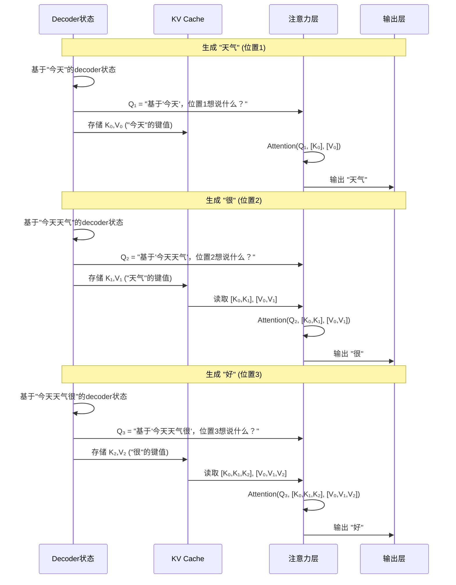

#### 为什么 Q 不能缓存的根本原因

```python
# 每一步的Q都代表不同的"查询意图"：

Q₁ = "我在位置1，基于'今天'，我想说什么？"           # 答案：天气
Q₂ = "我在位置2，基于'今天天气'，我想说什么？"       # 答案：很  
Q₃ = "我在位置3，基于'今天天气很'，我想说什么？"     # 答案：好

# 而K,V代表"已确定信息的固定表示"：
K₀,V₀ = "位置0的'今天'提供的信息"  # 固定不变
K₁,V₁ = "位置1的'天气'提供的信息"  # 固定不变
K₂,V₂ = "位置2的'很'提供的信息"    # 固定不变
```

#### 如果强行缓存 Q 会怎样？

```python
# 错误的做法
历史Q缓存: [Q₁, Q₂, Q₃]  # 这些是历史位置的查询需求

# 问题：
Q₁ = "在位置1，基于'今天'，我想要什么？"     # 已经过时
Q₂ = "在位置2，基于'今天天气'，我想要什么？"  # 已经过时  
Q₃ = "在位置3，基于'今天天气很'，我想要什么？" # 已经过时

# 当前需要的：
Q₄ = "在位置4，基于'今天天气很好'，我想要什么？" # 全新的查询需求
```

### Decoder State 的深入理解

#### 什么是 Decoder State？

`decoder_state_at_position` 是**经过多层 Transformer 处理后的隐藏状态**，它包含了到当前位置为止的所有上下文信息。

#### Decoder State 的计算流程

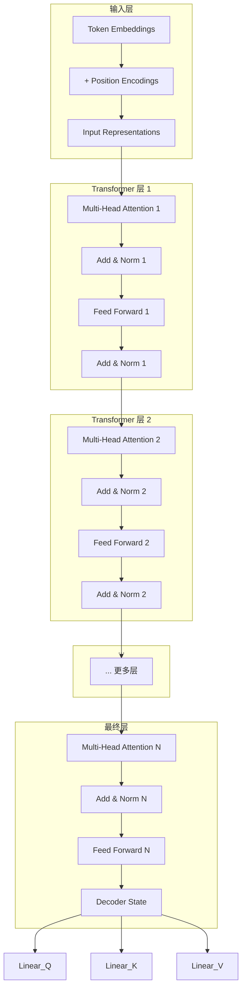

#### 具体的计算过程

让我们用例子来看每一步：

```python
# 假设我们有一个 2 层的 Transformer Decoder
# 当前状态：["今天", "天气"]，要生成位置 2

# === 输入准备 ===
tokens = ["今天", "天气"]
positions = [0, 1]

# 输入表示
input_0 = embedding("今天") + position_encoding[0]
input_1 = embedding("天气") + position_encoding[1]
inputs = [input_0, input_1]  # shape: [seq_len=2, hidden_dim]

# === 第 1 层 Transformer ===
# 多头注意力
Q1 = Linear_Q1(inputs)  # [2, hidden_dim]
K1 = Linear_K1(inputs)  # [2, hidden_dim]  
V1 = Linear_V1(inputs)  # [2, hidden_dim]

# 因果掩码注意力（只能看到之前的token）
attention_mask = [[1, 0],    # 位置0只能看到自己
                  [1, 1]]    # 位置1可以看到位置0和自己

attention_output1 = CausalAttention(Q1, K1, V1, mask=attention_mask)
# Add & Norm
layer1_output = LayerNorm(inputs + attention_output1)

# Feed Forward
ff_output1 = FeedForward(layer1_output)
# Add & Norm  
layer1_final = LayerNorm(layer1_output + ff_output1)

# === 第 2 层 Transformer ===
# 多头注意力
Q2 = Linear_Q2(layer1_final)
K2 = Linear_K2(layer1_final)
V2 = Linear_V2(layer1_final)

attention_output2 = CausalAttention(Q2, K2, V2, mask=attention_mask)
layer2_output = LayerNorm(layer1_final + attention_output2)

ff_output2 = FeedForward(layer2_output)
layer2_final = LayerNorm(layer2_output + ff_output2)

# === 最终的 Decoder State ===
decoder_states = layer2_final  # shape: [2, hidden_dim]
# decoder_states[0] = 位置0经过所有层处理后的状态
# decoder_states[1] = 位置1经过所有层处理后的状态
```

#### 生成下一个 Token 时的状态

```python
# 现在要生成位置 2 的 token
# 关键：位置 2 还没有确定的 token，但我们需要它的 decoder state

# 方法1：使用特殊的"生成位置"表示
generation_input = special_generation_embedding + position_encoding[2]

# 方法2：使用前一个位置的状态作为起点
# 实际上，现代实现通常使用位置1的最终状态作为位置2的初始查询

# 计算位置 2 的查询
decoder_state_at_position_2 = decoder_states[1]  # 使用位置1的最终状态
Q_for_position_2 = Linear_Q_final(decoder_state_at_position_2)
```

#### 更准确的理解

实际上，在现代 Transformer 实现中：

```python
# 生成过程的真实情况
def generate_next_token(past_tokens):
    # 1. 准备输入（包括所有历史token）
    inputs = prepare_inputs(past_tokens)  # ["今天", "天气"]
    
    # 2. 通过所有 Transformer 层
    hidden_states = inputs
    for layer in transformer_layers:
        hidden_states = layer(hidden_states)  # 每层都更新所有位置的状态
    
    # 3. 只取最后一个位置的状态用于生成
    last_position_state = hidden_states[-1]  # 位置1的最终状态
    
    # 4. 计算下一个token的概率
    logits = output_projection(last_position_state)
    next_token = sample(logits)
    
    return next_token
```

#### Decoder State 的本质

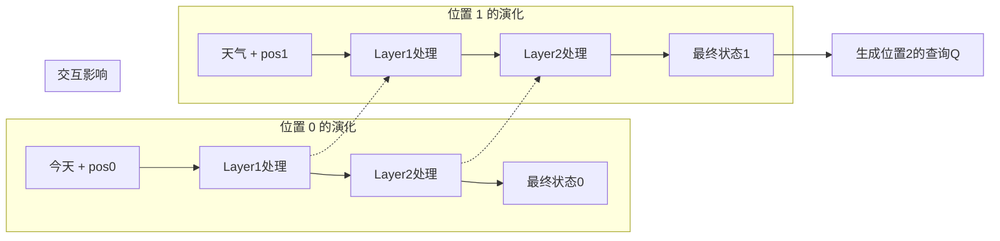

**Decoder State 包含了**：
1. **当前 token 的语义信息**
2. **位置信息**  
3. **与所有历史 token 的交互结果**
4. **经过多层抽象后的高级表示**

#### 为什么这样设计？

```python
# Decoder State 的作用
decoder_state_at_position_1 包含了：
- "天气" 这个词的语义
- 它在位置1的位置信息  
- 它与"今天"的关系（通过注意力机制学到）
- 经过多层处理后的抽象表示

# 用这个状态计算 Q，就是在问：
Q = "基于我现在掌握的所有信息（今天+天气的组合语义），
     我在下一个位置想要表达什么？"
```

#### 内存使用对比

```python
# 不使用KV Cache（每次重新计算）
第1步: 计算 Q₁, K₀, V₀                    # 1个token的计算
第2步: 计算 Q₂, K₀, K₁, V₀, V₁            # 2个token的计算（重复了K₀,V₀）
第3步: 计算 Q₃, K₀, K₁, K₂, V₀, V₁, V₂    # 3个token的计算（重复了前面所有K,V）

# 使用KV Cache
第1步: 计算 Q₁, K₀, V₀; 缓存 K₀, V₀
第2步: 计算 Q₂, K₁, V₁; 从缓存读取 K₀, V₀; 缓存 K₁, V₁  
第3步: 计算 Q₃, K₂, V₂; 从缓存读取所有历史 K, V; 缓存 K₂, V₂
```

所以 `decoder_state_at_position` 实际上是**经过完整 Transformer 处理的上下文感知表示**，它融合了当前位置的信息和所有历史信息的交互结果。这就是为什么：
- **K, V 缓存**：避免重复计算历史 token 的键值信息
- **Q 不缓存**：因为每个新 token 的查询需求都是全新的，必须重新计算

## 性能特点

### 🚀 高速性能

#### PagedAttention - 解决 KV Cache 内存问题

**PagedAttention** 是 vLLM 的核心创新，它像操作系统管理内存一样管理 KV Cache：

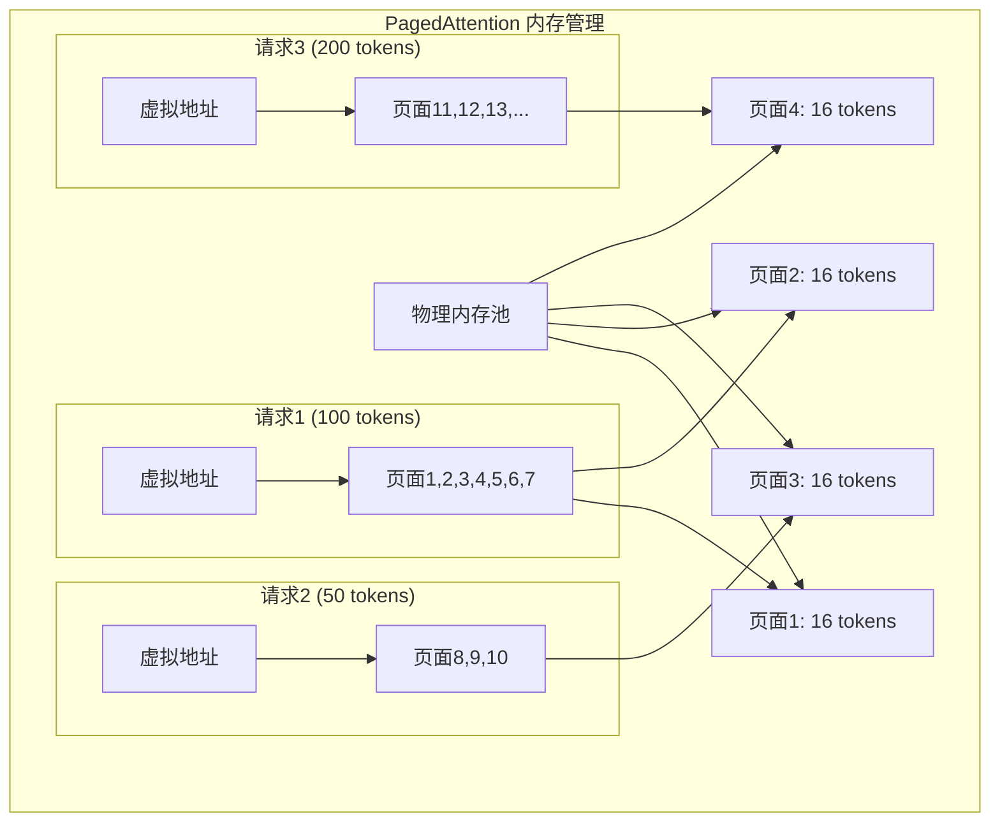

**PagedAttention 的优势**：

| 特性 | 传统方法 | PagedAttention |
|:-----|:---------|:---------------|
| **内存分配** | 预分配固定大小 | 按需分配页面 |
| **内存利用率** | 30-40% | 90%+ |
| **内存碎片** | 严重 | 几乎无碎片 |
| **支持序列长度** | 受预分配限制 | 动态扩展 |
| **并发请求数** | 受内存浪费限制 | 显著提升 |

#### 连续批处理（Continuous Batching）

**传统批处理 vs 连续批处理**：

```mermaid
gantt
    title 批处理对比 (时间轴)
    dateFormat X
    axisFormat %s
    
    section 传统批处理
    请求A(长) :done, trad_a, 0, 10
    请求B(短) :done, trad_b, 0, 3  
    请求C(短) :done, trad_c, 0, 2
    GPU空闲 :crit, trad_idle, 2, 10
    等待新批次 :crit, trad_wait, 10, 12
    新批次开始 :trad_new, 12, 15
    
    section 连续批处理  
    请求A(长) :done, cont_a, 0, 10
    请求B(短) :done, cont_b, 0, 3
    请求C(短) :done, cont_c, 0, 2  
    请求D :done, cont_d, 2, 7
    请求E :done, cont_e, 3, 8
    请求F :done, cont_f, 7, 12
```

**连续批处理的工作机制**：

1. **动态调度**：一旦有请求完成，立即用新请求填补
2. **内存复用**：完成的请求释放的 KV Cache 立即可用
3. **负载均衡**：长短请求混合，保持 GPU 利用率

#### 其他性能优化技术

**推测解码（Speculative Decoding）**：
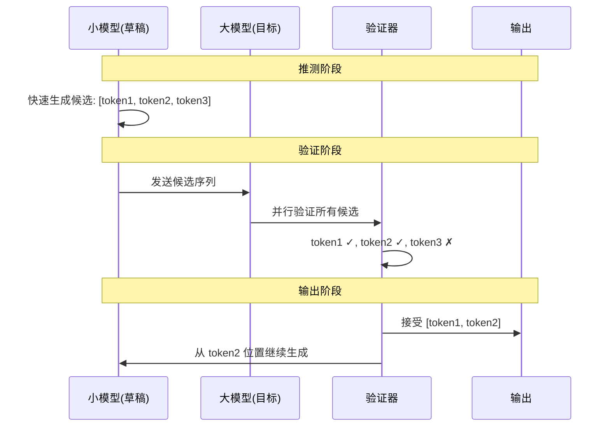

**量化技术对比**：

| 量化方法 | 模型大小 | 推理速度 | 精度损失 | 适用场景 |
|:---------|:---------|:---------|:---------|:---------|
| **FP16** | 基准 | 基准 | 无 | 高精度要求 |
| **INT8** | 50% | 1.5-2x | 很小 | 平衡性能精度 |  
| **INT4** | 25% | 2-3x | 小 | 资源受限 |
| **GPTQ** | 25% | 2-4x | 很小 | 生产环境 |
| **AWQ** | 25% | 2-4x | 极小 | 高质量要求 |

### 🔧 灵活易用

#### 分布式推理策略

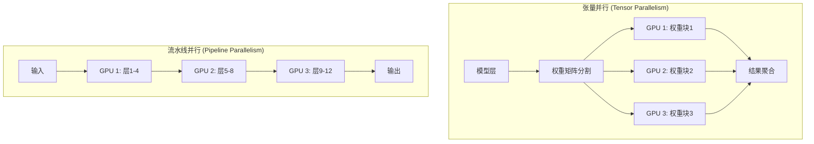

## 核心架构

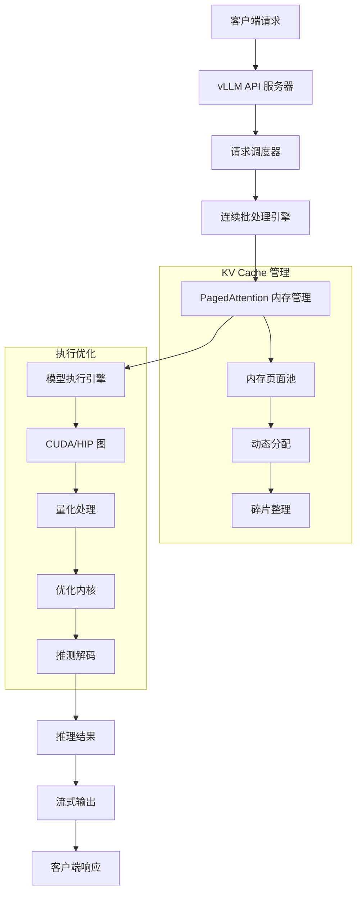

## 参考资料

- [vLLM 发布博客](https://blog.vllm.ai/2023/06/20/vllm.html) - PagedAttention 介绍
- [vLLM 论文](https://arxiv.org/abs/2309.06180) (SOSP 2023)
- [连续批处理如何在 LLM 推理中实现 23 倍吞吐量提升](https://www.anyscale.com/blog/continuous-batching-llm-inference) - Cade Daniel 等人
- vLLM Meetups


