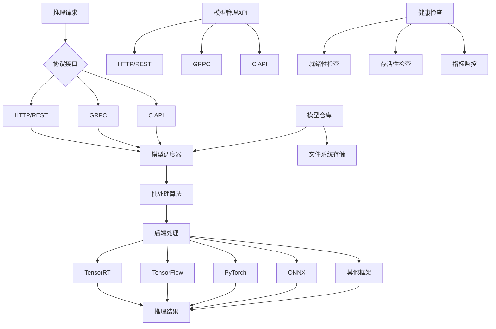

# NVIDIA Triton Inference Server 文档

## 概述

NVIDIA Triton Inference Server 是一个开源的推理服务软件，用于简化 AI 推理过程。Triton 推理服务器使团队能够部署来自多个深度学习和机器学习框架的任何 AI 模型，包括 TensorRT、TensorFlow、PyTorch、ONNX、OpenVINO、Python、RAPIDS FIL 等。

### 支持平台
- **云端、数据中心、边缘和嵌入式设备**
- **硬件支持**：NVIDIA GPU、x86 和 ARM CPU、AWS Inferentia
- **查询类型**：实时、批处理、集成和音频/视频流

Triton 推理服务器是 NVIDIA AI Enterprise 的一部分，这是一个加速数据科学管道并简化生产 AI 开发和部署的软件平台。

## 架构设计

### 核心组件

| 组件 | 功能描述 |
|:---|:---|
| **模型仓库** | 基于文件系统的模型存储，包含 Triton 可用于推理的所有模型 |
| **请求路由** | 通过 HTTP/REST、GRPC 或 C API 接收推理请求并路由到相应的模型调度器 |
| **调度器** | 为每个模型实现多种调度和批处理算法，可按模型进行配置 |
| **后端处理** | 使用批处理请求中的输入执行推理以产生所需的输出 |
| **后端 C API** | 允许扩展 Triton 功能，如自定义预处理和后处理操作 |

## 主要特性

### 🚀 框架支持
- **多深度学习框架支持**
- **多机器学习框架支持**

### ⚡ 性能优化
- **并发模型执行**
- **动态批处理**
- **序列批处理和有状态模型的隐式状态管理**

### 🔧 扩展性
- **后端 API**：支持添加自定义后端和预/后处理操作
- **模型管道**：使用集成或业务逻辑脚本 (BLS)

### 🌐 协议支持
- **HTTP/REST 和 GRPC 推理协议**（基于社区开发的 KServe 协议）
- **C API 和 Java API**：允许 Triton 直接链接到应用程序中，用于边缘和其他进程内用例

### 📊 监控指标
- GPU 利用率
- 服务器吞吐量
- 服务器延迟
- 更多性能指标

### 🏥 健康检查
- **就绪性和存活性健康端点**
- **利用率、吞吐量和延迟指标**
- 便于集成到 Kubernetes 等部署框架中

