  

## 概述

  

FlashInfer 是一个专为大语言模型（LLM）设计的库和内核生成器，提供高性能的 LLM GPU 内核实现，包括 FlashAttention、PageAttention 和 LoRA。FlashInfer 专注于 LLM 服务和推理，在各种场景下提供最先进的性能。

  

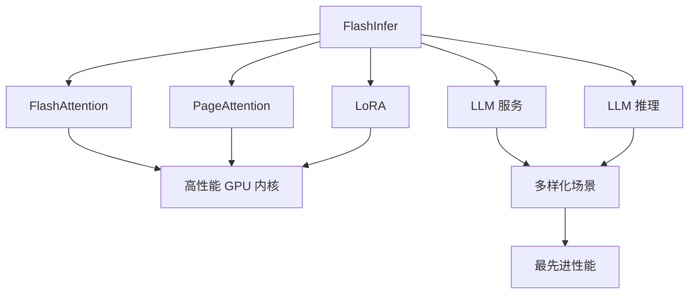

  

## Python 包

  

FlashInfer 作为 Python 包提供，基于 PyTorch 构建，可轻松集成到您的 Python 应用程序中。

  

### 系统要求


| 组件             | 要求                           |
| :------------- | :--------------------------- |
| **操作系统**       | 仅限 Linux                     |
| **Python 版本**  | 3.8, 3.9, 3.10, 3.11, 3.12   |
| **PyTorch 版本** | 2.2/2.3/2.4/2.5/2.6          |
| **CUDA 版本**    | 11.8/12.1/12.4/12.6          |
| **GPU 架构支持**   | sm75, sm80, sm86, sm89, sm90 |

  

> **重要**: FlashInfer 当前使用的包名是 `flashinfer-python`，而不是 `flashinfer`

  

检查 PyTorch CUDA 版本：

```python

python -c "import torch; print(torch.version.cuda)"

```

  

### 完整版本兼容性矩阵

  

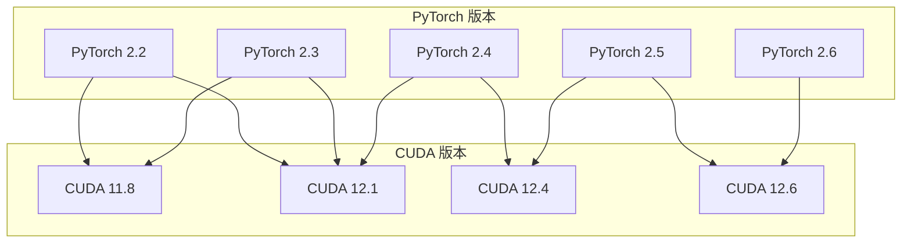

  

### 快速开始

  

通过 pip 安装 FlashInfer 是最简单的方式。我们为不同的 PyTorch 版本和 CUDA 版本提供带索引 URL 的 wheels。

  

#### 完整安装命令矩阵

  

**PyTorch 2.6:**

```bash

# CUDA 12.6

pip install flashinfer-python -i https://flashinfer.ai/whl/cu126/torch2.6/

```

  

**PyTorch 2.5:**

```bash

# CUDA 12.4

pip install flashinfer-python -i https://flashinfer.ai/whl/cu124/torch2.5/

# CUDA 12.6 (需要 PyTorch 2.5+)

pip install flashinfer-python -i https://flashinfer.ai/whl/cu126/torch2.5/

```

  

**PyTorch 2.4:**

```bash

# CUDA 12.1

pip install flashinfer-python -i https://flashinfer.ai/whl/cu121/torch2.4/

# CUDA 12.4 (PyTorch 2.4+ 支持)

pip install flashinfer-python -i https://flashinfer.ai/whl/cu124/torch2.4/

```

  

**PyTorch 2.3:**

```bash

# CUDA 11.8

pip install flashinfer-python -i https://flashinfer.ai/whl/cu118/torch2.3/

# CUDA 12.1

pip install flashinfer-python -i https://flashinfer.ai/whl/cu121/torch2.3/

```

  

**PyTorch 2.2:**

```bash

# CUDA 11.8

pip install flashinfer-python -i https://flashinfer.ai/whl/cu118/torch2.2/

# CUDA 12.1

pip install flashinfer-python -i https://flashinfer.ai/whl/cu121/torch2.2/

```

  

### 版本选择指南

  

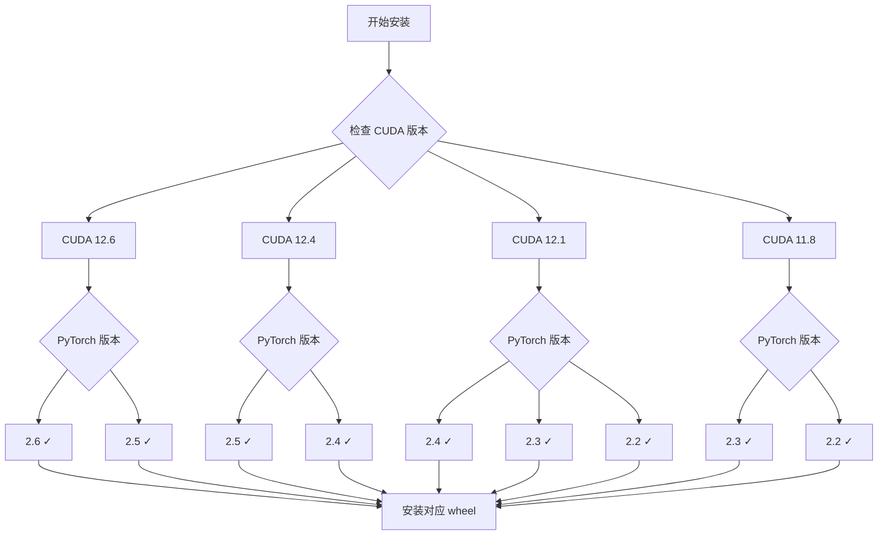

  

## 核心功能

  

### 1. 递归注意力 (Recursive Attention)

  

递归注意力是 FlashInfer 的核心特性之一，允许将注意力计算分解为更小的组件，提高内存效率和计算性能。

  

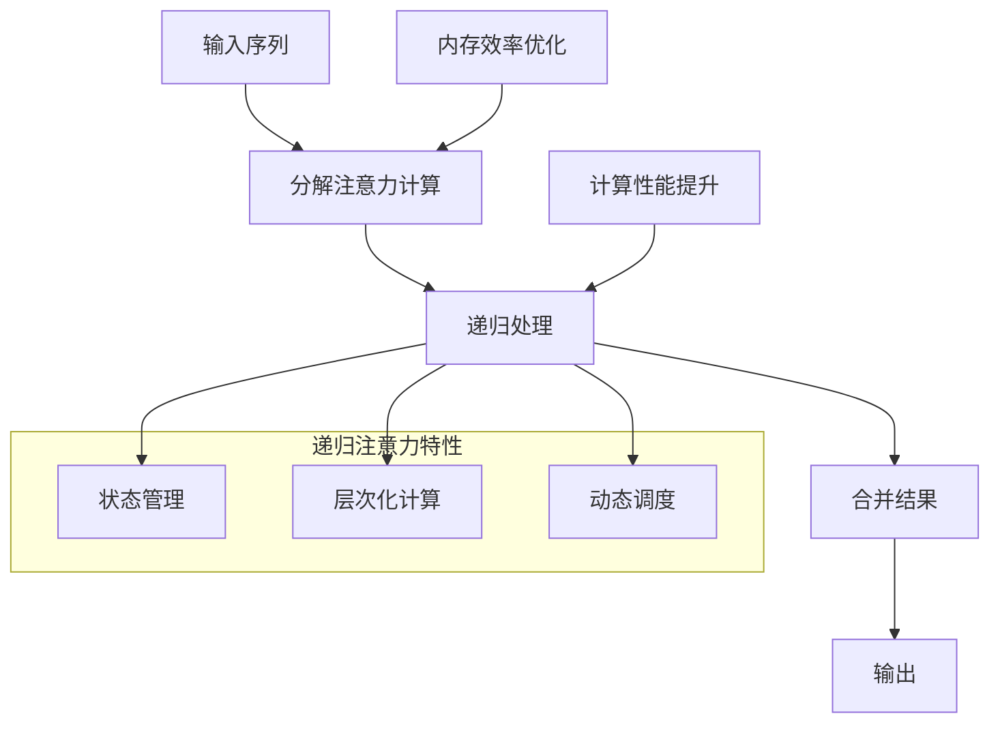

  

**主要优势:**

- **内存效率**: 通过分解计算减少内存占用

- **性能优化**: 递归处理提高计算效率

- **可扩展性**: 支持长序列处理

- **状态保持**: 维护注意力状态以支持增量计算

  

### 2. KV-Cache 布局

  

FlashInfer 提供灵活的 KV-Cache 布局管理，支持多种缓存策略以优化不同场景下的性能。

  

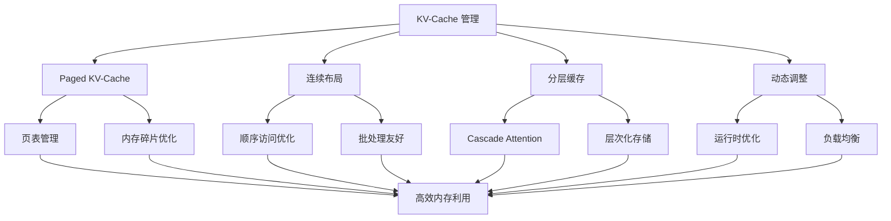

  

**KV-Cache 特性:**

- **分页管理**: 支持 Paged KV-Cache 减少内存碎片
- **布局优化**: 针对不同访问模式优化数据布局
- **动态管理**: 运行时动态调整缓存策略
- **页表支持**: 完整的页表布局文档和 API


## 技术架构

  
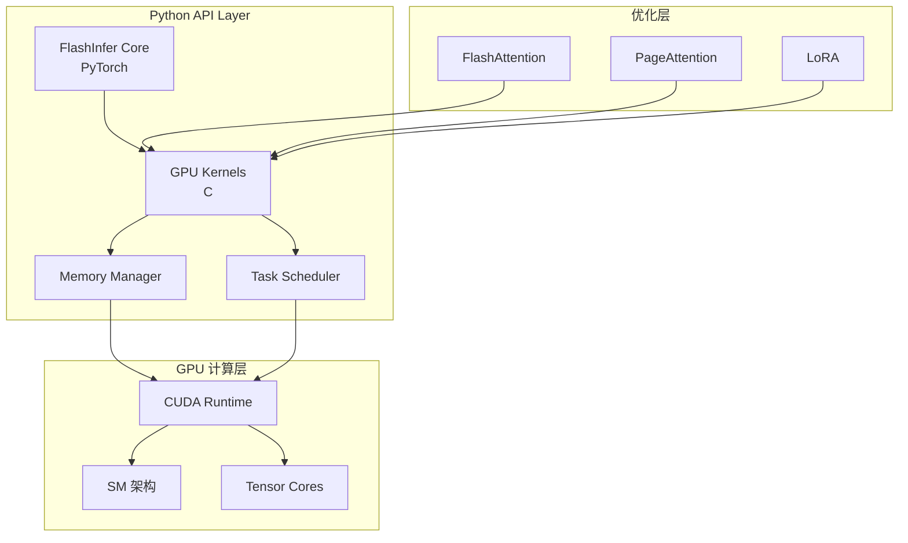
  

## 性能特性


### 内存优化技术
  

| 特性                    | 描述             | 适用场景  | 性能提升          |
| :-------------------- | :------------- | :---- | :------------ |
| **Cascade Attention** | 分层 KV-Cache 管理 | 长序列推理 | 30-50% 内存节省   |
| **Head-Query 优化**     | 头查询级别优化        | 多头注意力 | 20-30% 缓存效率提升 |
| **动态内存分配**            | 运行时内存管理        | 变长序列  | 减少内存碎片        |
| **Paged KV-Cache**    | 分页缓存机制         | 批处理推理 | 显著减少内存占用      |
  

### 计算优化策略

  

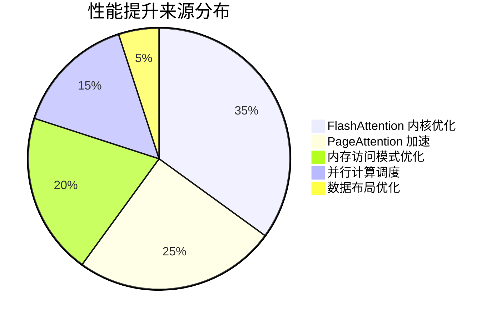

  

### GPU 架构支持

  

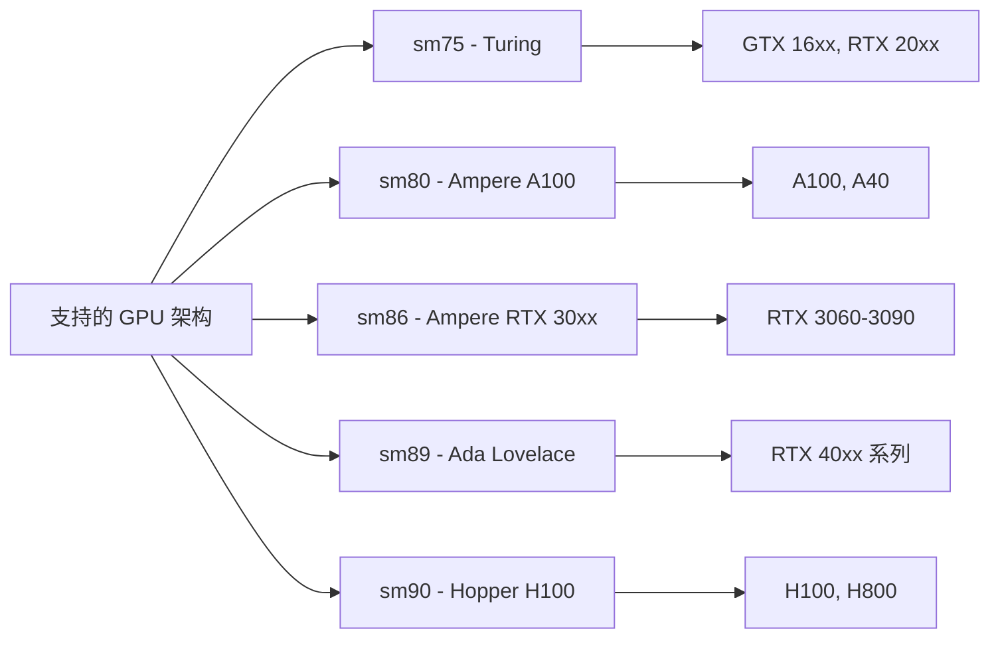

  

## 使用场景

  

### 1. LLM 推理服务

  

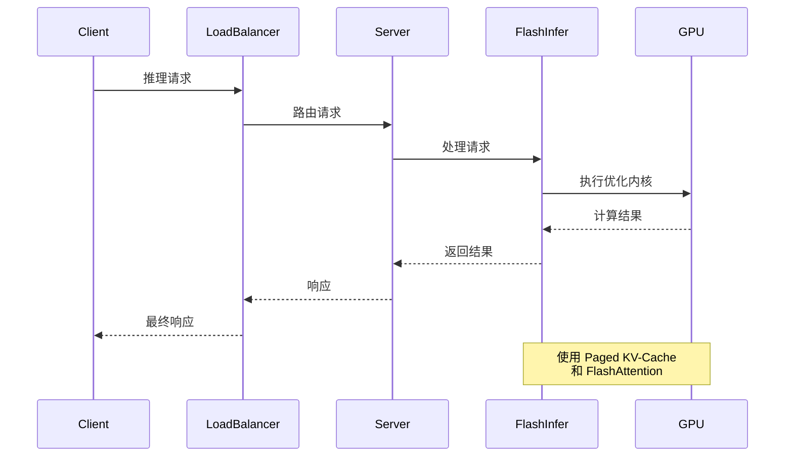

  

### 2. 批处理优化场景

**特性优势:**

- **负载均衡**: 计划阶段缓解负载不平衡问题
- **批处理效率**: 优化批量请求处理
- **资源利用**: 最大化 GPU 资源利用率
- **动态调度**: 根据请求特征动态调整处理策略


### 3. 长序列处理

  

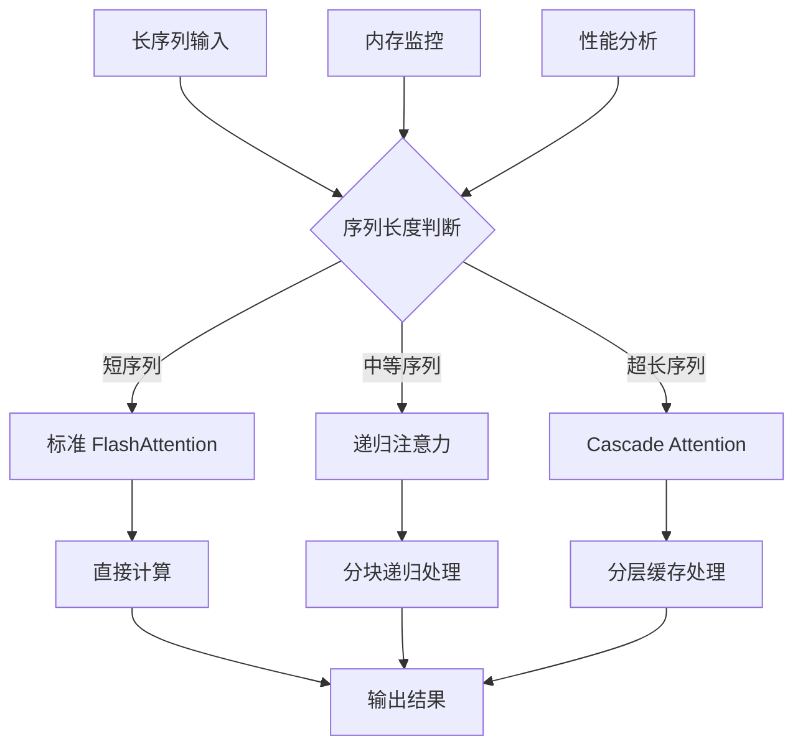

  

## 高级特性

  

### CUDAGraph 兼容性

`FlashInfer` 内核支持 `CUDAGraph` 捕获，可以进一步提升推理性能：

  

```python
# CUDAGraph 使用示例
import torch
from flashinfer import single_decode_with_kv_cache

# 启用 CUDAGraph
torch.cuda.synchronize()
graph = torch.cuda.CUDAGraph()
with torch.cuda.graph(graph):
	output = single_decode_with_kv_cache(...)
```

  

### 编译时优化


FlashInfer 支持编译时优化，可以根据具体硬件和使用场景生成最优内核：
  

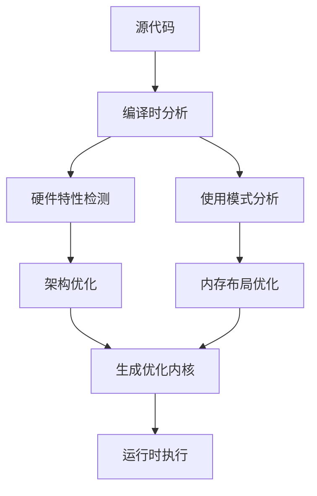

  

## 安装故障排除

  

### 常见问题及解决方案
  

| 问题             | 原因                                      | 解决方案                  |
| :------------- | :-------------------------------------- | :-------------------- |
| **CUDA 版本不匹配** | PyTorch 和 CUDA 版本不兼容                    | 参考兼容性矩阵选择正确版本         |
| **GPU 架构不支持**  | GPU 计算能力低于 sm75                         | 升级到支持的 GPU 架构         |
| **包名错误**       | 使用了 `flashinfer` 而非 `flashinfer-python` | 使用正确的包名安装             |
| **wheel 不存在**  | 版本组合不在支持矩阵中                             | 选择支持的 PyTorch/CUDA 组合 |

### 验证安装

  

```python
import torch
import flashinfer
# 检查版本
print(f"PyTorch: {torch.__version__}")
print(f"CUDA: {torch.version.cuda}")
print(f"FlashInfer: {flashinfer.__version__}")

# 检查 GPU 可用性
print(f"GPU 可用: {torch.cuda.is_available()}")
print(f"GPU 数量: {torch.cuda.device_count()}")

# 简单功能测试
if torch.cuda.is_available():
	device = torch.cuda.current_device()
	print(f"当前设备: {torch.cuda.get_device_name(device)}")
```

  

## 总结

`FlashInfer` 作为专业的 LLM 内核库，通过以下核心技术提供卓越性能：

1. **完整的版本支持**: 支持 PyTorch 2.2-2.6 和 CUDA 11.8-12.6 的完整组合矩阵
2. **高性能内核**: FlashAttention、PageAttention、LoRA 的优化实现
3. **先进的内存管理**: Cascade Attention、Paged KV-Cache 和分层缓存
4. **灵活的架构支持**: 从 Turing 到 Hopper 的全系列 GPU 架构
5. **易于集成**: Python 包形式，与现有工作流程无缝集成
6. **企业级特性**: CUDAGraph 支持、编译时优化、负载均衡

  
`FlashInfer` 为 `LLM` 服务和推理场景提供了完整且高性能的解决方案，在保证最佳性能的同时简化了开发和部署流程。通过精确的版本兼容性管理和丰富的优化特性，`FlashInfer` 已成为 `LLM` 推理加速的首选解决方案。
