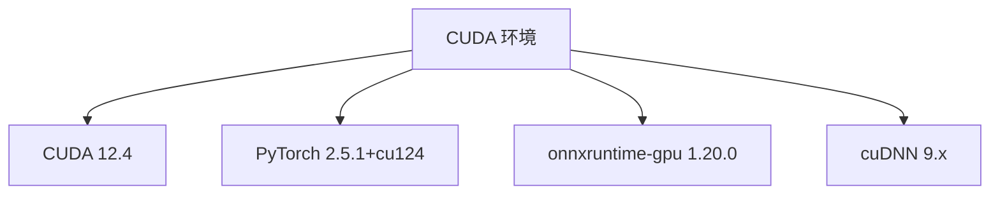
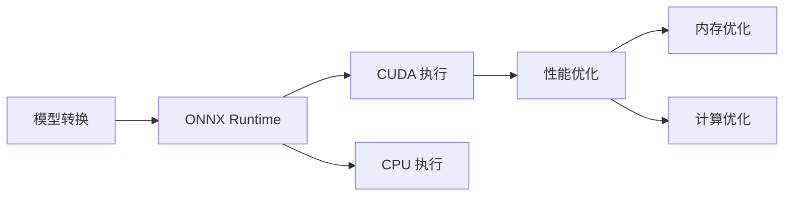

## 环境配置

### CUDA 环境


### 依赖版本
```python
# 核心依赖
torch>=2.0.0,<2.6.0
torchvision>=0.15.0,<0.21.0
torchaudio>=2.0.0,<2.6.0
onnxruntime-gpu==1.20.0
optimum[onnxruntime-gpu]>=1.12.0,<1.20.0
```

## 模型转换流程

### 1. 转换脚本
```bash
#!/bin/bash
# official_convert.sh

# 配置路径
ORIGINAL_MODEL="/users/yusizhen/models/vad_turn"
OUTPUT_BASE="./converted_models"
ONNX_OUTPUT="$OUTPUT_BASE/onnx"

# 转换为ONNX
optimum-cli export onnx \
    --model "$ORIGINAL_MODEL" \
    --task sequence-classification \
    --framework pt \
    --opset 14 \
    --atol 1e-3 \
    "$ONNX_OUTPUT"
```

### 2. 性能优化


## 推理性能

### 测试结果
- PyTorch 推理时间: 20.32ms
- ONNX 推理时间: 9.15ms
- 加速比: 2.22x

### 精度验证
- 预测结果完全一致
- Logits 最大差异: 0.003769
- 分类准确率: 100%

## 代码实现

### 1. 模型加载
```python
# 加载 ONNX 模型
onnx_model = ORTModelForSequenceClassification.from_pretrained(
    onnx_path,
    provider="CUDAExecutionProvider",
    local_files_only=True
)
```

### 2. 推理实现
```python
# 准备输入
inputs = tokenizer(test_text, return_tensors="pt", truncation=True, padding=True)
inputs = {k: v.cuda() for k, v in inputs.items()}

# ONNX 推理
onnx_output = onnx_model(**inputs)
onnx_logits = onnx_output.logits
onnx_pred = torch.argmax(onnx_logits, dim=-1).cpu().numpy()[0]
```

## REFER

### 依赖

```python
# =============================================================================
# 深度学习核心框架
# =============================================================================
--extra-index-url https://download.pytorch.org/whl/cu124
torch>=2.0.0,<2.6.0
torchvision>=0.15.0,<0.21.0
torchaudio>=2.0.0,<2.6.0

# =============================================================================
# Transformers生态系统
# =============================================================================
transformers>=4.30.0,<4.50.0
accelerate>=0.20.0,<0.30.0
tokenizers>=0.13.0,<0.20.0
safetensors>=0.3.0,<0.5.0
huggingface-hub>=0.16.0,<0.25.0

# =============================================================================
# 数据处理和工具
# =============================================================================
datasets>=2.10.0,<2.20.0
sentencepiece>=0.1.99,<0.2.0
protobuf>=3.20.0,<4.0.0
numpy>=1.21.0,<2.0.0
tiktoken>=0.4.0,<0.8.0

# =============================================================================
# 推理优化工具
# ============================================================================
onnxruntime-gpu>=1.18.1
optimum[onnxruntime-gpu]>=1.12.0,<1.20.0

# =============================================================================
# Web服务框架
# =============================================================================
fastapi>=0.95.0,<0.110.0
uvicorn>=0.20.0,<0.30.0
pydantic>=2.0.0,<3.0.0

# =============================================================================
# 音频处理
# =============================================================================
librosa>=0.10.0,<0.11.0

# =============================================================================
# 语音识别（可选，如果需要的话）
# =============================================================================
# funasr>=1.0.0

# =============================================================================
# 注意：TensorRT建议单独安装
tensorrt  # 请在环境设置完成后单独安装
# =============================================================================
```


### 代码

```python
# correct_onnx_test.py
import time
import torch
from transformers import AutoTokenizer, AutoModelForSequenceClassification
from optimum.onnxruntime import ORTModelForSequenceClassification
import onnxruntime as ort

# 路径配置
original_path = "/users/yusizhen/models/vad_turn"
onnx_path = "/group-shared/models/trained_models/turn-detection-1.5B-250605-onnx"

print("🧪 ONNX GPU 性能测试...")

# 检查 CUDA 可用性
print("\n🔍 检查 CUDA 可用性...")
cuda_available = torch.cuda.is_available()
print(f"CUDA 是否可用: {'✅' if cuda_available else '❌'}")

# 检查 ONNX Runtime 执行提供程序
print("\n🔍 检查 ONNX Runtime 执行提供程序...")
available_providers = ort.get_available_providers()
print(f"可用的执行提供程序: {available_providers}")

# 1. Tokenizer 加载
print("\n📦 加载 tokenizer...")
tokenizer = AutoTokenizer.from_pretrained(
    original_path,
    local_files_only=True,
    trust_remote_code=True,
    use_fast=False  # 使用慢速 tokenizer
)
print("✅ Tokenizer 加载成功")

# 2. PyTorch 模型加载
print("\n📦 加载 PyTorch 模型...")
pytorch_model = AutoModelForSequenceClassification.from_pretrained(
    original_path,
    local_files_only=True,
    trust_remote_code=True
).cuda()
pytorch_model.eval()
print("✅ PyTorch 模型加载成功")

# 3. ONNX 模型加载
print("\n📦 加载 ONNX 模型...")
onnx_model = ORTModelForSequenceClassification.from_pretrained(
    onnx_path,
    provider="CUDAExecutionProvider",
    local_files_only=True
)
print("✅ ONNX 模型加载成功")
print(f"ONNX 模型使用的执行提供程序: {onnx_model.model.get_providers()}")

# 4. 测试推理
test_text = "这是一个测试文本，用于验证模型转换效果"
print(f"\n🧪 测试文本: {test_text}")

# 准备输入
inputs = tokenizer(test_text, return_tensors="pt", truncation=True, padding=True)
inputs = {k: v.cuda() for k, v in inputs.items()}

# 测试 PyTorch
print("\n🐌 测试 PyTorch 推理...")
with torch.no_grad():
    pytorch_output = pytorch_model(**inputs)
pytorch_logits = pytorch_output.logits
pytorch_pred = torch.argmax(pytorch_logits, dim=-1).cpu().numpy()[0]

# 测试 ONNX
print("🚀 测试 ONNX 推理...")
onnx_output = onnx_model(**inputs)
onnx_logits = onnx_output.logits
onnx_pred = torch.argmax(onnx_logits, dim=-1).cpu().numpy()[0]

# 验证精度
print("\n🔍 精度验证:")
print(f"PyTorch 预测: {pytorch_pred}")
print(f"ONNX 预测: {onnx_pred}")
print(f"预测一致: {'✅' if pytorch_pred == onnx_pred else '❌'}")

# 计算 logits 差异
pytorch_logits = pytorch_logits.cpu()  # 将 PyTorch logits 移到 CPU
onnx_logits = onnx_logits.cpu()  # 确保 ONNX logits 也在 CPU 上
max_diff = torch.max(torch.abs(pytorch_logits - onnx_logits)).item()
print(f"Logits 最大差异: {max_diff:.6f}")

# 性能测试
print("\n⚡ 性能测试 (10次推理平均):")
# PyTorch
start = time.time()
for _ in range(10):
    with torch.no_grad():
        _ = pytorch_model(**inputs)
pytorch_time = (time.time() - start) / 10 * 1000

# ONNX
start = time.time()
for _ in range(10):
    _ = onnx_model(**inputs)
onnx_time = (time.time() - start) / 10 * 1000

print(f"PyTorch: {pytorch_time:.2f}ms")
print(f"ONNX:    {onnx_time:.2f}ms")
print(f"加速比:   {pytorch_time/onnx_time:.2f}x")

print(f"\n🎉 测试完成！")
```

