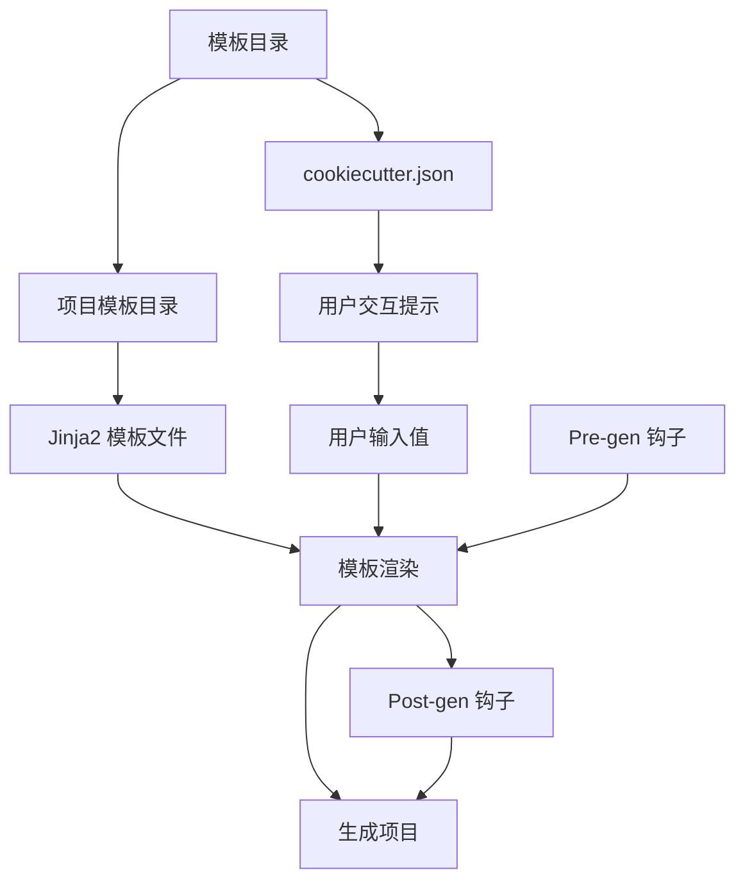

# Cookiecutter 文档

## 概述

Cookiecutter 是一个命令行工具，用于从 cookiecutter（项目模板）快速创建项目。它特别适合生成 Python 包项目等各种类型的项目。

## 基本信息

- **文档**: [官方文档](https://cookiecutter.readthedocs.io/)
- **GitHub**: [项目仓库](https://github.com/cookiecutter/cookiecutter)
- **PyPI**: [包管理页面](https://pypi.org/project/cookiecutter/)
- **许可证**: BSD 许可证

## 安装

推荐使用 pipx 安装 cookiecutter：

```bash
# 强烈推荐使用 pipx
pipx install cookiecutter

# 如果 pipx 不可用，可以安装到用户目录
python -m pip install --user cookiecutter
```

## 特性

- **跨平台**: 支持 Windows、Mac 和 Linux
- **用户友好**: 无需 Python 知识
- **多版本兼容**: 兼容 Python 3.7 到 3.12
- **多语言支持**: 可使用任何语言或标记格式的模板

## 快速开始

### 使用 GitHub 模板

```bash
# 系统会提示输入值
# 然后在当前工作目录创建 Python 包项目
# GitHub 仓库可以使用 'gh' 前缀简化
$ pipx run cookiecutter gh:audreyfeldroy/cookiecutter-pypackage
```

### 使用本地模板

```bash
$ pipx run cookiecutter cookiecutter-pypackage/
```

### 在 Python 中使用

```python
from cookiecutter.main import cookiecutter

# 从本地模板创建项目
cookiecutter('cookiecutter-pypackage/')

# 从 Git 仓库模板创建项目
cookiecutter('gh:audreyfeldroy/cookiecutter-pypackage.git')
```

## 工作原理



## 模板结构

### 输入结构

```
cookiecutter-something/
├── {{ cookiecutter.project_name }}/  ←── 项目模板
│   └── ...
├── blah.txt                          ←── 非模板化文件/目录
│                                         放在外面
│
└── cookiecutter.json                 ←── 提示和默认值
```

**必需组件:**
- `cookiecutter.json` 文件
- `{{ cookiecutter.project_name }}/` 目录（project_name 在 cookiecutter.json 中定义）

### 输出结构

```
mysomething/  ←── 对应于 project_name 提示输入的值
│
└── ...       ←── 对应于模板中 {{ cookiecutter.project_name }}/ 目录的文件
```

## 使用方法

### 1. 获取模板

```bash
$ git clone https://github.com/audreyfeldroy/cookiecutter-pypackage.git
```

### 2. 自定义模板

- 修改 `cookiecutter.json` 中定义的变量
- 根据需要调整骨架项目
- 创建自己的仓库并推送作为新的模板

### 3. 生成项目

```bash
$ cookiecutter cookiecutter-pypackage/
```

## 高级用法

### 直接使用 Git/Hg 仓库

```bash
# 使用 GitHub 简写
$ cookiecutter gh:audreyfeldroy/cookiecutter-pypackage

# 使用完整 URL
$ cookiecutter https://github.com/audreyfeldroy/cookiecutter-pypackage.git

# 使用 SSH
$ cookiecutter git+ssh://git@github.com/audreyfeldroy/cookiecutter-pypackage.git

# 使用 Mercurial
$ cookiecutter hg+ssh://hg@bitbucket.org/audreyr/cookiecutter-pypackage
```

### 指定分支

```bash
$ cookiecutter https://github.com/audreyfeldroy/cookiecutter-pypackage.git --checkout develop
```

### 私有仓库

```bash
# 明确指定仓库类型
$ cookiecutter hg+https://example.com/repo

# 使用本地服务器路径
$ cookiecutter file://server/folder/project.git
```

### 使用 Zip 文件

```bash
# 本地 Zip 文件
$ cookiecutter /path/to/template.zip

# 在线 Zip 文件
$ cookiecutter https://example.com/path/to/template.zip
```

#### 密码保护的 Zip 文件

- 交互式使用时会提示输入密码
- 自动化环境中可设置 `COOKIECUTTER_REPO_PASSWORD` 环境变量

## 模板组织

### 版本 0.7.0 及以后

- 生成的项目输出到当前目录
- 克隆的 cookiecutter 默认存储在 `~/.cookiecutters/` 目录
- 存储位置可配置（详见用户配置）

### 版本 0.7.0 之前

- 生成的项目输出到当前目录
- 克隆的 cookiecutter 不会本地保存

## 详细功能

### 用户功能

- 从本地或远程模板生成项目
- 通过 `cookiecutter.json` 提示自定义项目
- 支持预提示、生成前和生成后钩子

### 模板创建者功能

- 支持无限目录嵌套
- 使用 Jinja2 进行所有模板化需求
- 通过 `cookiecutter.json` 轻松定义模板变量

## 仓库简写

Cookiecutter 支持以下平台的简写：

| 平台 | 简写 | 示例 |
|------|------|------|
| GitHub | `gh:` | `gh:user/repo` |
| Bitbucket | `bb:` | `bb:user/repo` |
| GitLab | `gl:` | `gl:user/repo` |

