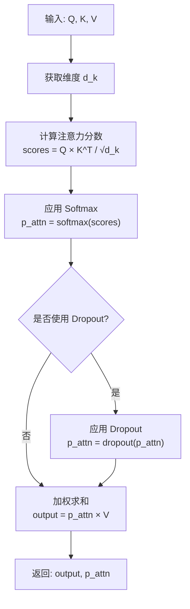
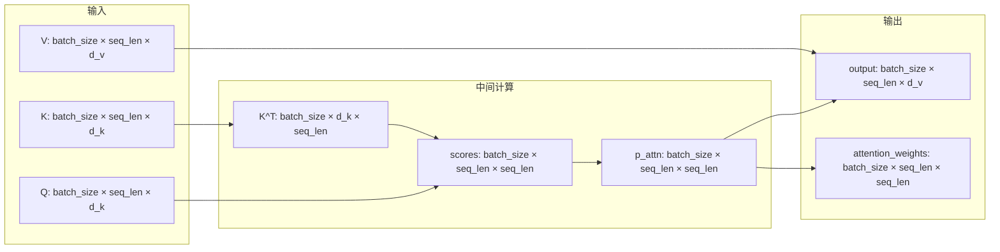
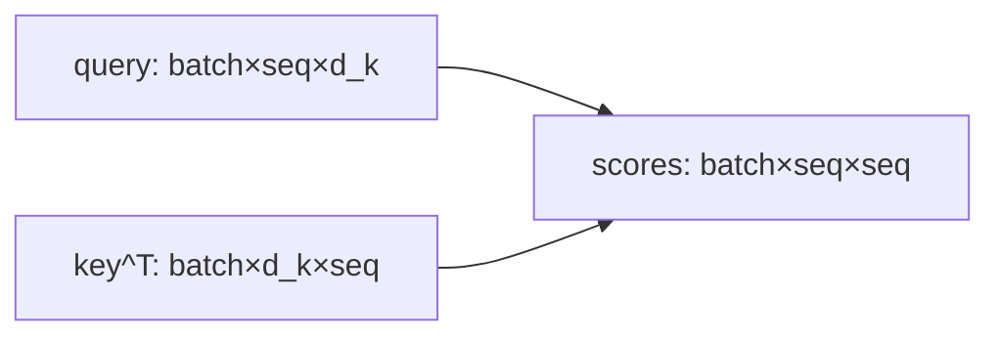
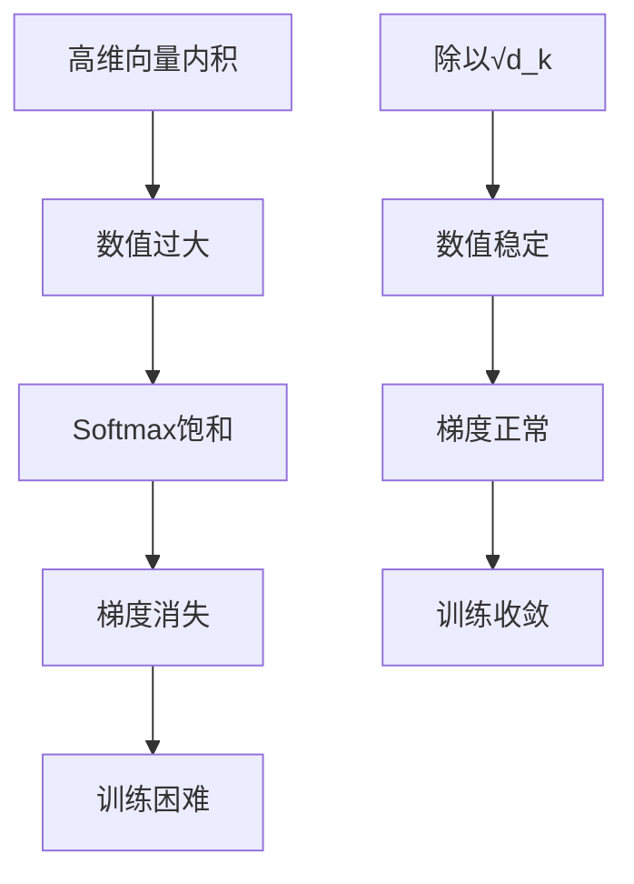
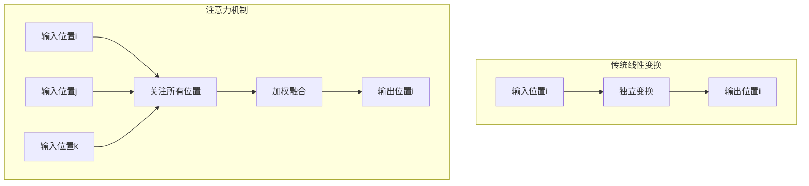
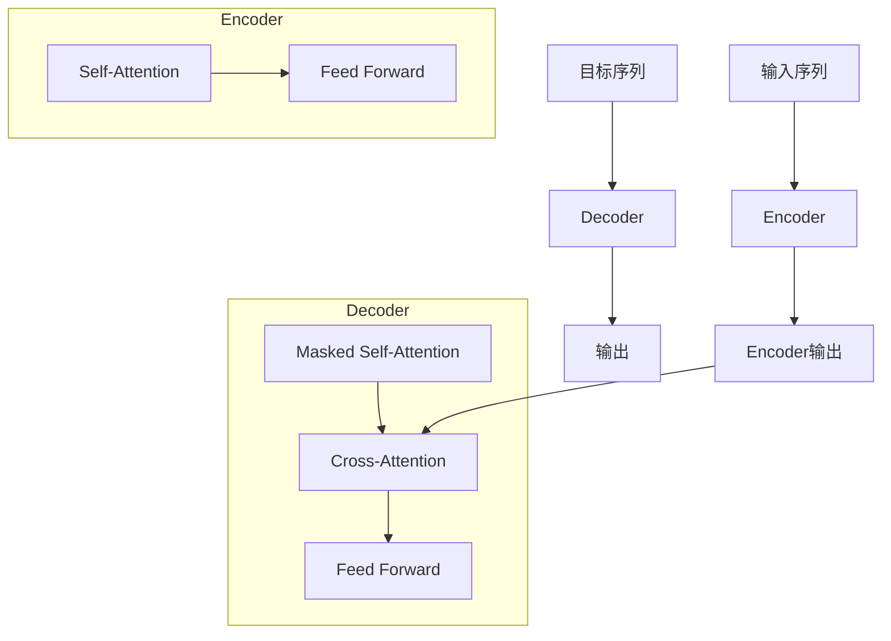
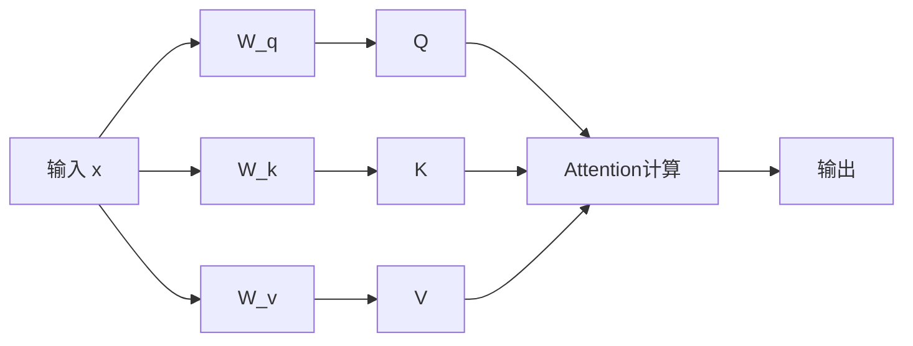
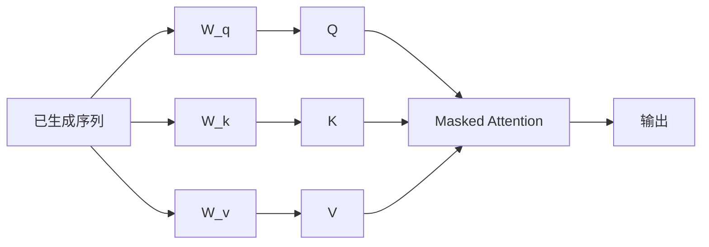
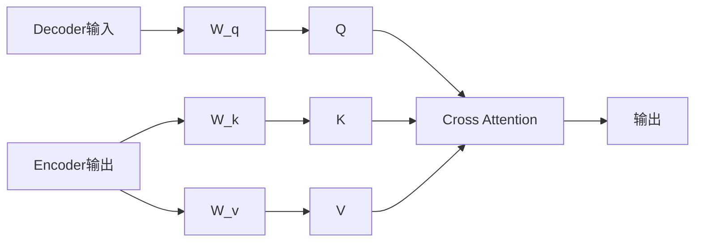
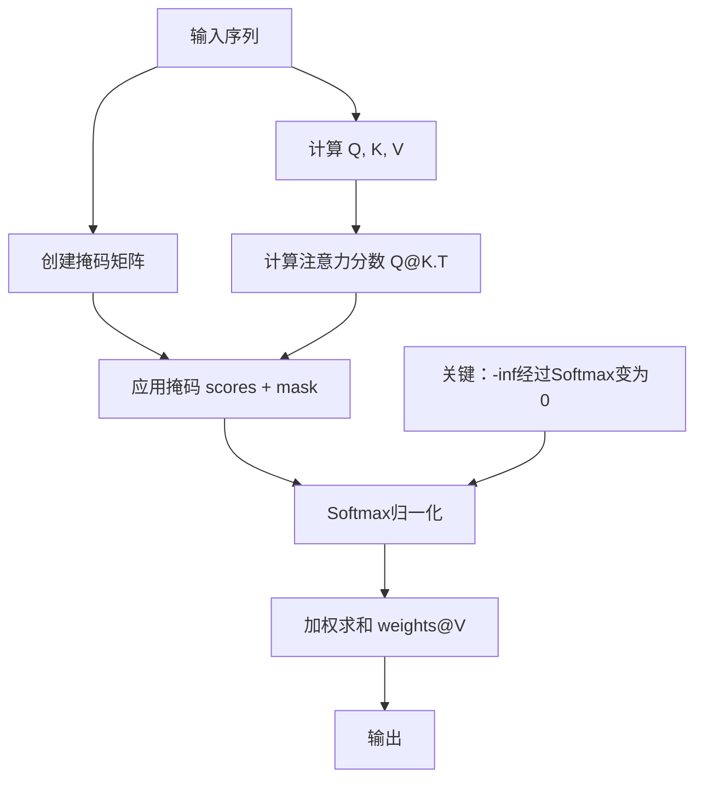

## 注意力机制的实现

注意力机制是 Transformer 架构的核心组件，它通过计算序列中每个位置与其他位置的相关性，实现了位置间的信息交互和融合。

### 核心算法

注意力机制的核心公式为：

$$\text{Attention}(Q, K, V) = \text{softmax}\left(\frac{QK^T}{\sqrt{d_k}}\right)V$$

其中：
- $Q$：查询矩阵 (Query)
- $K$：键矩阵 (Key)  
- $V$：值矩阵 (Value)
- $d_k$：键向量的维度

### 算法流程




###  数据流和形状变化



### 代码实现

```python
def attention(query, key, value, dropout=None):
    """
    缩放点积注意力机制
    
    Args:
        query: 查询值矩阵 [batch_size, seq_len, d_k]
        key: 键值矩阵 [batch_size, seq_len, d_k]
        value: 真值矩阵 [batch_size, seq_len, d_v]
        dropout: 可选的dropout层
    
    Returns:
        output: 注意力输出 [batch_size, seq_len, d_v]
        p_attn: 注意力权重 [batch_size, seq_len, seq_len]
    """
    # 获取键向量的维度
    d_k = query.size(-1) 
    
    # 计算Q与K的内积并除以根号dk
    scores = torch.matmul(query, key.transpose(-2, -1)) / math.sqrt(d_k)
    
    # 应用Softmax归一化
    p_attn = scores.softmax(dim=-1)
    
    # 可选的Dropout正则化
    if dropout is not None:
        p_attn = dropout(p_attn)
    
    # 根据注意力权重对value进行加权求和
    return torch.matmul(p_attn, value), p_attn
```

## # 详细步骤解析

#### 1. 维度获取
```python
d_k = query.size(-1)
```
- 获取查询向量的特征维度
- 用于后续的缩放计算

#### 2. 注意力分数计算
```python
scores = torch.matmul(query, key.transpose(-2, -1)) / math.sqrt(d_k)
```

**步骤分解：**
- `key.transpose(-2, -1)`：将键矩阵的最后两个维度转置
- `torch.matmul(query, key_transposed)`：计算每个query与每个key的内积
- `/ math.sqrt(d_k)`：缩放因子，防止softmax饱和

**形状变化：**


#### 3. Softmax归一化
```python
p_attn = scores.softmax(dim=-1)
```

- **目的**：将注意力分数转换为概率分布
- **dim=-1**：对每行进行归一化，确保每个query对所有key的注意力权重和为1
- **结果**：注意力权重矩阵，值域为[0,1]

#### 4. Dropout正则化
```python
if dropout is not None:
    p_attn = dropout(p_attn)
```

- **作用**：随机将部分注意力权重置零
- **目的**：防止过拟合，提高模型泛化能力
- **训练时**：随机屏蔽部分连接
- **推理时**：使用完整的注意力模式

#### 5. 加权求和
```python
return torch.matmul(p_attn, value), p_attn
```

- **计算**：注意力权重 × 值矩阵
- **含义**：每个位置的输出是所有位置value的加权平均
- **权重**：由注意力分数决定

### 关键概念解释

#### 缩放因子 √d_k 的作用



**数学原理：**
- 当向量维度为d_k时，内积的方差约为d_k
- 除以√d_k使方差归一化为1
- 保持softmax输入在合理范围内

### 注意力权重的含义

注意力权重矩阵 `p_attn[i, j]` 表示：
- 第i个位置对第j个位置的关注程度
- 值越大，表示关联性越强
- 每行和为1，形成概率分布

### 与传统线性变换的对比



**关键区别：**
- **传统方式**：每个位置独立处理
- **注意力方式**：每个位置都能感知和利用其他位置的信息

### 实际应用示例

假设处理句子："我 爱 编程 Python"

```python
# 输入形状：[1, 4, 64]
# 注意力权重可能如下：
attention_weights = [
    [0.1, 0.2, 0.3, 0.4],  # "我" 对各位置的注意力
    [0.2, 0.3, 0.4, 0.1],  # "爱" 对各位置的注意力
    [0.3, 0.4, 0.2, 0.1],  # "编程" 对各位置的注意力
    [0.4, 0.1, 0.2, 0.3]   # "Python" 对各位置的注意力
]

# 输出计算：
# "编程"的新表示 = 0.3×"我" + 0.4×"爱" + 0.2×"编程" + 0.1×"Python"
```


## 自注意力


**自注意力 是一个序列和自己计算**

| 类型    | Q来源 | K来源 | V来源 | 用途        |
| ----- | --- | --- | --- | --------- |
| 传统注意力 | 序列A | 序列B | 序列B | 建模两个序列间关系 |
| 自注意力  | 序列A | 序列A | 序列A | 建模序列内部关系  |

**transformer 中的注意力**




### encoder Self-Attn




**代码实现**：
```python
def encoder_self_attention(x):
    Q = x @ W_q  # 同一输入x
    K = x @ W_k  # 同一输入x
    V = x @ W_v  # 同一输入x
    
    return attention(Q, K, V)
```


### Decoder Self-Attention (Masked)



**特点**：只能看到当前位置之前的信息

### Decoder Cross-Attn


**代码实现**：
```python
def decoder_cross_attention(decoder_input, encoder_output):
    Q = decoder_input @ W_q      # 来自Decoder
    K = encoder_output @ W_k     # 来自Encoder
    V = encoder_output @ W_v     # 来自Encoder
    
    return attention(Q, K, V)
```

|                                   |                   |            |                         |
| --------------------------------- | ----------------- | ---------- | ----------------------- |
| 组件                                | 输入来源              | 作用         | 特点                      |
| **Encoder Self-Attention**        | 同一序列              | 理解输入序列内部关系 | 可以看到全部位置                |
| **Decoder Masked Self-Attention** | 已生成序列             | 利用历史生成信息   | 只能看到当前位置之前              |
| **Decoder Cross-Attention**       | Decoder + Encoder | 连接源序列和目标序列 | Q来自Decoder，K/V来自Encoder |
|                                   |                   |            |                         |

### masked attention

用来在训练的时候 并行计算. 

**代码**





```python
# 1. 创建掩码矩阵
def create_causal_mask(seq_len):
    # 创建上三角矩阵，上三角部分为-inf
    mask = torch.full((1, seq_len, seq_len), float("-inf"))
    mask = torch.triu(mask, diagonal=1)  # 保留上三角部分
    return mask

# 2. 应用掩码
def masked_attention(Q, K, V, mask):
    # 计算注意力分数
    scores = Q @ K.T / math.sqrt(Q.size(-1))
    
    # 应用掩码：上三角区域变为-inf
    scores = scores + mask
    
    # Softmax：-inf变为0，实现遮蔽
    attention_weights = F.softmax(scores, dim=-1)
    
    # 加权求和
    output = attention_weights @ V
    return output
```

例如对于序列 `[BOS] I like you [EOS]`，掩码矩阵为：

```
位置:  BOS  I   like you EOS
BOS  [  0  -∞   -∞  -∞  -∞ ]
I    [  0   0   -∞  -∞  -∞ ]
like [  0   0    0  -∞  -∞ ]
you  [  0   0    0   0  -∞ ]
EOS  [  0   0    0   0   0 ]
```

而为什么能用 `-inf`. `softmax` 转为概率的时候自动为 `0`

```python
# 演示Softmax如何处理-inf
import torch.nn.functional as F

scores = torch.tensor([
    [2.0, -float('inf'), -float('inf')],
    [1.0, 3.0, -float('inf')],
    [0.5, 2.0, 1.5]
])

attention_weights = F.softmax(scores, dim=-1)
print(attention_weights)
# 输出:
# [[1.0000, 0.0000, 0.0000],  # -inf变为0
#  [0.1192, 0.8808, 0.0000],  # -inf变为0
#  [0.0900, 0.6652, 0.2448]]  # 正常计算
```


## 多头注意力

### 组合矩阵内积

假设我们有：
- 输入维度：`dim = 512`
- 注意力头数：`n_heads = 8`
- 每个头的维度：`head_dim = 64`（512/8）

**多头注意力一般要保持维度**
1. **多视角需求**：需要足够的维度来支持多个不同的注意力头
2. **信息保持**：避免信息瓶颈，保持模型的表达能力
3. **并行计算**：便于GPU并行处理多个头
4. **实验验证**：Transformer论文证明这种设计效果更好

**朴素实现（效率低）：**
```python
# 需要为每个头单独创建参数矩阵
self.wq_head1 = nn.Linear(512, 64)  # 第1个头的Q矩阵
self.wq_head2 = nn.Linear(512, 64)  # 第2个头的Q矩阵
# ... 总共8个头，需要24个矩阵（8头×3种类型QKV）
```

**优化实现（效率高）：**
```python
# 只需要3个大矩阵
self.wq = nn.Linear(512, 8 * 64)  # 输出维度 = 512
self.wk = nn.Linear(512, 8 * 64)  # 输出维度 = 512  
self.wv = nn.Linear(512, 8 * 64)  # 输出维度 = 512
```

**数学上是等价的. 但是计算效率低，对比代码如下**:

```python
import torch

# 假设输入
x = torch.randn(2, 3, 4)  # [batch=2, seq=3, dim=4]
n_heads = 2
head_dim = 2

# 方法1：朴素实现 - 分别计算再拼接
W1 = torch.randn(4, 2)  # 第1个头的权重
W2 = torch.randn(4, 2)  # 第2个头的权重

result1_head1 = torch.matmul(x, W1)  # [2, 3, 2]
result1_head2 = torch.matmul(x, W2)  # [2, 3, 2]
result1 = torch.cat([result1_head1, result1_head2], dim=-1)  # [2, 3, 4]

# 方法2：优化实现 - 拼接权重再计算
W_combined = torch.cat([W1, W2], dim=-1)  # [4, 4] 拼接权重矩阵
result2 = torch.matmul(x, W_combined)  # [2, 3, 4]

print(torch.allclose(result1, result2))  # True - 结果完全相同！
```

**批处理的计算效率更高**
- 朴素方法：`[x·W1, x·W2]` （先算再拼）
- 优化方法：`x·[W1, W2]` （先拼再算）
- 由于矩阵乘法的分配律，两者结果完全相同


然后再通过 `view` 把计算的结果分割.

```python
import torch

# 假设参数
bsz, seqlen = 2, 3
n_heads = 4
head_dim = 2
dim = n_heads * head_dim  # 8

# 模拟经过线性层后的输出
xq = torch.randn(bsz, seqlen, dim)  # [2, 3, 8]
print("原始形状:", xq.shape)
print("原始数据:\n", xq)

# 关键的view操作 - 将最后一维分割成多头
xq_reshaped = xq.view(bsz, seqlen, n_heads, head_dim)  # [2, 3, 4, 2]
print("\nview后形状:", xq_reshaped.shape)
print("view后数据:\n", xq_reshaped)

# transpose操作 - 交换维度便于后续计算
xq_final = xq_reshaped.transpose(1, 2)  # [2, 4, 3, 2]
print("\ntranspose后形状:", xq_final.shape)
```

**维度变换的理解**

```python
# 让我们看看数据是如何被分割的
x = torch.arange(24).float().view(1, 3, 8)  # [1, 3, 8]
print("原始数据:")
print(x)
# tensor([[[0., 1., 2., 3., 4., 5., 6., 7.],
#          [8., 9., 10., 11., 12., 13., 14., 15.],
#          [16., 17., 18., 19., 20., 21., 22., 23.]]])

# view分割成4个头，每个头维度为2
x_heads = x.view(1, 3, 4, 2)
print("\n分割成4个头:")
print(x_heads)
# tensor([[[[0., 1.],      # 第1个头
#           [2., 3.],      # 第2个头  
#           [4., 5.],      # 第3个头
#           [6., 7.]],     # 第4个头
#          
#          [[8., 9.],      # 第1个头
#           [10., 11.],    # 第2个头
#           [12., 13.],    # 第3个头
#           [14., 15.]],   # 第4个头
#          
#          [[16., 17.],    # 第1个头
#           [18., 19.],    # 第2个头
#           [20., 21.],    # 第3个头
#           [22., 23.]]]])  # 第4个头

# transpose后，头维度移到前面
x_transposed = x_heads.transpose(1, 2)  # [1, 4, 3, 2]
print("\ntranspose后 - 每个头的数据:")
for i in range(4):
    print(f"头{i+1}:", x_transposed[0, i])
# 头1: tensor([[0., 1.], [8., 9.], [16., 17.]])
# 头2: tensor([[2., 3.], [10., 11.], [18., 19.]])
# 头3: tensor([[4., 5.], [12., 13.], [20., 21.]])
# 头4: tensor([[6., 7.], [14., 15.], [22., 23.]])
```

1. **view操作**：将连续的特征维度按头数分割
   - 原来：`[batch, seq, dim]`
   - 分割后：`[batch, seq, n_heads, head_dim]`

2. **transpose操作**：将头维度移到前面便于并行计算
   - 变换后：`[batch, n_heads, seq, head_dim]`
   - 这样每个头可以独立进行注意力计算

3. **计算便利性**：
   ```python
   # 注意力计算时，我们对最后两个维度进行矩阵乘法
   # scores = torch.matmul(xq, xk.transpose(2, 3))
   # 此时 xq: [batch, n_heads, seq, head_dim]
   # xk.transpose(2,3): [batch, n_heads, head_dim, seq]
   # 结果: [batch, n_heads, seq, seq] - 每个头的注意力矩阵
   ```

### 代码


```python
import torch.nn as nn
import torch

'''多头自注意力计算模块'''
class MultiHeadAttention(nn.Module):

    def __init__(self, args: ModelArgs, is_causal=False):
        # 构造函数
        # args: 配置对象
        super().__init__()
        # 隐藏层维度必须是头数的整数倍，因为后面我们会将输入拆成头数个矩阵
        assert args.dim % args.n_heads == 0
        # 模型并行处理大小，默认为1。
        model_parallel_size = 1
        # 本地计算头数，等于总头数除以模型并行处理大小。
        self.n_local_heads = args.n_heads // model_parallel_size
        # 每个头的维度，等于模型维度除以头的总数。
        self.head_dim = args.dim // args.n_heads

        # Wq, Wk, Wv 参数矩阵，每个参数矩阵为 n_embd x n_embd
        # 这里通过三个组合矩阵来代替了n个参数矩阵的组合，其逻辑在于矩阵内积再拼接其实等同于拼接矩阵再内积，
        # 不理解的读者可以自行模拟一下，每一个线性层其实相当于n个参数矩阵的拼接
        self.wq = nn.Linear(args.dim, args.n_heads * self.head_dim, bias=False)
        self.wk = nn.Linear(args.dim, args.n_heads * self.head_dim, bias=False)
        self.wv = nn.Linear(args.dim, args.n_heads * self.head_dim, bias=False)
        # 输出权重矩阵，维度为 dim x n_embd（head_dim = n_embeds / n_heads）
        self.wo = nn.Linear(args.n_heads * self.head_dim, args.dim, bias=False)
        # 注意力的 dropout
        self.attn_dropout = nn.Dropout(args.dropout)
        # 残差连接的 dropout
        self.resid_dropout = nn.Dropout(args.dropout)
         
        # 创建一个上三角矩阵，用于遮蔽未来信息
        # 注意，因为是多头注意力，Mask 矩阵比之前我们定义的多一个维度
        if is_causal:
           mask = torch.full((1, 1, args.max_seq_len, args.max_seq_len), float("-inf"))
           mask = torch.triu(mask, diagonal=1)
           # 注册为模型的缓冲区
           self.register_buffer("mask", mask)

    def forward(self, q: torch.Tensor, k: torch.Tensor, v: torch.Tensor):

        # 获取批次大小和序列长度，[batch_size, seq_len, dim]
        bsz, seqlen, _ = q.shape

        # 计算查询（Q）、键（K）、值（V）,输入通过参数矩阵层，维度为 (B, T, n_embed) x (n_embed, n_embed) -> (B, T, n_embed)
        xq, xk, xv = self.wq(q), self.wk(k), self.wv(v)

        # 将 Q、K、V 拆分成多头，维度为 (B, T, n_head, C // n_head)，然后交换维度，变成 (B, n_head, T, C // n_head)
        # 因为在注意力计算中我们是取了后两个维度参与计算
        # 为什么要先按B*T*n_head*C//n_head展开再互换1、2维度而不是直接按注意力输入展开，是因为view的展开方式是直接把输入全部排开，
        # 然后按要求构造，可以发现只有上述操作能够实现我们将每个头对应部分取出来的目标
        xq = xq.view(bsz, seqlen, self.n_local_heads, self.head_dim)
        xk = xk.view(bsz, seqlen, self.n_local_heads, self.head_dim)
        xv = xv.view(bsz, seqlen, self.n_local_heads, self.head_dim)
        xq = xq.transpose(1, 2)
        xk = xk.transpose(1, 2)
        xv = xv.transpose(1, 2)


        # 注意力计算
        # 计算 QK^T / sqrt(d_k)，维度为 (B, nh, T, hs) x (B, nh, hs, T) -> (B, nh, T, T)
        scores = torch.matmul(xq, xk.transpose(2, 3)) / math.sqrt(self.head_dim)
        # 掩码自注意力必须有注意力掩码
        if self.is_causal:
            assert hasattr(self, 'mask')
            # 这里截取到序列长度，因为有些序列可能比 max_seq_len 短
            scores = scores + self.mask[:, :, :seqlen, :seqlen]
        # 计算 softmax，维度为 (B, nh, T, T)
        scores = F.softmax(scores.float(), dim=-1).type_as(xq)
        # 做 Dropout
        scores = self.attn_dropout(scores)
        # V * Score，维度为(B, nh, T, T) x (B, nh, T, hs) -> (B, nh, T, hs)
        output = torch.matmul(scores, xv)

        # 恢复时间维度并合并头。
        # 将多头的结果拼接起来, 先交换维度为 (B, T, n_head, C // n_head)，再拼接成 (B, T, n_head * C // n_head)
        # contiguous 函数用于重新开辟一块新内存存储，因为Pytorch设置先transpose再view会报错，
        # 因为view直接基于底层存储得到，然而transpose并不会改变底层存储，因此需要额外存储
        output = output.transpose(1, 2).contiguous().view(bsz, seqlen, -1)

        # 最终投影回残差流。
        output = self.wo(output)
        output = self.resid_dropout(output)
        return output
```


**1 输入维度确认**

假设输入维度:
- `batch_size=10`
- `seq_len=6`
- `dim=512`
- `n_heads=8`

那么:
- `head_dim = 512 // 8 = 64`

**2.模型并行而非数据并行**

大模型在单个设备上无法处理.

```python
model_parallel_size = 1
self.n_local_heads = n_heads // model_parallel_size
```

- 当前的设备上应该负责哪些头


**3.xq 的维度变化**

```python
xq = self.xq(q)  # (10, 6, 512) -> (10, 6, 512)
xq = xq.view(bsz, seq_len self.n_local_heads, self.head_dim)  # (10, 6, 512) -> (10, 6, 8, 64)
xq = xq.transpose(1, 2) # (10, 6, 8, 64) -> (10, 8, 6, 64) 
```

- `(10, 6, 512) -> (10, 6, 8, 64)` : 将 512 降维分解为 8个头, 每头64维
- `(10, 6, 8, 64) -> (10, 8, 6, 64) ` : 将 `head` 的维度提前，用来 方便性能计算

**4. scores 的推理变化**

```python
# xq: (10, 8, 6, 64)
# xk: (10, 8, 6, 64)
scores = torch.matmul(xq, xk.transpose(-2, -1))  # (10, 8, 6, 64) × (10, 8, 64, 6) -> (10, 8, 6, 6)
scores = scores / math.sqrt(self.head_dim)        # (10, 8, 6, 6) 缩放
scores = scores + self.mask                       # (10, 8, 6, 6) 添加因果掩码
scores = F.softmax(scores, dim=-1)               # (10, 8, 6, 6) softmax归一化
```

**5. output 的维度变化**

```python
# scores: (10, 8, 6, 6)
# xv: (10, 8, 6, 64)
output = torch.matmul(scores, xv)                 # (10, 8, 6, 6) × (10, 8, 6, 64) -> (10, 8, 6, 64)
output = output.transpose(1, 2)                   # (10, 8, 6, 64) -> (10, 6, 8, 64)
output = output.contiguous().view(bsz, seqlen, -1) # (10, 8, 6, 64) -> (10, 8, 512)
output = self.wo(output)                          # (10, 8, 6, 64) -> (10, 8, 6, 64)
```


**6. 残差 dropout**


```python
self.attn_dropout = nn.Dropout(drop_out)    # 注意力权重的dropout
self.resid_dropout = nn.Dropout(drop_out)   # 残差连接的dropout
```


- `attn_dropout`: 是为了防止模型过度依赖位置信息
- `resid_dropout` : 则是为了防止 残差路径过拟合


```
输入: (4, 8, 512)
  ↓ Linear层
xq,xk,xv: (4, 8, 512)
  ↓ view + transpose  
xq,xk,xv: (4, 8, 8, 64)
  ↓ 注意力计算
scores: (4, 8, 8, 8)
  ↓ 与values相乘
output: (4, 8, 8, 64)
  ↓ transpose + view
output: (4, 8, 512)
  ↓ 输出投影
最终输出: (4, 8, 512)
```