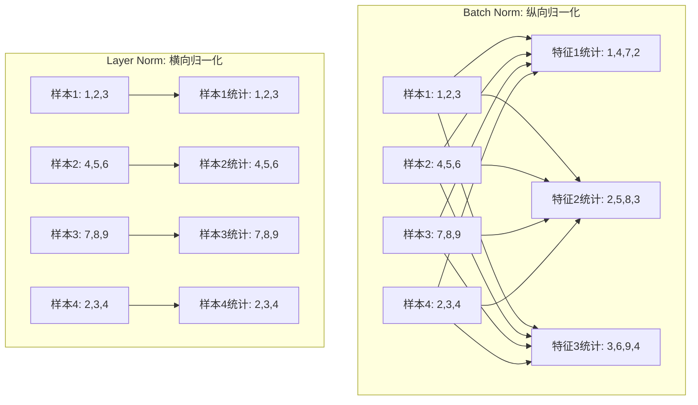
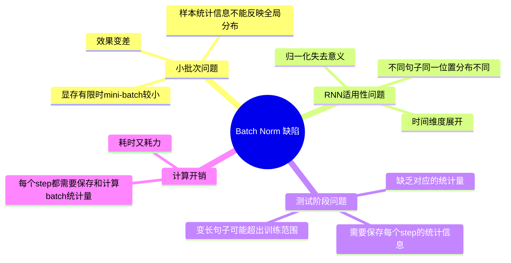
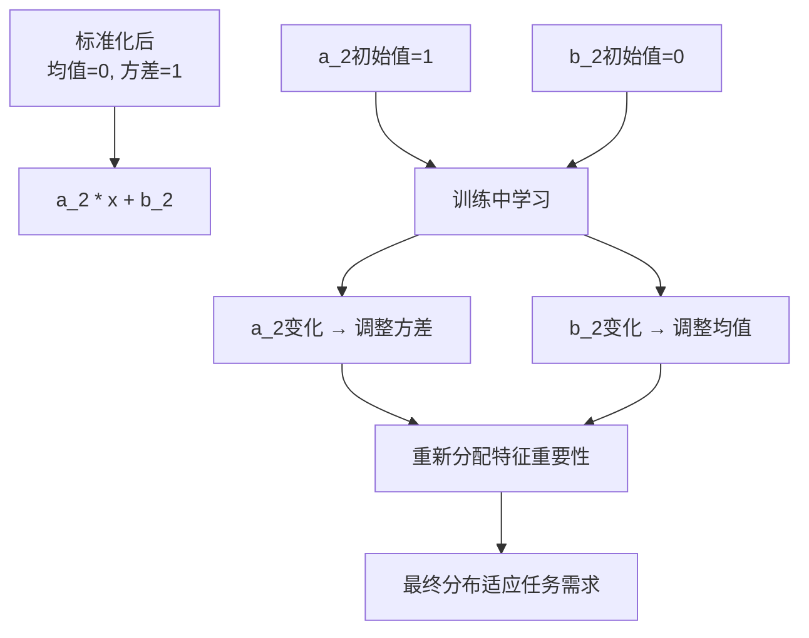
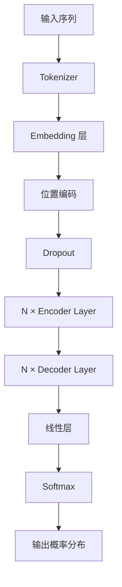

`transformer` 中用到的 常见网络: 多头 `Attention`, `FNN`

## Seq2Seq

### 1-FFN

```python
class MLP(nn.Module):
    def __init__(self, dim: int, hidden_dim: int, dropout: float):
        super().__init__()
        # 第一层：升维 (通常 dim → 4*dim)
        self.w1 = nn.Linear(dim, hidden_dim, bias=False)
        # 第二层：降维 (hidden_dim → dim)
        self.w2 = nn.Linear(hidden_dim, dim, bias=False)
        # Dropout 防止过拟合
        self.dropout = nn.Dropout(dropout)

    def forward(self, x):
        # 升维 → 激活 → 降维 → Dropout
        return self.dropout(self.w2(F.relu(self.w1(x))))
```

**关键特点：**
- **两层线性变换**：升维 → 降维
- **中间激活函数**：`ReLU`（引入非线性）
- **维度变化**：通常是 `dim → 4*dim → dim`
- **Dropout 正则化**：防止过拟合


标准的 `FNN`, 在 `w1` 把特征扩散到高维后 马上用 `Relu` 在高维度学习更复杂的特征


### 2-层归一化


归一化有用的逻辑是这样的， 预测的分布其实是相同的. 深度神经中 每一层都会改变 输出的值，我们为了保持 分布的稳定性，就引入了归一化.

层归一化（Layer Norm）是深度学习中经典的归一化操作，与批归一化（Batch Norm）并列为神经网络中的两种主流归一化方法。

归一化的核心目的是**让不同层输入的取值范围或分布保持一致**。在深度神经网络中：

- 每一层的输入都是上一层的输出
- 多层传递下，网络较高层的输入分布会因前面所有层的参数变化而发生较大改变
- 各层输出分布的差异随网络深度增大而增大
- 预测的条件分布始终相同，分布不一致造成预测误差

因此需要归一化操作，**将每一层的输入都归一化成标准分布**, 也就是在不改变分布形状的把 方差和期望都标准化, 1 和. 0 。


#### 计算方法

1. **计算样本均值：**
   $$\mu_j = \frac{1}{m}\sum_{i=1}^{m} Z_j^i$$

   其中：
   - $Z_j^i$ 是样本 i 在第 j 个维度上的值
   - m 是 mini-batch 的大小

2. **计算样本方差：**
   $$\sigma^2 = \frac{1}{m}\sum_{i=1}^{m} (Z_j^i - \mu_j)^2$$

3. **归一化变换：**
   $$\tilde{Z_j} = \frac{Z_j - \mu_j}{\sqrt{\sigma^2 + \epsilon}}$$

   其中 $\epsilon$ 是极小量，用于避免分母为0。


#### 归一化的维度不同

假设我们有一个形状为 `[batch_size=4, features=3]` 的张量：

```
样本1: [1.0, 2.0, 3.0]
样本2: [4.0, 5.0, 6.0]  
样本3: [7.0, 8.0, 9.0]
样本4: [2.0, 3.0, 4.0]
```

Batch Norm **对每个特征维度**，计算**所有样本**的均值和方差， 在 `Batch` 维度上归一：

```python
# 对第1个特征 [1.0, 4.0, 7.0, 2.0]
mean_feature1 = (1.0 + 4.0 + 7.0 + 2.0) / 4 = 3.5
var_feature1 = 计算这4个值的方差

# 对第2个特征 [2.0, 5.0, 8.0, 3.0]  
mean_feature2 = (2.0 + 5.0 + 8.0 + 3.0) / 4 = 4.5
var_feature2 = 计算这4个值的方差

# 对第3个特征 [3.0, 6.0, 9.0, 4.0]
mean_feature3 = (3.0 + 6.0 + 9.0 + 4.0) / 4 = 5.5
var_feature3 = 计算这4个值的方差
```


Layer Norm **对每个样本**，计算**所有特征**的均值和方差：


```python
# 对样本1 [1.0, 2.0, 3.0]
mean_sample1 = (1.0 + 2.0 + 3.0) / 3 = 2.0
var_sample1 = 计算这3个特征值的方差

# 对样本2 [4.0, 5.0, 6.0]
mean_sample2 = (4.0 + 5.0 + 6.0) / 3 = 5.0
var_sample2 = 计算这3个特征值的方差

# 对样本3 [7.0, 8.0, 9.0]
mean_sample3 = (7.0 + 8.0 + 9.0) / 3 = 8.0
var_sample3 = 计算这3个特征值的方差

# 对样本4 [2.0, 3.0, 4.0]
mean_sample4 = (2.0 + 3.0 + 4.0) / 3 = 3.0
var_sample4 = 计算这3个特征值的方差
```




#### 为什么 `Layer Norm` 更适合某些场景

- `Layer Norm`: 每个样本独立归一化，不依赖其他的样本
- 需要整个 `batch` 的信息，再归一化

在序列模型中, 不同位置的特征含义不同, 跨多个样本去统计没有什么意义. 如下: 

```python
# 句子1: "我 爱 北京"     -> [emb1, emb2, emb3]
# 句子2: "今天 天气 很好"  -> [emb4, emb5, emb6] 
# 句子3: "机器 学习"      -> [emb7, emb8, 0]

# Batch Norm会计算位置1的统计: [emb1, emb4, emb7] - 没有语义意义
# Layer Norm计算每个句子内部的统计 - 更合理
```




#### 代码实现

```python
import torch
import torch.nn as nn

# 输入: [batch_size=2, seq_len=3, hidden_dim=4]
x = torch.randn(2, 3, 4)

# Batch Norm: 在batch维度归一化
batch_norm = nn.BatchNorm1d(4)  # 对最后一个维度
# 需要reshape: [batch*seq, hidden] -> [6, 4]
x_bn = batch_norm(x.view(-1, 4)).view(2, 3, 4)

# Layer Norm: 在特征维度归一化  
layer_norm = nn.LayerNorm(4)    # 对最后一个维度
x_ln = layer_norm(x)  # 直接应用，每个样本独立归一化

print("原始形状:", x.shape)
print("Batch Norm后:", x_bn.shape) 
print("Layer Norm后:", x_ln.shape)
```


**关键点**：Layer Norm让每个样本的特征分布标准化，而不是让同一特征在不同样本间标准化。这在序列建模和小batch场景下更加稳定和有效。


#### 个性化恢复

```python

class LayerNorm(nn.Module):

    def __init__(self, features: int, eps=1e-6):
        """
        LayerNorm 类, 用于将输入的维度转换为隐藏维度, 再转换为输出维度
        """
        super(LayerNorm, self).__init__()
        self.a_2 = nn.Parameter(torch.ones(features))
        self.b_2 = nn.Parameter(torch.zeros(features))
        self.eps = eps

    def forward(self, x):
        # 在统计每个样本所有维度的值, 求均值和方差
        mean = x.mean(-1, keepdim=True)
        std = x.std(-1, keepdim=True)

        # 使用均值和方差来标准化输入
        # 在最后一个维度发生了广播
        return self.a_2 * (x - mean) / (std + self.eps) + self.b_2
```



1. **⁠****torch.ones(features****)**: 初始化a_2为1，表示初始时保持标准化的方差
2. **⁠****torch.zeros(features****)**: 初始化b_2为0，表示初始时保持标准化的均值
3. **训练过程中**: 这些参数会根据任务需求自动调整
4. **最终效果**: 每个特征都找到最适合的均值和方差


### 3-残差连接

`Transformer` 模型的层数还是很深的，为了防止模型退化， `Transformer` 采用了残差连接的思想来连接每一个子层, 残差的思想就是下一层的输入不仅仅包含了上一层的输出，还包含了上一层的输入.  


**传统网络**：
$$y = F(x)$$

**残差网络**：
$$y = x + F(x)$$

其中：
- $x$ 是输入
- $F(x)$ 是要学习的变换函数
- $y$ 是输出


#### Encoder 中的残差


**第一个子层（多头自注意力）**：
$$\text{SubLayer}_1(x) = x + \text{MultiHeadAttention}(\text{LayerNorm}(x))$$

**第二个子层（前馈网络）**：
$$\text{SubLayer}_2(h) = h + \text{FFN}(\text{LayerNorm}(h))$$

其中 $h = \text{SubLayer}_1(x)$


**完整的 encoder 块公式**


$$\begin{align}
h &= x + \text{MultiHeadAttention}(\text{LayerNorm}(x)) \\
\text{output} &= h + \text{FFN}(\text{LayerNorm}(h))
\end{align}$$


**代码如下**:

```python
class TransformerBlock(nn.Module):
    def __init__(self, d_model, n_heads, d_ff):
        super().__init__()
        self.attention = MultiHeadAttention(d_model, n_heads)
        self.feed_forward = FeedForward(d_model, d_ff)
        self.attention_norm = LayerNorm(d_model)
        self.fnn_norm = LayerNorm(d_model)
    
    def forward(self, x):
        # 第一个残差连接：注意力层
        # x: 原始输入
        # self.attention_norm(x): 标准化后的输入
        # self.attention.forward(...): 注意力计算结果
        h = x + self.attention.forward(self.attention_norm(x))
        
        # 第二个残差连接：前馈网络
        # h: 第一个残差连接的输出
        # self.fnn_norm(h): 标准化后的h
        # self.feed_forward.forward(...): 前馈网络结果
        out = h + self.feed_forward.forward(self.fnn_norm(h))
        
        return out
```

#### 残差有效的基本逻辑


**1. 梯度更加顺畅**

```python
# 不使用残差连接的梯度
def backward_without_residual():
    # 梯度需要通过所有层的复杂变换
    grad = dL/dy * df/dx * dg/dx * dh/dx * ...
    # 容易出现梯度消失（连乘很多小数）或梯度爆炸（连乘很多大数）

# 使用残差连接的梯度
def backward_with_residual():
    # y = x + f(x)
    # dy/dx = 1 + df/dx
    # 梯度至少有1这个直接通道，不会完全消失
    grad = dL/dy * (1 + df/dx)
```


**2. 恒等映射的保证**

```python
# 极端情况：如果f(x) = 0
# 传统网络：输出 = 0 (信息丢失)
# 残差网络：输出 = x + 0 = x (信息保持)

def demonstrate_identity():
    x = torch.randn(2, 4, 512)  # [batch, seq, d_model]
    
    # 如果注意力层输出全零
    attention_output = torch.zeros_like(x)
    
    # 传统方式：信息丢失
    traditional_output = attention_output
    print(f"传统输出均值: {traditional_output.mean()}")  # 接近0
    
    # 残差连接：信息保持
    residual_output = x + attention_output
    print(f"残差输出均值: {residual_output.mean()}")  # 保持原输入特征
```


## Encoder-Decoder


```python
class EncoderLayer(nn.Module):
    '''Encoder层'''
    def __init__(self, args):
        super().__init__()
        # 一个 Layer 中有两个 LayerNorm，分别在 Attention 之前和 MLP 之前
        self.attention_norm = LayerNorm(args.n_embd)
        # Encoder 不需要掩码，传入 is_causal=False
        self.attention = MultiHeadAttention(args, is_causal=False)
        self.fnn_norm = LayerNorm(args.n_embd)
        self.feed_forward = MLP(args)

    def forward(self, x):
        # Layer Norm
        norm_x = self.attention_norm(x)
        # 自注意力
        h = x + self.attention.forward(norm_x, norm_x, norm_x)
        # 经过前馈神经网络
        out = h + self.feed_forward.forward(self.fnn_norm(h))
        return out
```

```python
class Encoder(nn.Module):
    '''Encoder 块'''
    def __init__(self, args):
        super(Encoder, self).__init__() 
        # 一个 Encoder 由 N 个 Encoder Layer 组成
        self.layers = nn.ModuleList([EncoderLayer(args) for _ in range(args.n_layer)])
        self.norm = LayerNorm(args.n_embd)

    def forward(self, x):
        "分别通过 N 层 Encoder Layer"
        for layer in self.layers:
            x = layer(x)
        return self.norm(x)
```


类似的，我们也可以先搭建 Decoder Layer，再将 N 个 Decoder Layer 组装为 Decoder。但是和 Encoder 不同的是，Decoder 由两个注意力层和一个前馈神经网络组成：

1. **掩码自注意力层**：使用 Mask 的注意力计算，保证每一个 token 只能使用该 token 之前的注意力分数
2. **多头注意力层**：使用第一个注意力层的输出作为 query，使用 Encoder 的输出作为 key 和 value
3. **前馈神经网络**


```python
class DecoderLayer(nn.Module):
    '''解码层'''
    def __init__(self, args):
        super().__init__()
        # 一个 Layer 中有三个 LayerNorm，分别在 Mask Attention 之前、Self Attention 之前和 MLP 之前
        self.attention_norm_1 = LayerNorm(args.n_embd)
        # Decoder 的第一个部分是 Mask Attention，传入 is_causal=True
        self.mask_attention = MultiHeadAttention(args, is_causal=True)
        self.attention_norm_2 = LayerNorm(args.n_embd)
        # Decoder 的第二个部分是 类似于 Encoder 的 Attention，传入 is_causal=False
        self.attention = MultiHeadAttention(args, is_causal=False)
        self.ffn_norm = LayerNorm(args.n_embd)
        # 第三个部分是 MLP
        self.feed_forward = MLP(args)

    def forward(self, x, enc_out):
        # Layer Norm
        norm_x = self.attention_norm_1(x)
        # 掩码自注意力
        x = x + self.mask_attention.forward(norm_x, norm_x, norm_x)
        # 多头注意力
        norm_x = self.attention_norm_2(x)
        h = x + self.attention.forward(norm_x, enc_out, enc_out)
        # 经过前馈神经网络
        out = h + self.feed_forward.forward(self.ffn_norm(h))
        return out
```

```python
class Decoder(nn.Module):
    '''解码器'''
    def __init__(self, args):
        super(Decoder, self).__init__() 
        # 一个 Decoder 由 N 个 Decoder Layer 组成
        self.layers = nn.ModuleList([DecoderLayer(args) for _ in range(args.n_layer)])
        self.norm = LayerNorm(args.n_embd)

    def forward(self, x, enc_out):
        "Pass the input (and mask) through each layer in turn."
        for layer in self.layers:
            x = layer(x, enc_out)
        return self.norm(x)
```

在 NLP 任务中，我们需要将自然语言的输入转化为机器可以处理的向量。Embedding 层是一个存储固定大小的词典的嵌入向量查找表。

## Transformer

### Embedding 层

假设词表大小为 4，输入"我喜欢你"：

| 输入 | 输出 |
|------|------|
| 我   | 0    |
| 喜欢 | 1    |
| 你   | 2    |

Embedding 层输入形状：`(batch_size, seq_len, 1)`
Embedding 层输出形状：`(batch_size, seq_len, embedding_dim)`

```python
self.tok_embeddings = nn.Embedding(args.vocab_size, args.dim)
```


### 位置编码

注意力机制虽然可以实现良好的并行计算，但会导致序列中相对位置信息的丢失。为了保留序列中的相对位置信息，Transformer 采用了位置编码机制。


#### 位置编码公式

Transformer 使用正余弦函数进行位置编码（绝对位置编码 Sinusoidal）：

$$PE(pos,2i) = \sin(pos/10000^{2i/d_{model}})$$

$$PE(pos,2i+1) = \cos(pos/10000^{2i/d_{model}})$$

其中：
- `pos` 为 token 在句子中的位置
- `2i` 和 `2i+1` 指示了 token 是奇数位置还是偶数位置
- `d_model` 为模型维度

#### 位置编码示例

假设输入句子 "I like to code"，长度为 4，词向量维度为 4：

原始词向量矩阵：
$$x = \begin{bmatrix}
0.1 & 0.2 & 0.3 & 0.4 \\
0.2 & 0.3 & 0.4 & 0.5 \\
0.3 & 0.4 & 0.5 & 0.6 \\
0.4 & 0.5 & 0.6 & 0.7
\end{bmatrix}$$

位置编码矩阵：
$$PE = \begin{bmatrix}
\sin(0/10000^0) & \cos(0/10000^0) & \sin(0/10000^{2/4}) & \cos(0/10000^{2/4}) \\
\sin(1/10000^0) & \cos(1/10000^0) & \sin(1/10000^{2/4}) & \cos(1/10000^{2/4}) \\
\sin(2/10000^0) & \cos(2/10000^0) & \sin(2/10000^{2/4}) & \cos(2/10000^{2/4}) \\
\sin(3/10000^0) & \cos(3/10000^0) & \sin(3/10000^{2/4}) & \cos(3/10000^{2/4})
\end{bmatrix}$$

最终编码结果：$x_{PE} = x + PE$

#### 位置编码的优势

1. **适应性强**：能够适应比训练集更长的句子
2. **相对位置计算**：对于固定长度的间距 k，PE(pos+k) 可以用 PE(pos) 计算得到

#### 数学推导

通过严谨的数学推导，我们可以证明该编码方式的优越性。

原始 Transformer Embedding 的问题：
$$f(\cdots, x_m, \cdots, x_n, \cdots) = f(\cdots, x_n, \cdots, x_m, \cdots)$$

这样的函数不具有不对称性，无法表征相对位置信息。

我们希望得到：
$$\tilde{f}(\cdots, x_m, \cdots, x_n, \cdots) = f(\cdots, x_m + p_m, \cdots, x_n + p_n, \cdots)$$

通过复数运算和泰勒展开，最终得到位置编码的解：

$$p_m = \begin{pmatrix}
\cos m\theta_0 \\
\sin m\theta_0 \\
\cos m\theta_1 \\
\sin m\theta_1 \\
\vdots \\
\cos m\theta_{d/2-1} \\
\sin m\theta_{d/2-1}
\end{pmatrix}$$

其中 $\theta_i = 10000^{-2i/d}$

#### 位置编码实现

```python
class PositionalEncoding(nn.Module):
    '''位置编码模块'''

    def __init__(self, args):
        super(PositionalEncoding, self).__init__()
        # Dropout 层
        self.dropout = nn.Dropout(p=args.dropout)

        # block size 是序列的最大长度
        pe = torch.zeros(args.block_size, args.n_embd)
        position = torch.arange(0, args.block_size).unsqueeze(1)
        # 计算 theta
        div_term = torch.exp(
            torch.arange(0, args.n_embd, 2) * -(math.log(10000.0) / args.n_embd)
        )
        # 分别计算 sin、cos 结果
        pe[:, 0::2] = torch.sin(position * div_term)
        pe[:, 1::2] = torch.cos(position * div_term)
        pe = pe.unsqueeze(0)
        self.register_buffer("pe", pe)

    def forward(self, x):
        # 将位置编码加到 Embedding 结果上
        x = x + self.pe[:, : x.size(1)].requires_grad_(False)
        return self.dropout(x)
```


### 完整 Transformer 模型

#### 模型架构



#### 完整实现

```python
class Transformer(nn.Module):
    '''整体模型'''
    def __init__(self, args):
        super().__init__()
        # 必须输入词表大小和 block size
        assert args.vocab_size is not None
        assert args.block_size is not None
        self.args = args
        self.transformer = nn.ModuleDict(dict(
            wte = nn.Embedding(args.vocab_size, args.n_embd),
            wpe = PositionalEncoding(args),
            drop = nn.Dropout(args.dropout),
            encoder = Encoder(args),
            decoder = Decoder(args),
        ))
        # 最后的线性层，输入是 n_embd，输出是词表大小
        self.lm_head = nn.Linear(args.n_embd, args.vocab_size, bias=False)

        # 初始化所有的权重
        self.apply(self._init_weights)

        # 查看所有参数的数量
        print("number of parameters: %.2fM" % (self.get_num_params()/1e6,))

    def get_num_params(self, non_embedding=False):
        '''统计所有参数的数量'''
        n_params = sum(p.numel() for p in self.parameters())
        if non_embedding:
            n_params -= self.transformer.wpe.weight.numel()
        return n_params

    def _init_weights(self, module):
        '''初始化权重'''
        if isinstance(module, nn.Linear):
            torch.nn.init.normal_(module.weight, mean=0.0, std=0.02)
            if module.bias is not None:
                torch.nn.init.zeros_(module.bias)
        elif isinstance(module, nn.Embedding):
            torch.nn.init.normal_(module.weight, mean=0.0, std=0.02)
    
    def forward(self, idx, targets=None):
        '''前向计算函数'''
        device = idx.device
        b, t = idx.size()
        assert t <= self.args.block_size, f"不能计算该序列，该序列长度为 {t}, 最大序列长度只有 {self.args.block_size}"

        # 通过 Embedding 层
        tok_emb = self.transformer.wte(idx)
        # 然后通过位置编码
        pos_emb = self.transformer.wpe(tok_emb) 
        # 再进行 Dropout
        x = self.transformer.drop(pos_emb)
        # 然后通过 Encoder
        enc_out = self.transformer.encoder(x)
        # 再通过 Decoder
        x = self.transformer.decoder(x, enc_out)

        if targets is not None:
            # 训练阶段，计算 loss
            logits = self.lm_head(x)
            loss = F.cross_entropy(logits.view(-1, logits.size(-1)), targets.view(-1), ignore_index=-1)
        else:
            # 推理阶段，只需要 logits
            logits = self.lm_head(x[:, [-1], :])
            loss = None

        return logits, loss
```


**Pre-Norm vs Post-Norm**

- **Post-Norm**：LayerNorm 放在 Attention 层后面（原论文配图）
- **Pre-Norm**：LayerNorm 放在 Attention 层前面（实际源代码实现）

目前 LLM 一般采用 "Pre-Norm" 结构，因为可以使 loss 更稳定。

**模型组件总结**

| 组件 | 功能 | 关键参数 |
|------|------|----------|
| Embedding | 将 token 转换为向量 | vocab_size, n_embd |
| 位置编码 | 添加位置信息 | block_size, n_embd |
| Encoder | 编码输入序列 | n_layer, n_head |
| Decoder | 生成输出序列 | n_layer, n_head |
| 线性层 | 输出概率分布 | n_embd, vocab_size |

通过上述步骤，我们就可以从零"手搓"一个完整的、可计算的 Transformer 模型。
