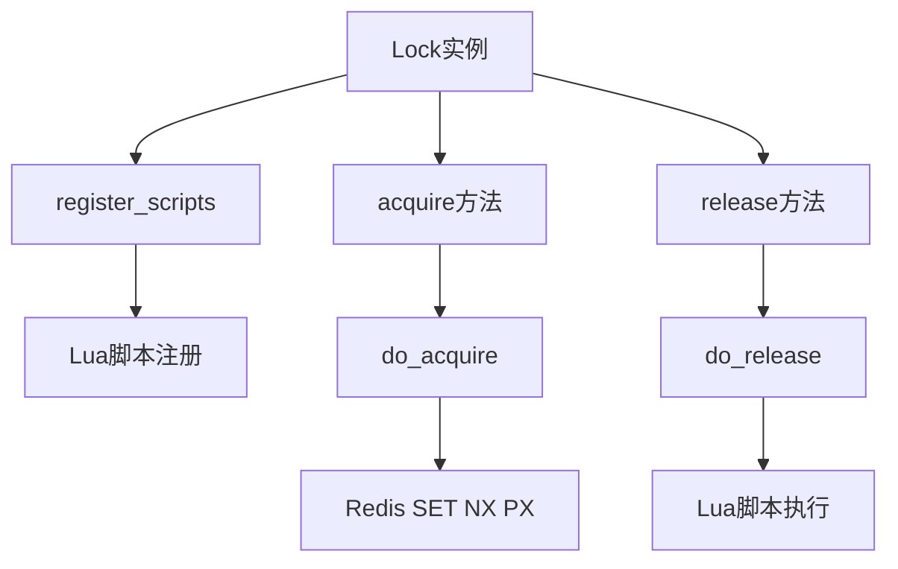
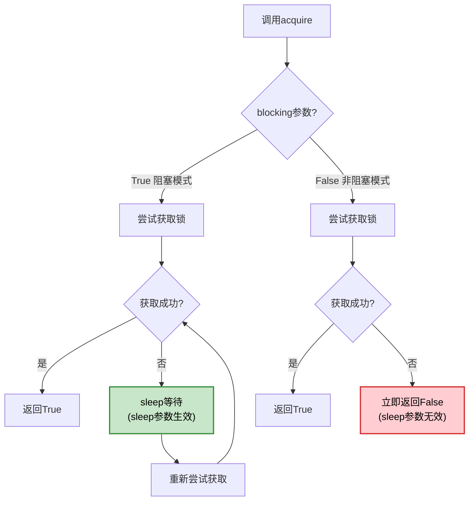

# Redis Asyncio Lock 完全指南

## 概述

Redis Asyncio Lock 是 redis-py 4.x+ 版本提供的异步分布式锁实现，专为 asyncio 应用设计。它允许在分布式环境中实现跨进程、跨机器的资源同步访问控制。

## 基础用法

### 导入和初始化

```python
import asyncio
import redis.asyncio as redis
from redis.asyncio.lock import Lock

# 创建异步 Redis 客户端
redis_client = redis.Redis(host='localhost', port=6379, db=0)

# 创建锁实例
lock = Lock(redis_client, "my_resource_lock", timeout=30)
```

### 上下文管理器用法（推荐）

```python
async def context_manager_example():
    async with Lock(redis_client, "resource_lock", timeout=10) as lock:
        print("获得锁，开始处理资源")
        await asyncio.sleep(2)  # 模拟异步工作
        print("资源处理完成")
    # 锁自动释放
```

### 手动获取和释放

```python
async def manual_lock_example():
    lock = Lock(redis_client, "manual_lock", timeout=15)
    
    if await lock.acquire(blocking=True, blocking_timeout=5):
        try:
            print("手动获取锁成功")
            await process_resource()
        finally:
            await lock.release()
    else:
        print("获取锁失败")
```

## 构造函数参数详解

```python
Lock(
    redis: Union["Redis", "RedisCluster"],
    name: Union[str, bytes, memoryview],
    timeout: Optional[float] = None,
    sleep: float = 0.1,
    blocking: bool = True,
    blocking_timeout: Optional[Number] = None,
    thread_local: bool = True,
    raise_on_release_error: bool = True,
)
```

### 核心参数

| 参数 | 类型 | 默认值 | 说明 |
|------|------|--------|------|
| `redis` | Redis/RedisCluster | 必需 | Redis 客户端实例，支持单机和集群模式 |
| `name` | str/bytes/memoryview | 必需 | 锁的唯一标识符，相同名称的锁互斥 |
| `timeout` | float/None | None | 锁的最大生存时间（秒），None 表示永不过期 |

### 行为控制参数

| 参数 | 类型 | 默认值 | 说明 |
|------|------|--------|------|
| `sleep` | float | 0.1 | **仅在阻塞模式下生效**：重试间隔时间（秒） |
| `blocking` | bool | True | 是否阻塞等待锁，False 时立即返回结果 |
| `blocking_timeout` | float/None | None | 阻塞等待的最大时间（秒），None 表示无限等待 |

> ⚠️ **重要提示**：当 `blocking=False` 时，`sleep` 参数不会生效，因为非阻塞模式下获取失败会立即返回，不会进入重试循环。

### 高级参数

| 参数 | 类型 | 默认值 | 说明 |
|------|------|--------|------|
| `thread_local` | bool | True | 是否使用线程本地存储保存 token |
| `raise_on_release_error` | bool | True | 退出上下文管理器时是否抛出释放错误异常 |

### 参数使用示例

```python
# ✅ 快速失败的锁（正确配置）
quick_lock = Lock(
    redis_client, 
    "quick_lock", 
    timeout=5,           # 5秒后自动过期
    blocking=False,      # 不阻塞，立即返回
    # sleep 参数在此无效，可省略
)

# ✅ 阻塞重试的锁（正确配置）
patient_lock = Lock(
    redis_client,
    "patient_lock",
    timeout=60,          # 60秒后过期
    blocking=True,       # 阻塞等待
    blocking_timeout=30, # 最多等待30秒
    sleep=0.2           # 每200ms重试一次（仅在blocking=True时生效）
)

# ✅ 跨线程共享的锁
shared_lock = Lock(
    redis_client,
    "shared_lock",
    thread_local=False,  # 禁用线程本地存储
    raise_on_release_error=False  # 释放错误时不抛异常
)
```

### 参数配置最佳实践

```python
# ❌ 错误：blocking=False时设置sleep参数（无效）
wrong_lock = Lock(
    redis_client, 
    "wrong_lock", 
    blocking=False, 
    sleep=0.1  # 这个参数不会生效
)

# ✅ 正确：参数配置与使用场景一致
non_blocking_lock = Lock(redis_client, "quick", blocking=False)
blocking_lock = Lock(redis_client, "patient", blocking=True, sleep=0.1)
```

## 核心方法详解

### acquire() 方法

```python
async def acquire(
    self,
    blocking: Optional[bool] = None,
    blocking_timeout: Optional[Number] = None,
    token: Optional[Union[str, bytes]] = None,
) -> bool
```

**参数说明**：
- `blocking`: 覆盖构造函数中的 blocking 设置
- `blocking_timeout`: 覆盖构造函数中的 blocking_timeout 设置  
- `token`: 自定义锁标识符，默认使用 UUID

**返回值**：成功获取锁返回 `True`，否则返回 `False`

**运行时参数覆盖**：
```python
# 构造时设置为阻塞模式
lock = Lock(redis_client, "flexible_lock", blocking=True, sleep=0.1)

# 运行时改为非阻塞模式
if await lock.acquire(blocking=False):  # 覆盖构造函数的blocking=True
    # sleep=0.1在这次调用中不会生效
    pass
```

### 状态检查方法

```python
# 检查锁是否被任何进程持有
is_locked = await lock.locked()

# 检查锁是否被当前实例持有
is_owned = await lock.owned()
```

### 锁管理方法

```python
# 释放锁
await lock.release()

# 延长锁时间
await lock.extend(additional_time=10, replace_ttl=False)

# 重置锁的TTL
await lock.reacquire()
```

## 最佳实践

### 1. 使用上下文管理器

```python
# ✅ 推荐：自动处理锁的获取和释放
async def recommended_usage():
    try:
        async with Lock(redis_client, "resource", timeout=30) as lock:
            await process_critical_section()
    except LockError:
        await handle_lock_failure()
```

### 2. 根据场景选择阻塞模式

```python
# ✅ 高并发场景：使用非阻塞模式
async def high_concurrency_pattern():
    lock = Lock(redis_client, "hot_resource", blocking=False, timeout=10)
    
    if await lock.acquire():
        try:
            await process_quickly()
        finally:
            await lock.release()
    else:
        # 立即处理获取失败的情况
        await handle_busy_resource()

# ✅ 关键任务场景：使用阻塞模式
async def critical_task_pattern():
    lock = Lock(
        redis_client, 
        "critical_resource", 
        blocking=True,
        blocking_timeout=30,
        sleep=0.1,  # 100ms重试间隔
        timeout=300
    )
    
    if await lock.acquire():
        try:
            await critical_operation()
        finally:
            await lock.release()
    else:
        raise Exception("无法获取关键资源锁")
```

### 3. 合理设置超时时间

```python
# ✅ 根据业务需求设置合适的超时
async def timeout_best_practice():
    # 短任务：设置较短超时，避免死锁
    async with Lock(redis_client, "quick_task", timeout=5) as lock:
        await quick_operation()
    
    # 长任务：设置较长超时，必要时延期
    lock = Lock(redis_client, "long_task", timeout=60)
    async with lock:
        await long_operation_part1()
        
        # 如果需要更多时间
        if need_more_time():
            await lock.extend(30)  # 延长30秒
            
        await long_operation_part2()
```

### 4. 错误处理策略

```python
async def error_handling_best_practice():
    lock = Lock(
        redis_client, 
        "safe_lock", 
        timeout=20,
        blocking_timeout=5,
        raise_on_release_error=False  # 避免释放时的异常
    )
    
    try:
        if await lock.acquire():
            await risky_operation()
        else:
            # 获取锁失败的处理
            await handle_lock_acquisition_failure()
            
    except Exception as e:
        logger.error(f"业务逻辑错误: {e}")
        # 锁会在上下文管理器中自动释放
        
    finally:
        # 确保资源清理
        await cleanup_resources()
```

### 5. 分布式任务协调

```python
async def distributed_task_coordination():
    """多个服务实例协调执行任务"""
    
    # 使用有意义的锁名称
    task_lock = Lock(
        redis_client,
        f"task:process_orders:{date.today()}",
        timeout=300,  # 5分钟超时
        blocking=True,
        blocking_timeout=60,  # 最多等待1分钟
        sleep=1  # 1秒重试间隔
    )
    
    try:
        async with task_lock:
            logger.info("开始处理今日订单")
            
            # 长时间任务，定期检查和延期
            async for batch in order_batches():
                await process_order_batch(batch)
                
                # 每处理一批就延长锁时间
                if batch.is_last_in_group():
                    await task_lock.extend(60)  # 延长1分钟
                    
    except LockError:
        logger.warning("其他实例正在处理订单，跳过")
```

## 源码原理分析

### 核心架构



### 1. 异步获取锁机制与阻塞模式分析

```python
async def acquire(self, blocking=None, blocking_timeout=None, token=None):
    # 生成唯一token
    if token is None:
        token = uuid.uuid1().hex.encode()
    else:
        # 处理编码器兼容性
        try:
            encoder = self.redis.connection_pool.get_encoder()
        except AttributeError:
            encoder = self.redis.get_encoder()  # Redis Cluster
        token = encoder.encode(token)
    
    # 计算超时时间点
    stop_trying_at = None
    if blocking_timeout is not None:
        stop_trying_at = asyncio.get_running_loop().time() + blocking_timeout
    
    # 核心循环：阻塞与非阻塞的关键区别
    while True:
        if await self.do_acquire(token):
            self.local.token = token  # 保存到线程本地存储
            return True
        
        # 🔑 关键判断：非阻塞模式直接返回
        if not blocking:
            return False  # 立即返回，不会执行后面的sleep
            
        # ⚠️ 只有在blocking=True时才会执行到这里
        # 这就是为什么blocking=False时sleep参数无效的原因
        next_try_at = asyncio.get_running_loop().time() + sleep
        if stop_trying_at is not None and next_try_at > stop_trying_at:
            return False
        await asyncio.sleep(sleep)  # blocking=False时永远不会执行这行
```

### 阻塞模式执行流程对比



**关键点分析**：

1. **Token生成与编码**：
   - 使用UUID确保唯一性，避免误释放其他客户端的锁
   - 兼容Redis单机和集群模式的不同编码器获取方式

2. **时间管理**：
   - 使用`asyncio.get_running_loop().time()`获取高精度时间
   - 避免系统时钟跳跃问题

3. **阻塞模式的核心逻辑**：
   ```python
   # 非阻塞模式：获取失败立即返回
   if not blocking:
       return False  # sleep参数在此处被跳过
   
   # 阻塞模式：进入重试循环
   await asyncio.sleep(sleep)  # sleep参数在此处生效
   ```

4. **异步睡眠的重要性**：
   - `await asyncio.sleep()`让出控制权，保持事件循环响应性
   - 避免阻塞其他协程的执行

### 2. 原子锁获取

```python
async def do_acquire(self, token: Union[str, bytes]) -> bool:
    if self.timeout:
        timeout = int(self.timeout * 1000)  # 转换为毫秒
    else:
        timeout = None
    
    # 使用Redis SET命令的原子性
    # NX: 只有键不存在时才设置
    # PX: 设置过期时间（毫秒）
    if await self.redis.set(self.name, token, nx=True, px=timeout):
        return True
    return False
```

**原子性保证**：
- `SET key value NX PX milliseconds` 是Redis的原子操作
- 要么完全成功（设置键值和过期时间），要么完全失败
- 避免了竞态条件

### 3. Lua脚本确保安全释放

```python
# 释放锁的Lua脚本
LUA_RELEASE_SCRIPT = """
    local token = redis.call('get', KEYS[1])
    if not token or token ~= ARGV[1] then
        return 0  -- 锁不存在或不属于当前客户端
    end
    redis.call('del', KEYS[1])
    return 1  -- 成功释放
"""

async def do_release(self, expected_token: bytes) -> None:
    if not bool(await self.lua_release(
        keys=[self.name], 
        args=[expected_token], 
        client=self.redis
    )):
        raise LockNotOwnedError("Cannot release a lock that's no longer owned")
```

**安全性分析**：
1. **所有权验证**：只有持有正确token的客户端才能释放锁
2. **原子操作**：检查和删除在单个Lua脚本中完成，避免竞态条件
3. **错误处理**：明确区分锁不存在和锁被其他客户端持有的情况

### 4. 锁延期机制

```python
LUA_EXTEND_SCRIPT = """
    local token = redis.call('get', KEYS[1])
    if not token or token ~= ARGV[1] then
        return 0
    end
    local expiration = redis.call('pttl', KEYS[1])
    if expiration < 0 then
        return 0  -- 锁已过期
    end

    local newttl = ARGV[2]
    if ARGV[3] == "0" then
        newttl = ARGV[2] + expiration  -- 增加时间
    end
    redis.call('pexpire', KEYS[1], newttl)
    return 1
"""
```

**延期逻辑**：
1. 验证锁的所有权
2. 检查锁是否已过期
3. 根据`replace_ttl`参数决定是增加时间还是替换TTL
4. 原子性地更新过期时间

### 5. 线程本地存储机制

```python
def __init__(self, ...):
    self.thread_local = bool(thread_local)
    self.local = threading.local() if self.thread_local else SimpleNamespace()
    self.local.token = None
```

**设计考虑**：
- **默认启用**：防止不同线程间的token混淆
- **可选禁用**：支持跨线程传递锁实例的场景
- **asyncio兼容**：在单线程事件循环中仍然有效

### 6. 异步上下文管理器

```python
async def __aenter__(self):
    if await self.acquire():
        return self
    raise LockError("Unable to acquire lock within the time specified")

async def __aexit__(self, exc_type, exc_value, traceback):
    try:
        await self.release()
    except LockError:
        if self.raise_on_release_error:
            raise
        logger.warning("Lock was unlocked when exiting context manager.")
```

**异常处理策略**：
- **获取失败**：立即抛出异常，阻止进入上下文
- **释放失败**：根据配置决定是否抛出异常，提供灵活的错误处理

## 性能特性

### 1. 脚本缓存优化

```python
def register_scripts(self):
    cls = self.__class__
    client = self.redis
    # 类级别缓存，所有实例共享
    if cls.lua_release is None:
        cls.lua_release = client.register_script(cls.LUA_RELEASE_SCRIPT)
```

**优化效果**：
- 避免重复注册相同的Lua脚本
- 减少网络传输和Redis服务器的脚本编译开销

### 2. 高精度时间管理

```python
# 使用事件循环时间，避免系统调用开销
stop_trying_at = asyncio.get_running_loop().time() + blocking_timeout
```

### 3. 网络往返优化

所有关键操作（获取、释放、延期）都通过单次Redis命令或Lua脚本完成，最小化网络延迟影响。

## 常见误区与注意事项

### 1. sleep 参数的有效性

```python
# ❌ 常见误区：认为sleep在所有情况下都生效
misunderstood_lock = Lock(
    redis_client, 
    "lock", 
    blocking=False,  # 非阻塞模式
    sleep=0.1       # 此参数无效！
)

# ✅ 正确理解：sleep只在阻塞模式下生效
correct_blocking_lock = Lock(
    redis_client,
    "lock",
    blocking=True,   # 阻塞模式
    sleep=0.1       # 此参数有效
)

correct_non_blocking_lock = Lock(
    redis_client,
    "lock", 
    blocking=False  # 非阻塞模式，无需设置sleep
)
```

### 2. 运行时参数覆盖的影响

```python
# 构造时的参数可能被运行时参数覆盖
lock = Lock(redis_client, "lock", blocking=True, sleep=0.5)

# 这次调用中，sleep=0.5不会生效，因为blocking被覆盖为False
await lock.acquire(blocking=False)
```

### 3. 阻塞超时与锁超时的区别

```python
lock = Lock(
    redis_client,
    "lock",
    timeout=60,          # 锁在Redis中的生存时间
    blocking_timeout=10  # 客户端等待获取锁的最大时间
)
```

## 总结

Redis Asyncio Lock 通过以下机制实现了高效、安全的分布式锁：

1. **异步非阻塞**：完全兼容asyncio生态，不阻塞事件循环
2. **智能阻塞控制**：`blocking` 参数决定了 `sleep` 参数是否生效
3. **原子性操作**：利用Redis命令和Lua脚本保证操作的原子性
4. **安全性保证**：通过token机制防止误释放，支持所有权验证
5. **灵活配置**：丰富的参数支持各种使用场景
6. **错误处理**：完善的异常处理机制，支持优雅降级
7. **性能优化**：脚本缓存、高精度计时等优化措施

理解 `blocking` 和 `sleep` 参数的关系是正确使用这个锁的关键，这确保了在不同场景下都能获得最佳的性能表现。

