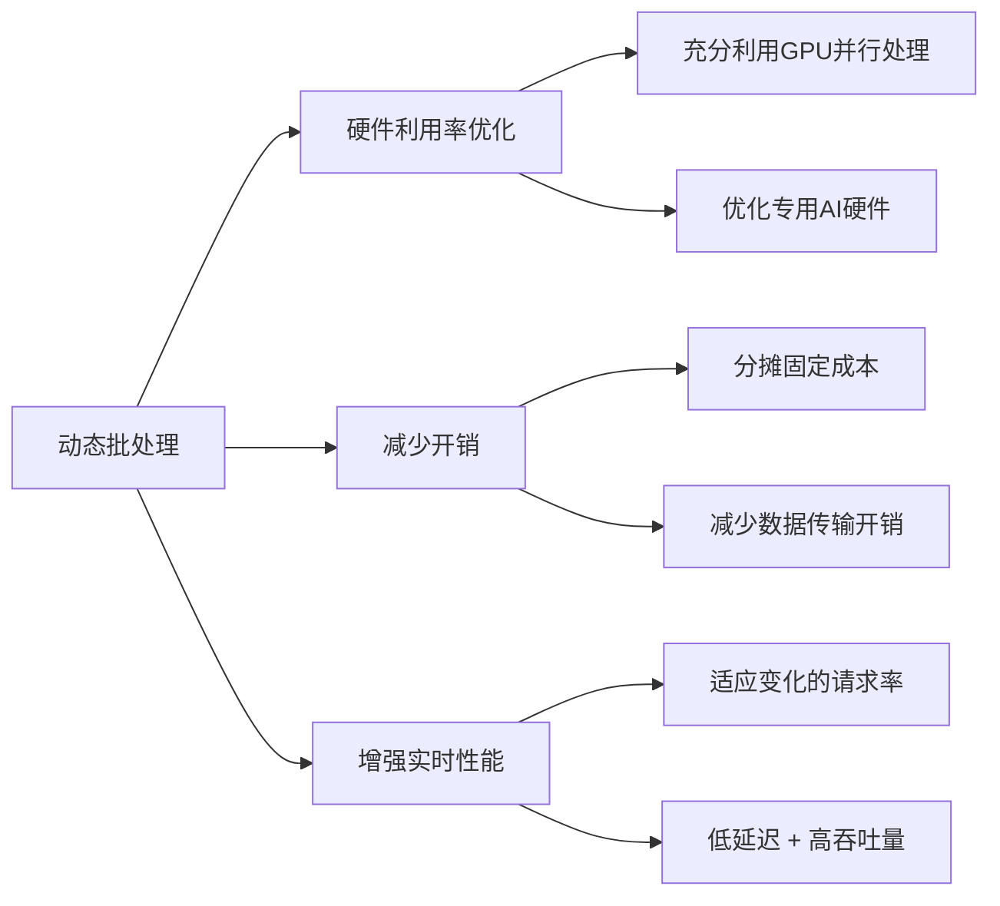
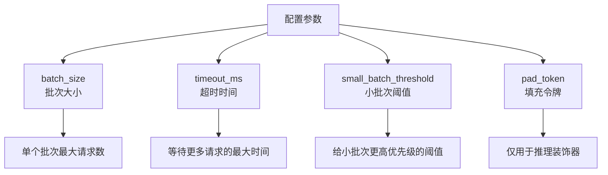

# Batched (Dynamic Batching) 项目文档

## 项目简介

Batched API 提供了一种灵活高效的方式来批量处理多个请求，主要专注于推理工作负载的动态批处理。它旨在优化吞吐量的同时保持低延迟体验，特别适用于需要同时处理大量请求的场景。支持异步和同步执行。

## 目录

```mermaid
graph TD
    A[Batched API] --> B[安装]
    A --> C[使用方法]
    A --> D[API 参考]
    A --> E[贡献指南]
    A --> F[许可证]
    
    C --> C1[基础示例]
    C --> C2[高级用法]
    
    D --> D1[线程实现]
    D --> D2[Asyncio 实现]
    
    D1 --> D1A[@batched.dynamically]
    D1 --> D1B[@batched.inference.dynamically]
    
    D2 --> D2A[@batched.aio.dynamically]
    D2 --> D2B[@batched.aio.inference.dynamically]
```

## 为什么使用动态批处理？

动态批处理是一种自动将多个传入的推理请求分组到单个批次中进行处理的技术。这对推理工作负载特别有益，因为将多个输入一起处理可以显著提高吞吐量和效率。

### 核心优势



在机器学习模型中，动态批处理的重要性体现在：

- **硬件利用率优化**：特别是对于GPU和专用AI硬件的并行处理设计
- **减少开销**：通过在多个请求间分摊固定成本（如数据传输和模型初始化）
- **增强实时性能**：适应变化的请求率，在安静期间保持低延迟，在繁忙时期最大化吞吐量

## 安装

```bash
pip install batched
```

## 使用方法

### 基础示例

以下是使用 Batched API 批量处理文本数据的基本示例：

```python
from sentence_transformers import SentenceTransformer
import numpy as np
import batched

class SentenceEmbedder:
    def __init__(self, model_name='mixedbread-ai/mxbai-embed-large-v1'):
        self.model = SentenceTransformer(model_name)

    @batched.dynamically
    def embed_sentences(self, sentences: list[str]) -> list[np.ndarray]:
        # 将句子转换为嵌入向量
        return self.model.encode(sentences)

# 创建 SentenceEmbedder 实例
embedder = SentenceEmbedder()

# 嵌入单个句子
single_sent = "This is a test sentence."
embedding = embedder.embed_sentences(single_sent)
awaited_embedding = await embedder.embed_sentences.acall(single_sent)

# 嵌入1000个句子的批次
batch_sentences = [f"This is test sentence number {i}." for i in range(1000)]
batch_embeddings = embedder.embed_sentences(batch_sentences)
awaited_batch_embeddings = await embedder.embed_sentences.acall(batch_sentences)

# 检查统计信息
stats = embedder.embed_sentences.stats
```

### 高级用法

对于更高级的用法，如动态自定义批次大小和超时，Batched API 提供了允许对批处理过程进行细粒度控制的装饰器。

#### 配置参数



示例：

```python
@batched.dynamically(batch_size=64, timeout_ms=5.0, small_batch_threshold=2)
def custom_batch_function(data):
    # 自定义处理逻辑
    pass
```

## API 参考

API 提供了用于批处理一般任务和推理任务的线程和 asyncio 实现：

### 线程实现

#### @batched.dynamically

允许对一般任务进行动态批处理（支持同步和异步）。

**装饰的方法应该：**
- 接收一个项目列表 (`list[T]`)
- 返回相同长度的结果列表 (`list[U]`)

```python
import batched

@batched.dynamically(batch_size=64)
def my_function(items: list[int]) -> list[str]:
    # 自定义处理逻辑
    return [f"{item * 2}" for item in items]

# 单项同步调用
my_function(2)

# 批次项目同步调用
my_function([2, 3, 4])

# 使用 asyncio 调用
await my_function.acall(2)
await my_function.acall([2, 3, 4])

# 支持统计检查
print(my_function.stats)
```

#### @batched.inference.dynamically

允许对推理任务进行动态批处理，处理带填充的 numpy 数组和张量。

**装饰的方法应该：**
- 接收张量或 numpy 数组字典 (`dict[str, Feature]`)
- 返回张量或 numpy 数组 (`Feature`)
- 满足：`features[feature_name].shape[0] == outputs.shape[0]`

```python
from batched import inference
import torch

@inference.dynamically(pad_token={"input_ids": 0})
def my_inference_function(features: dict[str, torch.Tensor]) -> torch.Tensor:
    logits = model(**features)
    return logits

# 同步调用
my_inference_function(data)

# 使用 asyncio 调用
await my_inference_function.acall(data)

print(my_inference_function.stats)
```

### Asyncio 实现

#### @

使用 asyncio 对一般任务进行动态批处理。

```python
from batched import aio

@aio.dynamically(batch_size=64, timeout_ms=20.0, small_batch_threshold=10)
def my_function(items: list[int]) -> list[int]:  # 也可以是异步函数: async def ...
    # 自定义处理逻辑
    return [item * 2 for item in items]

# 允许单项
await my_function(2)

# 允许批次项目
await my_function([2, 3, 4])

# 支持统计检查
print(my_function.stats)
```

#### @batched.aio.inference.dynamically

使用 asyncio 对推理任务进行动态批处理，处理带填充的 numpy 数组和张量。

```python
from batched import aio
import torch

@aio.inference.dynamically(pad_token={"input_ids": 0})
async def my_inference_function(features: dict[str, torch.Tensor]) -> list[torch.Tensor]:
    logits1 = await model1(**features)
    logits2 = await model2(**features)
    return [logits1, logits2]

await my_inference_function(data)

print(my_inference_function.stats)
```

## 数据类型支持

Feature 可以是以下任何类型：
- `np.ndarray`
- `torch.Tensor`
- `list[np.ndarray]`
- `list[torch.Tensor]`
