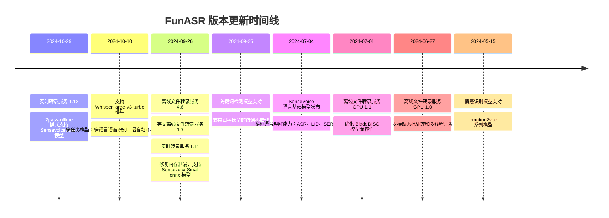
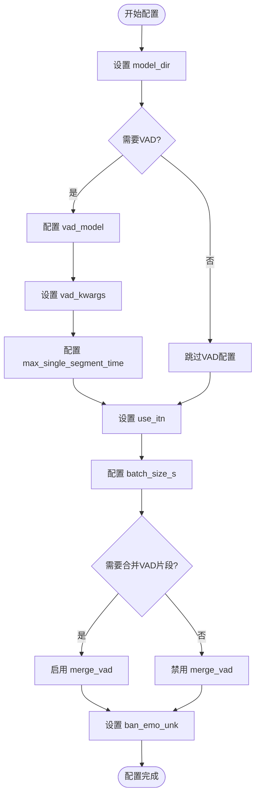
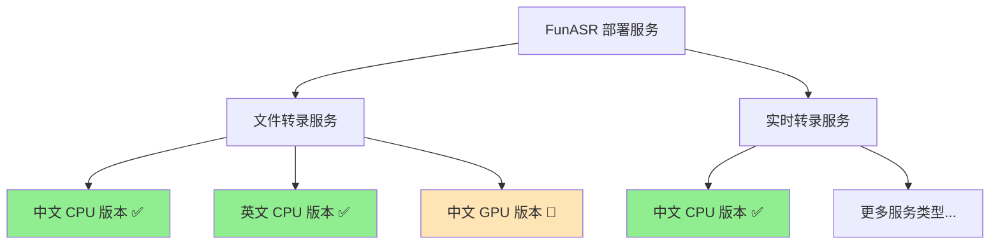

## 概述

FunASR 致力于在语音识别的学术研究和工业应用之间建立桥梁。通过支持工业级语音识别模型的训练和微调，研究人员和开发者可以更便捷地进行语音识别模型的研究和生产，推动语音识别生态的发展。

**ASR for Fun！**

## 主要特性

FunASR 是一个基础语音识别工具包，提供多种功能特性：

- **语音识别 (ASR)**
- **语音活动检测 (VAD)**
- **标点符号恢复**
- **语言模型**
- **说话人验证**
- **说话人分离**
- **多说话人 ASR**

FunASR 提供便捷的脚本和教程，支持预训练模型的推理和微调。

### 核心亮点

- 在 ModelScope 和 Hugging Face 上发布了大量学术和工业预训练模型
- 代表性模型 **Paraformer-large**：非自回归端到端语音识别模型
  - 高精度
  - 高效率
  - 便捷部署
  - 支持快速构建语音识别服务

## 最新更新



## 安装指南

### 系统要求

- **Python** >= 3.8
- **PyTorch** >= 1.13
- **torchaudio**

### 安装方式

#### 1. 通过 PyPI 安装

```bash
pip3 install -U funasr
```

#### 2. 从源码安装

```bash
git clone https://github.com/alibaba/FunASR.git && cd FunASR
pip3 install -e ./
```

#### 3. 安装模型库支持（可选）

```bash
pip3 install -U modelscope huggingface_hub
```

## 模型库

FunASR 在工业数据上开源了大量预训练模型。用户可以在模型许可协议下自由使用、复制、修改和分享 FunASR 模型。

### 代表性模型

| 模型名称 | 任务详情 | 训练数据 | 参数量 |
|:---|:---|:---|:---|
| **SenseVoiceSmall** ⭐🤗 | 多种语音理解能力：ASR、ITN、LID、SER、AED<br/>支持语言：中文、粤语、英语、日语、韩语 | 300,000 小时 | 234M |
| **paraformer-zh** ⭐🤗 | 语音识别，带时间戳，非流式 | 60,000 小时，中文 | 220M |
| **paraformer-zh-streaming** ⭐🤗 | 语音识别，流式 | 60,000 小时，中文 | 220M |
| **paraformer-en** ⭐🤗 | 语音识别，无时间戳，非流式 | 50,000 小时，英语 | 220M |
| **conformer-en** ⭐🤗 | 语音识别，非流式 | 50,000 小时，英语 | 220M |
| **ct-punc** ⭐🤗 | 标点符号恢复 | 100M，中英文 | 290M |
| **fsmn-vad** ⭐🤗 | 语音活动检测 | 5,000 小时，中英文 | 0.4M |
| **fsmn-kws** ⭐ | 关键词检测，流式 | 5,000 小时，中文 | 0.7M |
| **fa-zh** ⭐🤗 | 时间戳预测 | 5,000 小时，中文 | 38M |
| **cam++** ⭐🤗 | 说话人验证/分离 | 5,000 小时 | 7.2M |
| **Whisper-large-v3** ⭐🍀 | 语音识别，带时间戳，非流式 | 多语言 | 1550M |
| **Whisper-large-v3-turbo** ⭐🍀 | 语音识别，带时间戳，非流式 | 多语言 | 809M |
| **Qwen-Audio** ⭐🤗 | 音频-文本多模态模型（预训练） | 多语言 | 8B |
| **Qwen-Audio-Chat** ⭐🤗 | 音频-文本多模态模型（对话） | 多语言 | 8B |
| **emotion2vec+large** ⭐🤗 | 语音情感识别 | 40,000 小时 | 300M |

**图例说明：**
- ⭐ ModelScope 模型库
- 🤗 Hugging Face 模型库  
- 🍀 OpenAI 模型库

## 快速开始

### 命令行使用

```bash
funasr ++model=paraformer-zh ++vad_model="fsmn-vad" ++punc_model="ct-punc" ++input=asr_example_zh.wav
```

> **注意：** 支持单个音频文件识别，以及 Kaldi 格式的 wav.scp 文件列表：`wav_id wav_path`

### 语音识别（非流式）

#### SenseVoice 模型

```python
from funasr import AutoModel
from funasr.utils.postprocess_utils import rich_transcription_postprocess

model_dir = "iic/SenseVoiceSmall"

model = AutoModel(
    model=model_dir,
    vad_model="fsmn-vad",
    vad_kwargs={"max_single_segment_time": 30000},
    device="cuda:0",
)

# 英文识别示例
res = model.generate(
    input=f"{model.model_path}/example/en.mp3",
    cache={},
    language="auto",  # "zn", "en", "yue", "ja", "ko", "nospeech"
    use_itn=True,
    batch_size_s=60,
    merge_vad=True,
    merge_length_s=15,
)
text = rich_transcription_postprocess(res[0]["text"])
print(text)
```

**参数说明：**

| 参数名称 | 参数类型 | 单位 | 默认值 | 功能描述 | 使用说明 |
|:---------|:---------|:-----|:-------|:---------|:---------|
| `model_dir` | `string` | - | - | 指定模型名称或本地路径 | 可以是预定义模型名称或完整文件路径 |
| `vad_model` | `boolean/string` | - | `true` | 激活语音活动检测(VAD) | 将长音频分割为短片段，影响端到端延迟 |
| `vad_kwargs.max_single_segment_time` | `number` | ms | - | VAD音频分割最大持续时间 | 控制单个音频片段的长度上限 |
| `use_itn` | `boolean` | - | `true` | 输出包含标点和逆文本标准化 | `true`输出标点符号，`false`输出纯文本 |
| `batch_size_s` | `number` | s | - | 动态批处理音频总时长 | 以秒为单位，提高处理效率 |
| `merge_vad` | `boolean` | - | `false` | 合并VAD分割的短音频片段 | 配合`merge_length_s`参数使用 |
| `ban_emo_unk` | `boolean` | - | `false` | 禁止输出emo_unk标记 | `true`禁止情感未知标记输出 |




```

#### Paraformer 模型

```python
from funasr import AutoModel

# paraformer-zh 是多功能 ASR 模型
# 根据需要使用 vad、punc、spk 等功能
model = AutoModel(
    model="paraformer-zh",  
    vad_model="fsmn-vad",  
    punc_model="ct-punc", 
    # spk_model="cam++", 
)

res = model.generate(
    input=f"{model.model_path}/example/asr_example.wav", 
    batch_size_s=300, 
    hotword='魔搭'
)
print(res)
```

### 语音识别（流式）

```python
from funasr import AutoModel
import soundfile
import os

# 流式配置参数
chunk_size = [0, 10, 5]  # [0, 10, 5] 600ms, [0, 8, 4] 480ms
encoder_chunk_look_back = 4  # 编码器自注意力回看块数
decoder_chunk_look_back = 1  # 解码器交叉注意力回看编码器块数

model = AutoModel(model="paraformer-zh-streaming")

# 加载音频文件
wav_file = os.path.join(model.model_path, "example/asr_example.wav")
speech, sample_rate = soundfile.read(wav_file)
chunk_stride = chunk_size[1] * 960  # 600ms

cache = {}
total_chunk_num = int(len((speech)-1)/chunk_stride+1)

for i in range(total_chunk_num):
    speech_chunk = speech[i*chunk_stride:(i+1)*chunk_stride]
    is_final = i == total_chunk_num - 1
    
    res = model.generate(
        input=speech_chunk, 
        cache=cache, 
        is_final=is_final, 
        chunk_size=chunk_size, 
        encoder_chunk_look_back=encoder_chunk_look_back, 
        decoder_chunk_look_back=decoder_chunk_look_back
    )
    print(res)
```

**流式配置说明：**
- `chunk_size`: 流式延迟配置
  - `[0,10,5]`: 实时显示粒度为 10×60=600ms，前瞻信息为 5×60=300ms
  - 每次推理输入 600ms（采样点 16000×0.6=960）
- `is_final=True`: 最后一个语音段需要设置，强制输出最后一个词

## ONNX 导出和测试

### 导出 ONNX

#### 命令行方式

```bash
funasr-export ++model=paraformer ++quantize=false ++device=cpu
```

#### Python 方式

```python
from funasr import AutoModel

model = AutoModel(model="paraformer", device="cpu")
res = model.export(quantize=False)
```

### 测试 ONNX

```python
# pip3 install -U funasr-onnx
from funasr_onnx import Paraformer

model_dir = "damo/speech_paraformer-large_asr_nat-zh-cn-16k-common-vocab8404-pytorch"
model = Paraformer(model_dir, batch_size=1, quantize=True)

wav_path = ['~/.cache/modelscope/hub/damo/speech_paraformer-large_asr_nat-zh-cn-16k-common-vocab8404-pytorch/example/asr_example.wav']

result = model(wav_path)
print(result)
```

## 部署服务

FunASR 支持部署预训练或进一步微调的模型为服务。目前支持以下类型的服务部署：



**服务状态说明：**
- ✅ 已完成
- 🚧 开发中

更多详细信息请参考 [服务部署文档](docs)。

---

*更多示例请参考 [demo](demo)*

