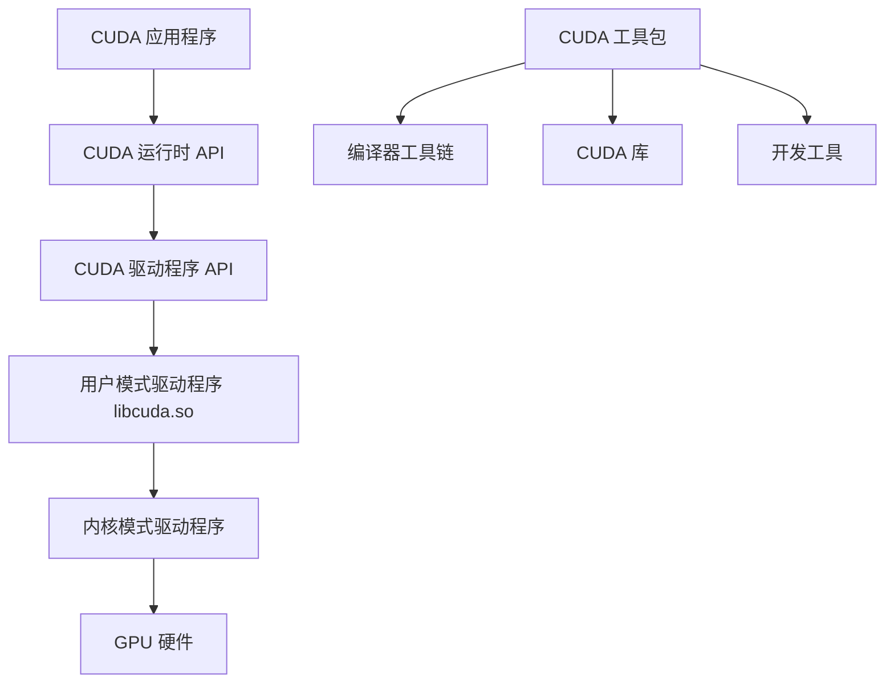
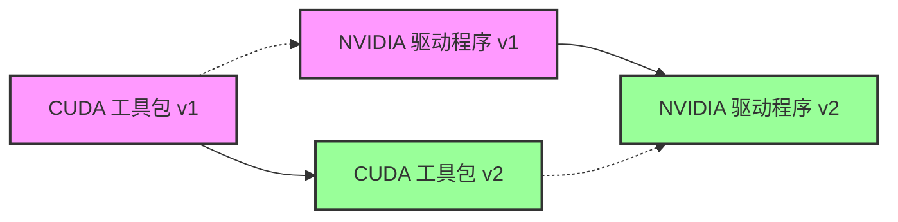
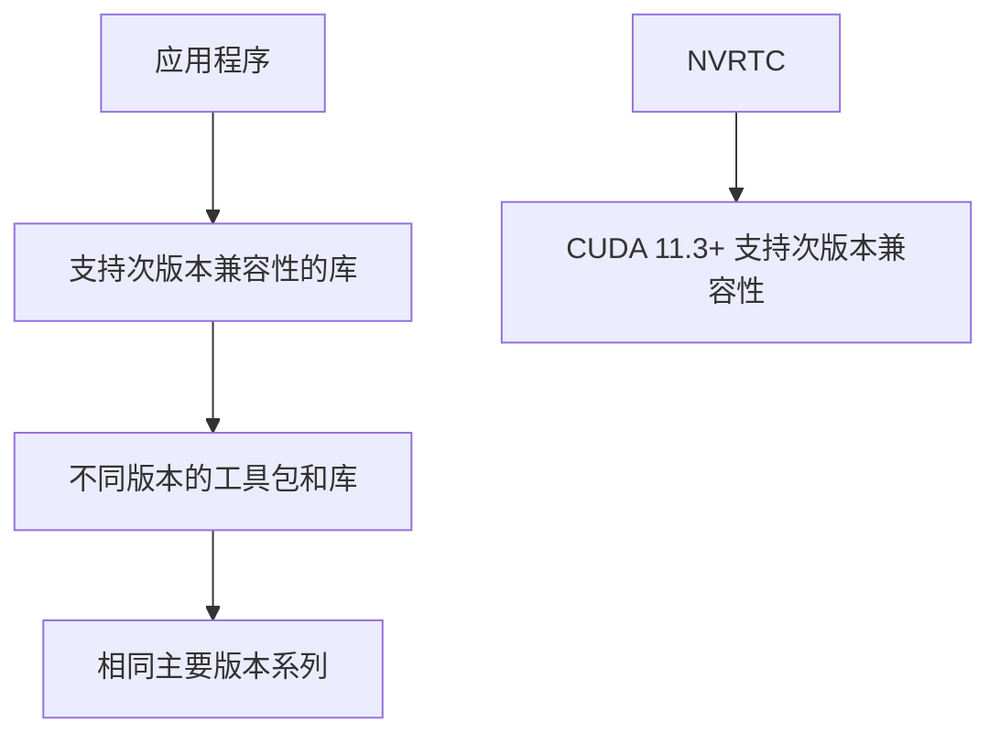
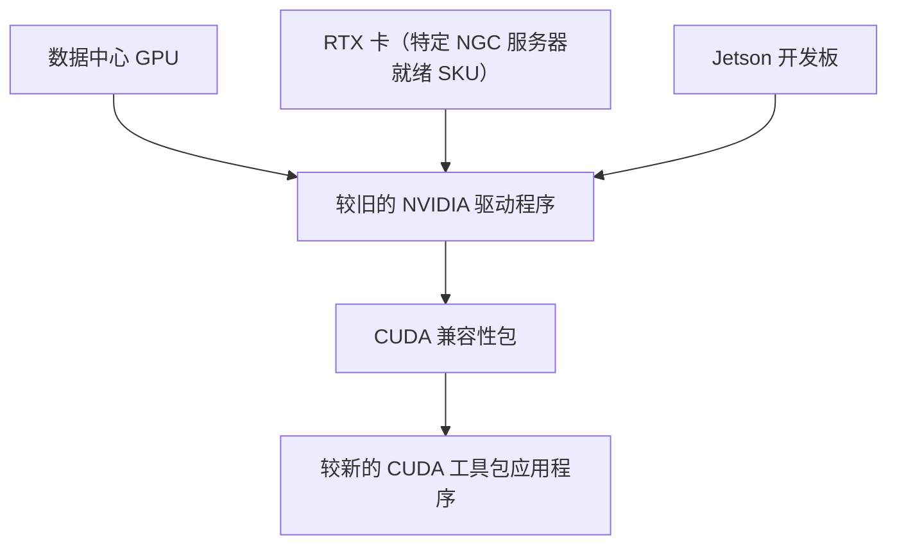
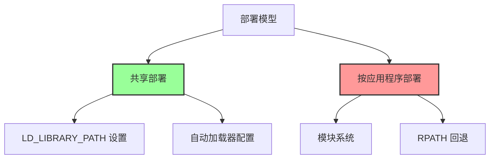
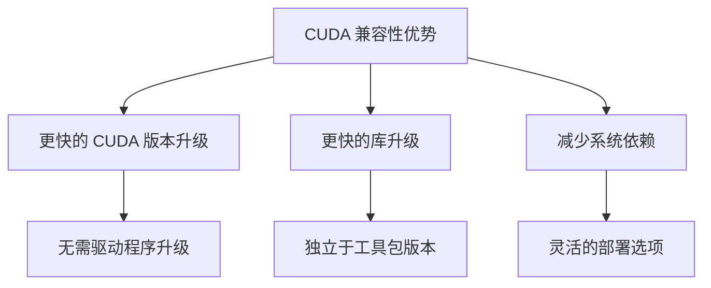

# CUDA 兼容性文档

## 概述

CUDA 兼容性描述了在具有较旧基础安装的系统上使用新 CUDA 工具包组件的方法。

## 1. 为什么需要 CUDA 兼容性

NVIDIA® CUDA® 工具包使开发人员能够为桌面计算机、企业和数据中心到超大规模系统构建 NVIDIA GPU 加速计算应用程序。它包含 CUDA 编译器工具链（包括 CUDA 运行时 (cudart)）以及各种 CUDA 库和工具。

### CUDA 组件结构



### 传统升级路径



### 兼容性类型

| CUDA 驱动程序 (libcuda.so) | 兼容性类型 | 要求 |
|:---|:---|:---|
| 比 CUDA 运行时新 | 向后兼容性 | 无 |
| 比 CUDA 运行时旧，但主版本相同 | 次版本兼容性 | 无 PTX（需要 SASS），需要 NVCC 目标架构 |
| 比 CUDA 运行时主版本旧 | 前向兼容性 | 额外的 CUDA 兼容性包 |

## 2. 次版本兼容性

### 2.1 CUDA 11 及更高版本默认支持次版本兼容性

从 CUDA 11 开始，使用 CUDA 主要版本系列中的 CUDA 工具包版本编译的应用程序可以在具有最低所需驱动程序版本的系统上运行（功能集有限）。

#### 最低驱动程序版本要求

| CUDA 工具包 | Linux x86_64 最低驱动程序版本 | Windows 最低驱动程序版本 |
|:---|:---|:---|
| CUDA 12.x | >=525.60.13 | >=527.41 |
| CUDA 11.x | >= 450.80.02* | >=452.39* |

*注：CUDA 11.0 发布时使用了较早的驱动程序版本，但通过升级到指定的驱动程序版本，可以在 CUDA 11.x 系列工具包中实现次版本兼容性。

#### CUDA 10.x 驱动程序要求

| CUDA 工具包  | Linux x86_64 最低驱动程序版本 | Windows 最低驱动程序版本 |
| :-------- | :-------------------- | :--------------- |
| CUDA 10.2 | >= 440.33             | >=441.22         |
| CUDA 10.1 | >= 418.39             | >=418.96         |
| CUDA 10.0 | >= 410.48             | >=411.31         |

### 2.2 次版本兼容性的应用程序注意事项

开发人员和系统管理员在依赖次版本兼容性时应注意三个重要限制：

1. **功能集有限**
   - 某些功能可能需要同时跨越工具包和驱动程序
   - 可能返回 `cudaErrorCallRequiresNewerDriver` 错误

2. **使用 PTX 的应用程序会遇到运行时问题**
   - 将设备代码编译为 PTX 的应用程序无法在较旧的驱动程序上运行

3. **需要向 NVCC 传递目标架构参数**
   - 次版本兼容性需要传递目标架构参数，例如 `nvcc -arch=sm_xx`

### 2.3 次版本兼容性的部署注意事项



## 3. 前向兼容性

### 3.1 跨主要工具包版本的前向兼容性支持

数据中心和企业可能不希望跨主要版本更新 NVIDIA GPU 驱动程序。为支持这种场景，CUDA 在 10.0 版本中引入了前向兼容性升级路径。



**警告：** 前向兼容性仅适用于：
- NVIDIA 数据中心 GPU
- 特定 NGC 服务器就绪 SKU 的 RTX 卡
- Jetson 开发板

### 3.2 安装 CUDA 前向兼容性包

#### 3.2.1 从网络存储库或本地安装程序安装

CUDA 前向兼容性包在本地安装程序或 NVIDIA 提供的 CUDA 网络存储库中以 `cuda-compat-<cuda_major_version>-<cuda_minor_version>` 的形式提供。

**安装命令：**

```bash
# Ubuntu / Debian
apt install cuda-compat-12-8

# Red Hat Enterprise Linux / Rocky Linux / Oracle Linux / Amazon Linux / Fedora / KylinOS
dnf install cuda-compat-12-8

# SLES / OpenSUSE
zypper install cuda-compat-12-8

# Azure Linux
tdnf install cuda-compat-12-8
```

**包含的文件：**
- `libcuda.so.*` - CUDA 驱动程序
- `libcudadebugger.so.*` - CUDA 驱动程序的 GPU 调试支持（仅 CUDA 11.8 及更高版本）
- `libnvidia-nvvm.so.*` - JIT LTO（仅 CUDA 11.5 及更高版本）
- `libnvidia-ptxjitcompiler.so.*` - PTX 文件的 JIT 编译器
- `libnvidia-pkcs11*.so.*` - CUDA 驱动程序的 OpenSSL 支持

#### 3.2.2 从 Runfile 手动安装

也可以从 NVIDIA 驱动程序下载中提供的相应数据中心驱动程序 'runfile' 安装程序 (.run) 中提取 CUDA 前向兼容性包文件。

### 3.3 前向兼容性的部署注意事项

#### 3.3.1 使用正确的 CUDA 前向兼容性包

CUDA 前向兼容性包应仅在需要跨主要版本的前向兼容性时使用。

#### 应用程序兼容性支持矩阵

| CUDA 前向兼容性包 | NVIDIA 驱动程序 535+ | NVIDIA 驱动程序 550+ | NVIDIA 驱动程序 570+ | NVIDIA 驱动程序 575+ |
|:---|:---:|:---:|:---:|:---:|
| cuda-compat-12-9 | C | C | C | N/A |
| cuda-compat-12-8 | C | C | N/A | X |
| cuda-compat-12-6 | C | C | X | X |
| cuda-compat-12-5 | C | C | X | X |
| cuda-compat-12-4 | C | N/A | X | X |
| cuda-compat-12-3 | C | X | X | X |
| cuda-compat-12-2 | N/A | X | X | X |

**图例：**
- C - 兼容
- X - 不兼容
- N/A - 不适用

#### 3.3.2 功能例外

某些 CUDA 驱动程序功能需要内核模式支持，仅在较新的内核模式驱动程序上工作。

| CUDA 前向兼容性包 | CUDA - OpenGL/Vulkan 互操作 | cuMemMap* 功能集 |
|:---|:---:|:---:|
| cuda-compat-12-x（系统基础：525 驱动程序） | 否 | 是 [1] |
| cuda-compat-11-x（系统基础：450 驱动程序） | 否 | 是 [1] |

[1] 这依赖于 `CU_DEVICE_ATTRIBUTE_HANDLE_TYPE_POSIX_FILE_DESCRIPTOR_SUPPORTED` 和 `CU_DEVICE_ATTRIBUTE_VIRTUAL_ADDRESS_MANAGEMENT_SUPPORTED`

#### 3.3.3 检查兼容性支持

应用程序应使用以下错误代码来确定是否支持 CUDA 前向兼容升级：

- `CUDA_ERROR_SYSTEM_DRIVER_MISMATCH = 803`：显示驱动程序和 CUDA 驱动程序版本不匹配
- `CUDA_ERROR_COMPAT_NOT_SUPPORTED_ON_DEVICE = 804`：系统升级为前向兼容性运行，但 CUDA 检测到的可见硬件不支持此配置

### 3.4 前向兼容性的部署模型



**推荐使用共享部署模式：**

```bash
# 共享部署示例
export LD_LIBRARY_PATH=/usr/local/cuda-12.1/compat

# 按应用程序部署示例
module load cuda/11.0
```

## 4. 结论

CUDA 兼容性通过以下方式帮助用户：

1. **更快升级到最新 CUDA 版本**
   - 企业或数据中心无需更新驱动程序即可使用新的 CUDA 版本
   - 减少部署延迟

2. **更快升级 CUDA 库**
   - 用户可以升级到基于 CUDA 构建的最新软件库和应用程序
   - 无需升级整个 CUDA 工具包或驱动程序



## 5. 常见问题解答

### Q: CUDA 前向兼容升级是否在分支内工作？
A: 用户可以在同一分支内升级内核模式驱动程序。有时这可能需要更新 `cuda-compat-*` 包。

### Q: 工具包的最低所需驱动程序版本是什么？
A: 请参考发布说明。

### Q: 如果使用 CUDA 11.0 构建应用程序，它能否继续用于较新的 NVIDIA 驱动程序？
A: 是的，驱动程序始终与 CUDA 向后兼容。CUDA 11.0 应用程序将与 R450 (11.0)、R455 (11.1) 及更高版本兼容。

### Q: CUDA 兼容性是否适用于容器？
A: 是的，CUDA 次版本兼容性和 CUDA 前向兼容升级都适用于 NGC 深度学习框架容器或基于官方 CUDA 基础镜像的容器。

## 6. 商标和法律声明

NVIDIA 和 NVIDIA 徽标是 NVIDIA Corporation 在美国和其他国家/地区的商标或注册商标。其他公司和产品名称可能是其相关公司的商标。
