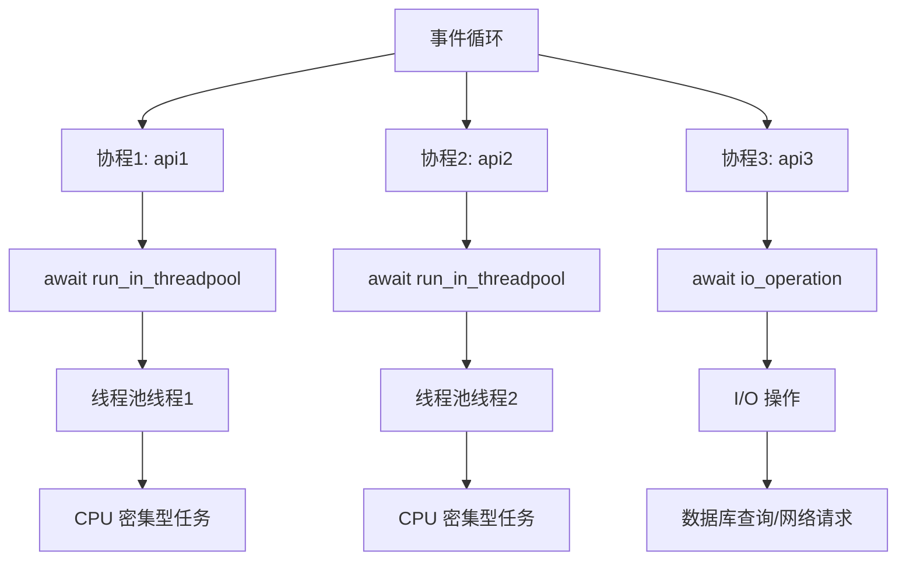
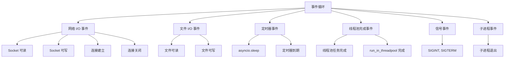
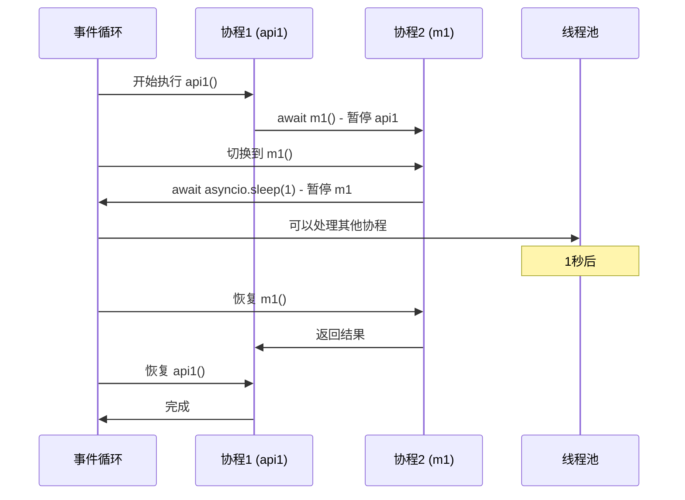
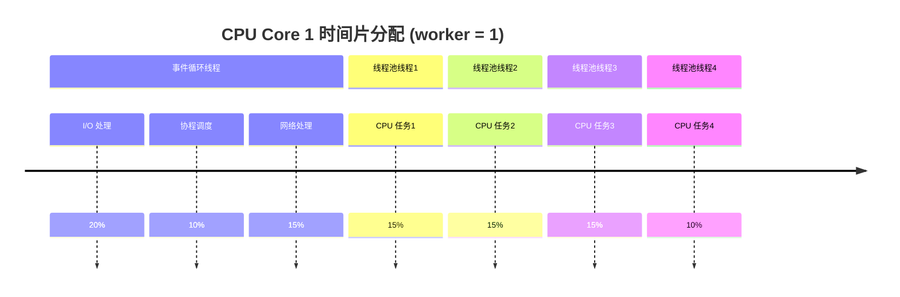
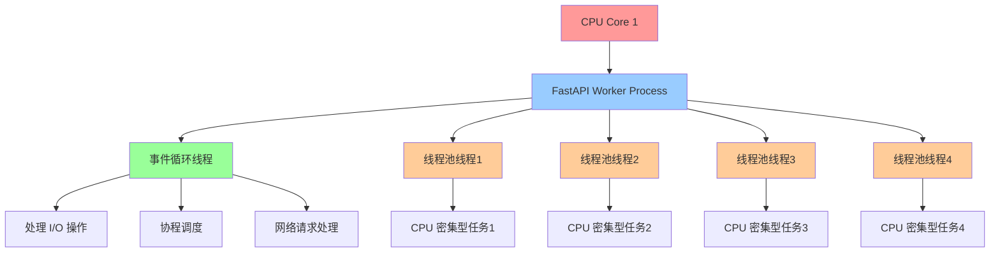
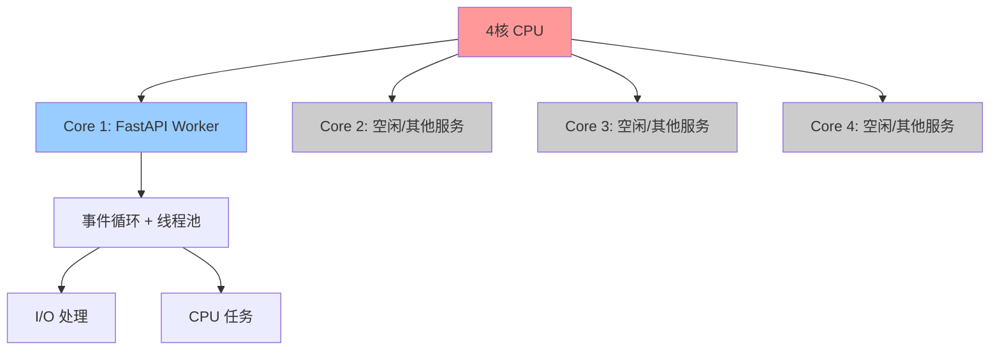

# FastAPI + Asyncio 并发模型完整文档

## 目录
- [核心概念](#核心概念)
- [事件循环机制](#事件循环机制)
- [CPU密集型 vs I/O密集型](#cpu密集型-vs-io密集型)
- [线程池管理策略](#线程池管理策略)
- [Worker 配置策略](#worker-配置策略)
- [最佳实践](#最佳实践)
- [性能测试与分析](#性能测试与分析)

## 核心概念

### 协程 (Coroutine)
```python
async def api1():
    await asyncio.sleep(1)  # 协程暂停，让出控制权
    return "done"
```

**特点：**
- 可以暂停和恢复的函数
- 在等待 I/O 时让出控制权
- 单线程并发模型

### 事件循环 (Event Loop)


## 事件循环机制

### 事件类型


### 执行流程


### CPU 使用情况


## CPU密集型 vs I/O密集型

### CPU 密集型任务
```python
# 特征：大量计算，CPU 使用率高
def cpu_intensive_task():
    result = 0
    for i in range(10000000):
        result += i * i
    return result

# 错误做法：直接调用会阻塞事件循环
async def bad_api():
    result = cpu_intensive_task()  # ❌ 阻塞事件循环
    return result

# 正确做法：使用线程池
async def good_api():
    result = await run_in_threadpool(cpu_intensive_task)  # ✅ 不阻塞
    return result
```

### I/O 密集型任务
```python
# 特征：等待外部资源，CPU 使用率低
async def io_intensive_task():
    await asyncio.sleep(1)  # 模拟网络请求
    return "io result"

# 协程天然支持 I/O 操作
async def api():
    result = await io_intensive_task()  # ✅ 不会阻塞
    return result
```

### 网络 I/O 处理流程
```python
async def handle_network_request():
    # 1. 接收 HTTP 请求 (网络 I/O)
    request = await receive_http_request()  # CPU 处理网络数据
    
    # 2. 解析请求 (CPU 计算)
    parsed_request = parse_request(request)  # CPU 计算
    
    # 3. 数据库查询 (网络 I/O)
    result = await database.query(parsed_request)  # 等待数据库响应
    
    # 4. 生成响应 (CPU 计算)
    response = generate_response(result)  # CPU 计算
    
    # 5. 发送响应 (网络 I/O)
    await send_http_response(response)  # CPU 处理网络数据
```

### 对比表
| 特性 | CPU 密集型 | I/O 密集型 |
|------|-----------|-----------|
| **CPU 使用率** | 高 | 低 |
| **阻塞性** | 会阻塞事件循环 | 不会阻塞 |
| **处理方式** | `run_in_threadpool` | 直接 `await` |
| **并发模型** | 线程池并行 | 协程并发 |
| **适用场景** | 音频推理、图像处理 | 数据库查询、网络请求 |

## 线程池管理策略

### 全局线程池 vs 局部线程池

#### 全局线程池（推荐）
```python
# async_executor.py
_thread_pool_executor: ThreadPoolExecutor | None = None

def get_thread_pool_executor():
    global _thread_pool_executor
    if _thread_pool_executor is None:
        _thread_pool_executor = ThreadPoolExecutor(max_workers=4)
    return _thread_pool_executor

async def run_in_threadpool(func, *args, **kwargs):
    executor = get_thread_pool_executor()
    return await loop.run_in_executor(executor, func, *args, **kwargs)
```

**优点：**
- ✅ 线程复用，性能更好
- ✅ 避免频繁创建/销毁开销
- ✅ 内存使用稳定
- ✅ 适合长期运行的服务

#### 局部线程池
```python
# 每次创建新的线程池
with ThreadPoolExecutor(max_workers=4) as executor:
    tasks = [
        loop.run_in_executor(executor, cpu_task) 
        for _ in range(4)
    ]
    results = await asyncio.gather(*tasks)
# 自动关闭
```

**特点：**
- ✅ 自动资源管理
- ❌ 性能开销大
- ❌ 无法复用线程
- ⚠️ 适合临时任务

### 线程池配置建议
```python
# 推荐配置
workers = 1  # FastAPI worker 数量
async_thread_pool_size = 4  # 线程池大小

# 原因：
# 1. worker=1 让其他 CPU 核心专注于推理
# 2. 线程池大小 = CPU 核心数
# 3. 避免过度并发导致资源竞争
```

## Worker 配置策略

### 单 Worker 的 CPU 分配


### 多核 CPU 配置


### Worker 配置建议

| 场景 | Worker 数量 | 原因 |
|------|------------|------|
| **CPU 密集型** | 1 | 保留其他核心给推理计算 |
| **I/O 密集型** | CPU 核心数 | 充分利用多核并发 |
| **混合型** | 1-2 | 平衡 I/O 和 CPU 处理 |

## 最佳实践

### 1. CPU 密集型应用配置
```python
# main.py
app = FastAPI(lifespan=lifespan)

@asynccontextmanager
async def lifespan(app: FastAPI):
    try:
        # 启动时初始化
        get_insight_manager()
        yield
    finally:
        # 关闭时清理
        shutdown_thread_pool_executor(wait=True)
```

### 2. API 端点设计
```python
# 推荐：CPU 密集型任务
@router.post("/snr-detect")
async def snr_detect(request_body: SnrDetectRequest):
    wav_bytes = await _process_audio_input(request_body)
    
    # 使用线程池处理 CPU 密集型推理
    result = await run_in_threadpool(
        insight_manager.snr_detect,
        wav_bytes, sample_rate, vad_hop_size, vad_threshold
    )
    
    return SnrDetectResponse(...)

# 推荐：I/O 密集型任务
@router.get("/user/{user_id}")
async def get_user(user_id: int):
    # 直接使用协程处理 I/O 操作
    user = await database.get_user(user_id)
    return user
```

### 3. 并发处理
```python
# 并行执行多个 CPU 任务
async def combined_analysis():
    snr_task = run_in_threadpool(insight_manager.snr_detect, ...)
    speaker_task = run_in_threadpool(insight_manager.speaker_count, ...)
    
    # 并行等待两个任务完成
    snr_result, speaker_result = await asyncio.gather(snr_task, speaker_task)
    
    return CombinedResponse(snr=snr_result, speaker=speaker_result)
```

### 4. 错误处理
```python
async def robust_api():
    try:
        # CPU 密集型任务
        result = await run_in_threadpool(cpu_intensive_task)
        return result
    except Exception as e:
        logger.error("CPU task failed: %s", str(e))
        raise HTTPException(status_code=500, detail=str(e))
```

## 性能测试与分析

### 测试配置
```python
# 测试环境
workers = 1
max_workers = 4
test_duration = 30s
```

### 测试结果对比

| 测试类型 | 阻塞调用 | 非阻塞调用 | 并发调用 |
|---------|---------|-----------|---------|
| **总时间** | 1.66s | 1.68s | 3.10s |
| **执行方式** | 串行 | 并行 | 并行 |
| **线程使用** | 主线程 | 线程池 | 线程池 |
| **事件循环** | 阻塞 | 非阻塞 | 非阻塞 |

### 关键发现

1. **Worker = 1 时事件循环仍然可以并发处理多个请求**
2. **run_in_threadpool 让 CPU 任务不阻塞事件循环**
3. **线程池提供真正的并行执行能力**
4. **全局线程池比局部线程池性能更好**

### 性能优化建议

```python
# 1. 使用全局线程池
result = await run_in_threadpool(cpu_task)

# 2. 并行执行多个任务
results = await asyncio.gather(
    run_in_threadpool(task1),
    run_in_threadpool(task2),
    run_in_threadpool(task3)
)

# 3. 合理配置线程池大小
async_thread_pool_size = cpu_count

# 4. 使用 worker = 1 保留其他核心
workers = 1  # 对于 CPU 密集型应用
```

## 总结

### 核心原则
1. **事件循环**：处理 I/O 事件，等待期间 CPU 释放
2. **线程池**：处理 CPU 密集型任务，使用预创建的线程
3. **Worker 配置**：根据应用类型选择合适的 worker 数量
4. **资源管理**：使用全局线程池，避免频繁创建/销毁

### 推荐配置
```python
# CPU 密集型应用（如音频推理）
workers = 1
async_thread_pool_size = cpu_count
max_workers = cpu_count

# I/O 密集型应用
workers = cpu_count
async_thread_pool_size = cpu_count * 2
```

这种设计既保证了 FastAPI 的响应性，又充分利用了多核 CPU 的计算能力，是高性能异步应用的最佳实践。
