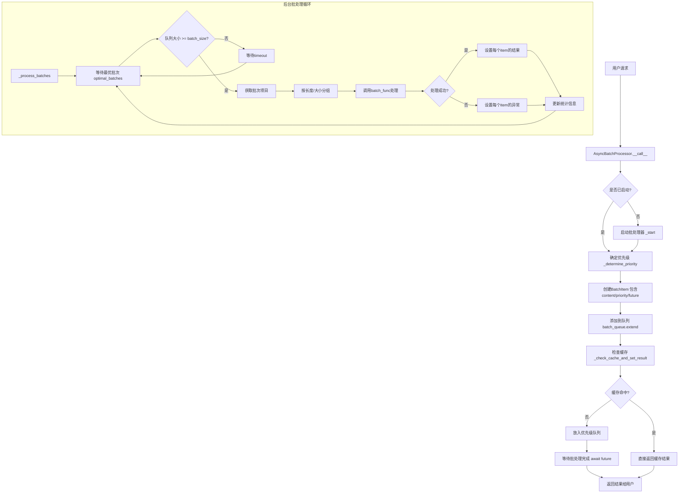
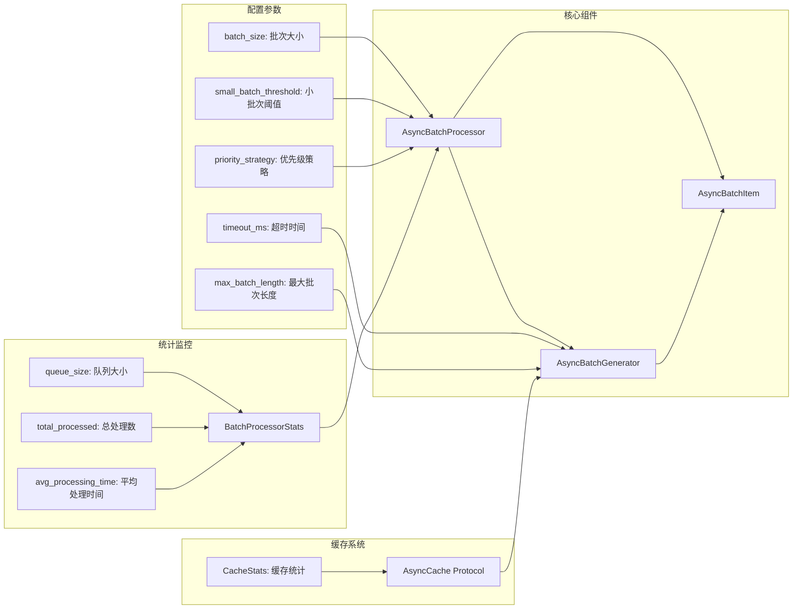
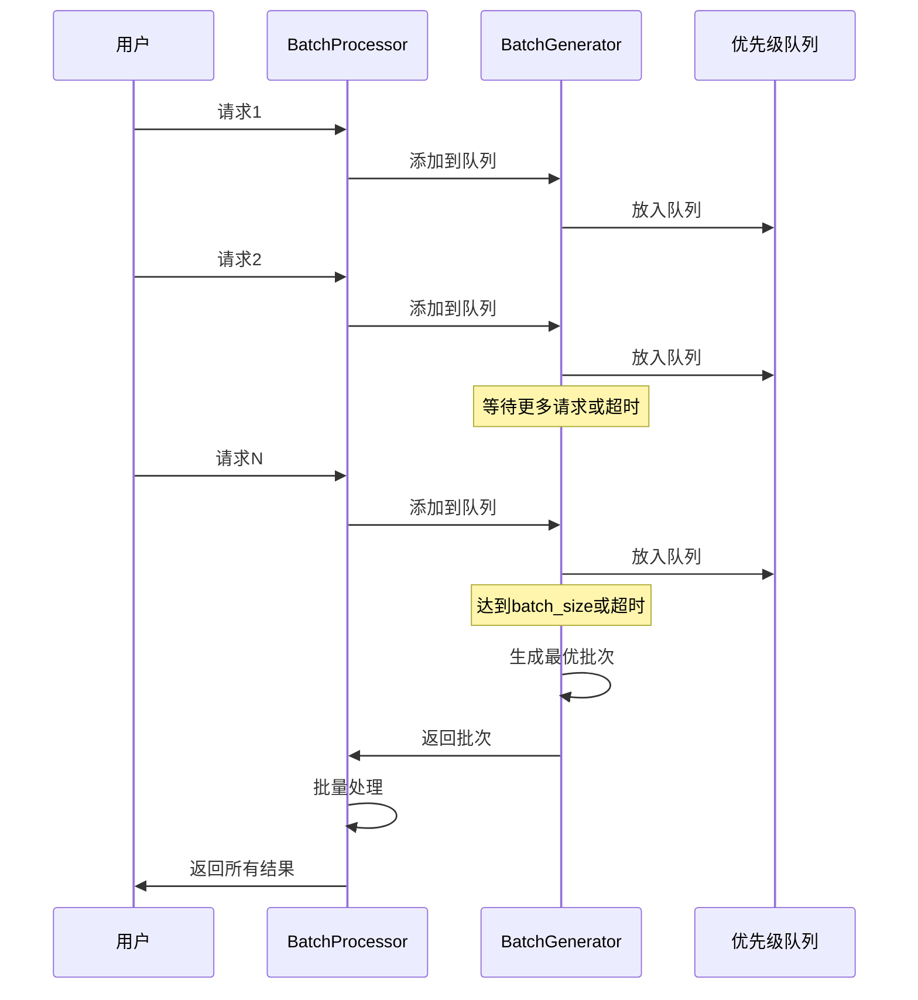
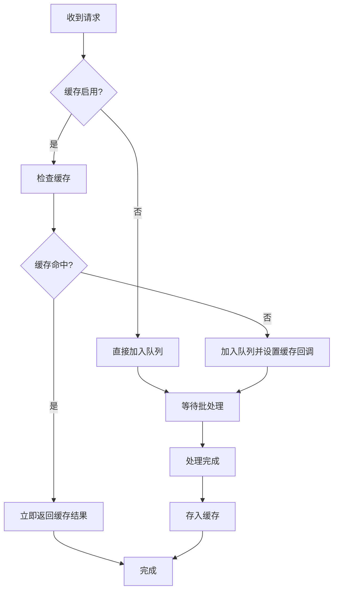
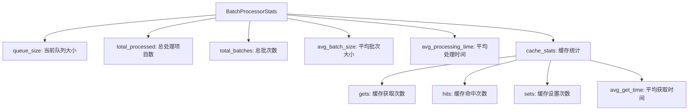

# Batched 异步批处理库原理分析

## 概述

Batched 是一个高性能的异步批处理库，专门用于将多个独立的请求聚合成批次进行处理，从而显著提升处理效率。该库特别适用于深度学习推理、数据库批量操作等场景。

## 核心架构



## 核心组件



## 关键原理

### 1. 异步批处理机制

#### AsyncBatchProcessor
- **职责**: 主要的批处理协调器
- **核心功能**:
  - 接收单个或批量请求
  - 管理批处理生命周期
  - 协调缓存、优先级、统计等功能

#### AsyncBatchGenerator  
- **职责**: 智能批次生成器
- **关键特性**:
  - 使用 `asyncio.PriorityQueue` 或 `asyncio.Queue`
  - 支持基于超时的批次收集
  - 支持基于长度的批次分割

#### AsyncBatchItem
- **职责**: 单个请求的包装器
- **核心属性**:
  - `content`: 实际的请求数据
  - `future`: 异步结果容器
  - `priority`: 优先级（支持排序）

### 2. 批次收集策略



### 3. 优先级策略

- **NONE**: 先进先出 (FIFO)
- **LENGTH**: 基于内容长度排序
- **PRIORITY**: 基于显式优先级值

### 4. 智能缓存机制



### 5. 批次优化算法

#### 批次大小优化
- 当队列大小 < `batch_size` 时，等待 `timeout_ms`
- 支持多批次并行处理：`n_batches = max(1, queue_size // batch_size)`

#### 长度限制处理
```python
if self._max_batch_length:
    batch_items = batch_iter_by_length(
        batch_items, 
        max_batch_length=self._max_batch_length, 
        batch_size=self._batch_size
    )
else:
    batch_items = batch_iter(batch_items, self._batch_size)
```

## 性能特性

### 1. 吞吐量提升
- **批处理效应**: 减少函数调用开销
- **并行处理**: 支持 GPU/向量化操作
- **智能等待**: 平衡延迟和吞吐量

### 2. 内存管理
- **流式处理**: 不会无限累积请求
- **及时清理**: 完成的 Future 会被及时清理
- **可控队列**: 队列大小可监控和控制

### 3. 错误处理
- **异常隔离**: 单个请求失败不影响整批
- **优雅降级**: 异常会正确传播到对应的 Future

## 使用模式

### 装饰器模式
```python
@aio.dynamically(batch_size=32, timeout_ms=5.0)
async def process_texts(texts: list[str]) -> list[int]:
    return [len(text) for text in texts]

# 自动批处理
result = await process_texts("hello")  # 单个请求
results = await process_texts(["a", "b", "c"])  # 批量请求
```

### 直接实例化
```python
processor = AsyncBatchProcessor(
    func=my_batch_function,
    batch_size=32,
    timeout_ms=10.0,
    cache=my_cache
)

result = await processor("single_item")
results = await processor(["item1", "item2", "item3"])
```

## 统计监控



## 适用场景

1. **深度学习推理**: 批量处理提升 GPU 利用率
2. **数据库操作**: 减少网络往返次数  
3. **API 聚合**: 将多个请求合并为一个
4. **图像处理**: 批量处理图像数据
5. **文本处理**: NLP 模型的批量推理

## 核心优势

1. **零侵入**: 通过装饰器无缝集成现有代码
2. **高性能**: 智能批处理算法最大化吞吐量
3. **灵活配置**: 丰富的参数配置满足不同需求
4. **缓存支持**: 内置缓存机制避免重复计算
5. **监控友好**: 详细的统计信息便于性能调优
6. **异常安全**: 完善的错误处理和异常传播机制