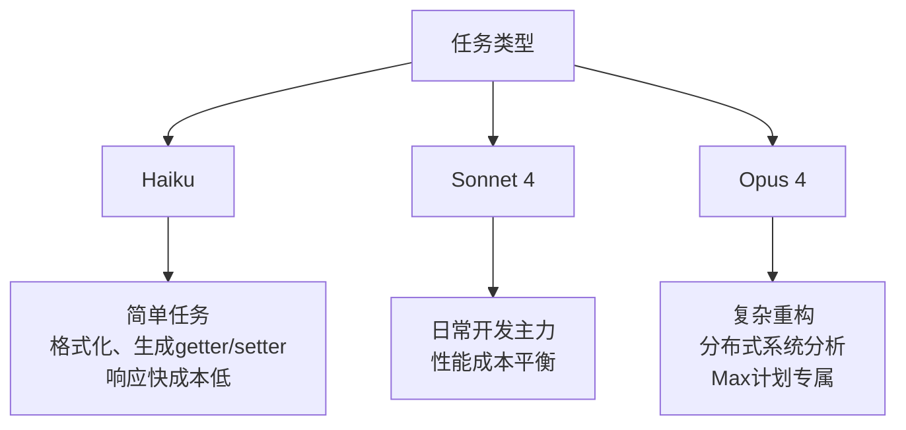
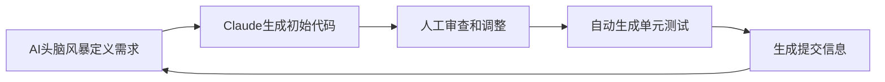
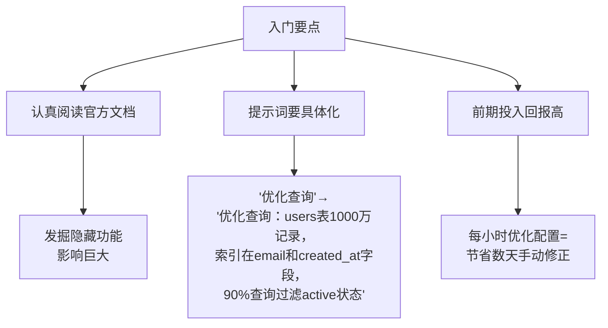

## 如何让AI真正理解你的代码规范

**作者：** Giuseppe Trisciuoglio

---

## 1. 项目上下文管理（CLAUDE.md）

### 手动完善CLAUDE.md，加入团队特定规范：

- **Lombok使用约定**（如优先用`@Data`、`@Builder`）
- **Google代码风格**（2空格缩进）
- **DDD架构模式说明**
- **自定义异常处理模式**
- **测试规范**（Given-When-Then模式、80%覆盖率要求）

> **效果：** 让AI从"新手"变成了解团队规范的"初级开发者"

---

## 2. 文档模块化策略

### 大型项目避免单一巨型文档，按领域拆分：

| 文档名称 | 用途 |
|:---|:---|
| `CLAUDE_AWS.md` | 云服务配置规范 |
| `CLAUDE_TESTING.md` | 测试策略和模式 |
| `CLAUDE_API.md` | REST接口设计规范 |

### 使用技巧
- 使用 `/memory` 命令动态更新会话上下文

---

## 3. 灵活切换AI模型

### 配置方式
- 环境变量或 `~/.claude/settings.json`

### 模型选择策略



### 实战技巧
- 会话中用 `/model` 命令快速切换

---

## 4. 高质量Prompt示例

### ❌ 差劲示例
```
创建一个管理用户的服务
```

### ✅ 优秀示例
```
分析现有UserService的模式，创建ProfileService并遵循相同约定。
要求：
🔹 集成AWS Cognito认证
🔹 继承BaseService处理错误
🔹 使用Spring Cache + Redis实现缓存
🔹 测试遵循项目的Given-When-Then模式
```

---

## 5. 高效开发循环



### 新功能开发流程：
1. **AI头脑风暴定义需求**
2. **Claude生成初始代码**
3. **人工审查和调整**
4. **自动生成单元测试**（Claude最擅长的领域）
5. **使用commitlint规范自动生成提交信息**

---

## 6. 会话管理

### 最佳实践
- **每30-40分钟使用 `/clear` 重置上下文**
- **原因：** 保持AI响应速度，避免上下文混乱导致的错误

---

## 7. 自定义Slash命令

### 配置位置
- 在 `~/.claude/commands` 创建专属命令文件（如`dto.md`）

### 示例：输入 `/user:dto User` 自动生成：
- **UserDTO**（包含Jakarta验证注解）
- **UserMapper**（使用MapStruct）
- **完整的单元测试**

> **价值：** 像拥有完全了解团队标准的初级开发者

---

## 8. 工具权限配置

```json
{
  "allow": [
    "Bash(cat:*)",     // 安全的只读命令
    "Bash(ls:*)",      
    "Bash(find:*)",
    "Bash(git:log,status,diff)",  // 仅查询Git状态
    "Bash(mvn:clean,compile,test)"  // 构建验证
  ]
}
```

### 策略
- **读取操作完全开放**
- **写入操作保持手动控制**

---

## 9. 量化收益

| 指标 | 提升幅度 | 说明 |
|:---|:---|:---|
| 标准任务效率 | ~400% | 一天工作量→几小时完成 |
| 角色转变 | - | 从编写样板代码→专注架构设计和业务逻辑 |
| 代码审查升级 | - | 从找语法错误→评估架构决策 |

---

## 10. 最佳应用场景

### ✅ 推荐场景
- **单元测试生成：** 自动覆盖边界情况，甚至发现潜在bug
- **标准架构的新功能：** REST端点、Service层、Repository
- **日志分析调试：** 结合上下文快速定位问题

### ❌ 限制场景
- **复杂架构限制：** Kafka+CQRS+gRPC组合时效果有限

---

## 11. 入门要点




### 核心建议
1. **认真阅读官方文档，发掘隐藏功能**（影响巨大）
2. **提示词要具体化：**
   - ❌ "优化查询"
   - ✅ "优化查询：users表1000万记录，索引在email和created_at字段，90%查询过滤active状态"
3. **前期投入回报高：** 每小时优化配置=节省数天手动修正

---

*本文档基于Giuseppe Trisciuoglio的实践经验整理，旨在帮助Java/AWS架构师更好地使用Claude Code进行开发工作。*

