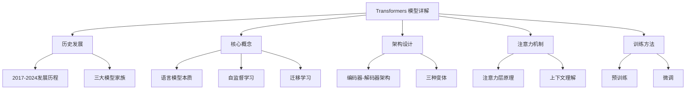
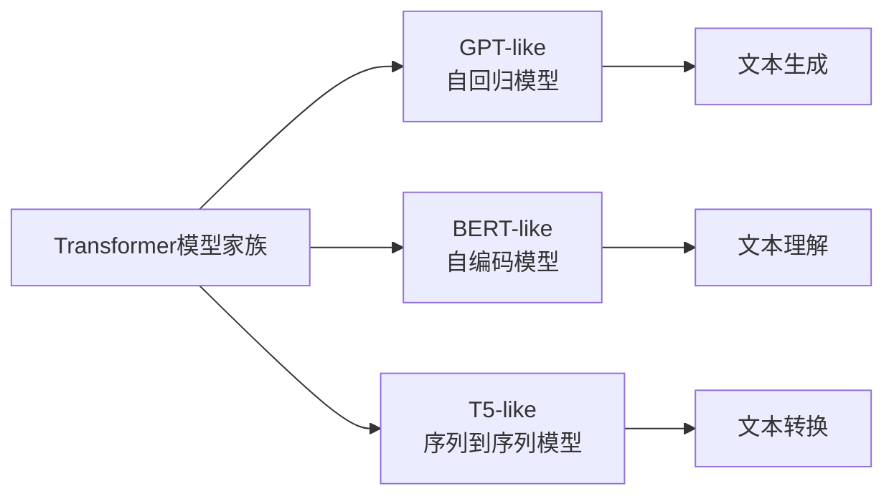
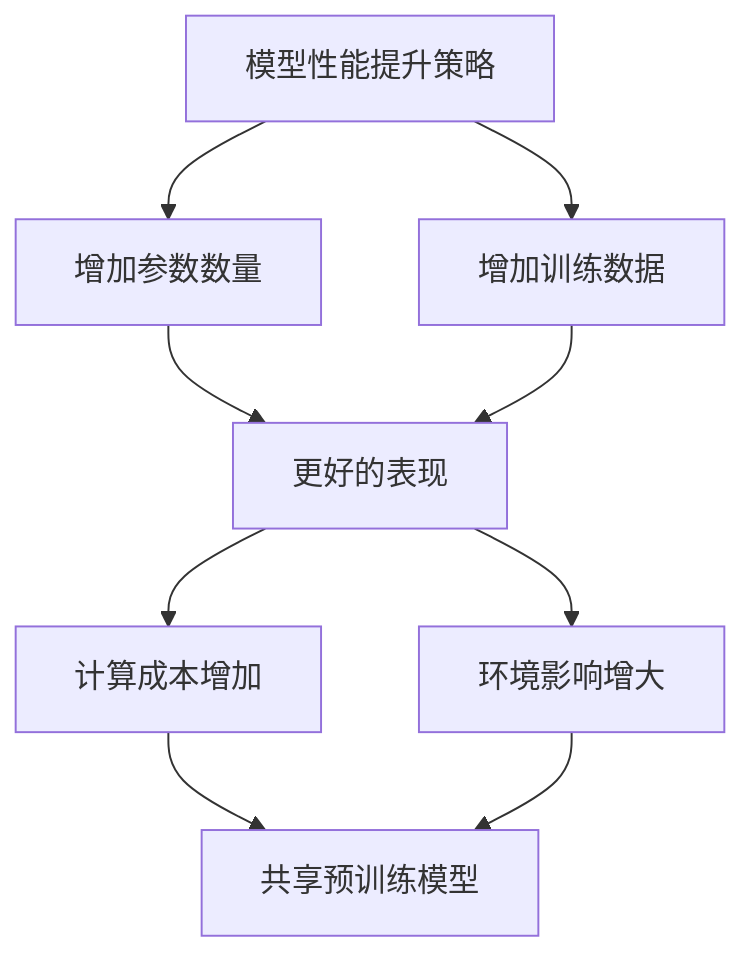
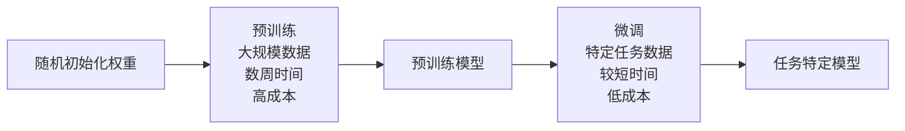
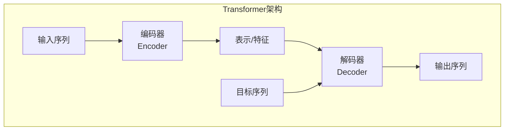
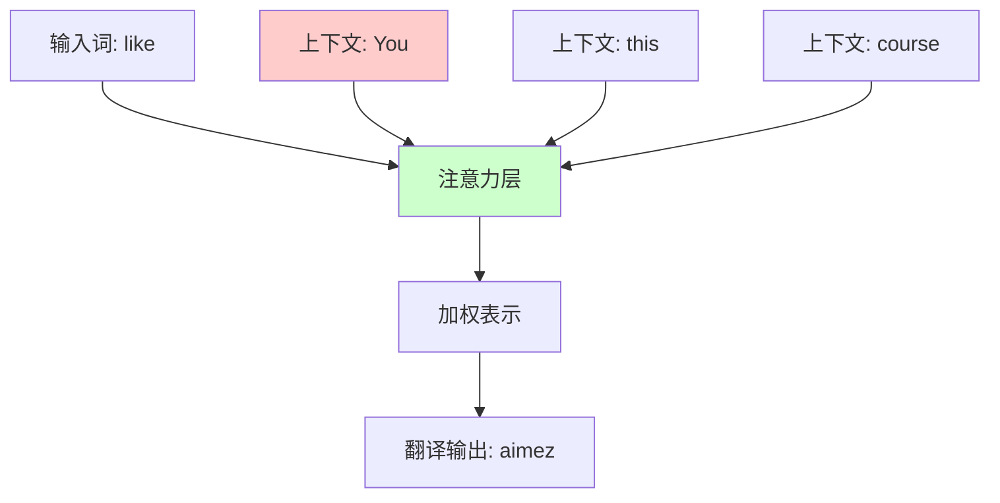
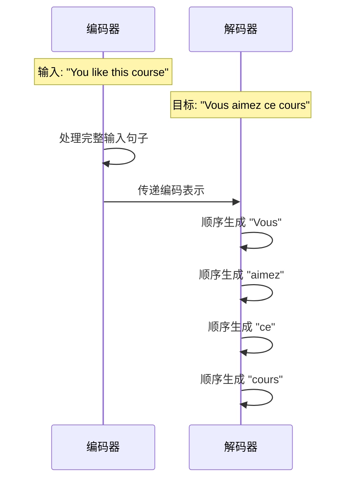

## 🕰️ Transformers 发展历史

### 重要里程碑

| 时间 | 模型 | 特点 |
|:---|:---|:---|
| 2017年6月 | **Transformer** | 首次提出，专注翻译任务 |
| 2018年6月 | **GPT** | 首个预训练Transformer，微调用于各种NLP任务 |
| 2018年10月 | **BERT** | 双向编码器，擅长句子理解 |
| 2019年2月 | **GPT-2** | GPT的改进版本，因伦理考虑延迟发布 |
| 2019年10月 | **T5** | 序列到序列多任务模型 |
| 2020年5月 | **GPT-3** | 大规模模型，支持零样本学习 |
| 2022年1月 | **InstructGPT** | 指令微调版本的GPT-3 |
| 2023年1月 | **Llama** | 多语言大语言模型 |
| 2023年3月 | **Mistral** | 70亿参数，使用分组查询注意力 |
| 2024年5月 | **Gemma 2** | 轻量级模型家族（2B-27B参数） |
| 2024年11月 | **SmolLM2** | 小型语言模型（135M-1.7B参数） |

### 三大模型家族



## 🧠 核心概念

### 语言模型本质

Transformers本质上是**语言模型**，通过以下方式训练：

- **大规模原始文本数据**：使用互联网上的大量文本
- **自监督学习**：无需人工标注，从输入自动计算目标
- **统计语言理解**：学习语言的统计规律和模式

### 自监督学习任务

#### 1. 因果语言建模 (Causal Language Modeling)
```
输入: "The cat sat on the"
目标: 预测下一个词 "mat"
```

#### 2. 掩码语言建模 (Masked Language Modeling)
```
输入: "The cat [MASK] on the mat"
目标: 预测被掩码的词 "sat"
```

### 模型规模趋势



## 🔄 迁移学习

### 预训练 vs 微调



### 迁移学习优势

1. **知识迁移**：预训练模型已具备语言理解能力
2. **数据效率**：微调需要的数据量大大减少
3. **资源节约**：时间、计算资源、环境成本都更低
4. **性能提升**：通常比从零开始训练效果更好

## 🏗️ Transformer 架构

### 基本结构




## 🎯 注意力机制

### 核心思想

> **"Attention Is All You Need"** - 注意力是关键

注意力层告诉模型在处理每个词时应该**关注**句子中的哪些特定词语。

### 翻译示例

```
英文: "You like this course"
法文: "Vous aimez ce cours"
```

翻译"like"时需要注意：
- **"You"** → 确定动词变位形式
- 其他词语相对不重要

翻译"this"时需要注意：
- **"course"** → 确定阴性/阳性形式

### 注意力工作原理



## 🔧 原始架构详解

### 训练过程



### 注意力掩码

- **编码器**：可以看到整个输入句子
- **解码器**：只能看到已生成的部分（防止"作弊"）

## 📖 术语说明

### 架构 vs 检查点 vs 模型

| 术语 | 定义 | 示例 |
|:---|:---|:---|
| **架构** (Architecture) | 模型的骨架结构 | BERT架构 |
| **检查点** (Checkpoint) | 特定的训练权重 | bert-base-cased |
| **模型** (Model) | 泛指，可指架构或检查点 | BERT模型 |

---


