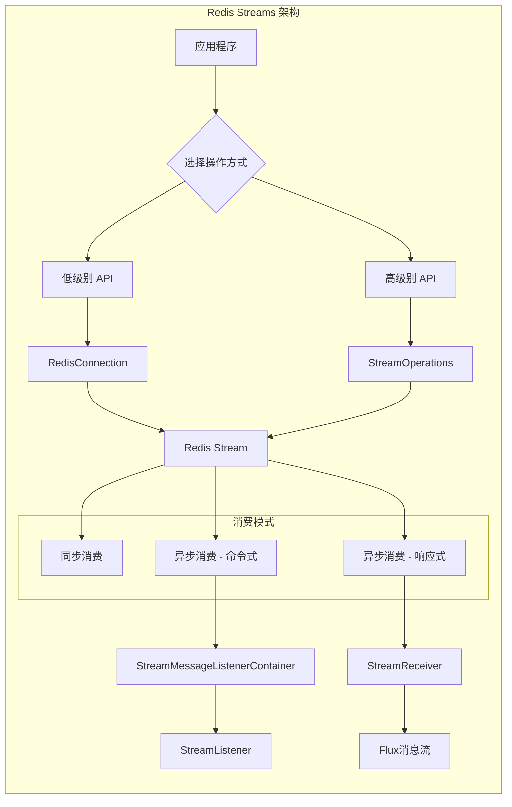

# Redis Streams 文档

## 概述

Redis Streams 是以抽象方式模拟日志数据结构的功能。通常，日志是仅追加的数据结构，可以从开始位置、随机位置或通过流式传输新消息来消费。

Redis Streams 的功能大致可分为两个领域：
- **追加记录**
- **消费记录**

### 与 Pub/Sub 的区别

虽然这种模式与 Pub/Sub 有相似之处，但主要区别在于：

| 特性 | Pub/Sub | Redis Streams |
|------|---------|---------------|
| 消息持久性 | 瞬态消息（错过就丢失） | 持久化、仅追加的数据类型 |
| 消息保留 | 不保留 | 保留消息直到流被修剪 |
| 消费方式 | 服务器端订阅，Redis 推送消息 | 需要主动轮询 |

## 核心功能

### 1. 追加记录（Appending）

发送记录可以使用低级别的 `RedisConnection` 或高级别的 `StreamOperations`：

```java
// 通过 connection 追加消息
RedisConnection con = …
byte[] stream = …
ByteRecord record = StreamRecords.rawBytes(…).withStreamKey(stream);
con.xAdd(record);

// 通过 RedisTemplate 追加消息
RedisTemplate template = …
StringRecord record = StreamRecords.string(…).withStreamKey("my-stream");
template.opsForStream().add(record);
```

> 💡 **注意**：流记录以 Map（键值对元组）作为有效载荷。追加记录到流会返回 `RecordId`，可用作进一步引用。

### 2. 消费记录（Consuming）

消费端可以消费一个或多个流。Redis Streams 提供了读取命令，允许：
- 从流内容的任意位置消费（随机访问）
- 消费流末尾之外的新流记录

#### 2.1 同步接收

```java
// 通过 RedisTemplate 读取消息
RedisTemplate template = …

// 普通读取
List<MapRecord<K, HK, HV>> messages = template.opsForStream().read(
    StreamReadOptions.empty().count(2),
    StreamOffset.latest("my-stream")
);

// 消费者组读取
List<MapRecord<K, HK, HV>> messages = template.opsForStream().read(
    Consumer.from("my-group", "my-consumer"),
    StreamReadOptions.empty().count(2),
    StreamOffset.create("my-stream", ReadOffset.lastConsumed())
);
```

> ⚠️ **警告**：Redis 中的订阅命令可能是阻塞的。调用 `xRead` 会导致当前线程阻塞，直到读取命令超时或接收到消息。

#### 2.2 异步接收 - 消息监听容器

Spring Data 提供两种实现：

##### 命令式编程模型：StreamMessageListenerContainer

```java
// 实现 StreamListener 接口
class ExampleStreamListener implements StreamListener<String, MapRecord<String, String, String>> {
    @Override
    public void onMessage(MapRecord<String, String, String> message) {
        System.out.println("MessageId: " + message.getId());
        System.out.println("Stream: " + message.getStream());
        System.out.println("Body: " + message.getValue());
    }
}

// 或使用 Lambda 形式
StreamListener listener = message -> {
    System.out.println("MessageId: " + message.getId());
    System.out.println("Stream: " + message.getStream());
    System.out.println("Body: " + message.getValue());
};

// 创建容器并注册订阅
RedisConnectionFactory connectionFactory = …
StreamListener<String, MapRecord<String, String, String>> streamListener = …

StreamMessageListenerContainerOptions<String, MapRecord<String, String, String>> containerOptions = 
    StreamMessageListenerContainerOptions
        .builder()
        .pollTimeout(Duration.ofMillis(100))
        .build();

StreamMessageListenerContainer<String, MapRecord<String, String, String>> container = 
    StreamMessageListenerContainer.create(connectionFactory, containerOptions);

Subscription subscription = container.receive(
    StreamOffset.fromStart("my-stream"), 
    streamListener
);
```

##### 响应式编程模型：StreamReceiver

```java
// 创建 StreamReceiver
ReactiveRedisConnectionFactory connectionFactory = …

StreamReceiverOptions<String, MapRecord<String, String, String>> options = 
    StreamReceiverOptions.builder()
        .pollTimeout(Duration.ofMillis(100))
        .build();
        
StreamReceiver<String, MapRecord<String, String, String>> receiver = 
    StreamReceiver.create(connectionFactory, options);

// 接收消息流
Flux<MapRecord<String, String, String>> messages = 
    receiver.receive(StreamOffset.fromStart("my-stream"));

// 处理消息
messages.doOnNext(message -> {
    System.out.println("MessageId: " + message.getId());
    System.out.println("Stream: " + message.getStream());
    System.out.println("Body: " + message.getValue());
}).subscribe();
```

> 💡 **提示**：响应式接收器使用背压信号来激活和停用轮询。当需求满足时，订阅会暂停轮询，直到订阅者发出进一步需求信号。

## 高级特性

### 3. 确认策略（Acknowledge Strategies）

当通过消费者组读取消息时，服务器会记住消息已传递并将其添加到待处理条目列表（PEL）。

```java
StreamMessageListenerContainer<String, MapRecord<String, String, String>> container = ...

container.receive(
    Consumer.from("my-group", "my-consumer"), 
    StreamOffset.create("my-stream", ReadOffset.lastConsumed()),
    msg -> {
        // 处理消息...
        
        // 手动确认消息
        redisTemplate.opsForStream().acknowledge("my-group", msg); 
    }
);
```

> 💡 **提示**：使用 `receiveAutoAck` 代替 `receive` 可以在接收时自动确认消息。

### 4. ReadOffset 策略

| ReadOffset 类型 | 说明 | 独立模式 | 消费者组模式 |
|----------------|------|----------|-------------|
| `ReadOffset.latest()` | 读取最新消息 | 读取最新消息 | 读取最新消息 |
| `ReadOffset.from(…)` | 从特定消息ID后读取 | 使用最后看到的消息作为下一个MessageId | 使用最后看到的消息作为下一个MessageId |
| `ReadOffset.lastConsumed()` | 从最后消费的消息后读取 | 使用最后看到的消息作为下一个MessageId | 根据消费者组的最后消费消息 |

### 5. 序列化

流记录需要序列化为二进制格式：

| 流属性 | 序列化器 | 描述 |
|--------|----------|------|
| key | `keySerializer` | 用于 `Record#getStream()` |
| field | `hashKeySerializer` | 用于有效载荷中的每个映射键 |
| value | `hashValueSerializer` | 用于有效载荷中的每个映射值 |

### 6. 对象映射

#### 6.1 简单值

```java
// 添加简单值
ObjectRecord<String, String> record = StreamRecords.newRecord()
    .in("my-stream")
    .ofObject("my-value");

redisTemplate()
    .opsForStream()
    .add(record);
// 执行: XADD my-stream * "_class" "java.lang.String" "_raw" "my-value"

// 读取简单值
List<ObjectRecord<String, String>> records = redisTemplate()
    .opsForStream()
    .read(String.class, StreamOffset.fromStart("my-stream"));
```

#### 6.2 复杂值

复杂值可以通过三种方式添加到流中：

1. **转换为简单值**（如 JSON 字符串）
2. **使用合适的 RedisSerializer 序列化**
3. **使用 HashMapper 转换为 Map**

```java
// 使用默认 ObjectHashMapper
ObjectRecord<String, User> record = StreamRecords.newRecord()
    .in("user-logon")
    .ofObject(new User("night", "angel"));

redisTemplate()
    .opsForStream()
    .add(record);
// 执行: XADD user-logon * "_class" "com.example.User" "firstname" "night" "lastname" "angel"

// 使用自定义 HashMapper
redisTemplate()
    .opsForStream(new Jackson2HashMapper(true))
    .add(record);
// 执行: XADD user-logon * "firstname" "night" "@class" "com.example.User" "lastname" "angel"
```

#### 6.3 配置 MappingContext

```java
@Bean
RedisMappingContext redisMappingContext() {
    RedisMappingContext ctx = new RedisMappingContext();
    ctx.setInitialEntitySet(Collections.singleton(Person.class));
    return ctx;
}

@Bean
RedisConverter redisConverter(RedisMappingContext mappingContext) {
    return new MappingRedisConverter(mappingContext);
}

@Bean
ObjectHashMapper hashMapper(RedisConverter converter) {
    return new ObjectHashMapper(converter);
}

@Bean
StreamMessageListenerContainer streamMessageListenerContainer(
        RedisConnectionFactory connectionFactory, 
        ObjectHashMapper hashMapper) {
    
    StreamMessageListenerContainerOptions<String, ObjectRecord<String, Object>> options = 
        StreamMessageListenerContainerOptions.builder()
            .objectMapper(hashMapper)
            .build();

    return StreamMessageListenerContainer.create(connectionFactory, options);
}
```

## 架构图



## 最佳实践

1. **选择合适的消费模式**
   - 简单场景使用同步接收
   - 高并发场景使用异步接收
   - 响应式应用使用 StreamReceiver

2. **合理设置 ReadOffset**
   - 确保不丢失消息时使用 `lastConsumed()` 或特定消息ID
   - 实时性要求高时使用 `latest()`

3. **正确处理消息确认**
   - 消费者组模式下务必确认消息
   - 根据业务需求选择手动或自动确认

4. **序列化策略**
   - 确保序列化器配置正确
   - 复杂对象考虑使用 HashMapper

5. **容器配置优化**
   - 合理设置轮询超时时间
   - 运行时动态管理订阅

