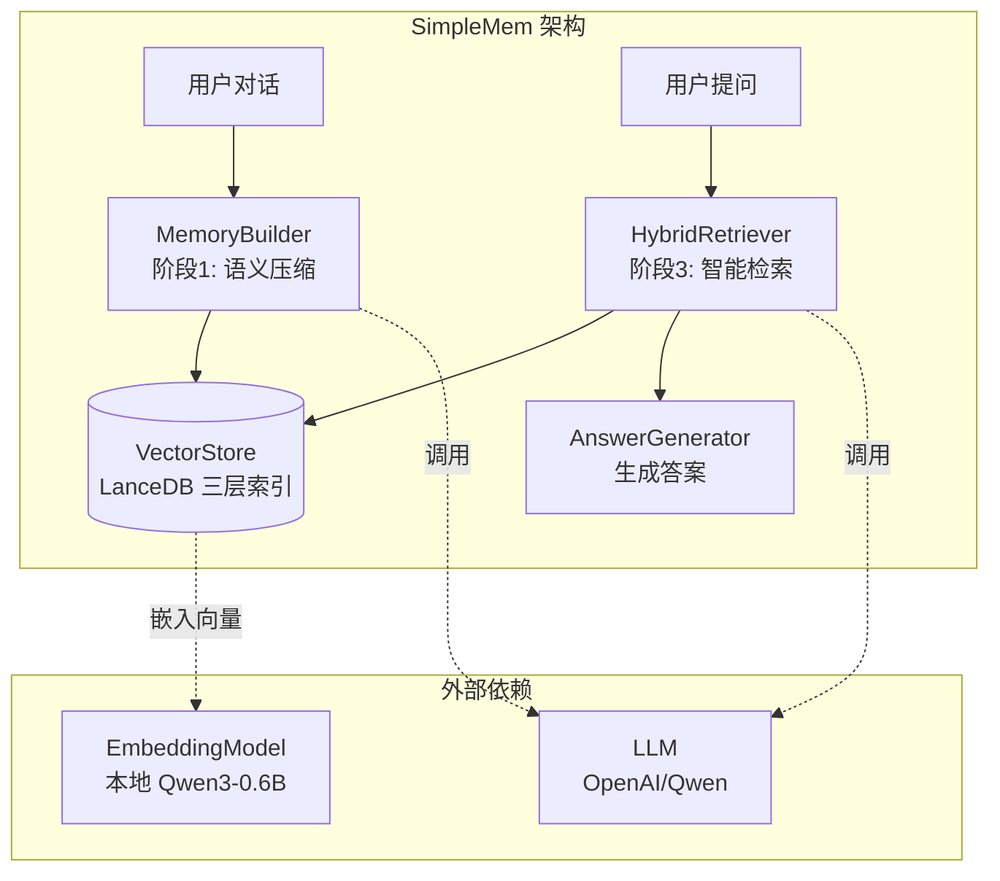
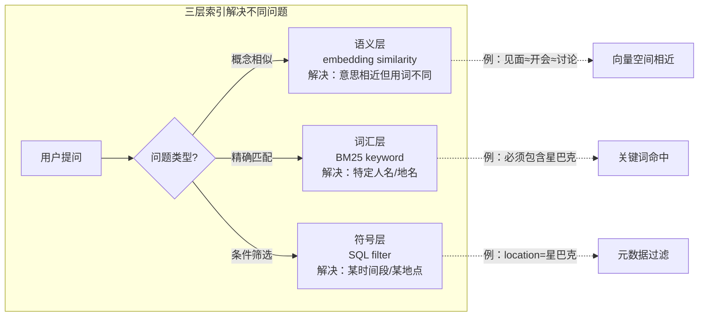
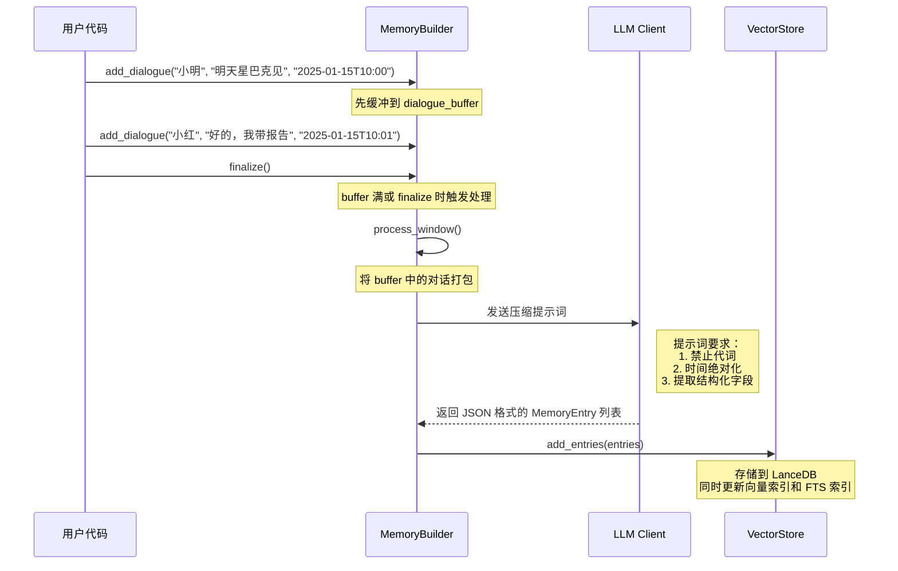
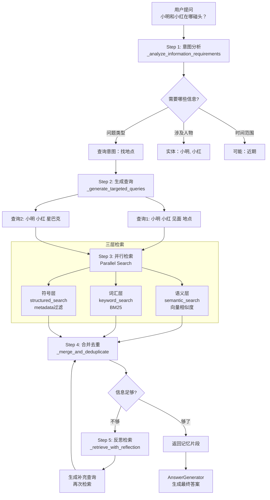
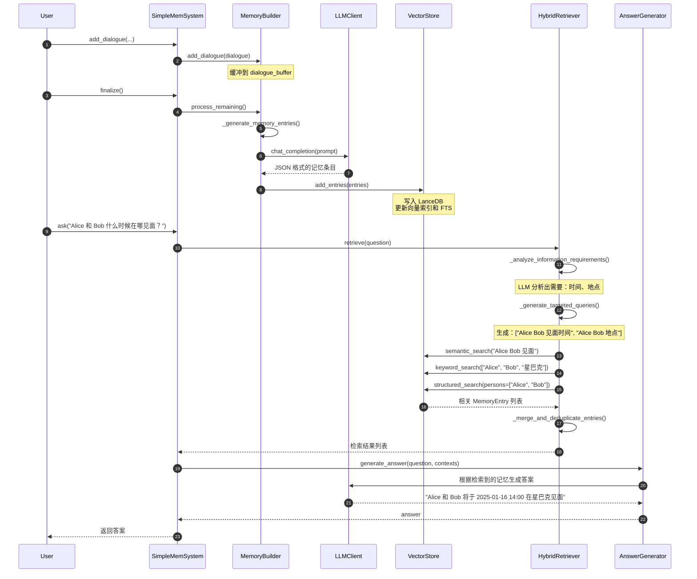

## 1：整体架构

### 1.1 一句话理解 SimpleMem

SimpleMem 解决的核心问题是：**如何让 AI 记住海量对话，但检索时只花最少的 token？**

传统做法：把全部对话历史塞进 Prompt → _token 爆炸，成本高昂_

SimpleMem 做法：**先压缩存储，再智能检索** → _token 省 30 倍_

---

### 1.2 三大核心组件




| 组件 | 作用 | 技术选型 |
|------|------|----------|
| **LLM** | 理解语义、压缩信息、生成答案 | OpenAI API / Qwen |
| **Embedding** | 把文字转成向量（1024维） | 本地 Qwen3-Embedding-0.6B |
| **VectorStore** | 存储+检索向量+元数据 | LanceDB（嵌入式，无需服务器） |

---

## 2.：数据模型 —— 理解"记忆单元"

### 2.1 从生活例子理解

想象你和朋友的聊天记录：

**原始对话（ messy ）：**
```
小明：明天下午去星巴克聊聊？
小红：好啊，我带上那份报告
小明：行，2点见
```

**SimpleMem 压缩后（ structured ）：**
```json
{
  "lossless_restatement": "小明提议于2025-01-16T14:00:00在星巴克与小红见面，小红同意并会携带报告",
  "keywords": ["小明", "小红", "星巴克", "报告", "见面"],
  "timestamp": "2025-01-16T14:00:00",
  "location": "星巴克",
  "persons": ["小明", "小红"],
  "entities": ["报告"],
  "topic": "会议安排"
}
```

**关键变化：**
- ❌ "明天" → ✅ "2025-01-16"（**时间绝对化**）
- ❌ "去" → ✅ "星巴克"（**地点明确化**）
- ❌ "聊聊" → ✅ "见面"（**行为具体化**）

### 2.2 代码中的数据结构

```python
# models/memory_entry.py

class MemoryEntry(BaseModel):
    """
    压缩后的记忆单元 - 三层索引设计
    """
    entry_id: str  # UUID 唯一标识

    # ========== 语义层（Semantic）==========
    # 用于：向量相似度搜索
    # 技术：1024维向量嵌入
    lossless_restatement: str  # "完整、无歧义的陈述句"

    # ========== 词汇层（Lexical）==========
    # 用于：BM25 关键词匹配
    # 技术：Tantivy 全文检索
    keywords: List[str]  # ["小明", "小红", "星巴克"]

    # ========== 符号层（Symbolic）==========
    # 用于：SQL 精确过滤
    # 技术：元数据字段过滤
    timestamp: Optional[str]  # "2025-01-16T14:00:00"
    location: Optional[str]   # "星巴克"
    persons: List[str]        # ["小明", "小红"]
    entities: List[str]       # ["报告"]
    topic: Optional[str]      # "会议安排"
```

### 2.3 为什么这样设计？




**举个例子：**
- 问："小明和小红在哪碰头？" → 语义层找"碰头"≈"见面"≈"讨论"
- 问："在星巴克发生了什么？" → 词汇层精确匹配"星巴克"
- 问："昨天有哪些会议？" → 符号层过滤 timestamp 范围

---

## 3：阶段1 —— 语义结构化压缩

### 3.1 核心流程图



### 3.2 关键代码解析：`MemoryBuilder._generate_memory_entries()`

```python
def _generate_memory_entries(self, dialogues: List[Dialogue]) -> List[MemoryEntry]:
    """
    隐式语义密度门控：Φ_gate(W) → {m_k}

    说人话：用 LLM 把一堆对话变成结构化记忆条目
    """
    # Step 1: 拼接对话文本
    dialogue_text = "\n".join([str(d) for d in dialogues])
    # 结果：
    # [2025-01-15T10:00:00] 小明: 明天星巴克见
    # [2025-01-15T10:01:00] 小红: 好的，我带报告

    # Step 2: 构建提示词（核心！）
    prompt = self._build_extraction_prompt(dialogue_text, ...)

    # Step 3: 调用 LLM
    response = self.llm_client.chat_completion(messages)

    # Step 4: 解析为 MemoryEntry 对象
    entries = self._parse_llm_response(response)
    return entries
```

### 3.3 提示词设计的艺术

为什么 SimpleMem 效果好？**提示词工程是关键**。

```python
# 核心提示词（简化版）
prompt = """
Your task is to extract all valuable information from dialogues.

[Requirements]
1. **Force Disambiguation**:
   - PROHIBIT pronouns: he, she, it, they, this, that
   - PROHIBIT relative time: yesterday, today, tomorrow, last week

2. **Lossless Information**:
   - Each entry must be a complete, independent sentence

3. **Precise Extraction**:
   - timestamp: ISO 8601 format (convert relative to absolute!)
   - location: specific place name
   - persons: all names mentioned

[Example]
Input: "[2025-11-15T14:30:00] Alice: let's meet at Starbucks tomorrow at 2pm"
Output: {
  "lossless_restatement": "Alice suggested at 2025-11-15T14:30:00 to meet at Starbucks on 2025-11-16T14:00:00",
  "timestamp": "2025-11-16T14:00:00",
  "location": "Starbucks",
  "persons": ["Alice"],
  ...
}
"""
```

**为什么这么设计？**

| 限制 | 目的 | 例子 |
|------|------|------|
| 禁止代词 | 解决**指代消解** | "他"→具体人名 |
| 时间绝对化 | 解决**时间锚定** | "明天"→具体日期 |
| 独立完整句 | 支持**单条检索** | 无需上下文即可理解 |

### 3.4 动手测试


```python
# 模拟 MemoryBuilder 的核心逻辑
dialogues = [
    {"speaker": "Alice", "content": "Let's meet tomorrow at 2pm", "timestamp": "2025-01-15T10:00:00"},
    {"speaker": "Bob", "content": "Sure, I'll bring the docs", "timestamp": "2025-01-15T10:01:00"}
]

# 拼接成提示词格式
dialogue_text = "\n".join([
    f"[{d['timestamp']}] {d['speaker']}: {d['content']}"
    for d in dialogues
])

print(dialogue_text)
# 输出：
# [2025-01-15T10:00:00] Alice: Let's meet tomorrow at 2pm
# [2025-01-15T10:01:00] Bob: Sure, I'll bring the docs

# 然后这个文本会被送进 LLM，要求转换成结构化 JSON
```

---

## 4：阶段3 —— 意图感知检索规划

### 4.1 从用户问题到答案的旅程




### 4.2 为什么需要"Planning"？

**传统 RAG 的问题：**
```
用户问："Alice 和 Bob 的会议和上次有什么区别？"

 naive 做法：直接用原问题做向量检索
 结果：向量数据库找不到"上次"指什么，检索失败
```

**SimpleMem 的做法（Planning）：**
```
Step 1: LLM 分析问题
  → "需要知道：1) 这次会议内容 2) 上次会议内容 3) 对比两者"

Step 2: 生成具体查询
  → 查询1: "Alice Bob meeting 2025-01-16"
  → 查询2: "Alice Bob previous meeting"
  → 查询3: "Alice Bob meeting comparison"

Step 3: 分别检索，合并结果
```

### 4.3 代码中的检索流程

```python
# core/hybrid_retriever.py

class HybridRetriever:
    def retrieve(self, query: str) -> List[MemoryEntry]:
        """
        主入口：执行意图感知检索
        """
        if self.enable_planning:
            return self._retrieve_with_planning(query)
        else:
            # 退化情况：直接语义搜索
            return self._semantic_search(query)

    def _retrieve_with_planning(self, query: str) -> List[MemoryEntry]:
        # Step 1: 分析信息需求
        information_plan = self._analyze_information_requirements(query)
        # 返回：{ "required_info": [...], "search_strategy": ... }

        # Step 2: 生成针对性查询
        search_queries = self._generate_targeted_queries(query, information_plan)
        # 返回：["查询1", "查询2", ...]

        # Step 3: 并行执行多种检索
        if self.enable_parallel_retrieval:
            all_results = self._execute_parallel_searches(search_queries)

        # Step 3.5: 混合检索（三层）
        semantic_results = self._semantic_search(query)
        keyword_results = self._keyword_search(query, query_analysis)
        structured_results = self._structured_search(query_analysis)

        # Step 4: 合并去重
        merged = self._merge_and_deduplicate_entries(
            all_results + semantic_results + keyword_results + structured_results
        )

        # Step 5: 反思检索（可选）
        if self.enable_reflection:
            merged = self._retrieve_with_intelligent_reflection(query, merged)

        return merged
```

### 4.4 Reflection 机制 —— 自我修正

```python
def _retrieve_with_intelligent_reflection(self, query, initial_results):
    """
    反思：当前检索结果足够回答问题吗？
    """
    for round in range(max_reflection_rounds):
        # 检查答案充分性
        status = self._check_answer_adequacy(query, current_results)

        if status == "sufficient":
            break  # 够了，停止
        elif status == "insufficient":
            # 不够，分析缺什么，生成补充查询
            additional_queries = self._generate_additional_queries(query, current_results)
            # 再次检索...

    return current_results
```

**举个例子：**
```
初始检索找到："小明和小红在星巴克见面"
用户问题："他们讨论了什么？"

反思检查：当前结果提到"见面"，但没提"讨论内容" → insufficient
补充查询：生成 "小明 小红 讨论 话题"、"小明 小红 报告"
再次检索 → 找到 "小红带了一份市场分析报告"
```

---

## 5：VectorStore 实现细节

### 5.1 LanceDB 表结构

```python
# database/vector_store.py

schema = pa.schema([
    pa.field("entry_id", pa.string()),           # UUID
    pa.field("lossless_restatement", pa.string()),  # 用于语义检索 + FTS
    pa.field("keywords", pa.list_(pa.string())),    # 用于词汇检索
    pa.field("timestamp", pa.string()),          # 用于符号过滤
    pa.field("location", pa.string()),           # 用于符号过滤
    pa.field("persons", pa.list_(pa.string())),     # 用于符号过滤
    pa.field("entities", pa.list_(pa.string())),    # 用于符号过滤
    pa.field("topic", pa.string()),              # 用于符号过滤
    pa.field("vector", pa.list_(pa.float32(), 1024))  # 1024维向量
])
```

### 5.2 三种检索的实现

```python
class VectorStore:
    def semantic_search(self, query: str, top_k: int = 25) -> List[MemoryEntry]:
        """
        语义检索：把查询转成向量，找最相似的
        """
        # 1. 查询向量化
        query_vector = self.embedding_model.embed(query)

        # 2. LanceDB 向量搜索
        results = self.table.search(query_vector) \
                         .metric("cosine") \
                         .limit(top_k) \
                         .to_pandas()

        return self._convert_to_entries(results)

    def keyword_search(self, keywords: List[str]) -> List[MemoryEntry]:
        """
        词汇检索：BM25 算法，精确匹配关键词
        """
        # 使用 Tantivy FTS 索引
        query = " OR ".join(keywords)  # "小明 OR 小红"
        results = self.table.search(query, query_type="fts") \
                         .limit(self.keyword_top_k) \
                         .to_pandas()
        return self._convert_to_entries(results)

    def structured_search(
        self,
        persons: Optional[List[str]] = None,
        location: Optional[str] = None,
        timestamp_range: Optional[Tuple] = None
    ) -> List[MemoryEntry]:
        """
        符号检索：SQL 式过滤
        """
        conditions = []
        if persons:
            # LanceDB 支持数组包含查询
            conditions.append(f"array_has_any(persons, {persons})")
        if location:
            conditions.append(f"location = '{location}'")
        if timestamp_range:
            conditions.append(f"timestamp BETWEEN '{start}' AND '{end}'")

        where_clause = " AND ".join(conditions)
        results = self.table.search() \
                         .where(where_clause) \
                         .limit(self.structured_top_k) \
                         .to_pandas()
        return self._convert_to_entries(results)
```

---

## 6：完整调用链追踪

让我们追踪一个完整的用户调用：

```python
# 用户代码
from main import SimpleMemSystem

system = SimpleMemSystem(clear_db=True)
system.add_dialogue("Alice", "明天2点星巴克见面", "2025-01-15T10:00:00")
system.add_dialogue("Bob", "好的我带报告", "2025-01-15T10:01:00")
system.finalize()
answer = system.ask("Alice 和 Bob 什么时候在哪见面？")
```



---

## 7：关键设计决策分析

### 7.1 为什么用 LLM 做压缩，而不是传统 NLP？

| 方案 | 优点 | 缺点 |
|------|------|------|
| **传统 NLP**<br/>(NER + 指代消解 + 时间解析) | 快、便宜、可控 | 准确率有限，难处理复杂语境 |
| **LLM 压缩**<br/>(SimpleMem) | 准确率高，理解上下文 | 慢、需要 API 调用 |

**SimpleMem 的权衡：**
- 存储时慢（调用 LLM）→ **换取** 检索时快（精准定位）
- 前期投入高 → **换取** 后期 token 省 30 倍

### 7.2 为什么用 LanceDB，而不是 Pinecone/Weaviate？

```
LanceDB 特点：
✅ 嵌入式（无需服务器， pip install 即用）
✅ 支持向量 + 全文检索 + SQL 过滤（三合一）
✅ 支持云存储（GCS/S3）
❌ 不如专用向量数据库性能极致

SimpleMem 场景：研究/个人项目 → LanceDB 足够
生产级高并发 → 可能需要迁移到 Pinecone/Milvus
```

### 7.3 Window Size = 40 怎么来的？

```python
# config.py
WINDOW_SIZE = 40  # 每个窗口处理40条对话
```

这是**超参数**：
- 太小 → LLM 调用频繁，成本高，上下文割裂
- 太大 → 单次 LLM 调用输入太长，可能遗漏信息

40 是作者在 LoCoMo 数据集上实验的经验值，你可以根据对话密度调整。

---

## 附录：源码阅读路线图

```
建议阅读顺序：

1. 入口理解
   └── main.py
       ├── SimpleMemSystem.__init__()      # 看组件初始化
       ├── add_dialogue() / finalize()     # 看存储流程
       └── ask()                           # 看检索流程

2. 数据模型
   └── models/memory_entry.py
       ├── MemoryEntry                     # 理解三层索引设计
       └── Dialogue                        # 原始输入结构

3. 阶段1：压缩存储
   └── core/memory_builder.py
       ├── add_dialogue()                  # 缓冲逻辑
       ├── process_window()                # 触发处理
       └── _generate_memory_entries()      # 核心：LLM 压缩

4. 阶段3：检索规划
   └── core/hybrid_retriever.py
       ├── retrieve()                      # 主入口
       ├── _retrieve_with_planning()       # 规划流程
       ├── _analyze_information_requirements()  # 意图分析
       └── _retrieve_with_reflection()     # 反思机制

5. 存储层
   └── database/vector_store.py
       ├── semantic_search()               # 向量检索
       ├── keyword_search()                # BM25 检索
       └── structured_search()             # 元数据过滤

6. 工具类
   ├── utils/llm_client.py               # OpenAI API 封装
   └── utils/embedding.py                # 本地嵌入模型

7. 评测（可选）
   └── test_locomo10.py                  # 看如何评测效果
```
