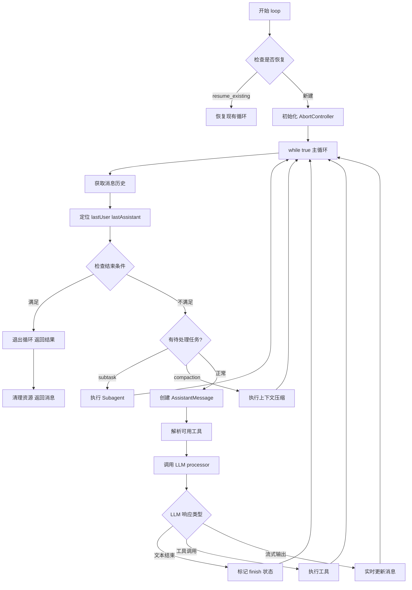
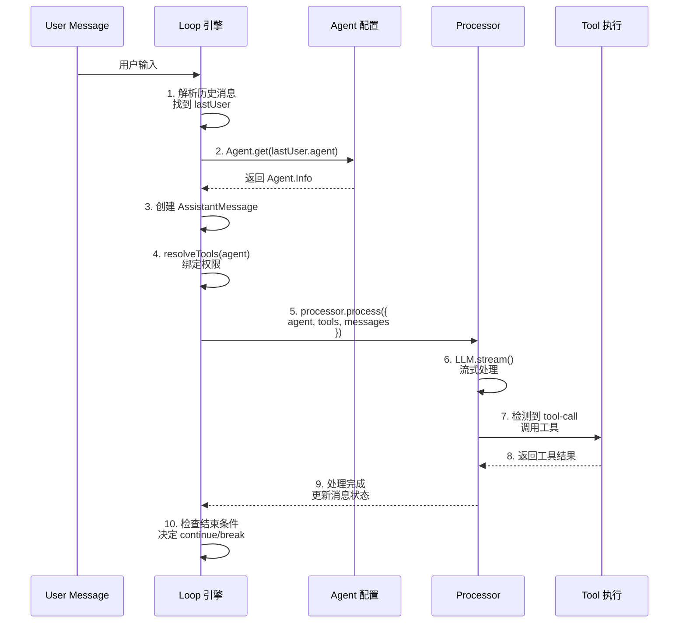
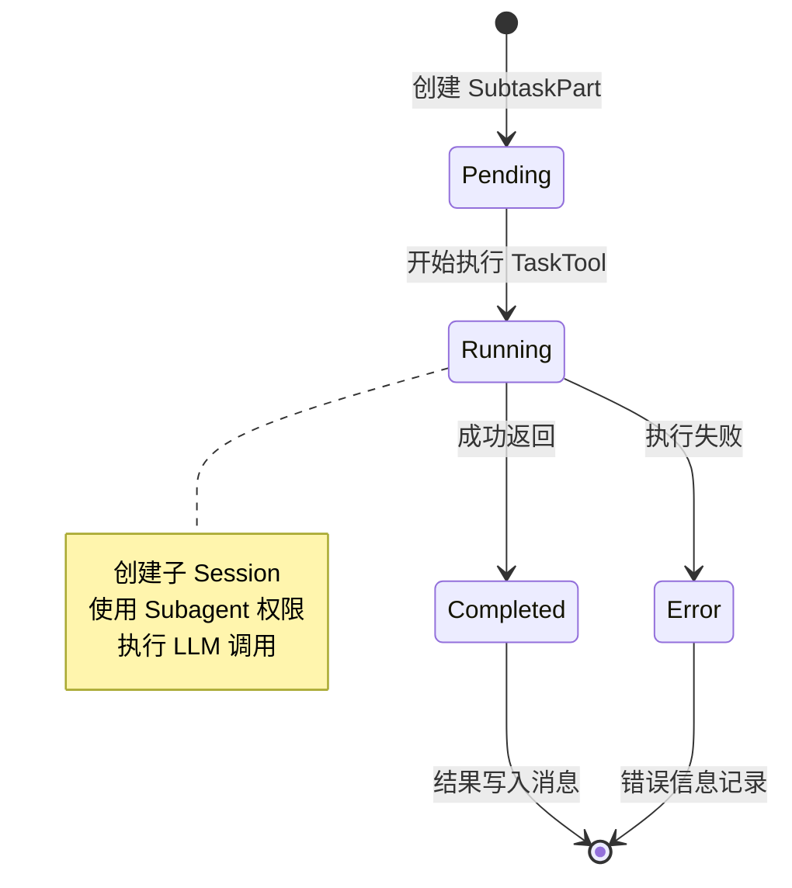
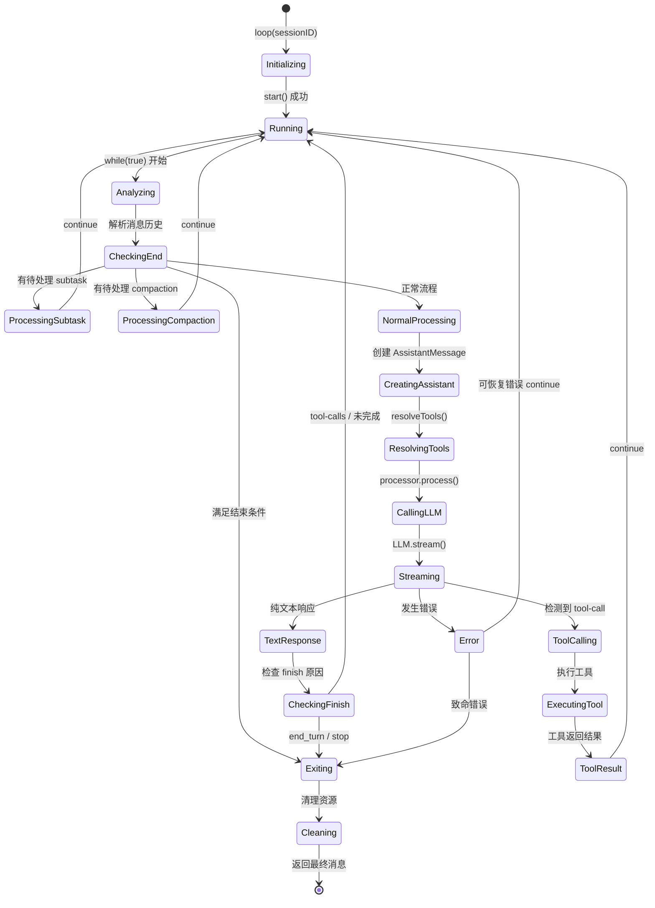
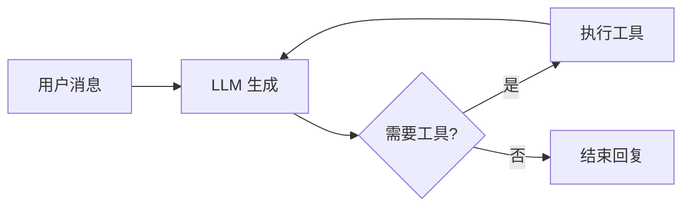
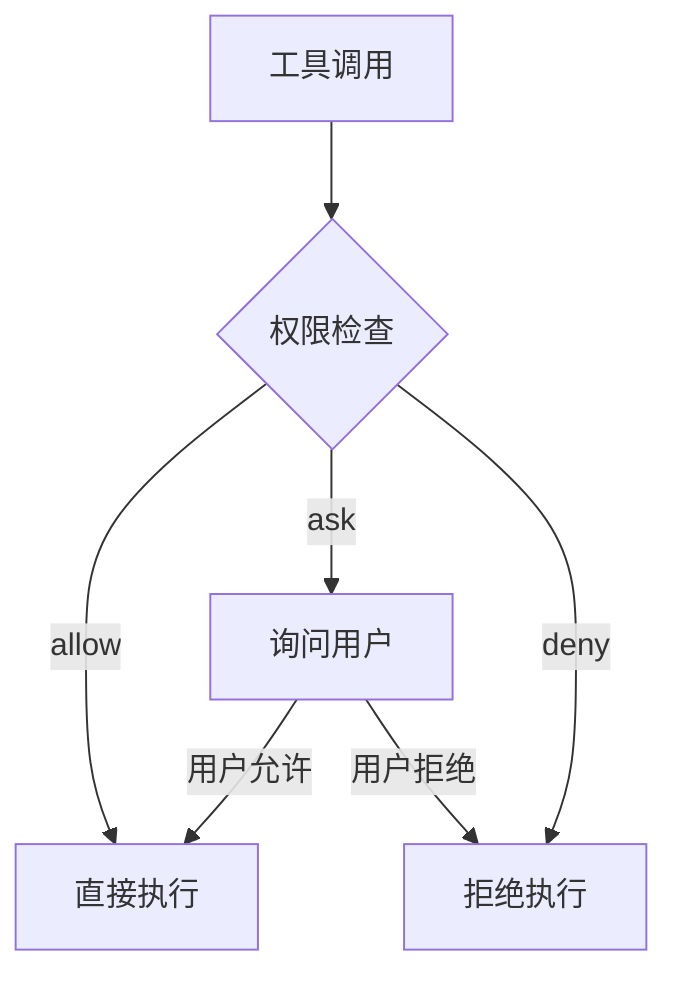
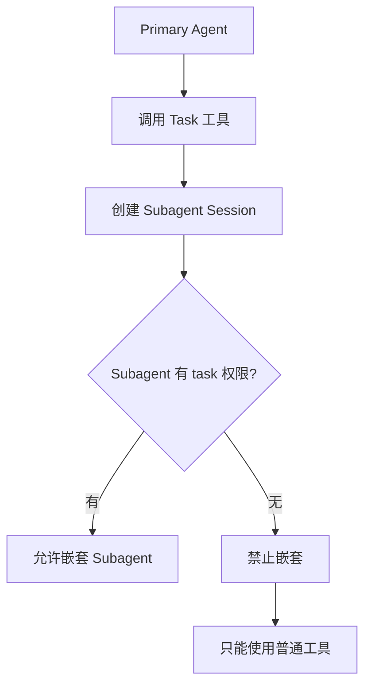

## 1. 函数概述

`loop` 是 OpenCode Agent 系统的**核心调度引擎**，负责驱动整个对话循环，管理消息流转、工具调用和 Subagent 执行。

**源码位置**：`packages/opencode/src/session/prompt.ts:266-663`

### 1.1 函数签名

```typescript
export const LoopInput = z.object({
  sessionID: Identifier.schema("session"),
  resume_existing: z.boolean().optional(),
})

export const loop = fn(LoopInput, async (input) => {
  // 主循环逻辑
})
```

### 1.2 核心职责

| 职责 | 说明 |
|------|------|
| **消息生命周期管理** | 维护用户消息与助手消息的交替流转 |
| **Agent 调度** | 加载 Agent 配置，绑定权限和工具 |
| **工具执行编排** | 处理 LLM 的工具调用，管理状态流转 |
| **Subagent 嵌套** | 支持 Task 工具创建子会话 |
| **上下文压缩** | 自动触发 compaction 处理长对话 |
| **循环终止判断** | 决定何时结束对话返回结果 |

---

## 2. 整体架构

### 2.1 流程概览



### 2.2 核心数据结构流转



---

## 3. 详细步骤分析

### 3.1 初始化阶段 (L266-280)

```typescript
export const loop = fn(LoopInput, async (input) => {
  const { sessionID, resume_existing } = input

  // 关键：AbortController 管理会话生命周期
  const abort = resume_existing ? resume(sessionID) : start(sessionID)
  if (!abort) {
    // 循环已在运行，加入等待队列
    return new Promise<MessageV2.WithParts>((resolve, reject) => {
      const callbacks = state()[sessionID].callbacks
      callbacks.push({ resolve, reject })
    })
  }

  using _ = defer(() => cancel(sessionID))  // 清理保障

  let step = 0
  const session = await Session.get(sessionID)
```

**关键点**：
- `start(sessionID)` 创建新的 AbortController
- `resume(sessionID)` 复用现有的（用于恢复中断的会话）
- 防止重复启动：如果循环已在运行，新请求加入 callbacks 队列等待

### 3.2 消息历史分析 (L285-302)

```typescript
while (true) {
  let msgs = await MessageV2.filterCompacted(MessageV2.stream(sessionID))

  let lastUser: MessageV2.User | undefined
  let lastAssistant: MessageV2.Assistant | undefined
  let lastFinished: MessageV2.Assistant | undefined
  let tasks: (MessageV2.CompactionPart | MessageV2.SubtaskPart)[] = []

  // 逆向遍历消息历史
  for (let i = msgs.length - 1; i >= 0; i--) {
    const msg = msgs[i]
    if (!lastUser && msg.info.role === "user") lastUser = msg.info as MessageV2.User
    if (!lastAssistant && msg.info.role === "assistant") lastAssistant = msg.info as MessageV2.Assistant
    if (!lastFinished && msg.info.role === "assistant" && msg.info.finish)
      lastFinished = msg.info as MessageV2.Assistant
    if (lastUser && lastFinished) break

    // 收集待处理任务
    const task = msg.parts.filter((part) => part.type === "compaction" || part.type === "subtask")
    if (task && !lastFinished) {
      tasks.push(...task)
    }
  }
```

**核心逻辑**：
- 从后向前扫描消息历史
- 定位最后一个用户消息（`lastUser`）
- 定位最后一个已完成回复（`lastFinished`）
- 收集 pending 的 subtask/compaction 任务

### 3.3 结束条件判断 (L305-312)

```typescript
// 结束条件：助手已回复且不是工具调用中间状态
if (
  lastAssistant?.finish &&
  !["tool-calls", "unknown"].includes(lastAssistant.finish) &&
  lastUser.id < lastAssistant.id
) {
  log.info("exiting loop", { sessionID })
  break
}
```

**结束条件详解**：

| 条件 | 含义 |
|------|------|
| `lastAssistant?.finish` | 助手消息已标记完成状态 |
| `!["tool-calls", "unknown"].includes(...)` | 不是"等待工具结果"的中间状态 |
| `lastUser.id < lastAssistant.id` | 助手回复的是最新消息 |

**finish 类型枚举**：
- `"end_turn"` - 正常结束对话
- `"stop"` - 被用户停止
- `"max_tokens"` - Token 耗尽
- `"tool-calls"` - 需要执行工具（不结束）
- `"unknown"` - 未知状态（继续）

### 3.4 Subtask 处理分支 (L339-478)

当检测到 `subtask` 类型 part 时，进入特殊处理：

```typescript
if (task?.type === "subtask") {
  const taskTool = await TaskTool.init()
  const taskModel = task.model ? await Provider.getModel(...) : model

  // 创建子会话的 AssistantMessage
  const assistantMessage = await Session.updateMessage({
    id: Identifier.ascending("message"),
    role: "assistant",
    parentID: lastUser.id,
    sessionID,
    mode: task.agent,      // 使用 subagent 的名称
    agent: task.agent,     // 如 "explore"
    // ...
  })

  // 创建 ToolPart 记录
  const part = await Session.updatePart({
    type: "tool",
    tool: TaskTool.id,
    callID: ulid(),
    state: {
      status: "running",
      input: {
        prompt: task.prompt,
        description: task.description,
        subagent_type: task.agent,
      },
    },
  })

  // 构建 Tool Context（关键：合并 subagent 权限）
  const taskCtx: Tool.Context = {
    agent: task.agent,
    sessionID,
    async ask(req) {
      await PermissionNext.ask({
        ...req,
        ruleset: PermissionNext.merge(taskAgent.permission, session.permission ?? []),
      })
    },
  }

  // 执行 Task 工具
  const result = await taskTool.execute(taskArgs, taskCtx)

  // 更新结果为完成状态
  await Session.updatePart({
    ...part,
    state: {
      status: "completed",
      output: result.output,
      // ...
    },
  })

  continue  // 回到循环开头
}
```

**Subtask 状态流转**：



### 3.5 正常处理流程 (L536-651)

如果没有待处理的 subtask/compaction，进入正常 LLM 调用：

```typescript
// 获取 Agent 配置
const agent = await Agent.get(lastUser.agent)
const maxSteps = agent.steps ?? Infinity
const isLastStep = step >= maxSteps

// 插入系统提醒（如 plan 模式提醒）
msgs = await insertReminders({ messages: msgs, agent, session })

// 创建处理器
const processor = SessionProcessor.create({
  assistantMessage: await Session.updateMessage({...}),
  sessionID,
  model,
  abort,
})

// 解析工具（绑定 Agent 权限）
const tools = await resolveTools({
  agent,
  session,
  model,
  bypassAgentCheck,  // 是否跳过权限检查（@agent 时）
  messages: msgs,
})

// 调用 LLM
const result = await processor.process({
  user: lastUser,
  agent,
  abort,
  sessionID,
  system: [...],
  messages: MessageV2.toModelMessages(sessionMessages, model),
  tools,
  model,
})

if (result === "stop") break
if (result === "compact") {
  await SessionCompaction.create({...})
  continue
}
```

### 3.6 工具解析与权限绑定 (L672-850)

`resolveTools` 是权限系统的关键接入点：

```typescript
async function resolveTools(input: {
  agent: Agent.Info        // Agent 配置（含 permission）
  session: Session.Info    // Session 权限
  ...
}) {
  const tools: Record<string, AITool> = {}

  for (const item of await ToolRegistry.tools(..., input.agent)) {
    tools[item.id] = tool({
      id: item.id,
      description: item.description,
      async execute(args, options) {
        const ctx = context(args, options)

        // 每个工具调用时都会执行权限检查
        await ctx.ask({
          permission: item.id,
          patterns: ["*"],
          ruleset: PermissionNext.merge(
            input.agent.permission,      // Agent 级别权限
            input.session.permission ?? []  // Session 级别权限
          ),
        })

        return await item.execute(args, ctx)
      },
    })
  }

  return tools
}
```

---

## 4. 状态流转全景图



---

## 5. 关键设计要点

### 5.1 循环驱动模型



- **ReAct 模式**：思考 -> 行动 -> 观察 -> 循环
- **状态持久化**：每次循环都从 MessageStore 读取最新状态
- **可中断恢复**：通过 AbortController 支持取消和恢复

### 5.2 权限检查点



检查发生在 `ctx.ask()`，合并了：
- Agent 配置的 permission
- Session 级别的 permission
- 工具的默认规则

### 5.3 嵌套限制



防止无限递归：Subagent 默认没有 `task` 权限，除非显式配置。

---

## 6. 源码阅读指南

### 推荐阅读顺序

1. **入口**：`prompt.ts:266` - `loop` 函数定义
2. **初始化**：`prompt.ts:269-280` - AbortController 管理
3. **主循环**：`prompt.ts:281` - `while (true)`
4. **消息分析**：`prompt.ts:285-302` - 历史消息扫描
5. **结束判断**：`prompt.ts:305-312` - 退出条件
6. **Subtask**：`prompt.ts:339-478` - 子代理执行
7. **正常处理**：`prompt.ts:536-651` - LLM 调用
8. **工具解析**：`prompt.ts:672-850` - `resolveTools`

### 关键代码行号速查

| 功能 | 行号 |
|------|------|
| 函数定义 | 266 |
| AbortController 管理 | 269-280 |
| 主循环开始 | 281 |
| 消息历史扫描 | 285-302 |
| 结束条件检查 | 305-312 |
| Subtask 处理 | 339-478 |
| Compaction 处理 | 509-518 |
| Agent 获取 | 537 |
| resolveTools 调用 | 582-590 |
| processor.process 调用 | 622-641 |
| 返回结果 | 654-662 |
