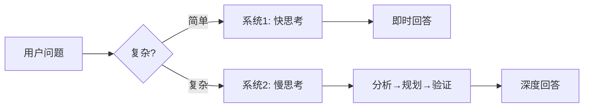
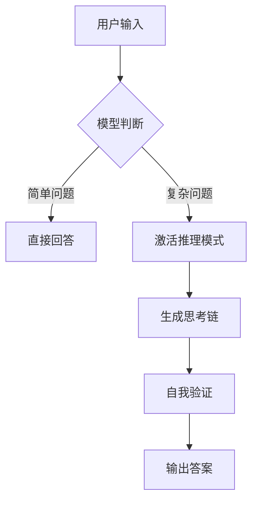
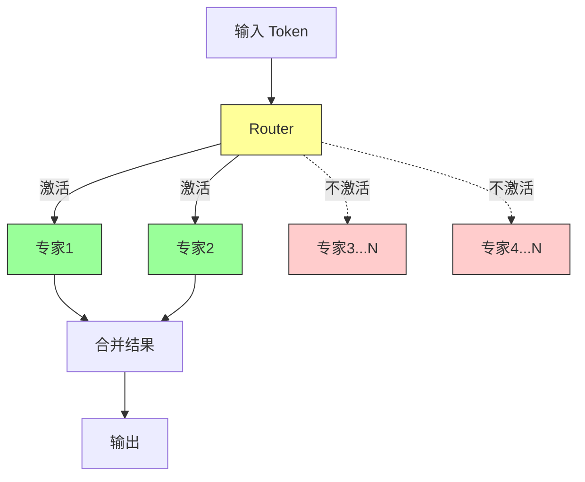
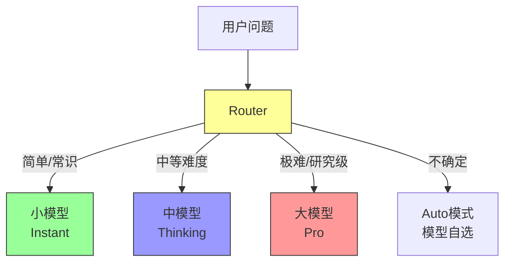
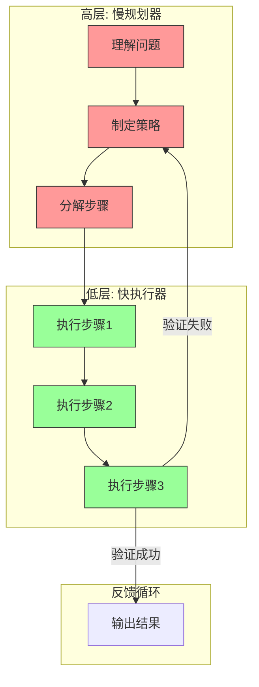
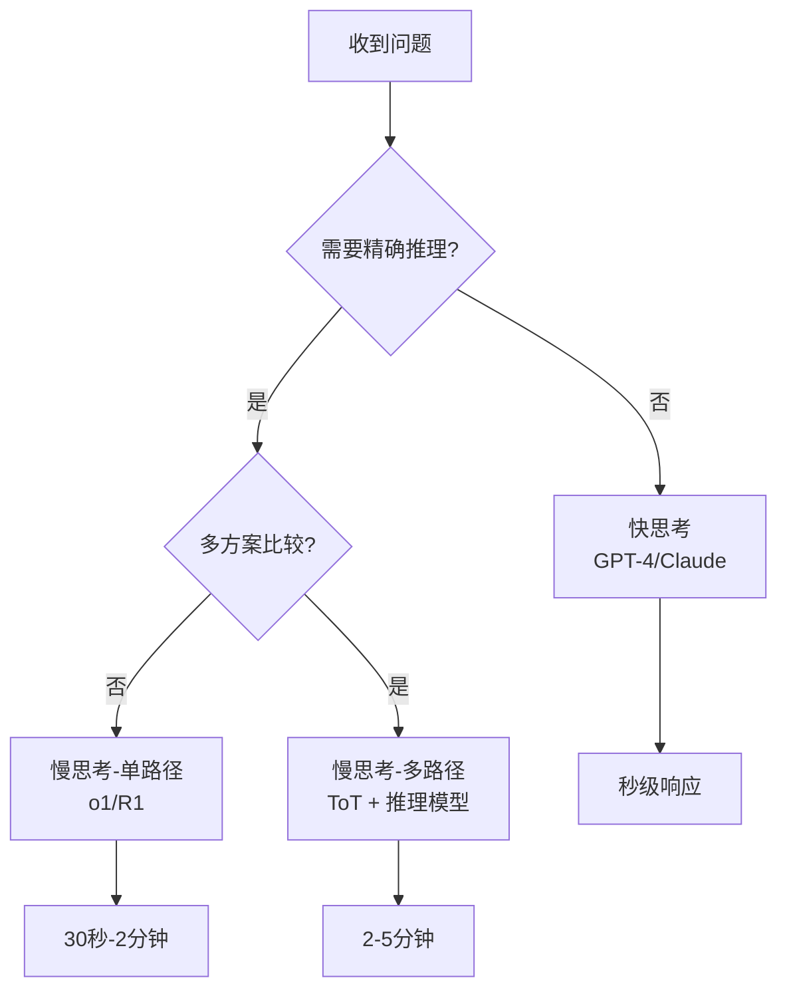
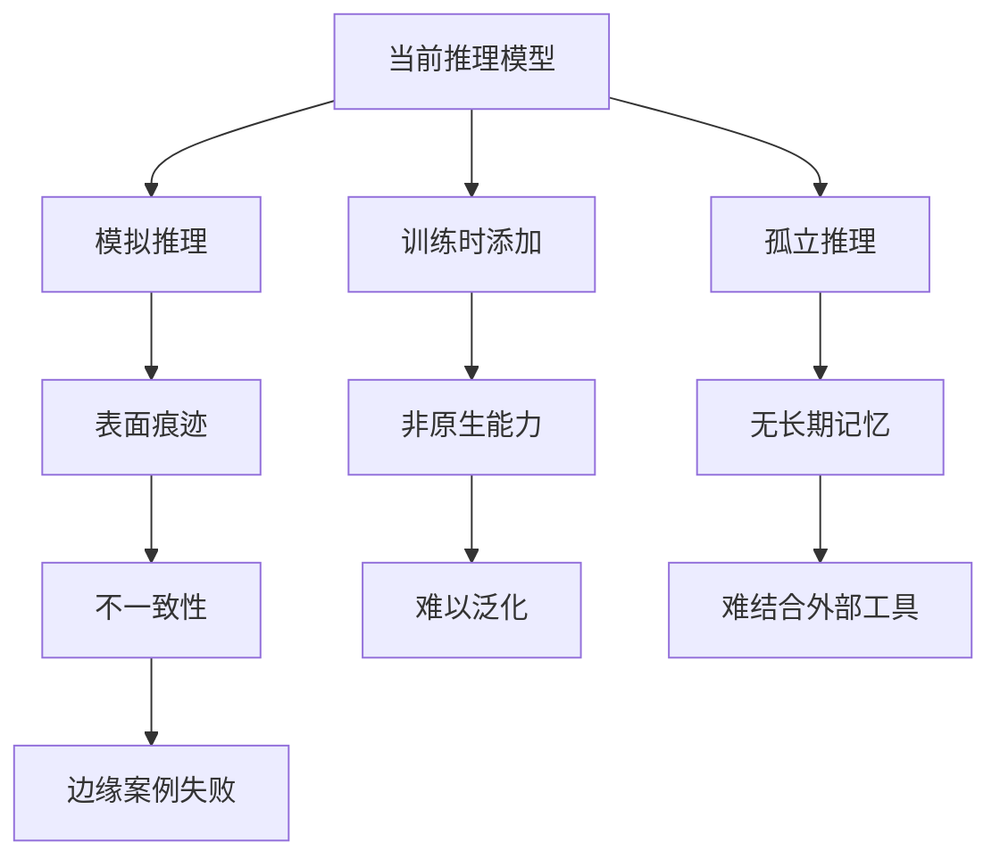
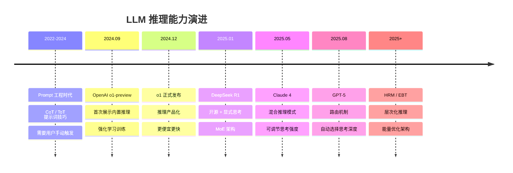

# LLM 推理模式 (Thinking Modes)

## 1. 核心概念：双系统理论

人脑有两种思考方式，LLM 也在走同样的路：



| 维度 | 系统1 (快) | 系统2 (慢) |
|------|-----------|-----------|
| **特点** | 直觉、自动、快速 | 逻辑、刻意、缓慢 |
| **人类例子** | 识别面孔、走路避障 | 解数学题、写论文 |
| **LLM 例子** | GPT-4 直接回答 | o1/R1 先思考再回答 |
| **时间** | 秒级 | 分钟级 |
| **准确率** | 简单任务高 | 复杂任务高 |

---

## 2. 为什么需要慢思考？

### 快思考的局限

**场景：解迷宫**

```
快思考模型 (GPT-4):
输入: "请找出从A到B的路径"
输出: "向右走，然后..." ❌ (经常走错)

慢思考模型 (R1/o1):
输入: "请找出从A到B的路径"
思考: 
  1. 分析地图结构
  2. 尝试路径A: 遇到死胡同 ❌
  3. 回溯，尝试路径B
  4. 验证路径B可达终点 ✓
输出: "正确路径是..." ✅
```

**关键区别**：慢思考会**试错、回溯、验证**，快思考直接给答案。

---

## 3. 慢思考的实现方式演进

### 阶段1: 提示词触发 (2022-2024)

通过特殊提示词强迫模型思考：


**常用技巧**：
- **CoT**: "Let's think step by step"
- **ToT**: "Generate 3 solutions and pick the best"
- **Few-shot**: 给示例展示思考格式

**问题**：
- ❌ 用户不知道何时该用
- ❌ 模型可能不按要求思考
- ❌ 需要反复尝试不同提示词

---

### 阶段2: 内置推理 (2024-至今)

模型通过训练**自动**进入思考模式：



**代表模型**：
- **OpenAI o1/o3**: 强化学习训练，内部思考不展示
- **DeepSeek-R1**: 开源，显式展示完整思考过程
- **Claude 4**: 可调节思考强度（低/中/高）

**优势**：
- ✅ 无需提示词技巧
- ✅ 比提示词触发更可靠
- ✅ 可处理更复杂问题

---

## 4. 技术架构对比

### 4.1 标准 Transformer (快思考)


**特点**：
- 每一层都处理全部参数
- 左到右依次生成 token
- 计算量 = 参数量 × token 数

---

### 4.2 MoE (Mixture of Experts) - 稀疏激活



**DeepSeek-R1 例子**：
- 总参数：671B
- 每次只激活：37B (5.5%)
- 效果：用 37B 的算力，获得 671B 的能力

**优势**：
- ✅ 计算效率高
- ✅ 可扩展到更大模型
- ✅ 专家可专门化（数学专家、代码专家等）

---

### 4.3 路由机制 (GPT-5)

智能判断该用哪种模式：



**Router 如何判断？**

| 信号 | 例子 | 决策 |
|------|------|------|
| 关键词 | "prove", "step-by-step", "debug" | → 深度思考 |
| 领域标签 | math, code, legal | → 专家模型 |
| 输入长度 | 长上下文 + 复杂约束 | → 更多思考时间 |
| 不确定性 | 模型对答案不确定 | → 多轮验证 |

---

### 4.4 HRM (分层推理模型) - 未来方向

模仿人脑层次化思考：



**关键创新**：
- 不同时间尺度：规划器慢，执行器快
- 嵌套循环：执行遇到问题，返回规划器重新规划
- 极小模型：27M 参数 >  frontier 大模型（推理任务）

---

## 5. 什么时候用什么？

### 决策树



### 具体场景对照

| 场景 | 推荐模式 | 为什么 |
|------|---------|--------|
| **问天气** | 快思考 |  factual lookup |
| **解方程** | 慢思考 | 需要逐步推导 |
| **写代码** | 慢思考 | 需要规划+验证 |
| **创意写作** | 快思考初稿 + 慢思考润色 | 创意快，修改慢 |
| **下棋** | ToT + 慢思考 | 需评估多种走法 |
| **医疗诊断** | 慢思考 + 多轮验证 | 高 stakes，不能错 |

---

## 6. 社区实战经验

### 核心观点

**质量 vs 速度** (kataryna91):
> "快速但错误的答案没用。如果不需要思考就能得到好答案，就不需要思考模型。"

**草稿纸效应** (kthepropogation):
> "模型一旦开始说话就难以改口。思考让模型在承诺前用草稿纸自我修正。"

**能力边界** (Lissanro):
> "DeepSeek V3 671B 配合 CoT 提示会失败的迷宫问题，R1 无需特殊提示就能解决。"

### 模型大小之争

| 观点          | 论据                           |
| ----------- | ---------------------------- |
| **小模型思考没用** | "傻瓜思考一分钟也不会变好" — GatePorters |
| **小模型受益更多** | "Qwen 从无法解方程到能解复杂问题" — [已删除] |

**实际观察**：
- 32B 推理模型 > 70B+ 非推理模型（在推理任务上）
- 思考可以**弥补**规模差距，但**不能无限弥补**
- 基础推理能力是底线

---

## 7. 局限与未来

### 当前问题



**具体表现**：
- ✅ 数学题能解对
- ❌ 稍微变个形式就错
- ✅ 代码能写对
- ❌ 长程规划会遗忘目标

### 未来方向

1. **原生推理**：从训练初期就嵌入推理能力
2. **层次化**：HRM 的慢规划 + 快执行
3. **能量优化**：EBT 的迭代稳定机制
4. **神经符号结合**：连接主义 + 符号逻辑

---

## 8. 时间线总结



---

## 参考

- Reddit r/LocalLLaMA 讨论
- [To Think or not to Think](https://www.dliangthinks.me/technology/reasoning/) - Dong Liang
