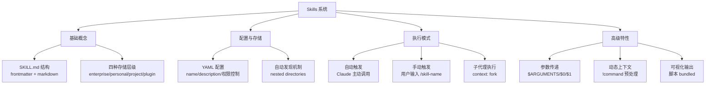

**阅读日期**: 2026-03-11
**文章来源**: Claude Code 官方技能文档

---

## 阶段1：快速定位

### 一句话总结
这篇文档定义了 Claude Code 的 Skill 系统——一个通过结构化目录 + YAML 配置 + Markdown 指令来扩展 Claude 能力的开放标准，让开发者可以创建、管理和共享自定义命令。

### 结构地图（Mermaid）



### 核心例子
作者用了 **「代码库可视化器」** 作为完整示例：
- 创建一个 skill 目录 `codebase-visualizer/`
- 编写 `Python` 脚本扫描目录结构
- 生成可交互的 `HTML` 树状图
- 展示 collapsible directories、file sizes、type colors

这个例子演示了 Skill 如何结合脚本实现超越纯提示词的能力。

---

## 阶段2：深度拆解

### Level 1: 表面 → 作者在做什么？

Claude Code 正在将「自定义命令」系统升级为「技能」系统：

1. **统一格式**: 之前是 `.claude/commands/*.md`，现在是 `.claude/skills/<skill-name>/SKILL.md`
2. **标准化配置**: 通过 YAML frontmatter 定义元数据（名称、描述、权限、模型等）
3. **开放标准**: 遵循 Agent Skills 开放标准（跨 AI 工具兼容）
4. **能力扩展**: 支持 bundled scripts、templates、examples 等辅助文件

**关键差异对比**:

| 特性 | 旧 Commands | 新 Skills |
|------|-------------|-----------|
| 文件位置 | `.claude/commands/*.md` | `.claude/skills/<name>/SKILL.md` |
| 配置方式 | 简单 frontmatter | 完整 YAML + markdown |
| 辅助文件 | 不支持 | 支持 scripts/templates/examples |
| 子代理执行 | 不支持 | `context: fork` |
| 动态上下文 | 不支持 | `!command` 预处理 |

### Level 2: 机制 → 具体怎么实现的？

**Skill 的物理结构**:
```
my-skill/
├── SKILL.md           # 主入口（必需）
├── template.md        # Claude 填充的模板
├── examples/
│   └── sample.md      # 期望输出格式示例
└── scripts/
    └── helper.py      # 可执行脚本
```

**SKILL.md 的双层结构**:

```yaml
---
name: my-skill                    # 标识符（小写字母/数字/连字符）
description: 描述用途              # Claude 判断是否触发的依据
disable-model-invocation: true    # 仅手动触发
allowed-tools: Read, Grep         # 权限白名单
context: fork                     # 在子代理中执行
agent: Explore                    # 使用特定代理类型
---

# 实际指令内容
When explaining code, always include:
1. **Start with an analogy**
2. **Draw a diagram**...
```

**触发机制**:

1. **自动触发**: Claude 根据对话内容匹配 description，决定是否加载 skill
2. **手动触发**: 用户输入 `/skill-name`，Claude 加载完整内容
3. **预处理**: 遇到 `!command` 先执行，输出替换占位符

### Level 3: 原理 → 背后的设计思想？

**1. 分层抽象的设计**

文档中反复强调 skill 的存储层级（enterprise > personal > project > plugin），这体现了一个核心思想：**能力应该是分层可覆盖的**

- 企业级：组织强制标准
- 个人级：用户偏好
- 项目级：特定项目需求
- 插件级：第三方扩展

**2. 声明式配置 vs 命令式代码**

Skill 系统选择 YAML + Markdown 而非直接编写代码，是为了平衡**灵活性**与**安全性**：
- 声明式让 Claude 可以解析并决定是否加载
- 命令式内容（Markdown）让 Claude 知道如何执行
- 权限字段（allowed-tools）提供沙箱边界

**3. 渐进式复杂性**

从简单的 reference content（知识库）到复杂的 task content（工作流），再到 bundled scripts（完整程序），系统设计允许用户按需选择复杂度：

```
Level 1: 纯文本提示词 → 适用于简单规范
Level 2: 带参数的模板 → 适用于可复用任务
Level 3: 预处理命令 → 适用于动态数据
Level 4:  bundled 脚本 → 适用于完整应用
```

### Level 4: 反思 → 为什么不用其他方案？

**为什么不直接用 shell alias 或 git hooks？**

| 方案 | 局限 | Skill 的优势 |
|------|------|-------------|
| Shell alias | 仅本地有效，无法共享 | 可提交到版本控制，跨项目复用 |
| Git hooks | 事件触发，不够灵活 | 自然语言触发，智能匹配 |
| VS Code 插件 | 需要写代码，门槛高 | Markdown 即可，低代码 |
| Makefile | 命令式，无 AI 理解 | Claude 可解析意图，自动选择 |

**为什么需要 `context: fork`？**

在子代理中执行是为了**隔离性**：
- 主对话历史不会污染 skill 的执行上下文
- Skill 可以加载自己的工具集（如 Explore 代理优化文件搜索）
- 错误不会破坏主对话状态

**为什么不直接用 API 调用？**

Skill 系统实际上是在**降低 AI 工程门槛**：
- 不需要编写完整的 API 客户端
- 不需要处理 token 限制和上下文管理
- 不需要自己实现 RAG 或工具调用逻辑

---

## 阶段3：Why 的探讨

### 历史视角

**以前怎么解决的？**

早期的 AI 助手（如初代 ChatGPT）没有持久化上下文能力：
- 每次对话都是白板开始
- 系统提示词（system prompt）硬编码，用户无法修改
- 自定义能力需要通过 Fine-tuning（成本高，门槛高）

**Claude Code 的演进路径**:

```
CLAUDE.md (静态上下文)
   ↓
.claude/commands/ (命令化)
   ↓
.claude/skills/ (模块化 + 可共享)
```

### 权衡视角

**Skill 系统放弃了什么？换来了什么？**

**放弃**:
- 即时反馈：需要预先定义 skill，无法临时即兴发挥
- 无限灵活：受限于允许的 tools 列表
- 细粒度控制：YAML 配置有其表达能力边界

**换来**:
- 可重复性：同样的输入产生一致的行为
- 可组合性：多个 skill 可以叠加使用
- 可审计性：所有行为都在文件中可追溯
- 可共享性：遵循开放标准，跨工具兼容

### 反事实视角

**如果不这么做，会怎样？**

假设 Claude Code 采用**纯 API 插件**模式（如 VS Code 的 Language Server Protocol）：

```
场景：用户需要一个代码审查助手

方案A: LSP 式插件
- 需要写 TypeScript/Python 代码
- 需要处理 JSON-RPC 协议
- 需要管理进程生命周期
- 开发时间：1-2 天

方案B: Skill 系统
- 编写 markdown 文件
- 定义 review checklist
- 直接可用
- 开发时间：10 分钟
```

但反过来，对于**重度交互**场景（如复杂的 IDE 集成），Skill 的声明式模型可能力不从心。这说明 Skill 的定位是**轻量级扩展**，而非**重度插件**。

### 延伸视角

**这个思路还能用在哪？**

**1. AI-Native 配置即代码**

`Skill` 模式代表了一种趋势：**用自然语言 + 结构化配置替代传统编程**。类似思路可见于：
- GitHub Actions 的 workflow YAML
- Docker Compose 的服务定义
- Vercel 的部署配置

**2. 分层上下文管理**

`Enterprise` > `Personal` > `Project` 的层级设计，对任何需要**多租户配置**的系统都有启发：
- `IDE` 设置（公司规范 > 个人偏好 > 项目配置）
- `CI/CD` 流水线（组织模板 > 团队定制 > 项目覆盖）
- 设计系统（基础组件 > 业务组件 > 场景变体）

**3. 人机协作界面**

`Skill` 的 `disable-model-invocation` 和 `user-invocable` 提供了**人机控制权分配**的精细调节：
- 有的任务应该 `AI` 自主（如代码解释）
- 有的任务必须人工触发（如部署）
- 有的任务应该 AI 可见但用户不可直接调用（如内部上下文）

这揭示了未来 AI 产品的设计原则：**不是全自动化，而是可配置的人机协作**。

---

## 关键洞察总结

1. **Skill 的本质是「提示词工程」的工程化封装**——把临时的 prompt 变成可复用、可版本控制、可共享的模块

2. **YAML frontmatter 是 AI 的「函数签名」**——描述输入（参数）、输出（行为）、副作用（allowed-tools）、执行环境（context）

3. **开放标准 Agent Skills 暗示了未来生态**——就像 VS Code 的 extension marketplace，可能出现 Skill 商店和第三方生态

4. **动态上下文 `!command` 是隐藏的杀手锏**——把静态 prompt 变成了动态生成的「AI 程序」

---

## 待深入问题

- [ ] Skill 的冲突解决机制（同名 skill 优先级）在实际项目中的表现
- [ ] `context: fork` 的具体实现细节（进程隔离？容器化？）
- [ ] 与 MCP (Model Context Protocol) 的关系和差异
- [ ] 性能影响：大量 skill 加载对 token 消耗的量化分析

---