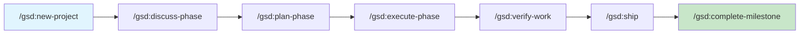
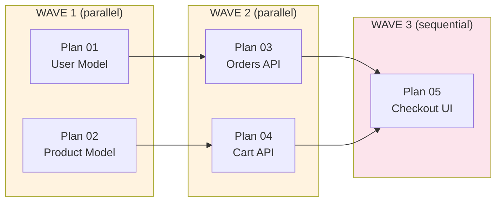
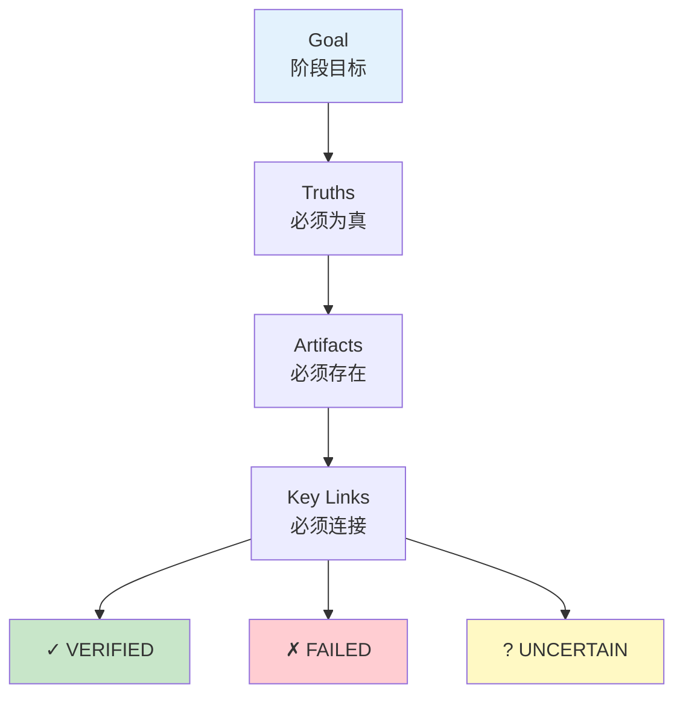
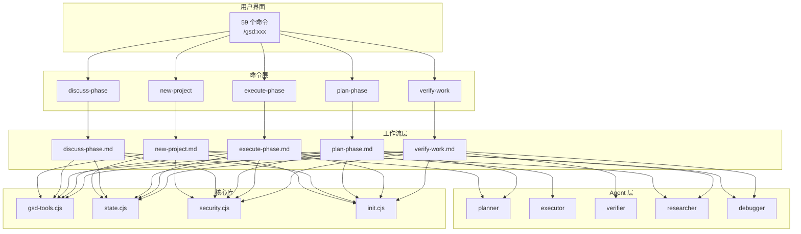

# Get Sh*t Done (GSD) 分析指南

---

## 命令速查

### 一表总览

| 命令                        | 类别   | 干什么           | 解决什么问题       |
| ------------------------- | ---- | ------------- | ------------ |
| **核心工作流**                 |      |               |              |
| `/gsd:new-project`        | 🔴核心 | 初始化项目         | 从想法到可执行计划    |
| `/gsd:discuss-phase [N]`  | 🔴核心 | 深入讨论阶段        | 避免"做出来不一样"   |
| `/gsd:plan-phase [N]`     | 🔴核心 | 创建可执行计划       | 拆解任务，确定顺序    |
| `/gsd:execute-phase [N]`  | 🔴核心 | 波次并行执行        | 高效完成任务       |
| `/gsd:verify-work [N]`    | 🔴核心 | 人工验收测试        | 确保真的做好了      |
| **快速执行**                  |      |               |              |
| `/gsd:quick`              | 🟠常用 | 快速任务+GSD保证    | 临时需求不想走流程    |
| `/gsd:fast`               | 🟠常用 | 最快执行          | 简单任务直接搞定     |
| `/gsd:ship [N]`           | 🟠常用 | 创建PR          | 完成阶段后快速发版    |
| `/gsd:autonomous`         |      | 自动跑完所有        | 完全放手让AI搞定    |
| **项目管理**                  |      |               |              |
| `/gsd:new-milestone`      |      | 启动下一版本        | v1完成→v1.1    |
| `/gsd:complete-milestone` |      | 归档+标记发布       | 收尾里程碑        |
| `/gsd:pause-work`         |      | 保存工作状态        | 会话中断         |
| `/gsd:resume-work`        |      | 恢复工作          | 从断点继续        |
| **阶段管理**                  |      |               |              |
| `/gsd:add-phase`          |      | 追加阶段          | roadmap扩展    |
| `/gsd:insert-phase [N]`   |      | 插入小数阶段        | 紧急工作插队(72.1) |
| `/gsd:remove-phase [N]`   |      | 删除阶段          | 需求变更         |
| **导航/状态**                 |      |               |              |
| `/gsd:progress`           | 🟠常用 | 查看进度          | 现在在哪？        |
| `/gsd:next`               | 🟠常用 | 自动下一步         | 不需要记命令       |
| `/gsd:health`             |      | 检查状态完整性       | 状态损坏早发现      |
| `/gsd:stats`              |      | 项目统计          | 了解项目状况       |
| **代码质量**                  |      |               |              |
| `/gsd:review`             |      | 交叉AI评审        | 外部视角审查       |
| `/gsd:audit-milestone`    |      | 验证里程碑完成       | 确保交付完整       |
| `/gsd:audit-uat`          |      | 扫描未处理UAT      | 追踪验证债务       |
| **上下文持久化**                |      |               |              |
| `/gsd:thread [name]`      |      | 跨会话上下文        | 跨session工作   |
| `/gsd:session-report`     |      | 会话报告          | 了解工作历史       |
| `/gsd:pr-branch`          |      | 干净PR分支        | reviewer只看代码 |
| **Backlog/长期**            |      |               |              |
| `/gsd:add-backlog`        |      | 添加parking lot | 暂时搁置想法       |
| `/gsd:review-backlog`     |      | 审查backlog     | 定期清理         |
| `/gsd:plant-seed`         |      | 前瞻性想法         | 正确时机浮现       |
| **工具类**                   |      |               |              |
| `/gsd:add-todo`           |      | 捕获todo        | 临时想到的任务      |
| `/gsd:check-todos`        |      | 查看todos       | 回顾待办         |
| `/gsd:note`               |      | 想法捕获          | 零摩擦记录        |
| `/gsd:debug`              |      | 系统调试          | 复杂问题定位       |
| `/gsd:forensics`          |      | 失败尸检          | 问题根因分析       |
| `/gsd:do`                 |      | 命令路由          | 自然语言转命令      |
| **配置**                    |      |               |              |
| `/gsd:settings`           |      | 工作流配置         | 个性化设置        |
| `/gsd:set-profile`        |      | 模型切换          | 成本/质量平衡      |
| `/gsd:update`             |      | GSD更新         | 保持最新         |
| `/gsd:map-codebase`       |      | 代码库分析         | 理解现有项目       |

---

## 常见工作流

### 场景一：新项目（从零开始）

```
┌─────────────────────────────────────────────────────────────────┐
│  完整流程：idea → 规划 → 执行 → 验证 → 发版                    │
└─────────────────────────────────────────────────────────────────┘
```

```
# 1. 初始化项目（告诉 GSD 你想做什么）
/gsd:new-project

# GSD 会问：
#   - 你要做什么？
#   - 技术栈偏好？
#   - 有哪些约束？
```

```
# 2. 对阶段1进行深度讨论（推荐）
/gsd:discuss-phase 1
# 明确实现细节，避免做出来不一样
```

```
# 3. 规划阶段1
/gsd:plan-phase 1
# GSD 会研究技术方案，创建 PLAN.md
```

```
# 4. 执行阶段1
/gsd:execute-phase 1
# 波次并行执行，原子提交
```

```
# 5. 验收测试
/gsd:verify-work 1
```

```
# 6. 发版
/gsd:ship 1
```

---

### 场景二：已有代码库（Brownfield）

```
# 1. 先分析现有代码库
/gsd:map-codebase

# 2. 再初始化新功能
/gsd:new-project
```

---

### 场景三：快速任务

```
# 修复 bug
/gsd:quick "修复登录密码显示问题"

# 添加简单功能
/gsd:quick --discuss "添加暗黑模式"

# 最简单的情况
/gsd:fast "更新 README"
```

---

### 场景四：不知道下一步

```
/gsd:progress    # 查看状态
/gsd:next        # 自动下一步
/gsd:manager     # 交互式仪表盘（推荐）
```

---

### 场景五：会话中断/恢复

```
# 工作中断
/gsd:pause-work

# 恢复工作
/gsd:resume-work
```

---

### 常用命令组合

| 场景 | 命令 |
|------|------|
| **新项目完整流程** | `new-project` → `discuss 1` → `plan 1` → `execute 1` → `verify 1` → `ship 1` |
| **快速修复** | `quick "具体描述"` |
| **查看状态** | `progress` 或 `manager` |
| **下一步** | `next` |
| **理解现有代码** | `map-codebase` |

---

## Auto Mode（懒人模式）

```
# 文档驱动，自动执行
/gsd:new-project --auto @prd.md
```

---

# 以下为详细分析

---

## 1. 项目概述

**定位**：为 AI 编程助手（Claude Code、OpenCode、Gemini CLI、Codex、Copilot）提供的 meta-prompting 和 context engineering 系统。

**核心问题**：解决 "context rot" — AI 上下文窗口填满后质量下降。

**解决思路**：
- 复杂度在系统中，不在工作流中
- 多 Agent 编排 + 波次并行执行
- XML 格式任务定义 + 目标回溯验证
- 原子 Git 提交保持可追溯性

---

## 2. 架构全景

```
命令层 (commands/gsd/) → 工作流层 (workflows/) → Agent 层 (agents/) → 核心库 (bin/lib/)
```

| 层级 | 目录 | 职责 |
|------|------|------|
| 命令层 | `commands/gsd/` | 用户入口，59 个命令 |
| 工作流层 | `workflows/` | Markdown 状态机，~50 个工作流 |
| Agent 层 | `agents/` | 17 个专业化子 Agent |
| 核心库 | `get-shit-done/bin/lib/` | Node.js 工具库 |

---

## 3. 核心流程图

### 3.1 主工作流



### 3.2 execute-phase 波次执行



### 3.3 verify-work 目标回溯



### 3.4 架构层次



---

## 4. 关键设计

### 4.1 多 Agent 编排

| Stage | Orchestrator | Agents |
|-------|-------------|--------|
| Research | 协调 | 4 并行 researchers |
| Planning | 验证 + 迭代 | Planner + Checker |
| Execution | 分组 + 追踪 | Executors（并行） |
| Verification | 呈现 + 路由 | Verifier + Debuggers |

### 4.2 Model Profiles

| Profile | Planning | Execution | Verification |
|---------|----------|-----------|-------------|
| quality | Opus | Opus | Sonnet |
| balanced | Opus | Sonnet | Sonnet |
| budget | Sonnet | Sonnet | Haiku |
| inherit | Inherit | Inherit | Inherit |

### 4.3 安全模块

```javascript
// security.cjs 五大威胁
1. Path traversal    — validatePath()
2. Prompt injection  — INJECTION_PATTERNS
3. Shell injection   — sanitizeShellArg()
4. JSON injection    — validateFieldName()
5. Regex DoS         — safeRegex()
```

---

## 5. 设计思想

1. **复杂度在系统中** — 用户只需命令，AI 搞定一切
2. **计划即提示** — PLAN.md 直接作为 prompt
3. **目标回溯** — 从期望结果验证，而非任务完成
4. **波次优于并行** — 独立任务并行，依赖任务顺序
5. **决策锁定** — discuss-phase 的决策不可覆盖

---

## 6. 文件索引

| 文件 | 功能 |
|------|------|
| `gsd-tools.cjs` | CLI 工具主入口 |
| `core.cjs` | 共享工具 |
| `state.cjs` | STATE.md 操作 |
| `security.cjs` | 安全检查 |
| `init.cjs` | 初始化逻辑 |

| Agent | 功能 |
|-------|------|
| gsd-planner | 创建可执行计划 |
| gsd-executor | 执行 + 原子提交 |
| gsd-verifier | 目标回溯验证 |
| gsd-phase-researcher | 领域研究 |
| gsd-plan-checker | 计划质量检查 |
| gsd-debugger | 诊断 + 修复 |
