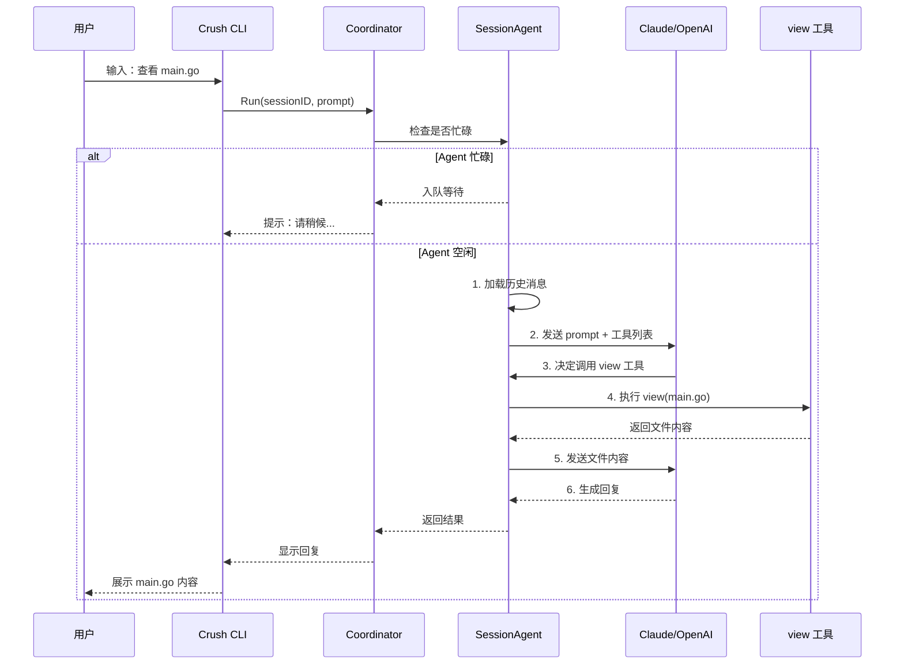
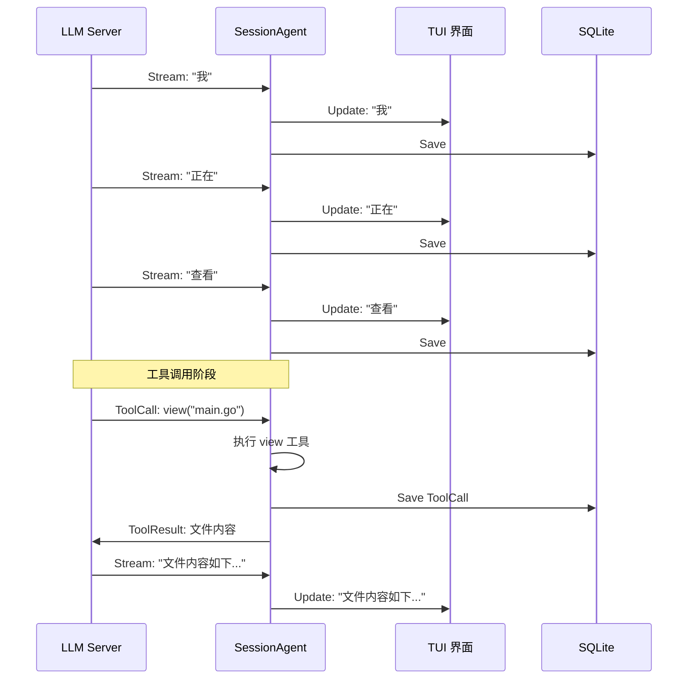
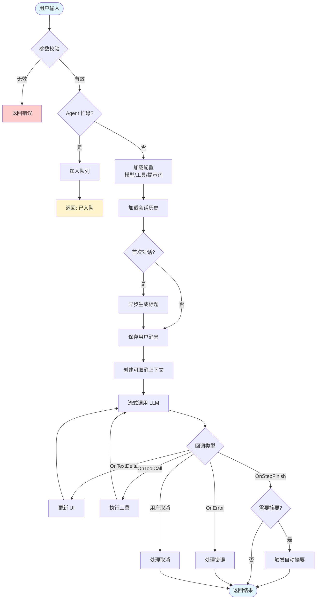

# Crush Agent 系统：从入门到精通

## 第一章：先跑起来——Agent 是什么？

### 1.1 一个真实的对话场景

想象你正在用 Crush 问一个问题：

```bash
$ crush
> 帮我查看一下 main.go 文件的内容
```

这时候发生了什么？让我们看看 Agent 系统的工作流程：



**关键点**：Agent 不是直接回答问题，而是协调 LLM 和工具之间的交互。

---

## 第二章：Coordinator——指挥官的角色

### 2.1 为什么需要 Coordinator？

想象你是一个项目经理（Coordinator），手下有多个工程师（Agent）。

```go
// 这是 Coordinator 的核心职责
type Coordinator interface {
    // 给 Agent 分配任务
    Run(ctx context.Context, sessionID, prompt string) (*fantasy.AgentResult, error)

    // 管理 Agent 状态
    IsSessionBusy(sessionID string) bool
    Cancel(sessionID string)

    // 管理模型配置
    UpdateModels(ctx context.Context) error
}
```

**现实例子**：
- 你（Coordinator）接到客户需求（prompt）
- 你检查工程师（Agent）是否忙碌
- 如果忙碌，让客户排队等待
- 如果不忙，分配任务并协调资源

### 2.2 Coordinator 创建 Agent 的过程

```go
// NewCoordinator 是 Crush 启动时的核心流程
func NewCoordinator(
    ctx context.Context,
    cfg *config.Config,           // 配置信息（选什么模型、API Key 等）
    sessions session.Service,      // 会话数据库操作
    messages message.Service,      // 消息数据库操作
    permissions permission.Service, // 权限检查
    history history.Service,       // 操作历史
    filetracker filetracker.Service, // 文件追踪
    lspManager *lsp.Manager,       // LSP 语言服务器
) (Coordinator, error) {

    // 1. 创建协调器实例
    c := &coordinator{
        cfg:         cfg,
        sessions:    sessions,
        messages:    messages,
        permissions: permissions,
        history:     history,
        filetracker: filetracker,
        lspManager:  lspManager,
        agents:      make(map[string]SessionAgent),
    }

    // 2. 异步等待 LSP 准备就绪（不阻塞启动）
    c.readyWg.Go(func() error {
        if err := lspManager.Ready(ctx); err != nil {
            return fmt.Errorf("LSP manager failed: %w", err)
        }
        return nil
    })

    // 3. 构建系统提示词（告诉 LLM 怎么工作）
    prompt, err := coderPrompt(prompt.WithWorkingDir(cfg.WorkingDir()))

    // 4. 创建真正的 Agent（目前只支持一个，预留多 Agent）
    agent, err := c.buildAgent(ctx, prompt, agentCfg, false)
    c.currentAgent = agent
    c.agents[config.AgentCoder] = agent

    return c, nil
}
```

**重点**：Coordinator 是"管理者"，Agent 是"执行者"。

---

## 第三章：SessionAgent——真正的执行者

### 3.1 SessionAgent 的核心数据结构

想象 SessionAgent 是一个正在和客户（LLM）对话的客服：

```go
type sessionAgent struct {
    // ====== 大脑配置（可动态切换）======
    largeModel         *csync.Value[Model]   // 大模型（Claude-4、GPT-4）- 处理复杂任务
    smallModel         *csync.Value[Model]   // 小模型（Claude-3-Haiku）- 处理简单任务
    systemPrompt       *csync.Value[string]  // 系统提示词（告诉 LLM 怎么做事）
    tools              *csync.Slice[fantasy.AgentTool] // 可用工具列表

    // ====== 记忆存储（数据库服务）======
    sessions           session.Service       // 会话信息存储
    messages           message.Service       // 消息历史存储

    // ====== 状态管理（并发安全）======
    messageQueue       *csync.Map[string, []SessionAgentCall] // 消息队列（每个会话一个队列）
    activeRequests     *csync.Map[string, context.CancelFunc] // 活跃请求（用于取消）

    // ====== 行为开关 ======
    isYolo             bool                  // 是否跳过权限检查
    disableAutoSummarize bool                // 是否禁用自动摘要
}
```

**类比理解**：
- `largeModel` / `smallModel` = 客服的普通员工和实习生
- `systemPrompt` = 员工手册（工作流程规范）
- `tools` = 工具箱（view、edit、bash 等）
- `messageQueue` = 等待区客户
- `activeRequests` = 正在服务的客户

### 3.2 创建 SessionAgent

```go
func NewSessionAgent(opts SessionAgentOptions) SessionAgent {
    return &sessionAgent{
        // 使用 csync 包装实现并发安全
        largeModel:         csync.NewValue(opts.LargeModel),
        smallModel:         csync.NewValue(opts.SmallModel),
        systemPrompt:       csync.NewValue(opts.SystemPrompt),
        tools:              csync.NewSliceFrom(opts.Tools),

        // 依赖注入服务
        sessions:           opts.Sessions,
        messages:           opts.Messages,

        // 初始化并发安全的数据结构
        messageQueue:       csync.NewMap[string, []SessionAgentCall](),
        activeRequests:     csync.NewMap[string, context.CancelFunc](),

        // 行为配置
        isYolo:             opts.IsYolo,
        disableAutoSummarize: opts.DisableAutoSummarize,
    }
}
```

**为什么要用 `csync.Value`？**

```go
// 普通写法（线程不安全）
type BadAgent struct {
    model Model
}

func (a *BadAgent) SetModel(m Model) {
    a.model = m  // 多线程下可能数据竞争！
}

// Crush 写法（线程安全）
type GoodAgent struct {
    model *csync.Value[Model]  // 底层使用 atomic.Value
}

func (a *GoodAgent) SetModel(m Model) {
    a.model.Set(m)  // 无锁、线程安全
}

func (a *GoodAgent) GetModel() Model {
    return a.model.Get()  // 无锁读取
}
```

---

## 第四章：Run 方法——一次完整的对话流程

### 4.1 Run 方法的入口检查

```go
func (a *sessionAgent) Run(ctx context.Context, call SessionAgentCall) (*fantasy.AgentResult, error) {
    // ========== 第 1 步：参数校验 ==========
    if call.Prompt == "" && !message.ContainsTextAttachment(call.Attachments) {
        return nil, ErrEmptyPrompt  // 不能问空问题
    }
    if call.SessionID == "" {
        return nil, ErrSessionMissing  // 必须指定会话 ID
    }

    // ========== 第 2 步：检查是否忙碌 ==========
    if a.IsSessionBusy(call.SessionID) {
        // 如果 Agent 正在处理这个会话的其他问题，入队等待
        existing, _ := a.messageQueue.Get(call.SessionID)
        existing = append(existing, call)
        a.messageQueue.Set(call.SessionID, existing)
        return nil, nil  // 返回 nil 表示已入队
    }

    // ... 后续流程
}
```

**场景举例**：
```
你：帮我修改 main.go
Agent：正在修改...
你：（又输入）再帮我看看 utils.go  ← 这时候不会崩溃，而是入队等待
Agent：（完成 main.go 后）自动处理 utils.go 的请求
```

### 4.2 准备 LLM 对话环境

```go
// ========== 第 3 步：并发安全地复制配置 ==========
agentTools := a.tools.Copy()         // 复制工具列表（防止运行时修改）
largeModel := a.largeModel.Get()      // 获取当前大模型配置
systemPrompt := a.systemPrompt.Get()  // 获取系统提示词

// ========== 第 4 步：注入 MCP 服务器指令 ==========
var instructions strings.Builder
for _, server := range mcp.GetStates() {
    if server.State == mcp.StateConnected {
        // 如果 MCP 服务器（如文件系统 MCP）有额外指令，追加到提示词
        if s := server.Client.InitializeResult().Instructions; s != "" {
            instructions.WriteString(s)
            instructions.WriteString("\n\n")
        }
    }
}

if s := instructions.String(); s != "" {
    systemPrompt += "\n\n<mcp-instructions>\n" + s + "\n</mcp-instructions>"
}

// ========== 第 5 步：创建 fantasy Agent（LLM 抽象层） ==========
agent := fantasy.NewAgent(
    largeModel.Model,
    fantasy.WithSystemPrompt(systemPrompt),
    fantasy.WithTools(agentTools...),
)
```

**MCP 指令注入示例**：
```
原始系统提示词：
你是一个编程助手...

注入 MCP 指令后：
你是一个编程助手...

<mcp-instructions>
你有额外的文件系统访问权限：
- 可以读取 /home/user/project 下的任何文件
- 可以执行 npm install 等命令
</mcp-instructions>
```

### 4.3 加载会话历史

```go
// ========== 第 6 步：加载会话历史 ==========
currentSession, err := a.sessions.Get(ctx, call.SessionID)
if err != nil {
    return nil, fmt.Errorf("failed to get session: %w", err)
}

msgs, err := a.getSessionMessages(ctx, currentSession)
if err != nil {
    return nil, fmt.Errorf("failed to get session messages: %w", err)
}

// ========== 第 7 步：首次对话生成标题 ==========
if len(msgs) == 0 {
    // 异步生成标题（不阻塞主流程）
    titleCtx := ctx
    wg.Go(func() {
        a.generateTitle(titleCtx, call.SessionID, call.Prompt)
    })
}
```

**标题生成示例**：
```
你的输入：帮我优化一下这个排序算法的性能
生成的标题：优化排序算法性能
（如果不生成标题，列表里会显示 "Untitled Session"）
```

### 4.4 保存用户消息

```go
// ========== 第 8 步：保存用户消息到数据库 ==========
_, err = a.createUserMessage(ctx, call)
if err != nil {
    return nil, err
}

// createUserMessage 内部实现：
func (a *sessionAgent) createUserMessage(ctx context.Context, call SessionAgentCall) (message.Message, error) {
    parts := []message.ContentPart{
        message.TextContentPart{Text: call.Prompt},
    }

    // 如果有附件（如图片、文本文件）
    for _, att := range call.Attachments {
        parts = append(parts, message.AttachmentContentPart{Attachment: att})
    }

    return a.messages.Create(ctx, call.SessionID, message.CreateMessageParams{
        Role:  message.User,
        Parts: parts,
    })
}
```

### 4.5 流式调用 LLM（核心逻辑）

这是最关键的部分，涉及 **7 个回调函数**：

```go
// ========== 第 9 步：创建可取消的上下文 ==========
genCtx, cancel := context.WithCancel(ctx)
a.activeRequests.Set(call.SessionID, cancel)  // 保存 cancel 函数，用于中断
defer cancel()
defer a.activeRequests.Del(call.SessionID)    // 清理

// ========== 第 10 步：准备对话历史 ==========
history, files := a.preparePrompt(msgs, call.Attachments...)

// ========== 第 11 步：流式调用 LLM ==========
result, err := agent.Stream(genCtx, fantasy.AgentStreamCall{
    Prompt:   message.PromptWithTextAttachments(call.Prompt, call.Attachments),
    Files:    files,
    Messages: history,

    // ===== 回调函数 1：准备阶段 =====
    PrepareStep: func(callContext context.Context, options fantasy.PrepareStepFunctionOptions) (context.Context, fantasy.PrepareStepResult, error) {
        // 处理消息队列中的排队消息
        queuedCalls, _ := a.messageQueue.Get(call.SessionID)
        a.messageQueue.Del(call.SessionID)
        for _, queued := range queuedCalls {
            userMessage, _ := a.createUserMessage(callContext, queued)
            options.Messages = append(options.Messages, userMessage.ToAIMessage()...)
        }

        // 添加缓存控制（Anthropic 的 prompt caching）
        for i := range options.Messages {
            if i > len(options.Messages)-3 {
                options.Messages[i].ProviderOptions = a.getCacheControlOptions()
            }
        }

        // 在数据库创建 Assistant 消息占位
        assistantMsg, _ := a.messages.Create(callContext, call.SessionID, message.CreateMessageParams{
            Role:     message.Assistant,
            Parts:    []message.ContentPart{},
            Model:    largeModel.ModelCfg.Model,
            Provider: largeModel.ModelCfg.Provider,
        })

        // 将关键信息注入上下文（供工具使用）
        callContext = context.WithValue(callContext, tools.MessageIDContextKey, assistantMsg.ID)
        callContext = context.WithValue(callContext, tools.SupportsImagesContextKey, largeModel.CatwalkCfg.SupportsImages)
        callContext = context.WithValue(callContext, tools.ModelNameContextKey, largeModel.CatwalkCfg.Name)

        currentAssistant = &assistantMsg
        return callContext, fantasy.PrepareStepResult{Messages: options.Messages}, nil
    },

    // ===== 回调函数 2-4：推理阶段（Chain of Thought）=====
    OnReasoningStart: func(id string, reasoning fantasy.ReasoningContent) error {
        // Claude-4 开始思考
        currentAssistant.AppendReasoningContent(reasoning.Text)
        return a.messages.Update(genCtx, *currentAssistant)  // 实时保存到数据库
    },
    OnReasoningDelta: func(id string, text string) error {
        // Claude-4 思考内容更新（流式）
        currentAssistant.AppendReasoningContent(text)
        return a.messages.Update(genCtx, *currentAssistant)
    },
    OnReasoningEnd: func(id string, reasoning fantasy.ReasoningContent) error {
        // 思考结束，保存签名（用于验证）
        if anthropicData, ok := reasoning.ProviderMetadata[anthropic.Name]; ok {
            if r, ok := anthropicData.(*anthropic.ReasoningOptionMetadata); ok {
                currentAssistant.AppendReasoningSignature(r.Signature)
            }
        }
        currentAssistant.FinishThinking()
        return a.messages.Update(genCtx, *currentAssistant)
    },

    // ===== 回调函数 5：文本生成（最常用）=====
    OnTextDelta: func(id string, text string) error {
        // 流式更新到 UI（逐字显示）
        if len(currentAssistant.Parts) == 0 {
            text = strings.TrimPrefix(text, "\n")  // 去掉开头的换行
        }
        currentAssistant.AppendContent(text)
        return a.messages.Update(genCtx, *currentAssistant)
    },

    // ===== 回调函数 6：工具调用 =====
    OnToolCall: func(tc fantasy.ToolCallContent) error {
        // LLM 决定调用工具
        toolCall := message.ToolCall{
            ID:       tc.ToolCallID,
            Name:     tc.ToolName,
            Input:    tc.Input,
            Finished: true,
        }
        currentAssistant.AddToolCall(toolCall)
        return a.messages.Update(genCtx, *currentAssistant)
    },

    // ===== 回调函数 7：工具执行结果 =====
    OnToolResult: func(result fantasy.ToolResultContent) error {
        // 工具执行完成，保存结果
        toolResult := a.convertToToolResult(result)
        _, err := a.messages.Create(genCtx, currentAssistant.SessionID, message.CreateMessageParams{
            Role:  message.Tool,
            Parts: []message.ContentPart{toolResult},
        })
        return err
    },

    // ===== 回调函数 8：步骤结束 =====
    OnStepFinish: func(stepResult fantasy.StepResult) error {
        // 更新 Token 使用量
        a.updateSessionUsage(largeModel, &updatedSession, stepResult.Usage)

        // 检查是否需要自动摘要
        if a.shouldSummarize(&updatedSession, currentAssistant) {
            shouldSummarize = true
        }

        return a.messages.Update(genCtx, *currentAssistant)
    },
})
```

**流式处理的可视化**：



---

## 第五章：并发控制与取消机制

### 5.1 消息队列的实现

```go
// 场景：用户快速发送多条消息
func (a *sessionAgent) queueMessage(sessionID string, call SessionAgentCall) {
    // 获取当前队列
    existing, _ := a.messageQueue.Get(sessionID)
    if existing == nil {
        existing = []SessionAgentCall{}
    }

    // 追加新消息
    existing = append(existing, call)
    a.messageQueue.Set(sessionID, existing)
}

// 处理队列（在 PrepareStep 中调用）
func (a *sessionAgent) processQueue(callContext context.Context, sessionID string) []fantasy.Message {
    queuedCalls, _ := a.messageQueue.Get(sessionID)
    a.messageQueue.Del(sessionID)  // 清空队列

    var messages []fantasy.Message
    for _, queued := range queuedCalls {
        // 将排队的消息保存到数据库
        userMessage, _ := a.createUserMessage(callContext, queued)
        // 转换为 LLM 格式
        messages = append(messages, userMessage.ToAIMessage()...)
    }
    return messages
}
```

**实际例子**：
```
时间线：
t=0s:  用户：帮我修改 main.go（Agent 开始处理）
t=1s:  用户：再看看 utils.go（入队，位置 1）
t=2s:  用户：还有 config.json（入队，位置 2）
t=5s:  Agent 完成 main.go，自动处理 utils.go
```

### 5.2 请求取消机制

```go
// 用户按 Ctrl+C 或点击取消按钮时调用
func (a *sessionAgent) Cancel(sessionID string) {
    // 从 activeRequests 获取 cancel 函数
    if cancel, ok := a.activeRequests.Get(sessionID); ok {
        cancel()  // 调用 context.CancelFunc，中断 LLM 请求
    }
}

// 取消所有会话的请求
func (a *sessionAgent) CancelAll() {
    a.activeRequests.Range(func(sessionID string, cancel context.CancelFunc) bool {
        cancel()
        return true  // 继续遍历
    })
}
```

**实现原理**：
```go
// 1. 创建可取消的上下文
genCtx, cancel := context.WithCancel(ctx)

// 2. 保存 cancel 函数
a.activeRequests.Set(sessionID, cancel)

// 3. 在 HTTP 请求中使用这个上下文
req, _ := http.NewRequestWithContext(genCtx, "POST", url, body)
resp, err := httpClient.Do(req)

// 4. 取消时，HTTP 请求会被中断
cancel()  // 这会触发 req.Context().Done()，HTTP 客户端会终止请求
```

---

## 第六章：自动摘要机制

### 6.1 为什么要摘要？

LLM 有上下文长度限制（如 Claude-4 是 200k tokens）。当对话太长时，需要压缩历史：

```
原始对话（100k tokens）：
用户：你好
AI：你好
用户：帮我写代码
AI：好的
...（几百轮对话）
用户：现在优化一下

摘要后（5k tokens）：
[摘要] 用户和 AI 讨论了一个排序算法，实现了快速排序和归并排序
用户：现在优化一下
```

### 6.2 触发条件

```go
func (a *sessionAgent) shouldSummarize(session *session.Session, lastMessage *message.Message) bool {
    if a.disableAutoSummarize {
        return false
    }

    tokenCount := session.TokenCount + lastMessage.EstimatedTokenCount()
    contextWindow := a.largeModel.Get().CatwalkCfg.ContextWindow

    // 大上下文窗口模型（如 200k）
    if contextWindow >= largeContextWindowThreshold {  // 200,000
        // 剩余空间少于 20k 时触发
        return tokenCount >= (contextWindow - largeContextWindowBuffer)  // 20,000
    }

    // 小上下文窗口模型（如 32k）
    // 使用率达到 80% 时触发
    return float64(tokenCount) >= float64(contextWindow) * (1 - smallContextWindowRatio)  // 0.2
}
```

**例子**：
```
Claude-4（200k 上下文）：
- 当前使用了 185k tokens
- 剩余 15k < 阈值 20k
- 触发摘要

GPT-3.5（32k 上下文）：
- 当前使用了 26k tokens
- 使用率 81% > 阈值 80%
- 触发摘要
```

### 6.3 摘要生成流程

```go
func (a *sessionAgent) Summarize(ctx context.Context, sessionID string, opts fantasy.ProviderOptions) error {
    // 1. 加载会话历史
    session, _ := a.sessions.Get(ctx, sessionID)
    msgs, _ := a.getSessionMessages(ctx, session)

    // 2. 构建提示词
    historyText := buildHistoryText(msgs)
    summaryPrompt := fmt.Sprintf(string(a.summaryPrompt), historyText)

    // 3. 使用 Small Model 生成摘要（成本低）
    smallModel := a.smallModel.Get()
    result, err := fantasy.NewAgent(smallModel.Model).Execute(ctx, fantasy.AgentExecuteCall{
        Prompt: summaryPrompt,
    })

    // 4. 保存摘要到会话
    session.SetSummary(result.Content)
    a.sessions.Save(ctx, session)
}
```

**摘要提示词模板**：
```markdown
请总结以下对话的关键信息：

{{.History}}

要求：
1. 保留所有重要的代码修改和决策
2. 保留用户的最终需求
3. 去掉闲聊和重复内容
4. 不超过 1000 字
```

---

## 第七章：完整流程图解



---

## 第八章：实战代码示例

### 8.1 创建一个简单的 Agent

```go
package main

import (
    "context"
    "fmt"
    "github.com/charmbracelet/crush/internal/agent"
    "github.com/charmbracelet/crush/internal/config"
)

func main() {
    // 1. 准备配置
    cfg := &config.Config{
        Options: config.Options{
            LargeModelProvider: "anthropic",
            LargeModel:         "claude-sonnet-4-20250514",
        },
    }

    // 2. 创建模拟服务
    sessions := NewMockSessionService()
    messages := NewMockMessageService()
    permissions := NewMockPermissionService()

    // 3. 创建 Agent
    a := agent.NewSessionAgent(agent.SessionAgentOptions{
        LargeModel: agent.Model{
            Model:      fantasy.NewAnthropicModel("api-key"),
            CatwalkCfg: catwalk.Model{Name: "Claude-4"},
            ModelCfg:   config.SelectedModel{Provider: "anthropic"},
        },
        SmallModel: agent.Model{
            Model:      fantasy.NewAnthropicModel("api-key"),
            CatwalkCfg: catwalk.Model{Name: "Claude-3-Haiku"},
        },
        SystemPrompt: "你是一个编程助手...",
        Sessions:     sessions,
        Messages:     messages,
    })

    // 4. 运行一次对话
    result, err := a.Run(context.Background(), agent.SessionAgentCall{
        SessionID: "session-123",
        Prompt:    "帮我写一个快速排序算法",
    })

    if err != nil {
        fmt.Printf("Error: %v\n", err)
        return
    }

    fmt.Printf("Response: %s\n", result.Content)
}
```

### 8.2 自定义工具

```go
// 定义工具参数
type CalculatorParams struct {
    A float64 `json:"a" description:"First number"`
    B float64 `json:"b" description:"Second number"`
    Op string `json:"op" description:"Operation: +, -, *, /"`
}

// 创建工具
func NewCalculatorTool() fantasy.AgentTool {
    return fantasy.NewAgentTool(
        "calculator",
        "Perform basic math operations",
        func(ctx context.Context, params CalculatorParams, call fantasy.ToolCall) (fantasy.ToolResponse, error) {
            var result float64
            switch params.Op {
            case "+":
                result = params.A + params.B
            case "-":
                result = params.A - params.B
            case "*":
                result = params.A * params.B
            case "/":
                if params.B == 0 {
                    return fantasy.NewTextErrorResponse("Cannot divide by zero"), nil
                }
                result = params.A / params.B
            default:
                return fantasy.NewTextErrorResponse("Unknown operation"), nil
            }

            return fantasy.NewToolResponse(map[string]float64{
                "result": result,
            }), nil
        },
    )
}

// 注册到 Agent
agent.SetTools([]fantasy.AgentTool{
    NewViewTool(...),
    NewEditTool(...),
    NewCalculatorTool(),  // 添加自定义工具
})
```

---

## 总结：Agent 系统的核心要点

1. **Coordinator 是管理者**：负责生命周期、模型切换、错误重试
2. **SessionAgent 是执行者**：处理对话流程、工具调用、状态管理
3. **流式架构**：7 个回调函数实现实时交互
4. **并发安全**：`csync` 包保证无锁并发
5. **队列机制**：防止并发冲突，保证消息顺序
6. **自动摘要**：智能管理上下文窗口，降低 API 成本

通过这套架构，Crush 实现了一个既强大又灵活的 AI 编程助手，既能处理复杂的工具调用，又能保证流畅的用户体验。

---

**相关文档**:
- [[Crush_overview]] - 项目整体概览
- [[Crush_tools_system]] - 工具系统详解
- [[Crush_architecture]] - 架构设计哲学