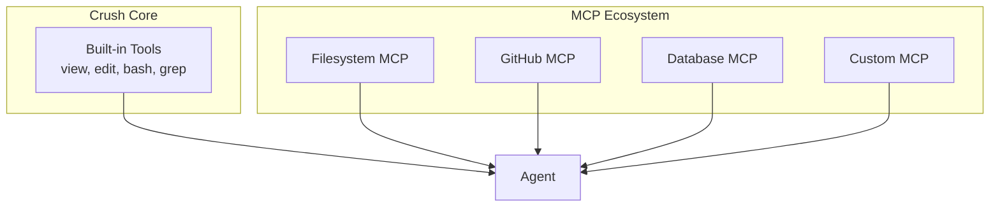
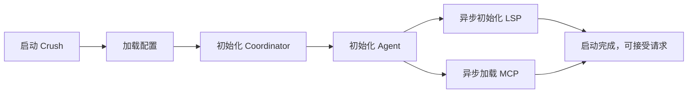

# Crush 架构设计：从问题到解决方案

## 第一章：为什么这样设计？——核心问题驱动

### 1.1 我们要解决什么问题？

想象你要开发一个 AI 编程助手，你会遇到这些挑战：

```
挑战 1：LLM 不直接支持"查看文件"
- LLM 只能处理文本，无法直接访问你的文件系统
- 解决方案：工具系统（view, edit, bash 等）

挑战 2：多用户并发使用
- 用户 A 正在生成代码，用户 B 又发了一个请求
- 解决方案：会话隔离 + 消息队列

挑战 3：API 成本高
- GPT-4 每 1k tokens 要 $0.03，长对话费用爆炸
- 解决方案：双模型策略（大模型思考，小模型摘要）

挑战 4：响应要实时
- 用户不想等 10 秒后才看到第一个字
- 解决方案：流式架构 + 回调驱动

挑战 5：代码要安全
- AI 生成的代码可能包含错误，不能直接信任
- 解决方案：权限系统 + 人工确认
```

### 1.2 架构演进过程


---

## 第二章：分层架构——为什么分四层？

### 2.1 不分层的灾难

想象一下，如果不分层，把所有代码写在一起：

```go
// ❌ 反模式：大泥球架构
func HandleUserInput(input string) {
    // 1. 解析用户输入
    prompt := parseInput(input)

    // 2. 直接调用 LLM API
    resp, err := http.Post("https://api.anthropic.com", ..., prompt)

    // 3. 解析 LLM 响应，看看要不要调用工具
    if strings.Contains(resp, "view:") {
        // 4. 直接操作文件系统
        content, _ := os.ReadFile(extractPath(resp))

        // 5. 再次调用 LLM，带上文件内容
        resp2, _ := http.Post("https://api.anthropic.com", ..., content)

        // 6. 直接操作数据库保存消息
        db.Exec("INSERT INTO messages ...", resp2)
    }

    // 7. 直接渲染 UI
    fmt.Printf("\033[32m%s\033[0m", resp)  // ANSI 颜色代码
}
```

**问题**：
- 无法测试（依赖真实 API、数据库、文件系统）
- 无法复用（UI 逻辑和 API 调用耦合）
- 无法扩展（添加新工具要改大段代码）
- 无法维护（一行改动可能影响整个系统）

### 2.2 分层后的清晰结构

```mermaid
graph TB
    subgraph "Presentation Layer 表示层"
        CMD[CLI Commands]
        TUI[Bubble Tea UI]
    end

    subgraph "Orchestration Layer 编排层"
        COORD[Coordinator<br/>生命周期管理]
        AGENT[SessionAgent<br/>对话流程]
        TOOLS[Tool Registry<br/>工具注册]
    end

    subgraph "Service Layer 服务层"
        SESS[Session Service<br/>会话业务逻辑]
        MSG[Message Service<br/>消息业务逻辑]
        PERM[Permission Service<br/>权限业务逻辑]
    end

    subgraph "Infrastructure Layer 基础设施层"
        DB[(SQLite<br/>数据持久化)]
        LSP[LSP Manager<br/>语言服务器]
        MCP[MCP Client<br/>外部工具)]
        SHELL[Shell Executor<br/>命令执行)]
    end

    CMD --> COORD
    TUI --> COORD
    COORD --> AGENT
    AGENT --> TOOLS
    AGENT --> SESS
    AGENT --> MSG
    TOOLS --> PERM
    SESS --> DB
    MSG --> DB
    PERM --> TUI
    TOOLS --> LSP
    TOOLS --> MCP
    TOOLS --> SHELL
```

**各层职责**：

| 层级 | 职责 | 举个例子 |
|------|------|----------|
| **Presentation** | 用户交互 | 把用户输入传给 Coordinator，把结果显示出来 |
| **Orchestration** | 业务流程 | 协调 Agent 执行对话，处理工具调用 |
| **Service** | 业务逻辑 | 会话怎么创建？消息怎么存储？权限怎么检查？ |
| **Infrastructure** | 技术实现 | SQLite 怎么查？LSP 怎么调？ |

### 2.3 依赖规则——关键设计

**铁律：内层不依赖外层**

```go
// ✅ 正确：Service 层不依赖 Orchestration
package session

type Service interface {
    Get(ctx context.Context, id string) (Session, error)
    Save(ctx context.Context, s Session) error
}

// Infrastructure 实现 Service 接口
package db

type sessionService struct {
    db *sql.DB
}

func (s *sessionService) Get(ctx context.Context, id string) (Session, error) {
    // 用 SQLite 实现查询
    row := s.db.QueryRowContext(ctx, "SELECT * FROM sessions WHERE id = ?", id)
    // ...
}
```

**好处**：
- **可测试**：Service 接口可以用 Mock 实现
- **可替换**：今天用 SQLite，明天可以换成 PostgreSQL，不用改业务代码
- **可复用**：Service 逻辑可以在不同界面复用（CLI、TUI、Web）

---

## 第三章：关键设计决策——为什么这样实现？

### 3.1 并发安全：为什么用 csync 而不是 mutex？

#### 问题场景

```go
// 多个 goroutine 同时读写 Agent 配置
go agent.SetModel(newModel)      // 用户切换模型
go agent.GetModel()              // 查询当前模型
go agent.Run(...)                // 执行对话（读取模型配置）
```

#### 方案对比

```go
// ========== 方案 1：sync.RWMutex（传统）==========
type TraditionalAgent struct {
    mu     sync.RWMutex
    model  Model
}

func (a *TraditionalAgent) GetModel() Model {
    a.mu.RLock()                    // 获取读锁
    defer a.mu.RUnlock()            // 释放读锁
    return a.model
}

func (a *TraditionalAgent) SetModel(m Model) {
    a.mu.Lock()                     // 获取写锁
    defer a.mu.Unlock()
    a.model = m
}
// 优点：灵活，支持复杂操作
// 缺点：容易忘加锁、死锁、性能损耗


// ========== 方案 2：atomic.Value（Crush 采用）==========
type ModernAgent struct {
    model  csync.Value[Model]       // 底层是 atomic.Value
}

func (a *ModernAgent) GetModel() Model {
    return a.model.Get()            // 无锁读取，O(1)
}

func (a *ModernAgent) SetModel(m Model) {
    a.model.Set(m)                  // 无锁写入，O(1)
}
// 优点：无锁、线程安全、不会死锁、简单易用
// 缺点：只适用于值类型，不适合复杂数据结构
```

**决策理由**：
- Agent 的配置（模型、提示词）是**读多写少**的场景
- atomic.Value 提供**无锁并发**，性能更好
- 代码更简洁，不会忘记加锁

### 3.2 流式架构：为什么用回调而不是 channel？

#### 问题：用户输入后，要等多久看到响应？

```
传统方案（批量返回）：
用户：你好
AI：（思考 5 秒）
    （生成 1000 字）
    一次性显示
用户体验：焦急等待，不知道是否在处理

流式方案（逐字返回）：
用户：你好
AI：你（0.1s）
    好（0.2s）
    ，（0.3s）
    我（0.4s）
    ...
用户体验：实时看到思考过程，感觉更流畅
```

#### 回调 vs Channel

```go
// ========== 方案 1：Channel（生产者-消费者）==========
func (a *Agent) StreamChan(ctx context.Context, prompt string) (
    textChan <-chan string,
    toolChan <-chan ToolCall,
    errChan <-chan error,
) {
    textCh := make(chan string)
    toolCh := make(chan ToolCall)
    errCh := make(chan error)

    go func() {
        defer close(textCh)
        defer close(toolCh)
        defer close(errCh)

        // 调用 LLM，把响应写入不同 channel
        for chunk := range llmStream {
            switch chunk.Type {
            case "text":
                textCh <- chunk.Text
            case "tool":
                toolCh <- chunk.ToolCall
            case "error":
                errCh <- chunk.Error
            }
        }
    }()

    return textCh, toolCh, errCh
}

// 使用方要处理复杂的 select
textChan, toolChan, errChan := agent.StreamChan(ctx, prompt)
for {
    select {
    case text := <-textChan:
        updateUI(text)
    case tool := <-toolChan:
        executeTool(tool)
    case err := <-errChan:
        handleError(err)
        return
    case <-ctx.Done():
        return
    }
}
// 缺点：复杂、容易 goroutine 泄漏、难调试


// ========== 方案 2：回调函数（Crush 采用）==========
func (a *Agent) Stream(ctx context.Context, call AgentStreamCall) error {
    return a.llmClient.Stream(ctx, LLMStreamCall{
        Prompt: call.Prompt,

        OnTextDelta: func(text string) error {
            // 直接处理，无需 channel
            return call.OnTextDelta(text)
        },

        OnToolCall: func(tool ToolCall) error {
            result := executeTool(tool)
            return call.OnToolResult(result)
        },

        OnError: func(err error) {
            call.OnError(err)
        },
    })
}

// 使用方代码清晰
agent.Stream(ctx, AgentStreamCall{
    Prompt: userInput,
    OnTextDelta: func(text string) error {
        fmt.Print(text)  // 实时输出
        return nil
    },
    OnToolCall: func(tool ToolCall) error {
        return executeTool(tool)
    },
})
// 优点：简单直观、无 goroutine 泄漏风险、易调试
```

**决策理由**：
- 回调函数更直观，**调用栈清晰**
- 错误处理更简单（返回 error 即可）
- 性能更好（无 channel 调度开销）

### 3.3 双模型策略：为什么用大小两个模型？

#### 成本对比

| 模型 | 输入费用 ($/1M tokens) | 输出费用 ($/1M tokens) | 速度 |
|------|----------------------|----------------------|------|
| GPT-4 | $30 | $60 | 慢 |
| GPT-3.5 | $0.5 | $1.5 | 快 |
| Claude-4 | $15 | $75 | 慢 |
| Claude-3-Haiku | $0.25 | $1.25 | 快 |

**假设一个场景**：
```
用户进行了 100 轮对话，总共 500k tokens

方案 1：全用 GPT-4
- 成本：500k * $0.045 = $22.5

方案 2：双模型（Crush 采用）
- 核心对话（300k）用 GPT-4：300k * $0.045 = $13.5
- 标题生成 + 摘要（200k）用 GPT-3.5：200k * $0.001 = $0.2
- 总成本：$13.7（节省 40%）
```

#### 实现方式

```go
type sessionAgent struct {
    largeModel *csync.Value[Model]  // GPT-4, Claude-4
    smallModel *csync.Value[Model]  // GPT-3.5, Claude-3-Haiku
}

// 核心对话用大模型
func (a *sessionAgent) Run(ctx context.Context, call SessionAgentCall) (*AgentResult, error) {
    largeModel := a.largeModel.Get()
    agent := fantasy.NewAgent(largeModel.Model, ...)
    return agent.Stream(ctx, call)
}

// 标题生成用小模型
func (a *sessionAgent) generateTitle(ctx context.Context, sessionID, prompt string) {
    smallModel := a.smallModel.Get()

    titlePrompt := fmt.Sprintf("Generate a short title (3-5 words) for: %s", prompt)

    result, _ := fantasy.NewAgent(smallModel.Model).Execute(ctx, AgentExecuteCall{
        Prompt: titlePrompt,
    })

    session.SetTitle(result.Content)
}

// 自动摘要用小模型
func (a *sessionAgent) Summarize(ctx context.Context, sessionID string) error {
    smallModel := a.smallModel.Get()
    // ... 类似实现
}
```

**决策理由**：
- **成本优化**：非核心任务用小模型，节省 50-80% 费用
- **速度优化**：小模型响应快，提升用户体验
- **灵活切换**：支持运行时切换，不中断服务

### 3.4 依赖注入：为什么不用全局变量？

#### 全局变量的噩梦

```go
// ❌ 反模式：全局变量
var (
    DB     *sql.DB
    Config *AppConfig
    LLMClient *fantasy.Client
)

func init() {
    // 在启动时初始化
    DB = mustConnectDB()
    Config = mustLoadConfig()
    LLMClient = mustCreateLLMClient()
}

func HandleRequest(ctx context.Context) {
    // 直接使用全局变量
    session := DB.QueryRow("SELECT ...")
    result := LLMClient.Complete(ctx, prompt)
}

// 问题：
// 1. 无法并行测试（全局状态共享）
// 2. 无法替换实现（测试时想 Mock DB 很难）
// 3. 隐式依赖（不知道函数依赖哪些外部资源）
// 4. 启动缓慢（所有全局变量都要在启动时初始化）
```

#### 依赖注入的优势

```go
// ✅ 正确：构造函数注入
type SessionAgent struct {
    sessions    session.Service    // 接口类型，非具体实现
    messages    message.Service
    permissions permission.Service
}

func NewSessionAgent(
    sessions session.Service,
    messages message.Service,
    permissions permission.Service,
) *SessionAgent {
    return &SessionAgent{
        sessions:    sessions,
        messages:    messages,
        permissions: permissions,
    }
}

func (a *SessionAgent) Run(ctx context.Context, call SessionAgentCall) error {
    // 显式依赖：从字段读取，不是全局变量
    session, err := a.sessions.Get(ctx, call.SessionID)
    // ...
}

// ========== 测试时轻松 Mock ==========

type mockSessionService struct {
    sessions map[string]Session
}

func (m *mockSessionService) Get(ctx context.Context, id string) (Session, error) {
    return m.sessions[id], nil
}

func TestSessionAgent(t *testing.T) {
    // 创建 Mock
    mockSessions := &mockSessionService{sessions: make(map[string]Session)}
    mockMessages := &mockMessageService{}
    mockPermissions := &mockPermissionService{}

    // 注入 Mock
    agent := NewSessionAgent(mockSessions, mockMessages, mockPermissions)

    // 测试：无需真实数据库、真实 LLM
    result, err := agent.Run(ctx, SessionAgentCall{
        SessionID: "test-123",
        Prompt:    "hello",
    })

    // 验证：检查 Mock 是否被正确调用
    assert.Equal(t, "test-123", mockSessions.sessions["test-123"].ID)
}
```

**决策理由**：
- **可测试性**：轻松注入 Mock，单元测试无需外部依赖
- **可观测性**：依赖关系显式化，代码更易理解
- **可替换性**：实现接口即可替换组件（如 SQLite → PostgreSQL）

---

## 第四章：可扩展性设计——如何应对未来变化？

### 4.1 工具系统的扩展

#### 内置工具 vs MCP 扩展



**添加新工具的三种方式**：

```go
// ========== 方式 1：修改源码（内置工具）==========
// 适合：通用工具，想贡献给社区
func NewMyTool() fantasy.AgentTool {
    return fantasy.NewAgentTool("my_tool", ..., handler)
}

// 在 coordinator.go 中添加
tools := []fantasy.AgentTool{
    NewViewTool(...),
    NewMyTool(),  // 添加这里
}


// ========== 方式 2：MCP Server（推荐）==========
// 适合：团队内部工具、特定领域工具
// 配置 crush.json
{
  "mcp": {
    "my-tool": {
      "type": "stdio",
      "command": "node",
      "args": ["/path/to/my-mcp-server.js"]
    }
  }
}

// Crush 自动发现并加载，无需修改源码


// ========== 方式 3：动态注册（运行时）==========
// 适合：插件系统、第三方扩展
func RegisterCustomTool(agent Agent, tool fantasy.AgentTool) {
    existingTools := agent.GetTools()
    agent.SetTools(append(existingTools, tool))
}
```

### 4.2 LLM 提供商的扩展

#### 多提供商架构

```go
// 所有提供商实现相同的 fantasy.LanguageModel 接口
type LanguageModel interface {
    Generate(ctx context.Context, prompt string, options ...GenerateOption) (string, error)
    Stream(ctx context.Context, prompt string, handlers StreamHandlers, options ...GenerateOption) error
}

// Anthropic 实现
type AnthropicModel struct {
    client *anthropic.Client
    model  string
}

func (a *AnthropicModel) Stream(ctx context.Context, prompt string, handlers StreamHandlers, opts ...GenerateOption) error {
    // 调用 Anthropic API
}

// OpenAI 实现
type OpenAIModel struct {
    client *openai.Client
    model  string
}

func (o *OpenAIModel) Stream(ctx context.Context, prompt string, handlers StreamHandlers, opts ...GenerateOption) error {
    // 调用 OpenAI API
}

// Crush 代码完全面向接口编程
agent := fantasy.NewAgent(
    model,  // 可以是 Anthropic、OpenAI、Google 等任意实现
    fantasy.WithSystemPrompt(prompt),
    fantasy.WithTools(tools...),
)
```

**添加新提供商的步骤**：

1. 在 `charm.land/fantasy` 库中实现 `LanguageModel` 接口
2. Crush 通过配置自动识别
3. 无需修改 Crush 业务代码

```json
{
  "providers": {
    "my-provider": {
      "type": "custom",
      "base_url": "https://api.my-provider.com",
      "api_key": "$MY_API_KEY"
    }
  }
}
```

### 4.3 UI 的扩展

#### 多界面支持

```go
// CLI 界面（当前实现）
type CLI struct {
    coordinator agent.Coordinator
}

func (c *CLI) Run() {
    for {
        input := readLine()
        result, _ := c.coordinator.Run(ctx, sessionID, input)
        fmt.Println(result.Content)
    }
}

// Web 界面（未来可能）
type WebServer struct {
    coordinator agent.Coordinator
}

func (w *WebServer) HandleWebSocket(ws *websocket.Conn) {
    for {
        input := ws.Read()
        result, _ := w.coordinator.Run(ctx, sessionID, input)
        ws.Write(result.Content)
    }
}

// VS Code 插件（未来可能）
type VSCodeExtension struct {
    coordinator agent.Coordinator
}

func (v *VSCodeExtension) HandleEditorCommand(editor *vscode.TextEditor) {
    input := editor.GetSelectedText()
    result, _ := v.coordinator.Run(ctx, sessionID, input)
    editor.Insert(result.Content)
}
```

**关键**：Coordinator 和 Agent 完全与 UI 解耦，可以轻松支持多种界面。

---

## 第五章：性能优化策略

### 5.1 启动优化



```go
func NewCoordinator(...) (Coordinator, error) {
    c := &coordinator{...}

    // 同步初始化核心组件（必须）
    c.currentAgent = c.buildAgent(...)

    // 异步初始化非核心组件（加速启动）
    c.readyWg.Go(func() error {
        // LSP 初始化较慢，放到后台
        return c.lspManager.Ready(ctx)
    })

    c.readyWg.Go(func() error {
        // MCP 连接也放到后台
        return c.mcpManager.ConnectAll(ctx)
    })

    return c, nil
}

func (c *coordinator) Run(...) (*AgentResult, error) {
    // 等待异步初始化完成（如果需要）
    if err := c.readyWg.Wait(); err != nil {
        return nil, err
    }
    // ...
}
```

### 5.2 内存优化

```go
// 大文件处理：流式读取，避免一次性加载
func readFileStream(filePath string, handler func(line string)) error {
    file, _ := os.Open(filePath)
    defer file.Close()

    scanner := bufio.NewScanner(file)
    // 设置缓冲区大小（默认 64k，对大文件可能不够）
    const maxCapacity = 1024 * 1024  // 1MB
    buf := make([]byte, maxCapacity)
    scanner.Buffer(buf, maxCapacity)

    for scanner.Scan() {
        handler(scanner.Text())  // 逐行处理，不保存全部
    }
    return scanner.Err()
}

// 对象池：复用频繁创建的对象
var messagePool = sync.Pool{
    New: func() interface{} {
        return &message.Message{}
    },
}

func acquireMessage() *message.Message {
    return messagePool.Get().(*message.Message)
}

func releaseMessage(m *message.Message) {
    m.Reset()  // 清空状态
    messagePool.Put(m)
}
```

### 5.3 数据库优化

```sql
-- 索引优化
CREATE INDEX idx_messages_session_id ON messages(session_id);
CREATE INDEX idx_sessions_updated_at ON sessions(updated_at DESC);

-- 查询优化：分页加载消息，避免大会话内存爆炸
SELECT * FROM messages
WHERE session_id = ?
ORDER BY created_at DESC
LIMIT 100 OFFSET ?;
```

---

## 第六章：设计模式总结

### 6.1 使用的模式清单

| 模式 | 应用场景 | 效果 |
|------|----------|------|
| **依赖注入** | Service 注入 Agent | 可测试、可替换 |
| **工厂模式** | NewSessionAgent | 统一初始化逻辑 |
| **观察者模式** | Pub/Sub 事件系统 | 解耦组件通信 |
| **策略模式** | 多 LLM 提供商 | 运行时切换模型 |
| **装饰器模式** | MCP 工具包装 | 动态扩展功能 |
| **对象池** | Message 对象复用 | 减少 GC 压力 |

### 6.2 架构优势总结

```
✅ 可测试性（Testability）
   - 接口隔离，易于 Mock
   - 单元测试无需外部依赖

✅ 可维护性（Maintainability）
   - 分层清晰，修改影响范围可控
   - 单一职责，代码易于理解

✅ 可扩展性（Extensibility）
   - MCP 协议支持无限工具扩展
   - 多提供商架构，不被单一 LLM 锁定

✅ 性能（Performance）
   - 无锁并发，高吞吐
   - 流式架构，低延迟
   - 双模型策略，低成本

✅ 可靠性（Reliability）
   - 原子操作，数据不丢失
   - 错误处理完善，优雅降级
```

---

## 结语

Crush 的架构设计展现了一个成熟工程项目的考量：

1. **从问题出发**：每个设计决策都为了解决具体问题
2. **平衡取舍**：性能 vs 简单、成本 vs 质量、灵活 vs 稳定
3. **面向未来**：扩展点预留，不绑死任何技术选型
4. **工程严谨**：测试友好、代码清晰、文档完善

这套架构不仅支撑了 Crush 的当前功能，更为未来的演进（多 Agent 协作、企业级功能、生态扩展）奠定了坚实基础。

---

**相关文档**:
- [[Crush_agent_system]] - Agent 系统详解
- [[Crush_tools_system]] - 工具系统详解
- [[Crush_overview]] - 项目整体概览