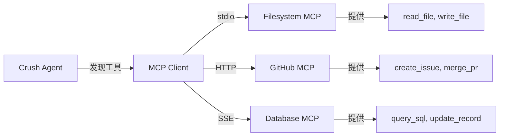
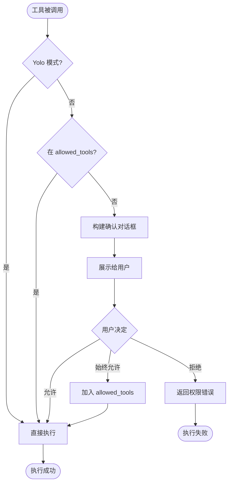

# Crush 工具系统：从原理到实战

## 第一章：工具系统是什么？

### 1.1 一个简单的类比

想象你在用微信聊天：

- **普通聊天**：朋友问"你好吗？"，你回答"我很好"
- **工具调用**：朋友说"帮我查一下北京的天气"，你需要：
  1. 打开天气 App（选择工具）
  2. 搜索"北京"（输入参数）
  3. 返回天气信息（执行结果）
  4. 告诉朋友"北京今天晴天 25°C"（整合回复）

**Crush 的工具系统就是第 1-3 步的自动化**。

### 1.2 真实场景示例

```
用户：帮我修改 main.go 的第 10 行

Crush 内部流程：
1. LLM 分析：用户要编辑文件 → 需要 edit 工具
2. 参数提取：file_path="main.go", old_string="xxx", new_string="yyy"
3. 调用 edit 工具执行修改
4. 返回成功结果给 LLM
5. LLM 生成友好回复："已帮你修改 main.go，将 xxx 改为 yyy"
```

## 第二章：工具的定义与结构

### 2.1 每个工具的三个核心部分

```go
// 1. 参数结构体 - 告诉 LLM 需要什么参数
type ViewParams struct {
    FilePath string `json:"file_path" description:"The path to the file to read"`
    Offset   int    `json:"offset,omitempty" description:"Start line number (0-based)"`
    Limit    int    `json:"limit,omitempty" description:"Number of lines to read (default 2000)"`
}

// 2. 权限参数结构体 - 用于权限确认对话框
type ViewPermissionsParams struct {
    FilePath string `json:"file_path"`
    Offset   int    `json:"offset"`
    Limit    int    `json:"limit"`
}

// 3. 响应元数据 - 返回执行结果的额外信息
type ViewResponseMetadata struct {
    FilePath    string `json:"file_path"`
    Content     string `json:"content"`
    TotalLines  int    `json:"total_lines"`
}
```

**为什么需要这三个结构体？**

| 结构体 | 用途 | 谁使用 |
|--------|------|--------|
| `ViewParams` | 定义 LLM 应该传递什么参数 | LLM 学习 + 反序列化 |
| `ViewPermissionsParams` | 展示给用户看的信息 | 权限确认对话框 |
| `ViewResponseMetadata` | 返回给 LLM 的结构化数据 | LLM 理解执行结果 |

### 2.2 完整的工具创建示例

以 `view` 工具为例，看看它是如何实现的：

```go
// NewViewTool 创建文件查看工具
func NewViewTool(
    lspManager *lsp.Manager,           // 可选：LSP 代码智能
    permissions permission.Service,     // 权限检查服务
    filetracker filetracker.Service,    // 文件追踪（记录访问了哪些文件）
    workingDir string,                  // 工作目录
    skillsPaths ...string,              // Skill 文件路径
) fantasy.AgentTool {
    return fantasy.NewAgentTool(
        // ===== 第 1 个参数：工具名称 =====
        ViewToolName,  // "view"

        // ===== 第 2 个参数：工具描述 =====
        // 从 view.md 文件加载，告诉 LLM 这个工具能做什么
        string(viewDescription),

        // ===== 第 3 个参数：执行函数 =====
        func(ctx context.Context, params ViewParams, call fantasy.ToolCall) (fantasy.ToolResponse, error) {

            // Step 1: 参数校验
            if params.FilePath == "" {
                return fantasy.NewTextErrorResponse("file_path is required"), nil
            }

            // Step 2: 处理相对路径
            // 用户输入 "main.go" → 转换为 "/home/user/project/main.go"
            filePath := filepathext.SmartJoin(workingDir, params.FilePath)

            // Step 3: 安全检查 - 文件是否在工作目录外？
            absWorkingDir, _ := filepath.Abs(workingDir)
            absFilePath, _ := filepath.Abs(filePath)

            if !strings.HasPrefix(absFilePath, absWorkingDir) {
                // 危险操作！需要用户确认
                permitted := permissions.Request(permission.Request{
                    Tool:      ViewToolName,
                    Operation: fmt.Sprintf("read file outside working directory: %s", filePath),
                    Params: ViewPermissionsParams{
                        FilePath: filePath,
                        Offset:   params.Offset,
                        Limit:    params.Limit,
                    },
                })
                if !permitted {
                    return fantasy.NewTextErrorResponse("Permission denied"), nil
                }
            }

            // Step 4: 执行实际的文件读取
            content, err := readFile(filePath, params.Offset, params.Limit)
            if err != nil {
                return fantasy.NewTextErrorResponse(err.Error()), nil
            }

            // Step 5: 追踪文件访问（用于后续分析依赖关系）
            filetracker.Track(filePath)

            // Step 6: 构建响应
            return fantasy.NewToolResponse(ViewResponseMetadata{
                FilePath:   filePath,
                Content:    content,
                TotalLines: countLines(content),
            }), nil
        },
    )
}
```

### 2.3 工具描述文件 view.md

```markdown
# View Tool

View the contents of a file. This tool allows you to read file contents
with optional pagination for large files.

## When to use

- Reading source code files
- Viewing configuration files
- Inspecting log files

## Parameters

- `file_path` (required): Path to the file to read
- `offset` (optional): Line number to start from (0-based)
- `limit` (optional): Maximum number of lines to read (default 2000)

## Examples

View an entire file:
```json
{
  "file_path": "main.go"
}
```

View specific lines:
```json
{
  "file_path": "main.go",
  "offset": 10,
  "limit": 50
}
```

## Notes

- Large files (>5MB) will be truncated
- Binary files will be returned as base64
- Line numbers are 0-based (first line is 0)
```

**这个描述文件的作用**：
1. LLM 通过它学习什么时候该用这个工具
2. 学习每个参数的含义和格式
3. 通过示例学习正确的调用方式

## 第三章：核心工具详解

### 3.1 View 工具 - 文件查看

#### 功能特性

```go
const (
    MaxReadSize      = 5 * 1024 * 1024  // 5MB 上限
    DefaultReadLimit = 2000              // 默认读取 2000 行
    MaxLineLength    = 2000              // 单行最多 2000 字符
)
```

#### 读取逻辑

```go
func readFile(filePath string, offset, limit int) (string, error) {
    // 1. 检查文件大小
    info, err := os.Stat(filePath)
    if err != nil {
        return "", fmt.Errorf("file not found: %s", filePath)
    }

    if info.Size() > MaxReadSize {
        return "", fmt.Errorf("file too large (max 5MB)")
    }

    // 2. 检查是否为图片文件
    if isImageFile(filePath) {
        data, _ := os.ReadFile(filePath)
        return base64.StdEncoding.EncodeToString(data), nil
    }

    // 3. 文本文件分片读取
    file, _ := os.Open(filePath)
    defer file.Close()

    scanner := bufio.NewScanner(file)
    currentLine := 0
    var result strings.Builder

    for scanner.Scan() {
        // 跳过 offset 之前的行
        if currentLine < offset {
            currentLine++
            continue
        }

        // 读取 limit 行
        if limit > 0 && currentLine >= offset+limit {
            break
        }

        line := scanner.Text()

        // 截断超长行（避免压缩 JS 等一行几万字符）
        if len(line) > MaxLineLength {
            line = line[:MaxLineLength] + "... [truncated]"
        }

        result.WriteString(line + "\n")
        currentLine++
    }

    return result.String(), nil
}
```

#### 实际使用场景

**场景 1：查看完整文件**
```json
{
  "file_path": "go.mod"
}
```
返回：
```
module github.com/charmbracelet/crush

go 1.22

require (
    charm.land/bubbletea/v2 v2.0.0
    ...
)
```

**场景 2：查看大文件的特定部分**
```json
{
  "file_path": "internal/agent/agent.go",
  "offset": 100,
  "limit": 50
}
```
返回第 100-150 行的代码。

**场景 3：查看图片（自动 Base64）**
```json
{
  "file_path": "docs/architecture.png"
}
```
返回 base64 编码，多模态 LLM 可以直接理解图片内容。

### 3.2 Edit 工具 - 精确编辑

#### 设计哲学

**为什么选择字符串匹配而不是行号？**

```go
// ❌ 方案 1：基于行号（容易出错）
{
  "file_path": "main.go",
  "start_line": 10,
  "end_line": 15,
  "new_content": "new code"
}
// 问题：如果前面插入了代码，行号就变了！

// ✅ 方案 2：基于字符串匹配（Crush 采用）
{
  "file_path": "main.go",
  "old_string": "func oldFunc() {\n    return 1\n}",
  "new_string": "func newFunc() {\n    return 2\n}"
}
// 优点：上下文精确匹配，不受其他修改影响
```

#### 核心算法

```go
func editFile(params EditParams) (fantasy.ToolResponse, error) {
    // 1. 读取原文件
    content, _ := os.ReadFile(params.FilePath)
    oldContent := string(content)

    // 2. 查找匹配
    occurrences := strings.Count(oldContent, params.OldString)

    switch occurrences {
    case 0:
        // 未找到匹配
        return fantasy.NewTextErrorResponse(
            "old_string not found in file. Make sure it matches exactly, including whitespace and line breaks."
        ), nil

    case 1:
        // 唯一匹配，安全替换
        newContent := strings.Replace(oldContent, params.OldString, params.NewString, 1)

    default:
        // 多个匹配
        if params.ReplaceAll {
            // 全部替换
            newContent := strings.ReplaceAll(oldContent, params.OldString, params.NewString)
        } else {
            return fantasy.NewTextErrorResponse(
                "old_string appears multiple times. Provide more context for unique match, or set replace_all to true"
            ), nil
        }
    }

    // 3. 权限检查（展示变更摘要）
    permitted := permissions.Request(permission.Request{
        Tool:      EditToolName,
        Operation: fmt.Sprintf("edit file: %s", params.FilePath),
        Params: EditPermissionsParams{
            OldContent: summarize(oldContent),
            NewContent: summarize(newContent),
        },
    })

    if !permitted {
        return fantasy.NewTextErrorResponse("Permission denied"), nil
    }

    // 4. 原子写入（先写临时文件，再重命名）
    tmpFile := params.FilePath + ".tmp"
    if err := os.WriteFile(tmpFile, []byte(newContent), 0o644); err != nil {
        return nil, err
    }

    // 原子重命名（保证文件完整性）
    if err := os.Rename(tmpFile, params.FilePath); err != nil {
        os.Remove(tmpFile)  // 清理临时文件
        return nil, err
    }

    // 5. 计算 diff 统计
    additions, removals := computeDiffStats(oldContent, newContent)

    // 6. 记录历史（支持撤销）
    history.Record(params.FilePath, oldContent, newContent)

    return fantasy.NewToolResponse(EditResponseMetadata{
        Additions:  additions,
        Removals:   removals,
        OldContent: oldContent,
        NewContent: newContent,
    }), nil
}
```

#### 实际使用示例

**示例 1：简单替换**
```json
{
  "file_path": "main.go",
  "old_string": "fmt.Println(\"Hello\")",
  "new_string": "fmt.Println(\"Hello, World!\")"
}
```

**示例 2：多行替换（推荐）**
```json
{
  "file_path": "main.go",
  "old_string": "func calculate(x, y int) int {\n    return x + y\n}",
  "new_string": "func calculate(x, y int) int {\n    result := x + y\n    log.Printf(\"Calculated: %d\", result)\n    return result\n}"
}
```

**示例 3：解决多重匹配**
```json
{
  "file_path": "utils.go",
  "old_string": "func helper() {\n    return 1\n}",
  "new_string": "func helper() {\n    return 2\n}",
  "replace_all": true
}
```

### 3.3 Bash 工具 - 命令执行

#### 安全设计

```go
var bannedCommands = []string{
    // 网络下载工具（防止下载恶意文件）
    "curl", "wget", "httpie", "aria2c", "axel",

    // 浏览器（防止自动化滥用）
    "chrome", "firefox", "safari", "lynx", "links",

    // 交互式编辑器（会阻塞）
    "vim", "emacs", "nano", "vi", "less", "more",

    // 权限提升（安全风险）
    "sudo", "su", "doas", "pkexec",

    // 系统管理
    "passwd", "useradd", "usermod", "userdel",

    // 网络扫描（可能被滥用）
    "nmap", "netcat", "nc", "ncat",

    // 文件删除保护
    "rm",  // 允许但会警告
}
```

#### 执行逻辑

```go
func executeBash(ctx context.Context, params BashParams) (fantasy.ToolResponse, error) {
    // 1. 命令安全检查
    if containsBannedCommand(params.Command) {
        return fantasy.NewTextErrorResponse(
            fmt.Sprintf("Command '%s' is not allowed for security reasons", params.Command)
        ), nil
    }

    // 2. 工作目录处理
    workingDir := cmp.Or(params.WorkingDir, workingDir)

    // 3. 创建 shell 命令
    cmd := shell.Command{
        Command:    params.Command,
        WorkingDir: workingDir,
        Env:        os.Environ(),
    }

    // 4. 后台执行模式（长时间任务）
    if params.RunInBackground {
        jobID, err := shell.StartBackground(cmd)
        return fantasy.NewToolResponse(BashResponseMetadata{
            Background: true,
            ShellID:    jobID,
            Output:     fmt.Sprintf("Job started in background. ID: %s", jobID),
        }), nil
    }

    // 5. 前台执行
    startTime := time.Now()
    result, err := shell.Execute(ctx, cmd)
    duration := time.Since(startTime)

    // 6. 自动转为后台任务（如果执行时间过长）
    if duration > AutoBackgroundThreshold {  // 1 minute
        return convertToBackgroundOutput(result)
    }

    // 7. 输出截断（防止大输出）
    output := truncateOutput(result.Output, MaxOutputLength)  // 30000 chars

    return fantasy.NewToolResponse(BashResponseMetadata{
        Output:           output,
        StartTime:        startTime.Unix(),
        EndTime:         time.Now().Unix(),
        Duration:        duration.Seconds(),
        WorkingDirectory: workingDir,
    }), nil
}
```

#### 实际使用场景

**场景 1：简单命令**
```json
{
  "command": "ls -la",
  "description": "List files in current directory"
}
```

**场景 2：后台任务**
```json
{
  "command": "go build -o myapp ./...",
  "description": "Build the project",
  "run_in_background": true
}
```
后续查询：
```json
{
  "command": "job_output",
  "description": "Check build status",
  "shell_id": "job-123"
}
```

**场景 3：带工作目录**
```json
{
  "command": "go test ./...",
  "description": "Run tests",
  "working_dir": "/home/user/project/backend"
}
```

### 3.4 Grep 工具 - 代码搜索

```go
type GrepParams struct {
    Pattern string `json:"pattern" description:"Regular expression pattern to search"`
    Path    string `json:"path,omitempty" description:"Directory or file to search in"`
    Include string `json:"include,omitempty" description:"File pattern to include (e.g., '*.go')"`
}

func grepSearch(params GrepParams) (fantasy.ToolResponse, error) {
    // 构建 rg (ripgrep) 命令
    args := []string{
        "-n",                      // 显示行号
        "--context=2",            // 显示匹配行前后 2 行
        "--color=never",          // 禁用颜色（纯文本）
    }

    if params.Include != "" {
        args = append(args, "--include", params.Include)
    }

    args = append(args, params.Pattern, params.Path)

    // 执行搜索
    cmd := exec.Command("rg", args...)
    output, err := cmd.CombinedOutput()

    if err != nil && len(output) == 0 {
        return fantasy.NewTextErrorResponse("No matches found"), nil
    }

    // 解析结果
    matches := parseRipgrepOutput(string(output))

    return fantasy.NewToolResponse(GrepResponseMetadata{
        Matches: matches,
        Count:   len(matches),
        Pattern: params.Pattern,
    }), nil
}
```

**使用示例**：
```json
{
  "pattern": "func.*NewSessionAgent",
  "path": "internal/agent",
  "include": "*.go"
}
```

返回：
```
internal/agent/agent.go:129:func NewSessionAgent(opts SessionAgentOptions) SessionAgent {
internal/agent/agent.go:146:    agent := NewSessionAgent(options)
```

## 第四章：上下文传递机制

### 4.1 为什么需要上下文？

工具执行时需要知道：
- 当前是哪个会话？（SessionID）
- 当前是哪条消息？（MessageID）
- 模型支持图片吗？（SupportsImages）
- 模型名称是什么？（ModelName）

### 4.2 实现方式

```go
package tools

// 定义上下文 key 的类型（避免冲突）
type (
    sessionIDContextKey string
    messageIDContextKey string
    supportsImagesKey   string
    modelNameKey        string
)

// 导出的 key（供外部使用）
const (
    SessionIDContextKey      sessionIDContextKey = "session_id"
    MessageIDContextKey      messageIDContextKey = "message_id"
    SupportsImagesContextKey supportsImagesKey   = "supports_images"
    ModelNameContextKey      modelNameKey        = "model_name"
)

// 通用辅助函数
func getContextValue[T any](ctx context.Context, key any, defaultValue T) T {
    value := ctx.Value(key)
    if value == nil {
        return defaultValue
    }
    if typedValue, ok := value.(T); ok {
        return typedValue
    }
    return defaultValue
}

// 便捷函数
func GetSessionFromContext(ctx context.Context) string {
    return getContextValue(ctx, SessionIDContextKey, "")
}

func GetMessageFromContext(ctx context.Context) string {
    return getContextValue(ctx, MessageIDContextKey, "")
}

func GetSupportsImagesFromContext(ctx context.Context) bool {
    return getContextValue(ctx, SupportsImagesContextKey, false)
}
```

### 4.3 在 Agent 中注入上下文

```go
// internal/agent/agent.go

// Step 1: 在 PrepareStep 中注入上下文
callContext = context.WithValue(callContext, tools.MessageIDContextKey, assistantMsg.ID)
callContext = context.WithValue(callContext, tools.SupportsImagesContextKey, largeModel.CatwalkCfg.SupportsImages)
callContext = context.WithValue(callContext, tools.ModelNameContextKey, largeModel.CatwalkCfg.Name)

// Step 2: 工具函数中使用
func NewViewTool(...) fantasy.AgentTool {
    return fantasy.NewAgentTool(..., func(ctx context.Context, params ViewParams, call fantasy.ToolCall) (fantasy.ToolResponse, error) {
        sessionID := tools.GetSessionFromContext(ctx)
        messageID := tools.GetMessageFromContext(ctx)
        supportsImages := tools.GetSupportsImagesFromContext(ctx)

        // 根据模型能力调整行为
        if isImageFile(params.FilePath) && !supportsImages {
            return fantasy.NewTextErrorResponse("Model does not support images"), nil
        }

        // 记录日志时带上会话信息
        slog.Info("Viewing file",
            "session", sessionID,
            "message", messageID,
            "file", params.FilePath)

        // ... 执行逻辑
    })
}
```

## 第五章：MCP（Model Context Protocol）扩展

### 5.1 什么是 MCP？

MCP 是开放标准，允许第三方服务动态提供工具给 AI Agent。



### 5.2 MCP 配置示例

```json
{
  "mcp": {
    "filesystem": {
      "type": "stdio",
      "command": "node",
      "args": ["/path/to/filesystem-mcp-server.js"],
      "env": {
        "ROOT_DIR": "/home/user/project"
      }
    },
    "github": {
      "type": "http",
      "url": "https://api.github.com/mcp",
      "headers": {
        "Authorization": "Bearer $GITHUB_TOKEN"
      }
    }
  }
}
```

### 5.3 MCP 工具集成代码

```go
// internal/agent/tools/mcp-tools.go

func refreshMCPTools() {
    var allTools []fantasy.AgentTool

    // 1. 添加内置工具
    allTools = append(allTools, builtInTools...)

    // 2. 从 MCP Servers 获取工具
    for _, server := range mcp.GetStates() {
        if server.State != mcp.StateConnected {
            continue
        }

        // 向 MCP Server 请求工具列表
        tools, err := server.Client.ListTools()
        if err != nil {
            slog.Error("Failed to list MCP tools", "server", server.Name, "err", err)
            continue
        }

        // 包装为 fantasy.AgentTool
        for _, tool := range tools {
            wrappedTool := wrapMCPTool(server.Name, tool)
            allTools = append(allTools, wrappedTool)
        }
    }

    // 3. 更新 Agent 的工具集
    agent.SetTools(allTools)
}

// 将 MCP Tool 包装为 fantasy.AgentTool
func wrapMCPTool(serverName string, mcpTool mcp.Tool) fantasy.AgentTool {
    return fantasy.NewAgentTool(
        mcpTool.Name,
        mcpTool.Description,
        func(ctx context.Context, params json.RawMessage, call fantasy.ToolCall) (fantasy.ToolResponse, error) {
            // 获取 MCP Server 客户端
            server := mcp.GetServer(serverName)
            if server == nil {
                return nil, fmt.Errorf("MCP server %s not found", serverName)
            }

            // 调用 MCP Server 执行工具
            result, err := server.Client.CallTool(ctx, mcpTool.Name, params)
            if err != nil {
                return fantasy.NewTextErrorResponse(err.Error()), nil
            }

            // 转换结果为 fantasy.ToolResponse
            return fantasy.NewToolResponse(result), nil
        },
    )
}
```

## 第六章：权限控制系统

### 6.1 权限检查流程



### 6.2 权限服务接口

```go
package permission

type Service interface {
    // 请求权限（弹出确认对话框）
    Request(req Request) bool

    // 检查是否已允许
    IsAllowed(tool string) bool

    // 手动允许/禁止工具
    Allow(tool string)
    Disallow(tool string)
}

type Request struct {
    Tool       string      // 工具名称
    Operation  string      // 操作描述（展示给用户）
    Params     interface{} // 详细参数（展示给用户）
}
```

### 6.3 实际权限确认对话框

```
┌─────────────────────────────────────────────────┐
│ 🔒 Permission Requested                          │
├─────────────────────────────────────────────────┤
│ Tool: edit                                       │
│ Operation: edit file: main.go                    │
│                                                  │
│ Parameters:                                      │
│ {                                                │
│   "file_path": "main.go"                         │
│   "old_content": "func main() {...}"            │
│   "new_content": "func main() {...}"            │
│ }                                                │
│                                                  │
│ [Allow] [Deny] [Always Allow]                    │
└─────────────────────────────────────────────────┘
```

### 6.4 代码实现示例

```go
func NewEditTool(permissions permission.Service, ...) fantasy.AgentTool {
    return fantasy.NewAgentTool(..., func(ctx context.Context, params EditParams, call fantasy.ToolCall) (fantasy.ToolResponse, error) {

        // 构建权限请求
        req := permission.Request{
            Tool:      EditToolName,
            Operation: fmt.Sprintf("edit file: %s", params.FilePath),
            Params: EditPermissionsParams{
                FilePath:   params.FilePath,
                OldContent: summarize(oldContent),
                NewContent: summarize(newContent),
            },
        }

        // 请求权限
        if !permissions.Request(req) {
            return fantasy.NewTextErrorResponse("Permission denied by user"), nil
        }

        // 执行编辑...
    })
}
```

## 第七章：实战代码示例

### 7.1 创建一个完整的自定义工具

```go
package main

import (
    "context"
    "encoding/json"
    "fmt"
    "os/exec"

    "charm.land/fantasy"
    "github.com/charmbracelet/crush/internal/agent/tools"
)

// 1. 定义参数结构体
type GitStatusParams struct {
    WorkingDir string `json:"working_dir,omitempty" description:"Working directory (default: current)"`
}

type GitStatusResult struct {
    Branch      string   `json:"branch"`
    Modified    []string `json:"modified"`
    Staged      []string `json:"staged"`
    Untracked   []string `json:"untracked"`
}

// 2. 创建工具
func NewGitStatusTool(permissions permission.Service) fantasy.AgentTool {
    description := `Execute 'git status' to check repository status.

Use this when you need to:
- Check which files have been modified
- See what files are staged for commit
- Find untracked files
- Determine the current branch

Parameters:
- working_dir: Optional path to git repository`

    return fantasy.NewAgentTool(
        "git_status",
        description,
        func(ctx context.Context, params GitStatusParams, call fantasy.ToolCall) (fantasy.ToolResponse, error) {
            // 使用上下文中的工作目录
            workingDir := params.WorkingDir
            if workingDir == "" {
                workingDir = "."
            }

            // 请求权限
            if !permissions.Request(permission.Request{
                Tool:      "git_status",
                Operation: fmt.Sprintf("check git status in %s", workingDir),
            }) {
                return fantasy.NewTextErrorResponse("Permission denied"), nil
            }

            // 执行 git status
            cmd := exec.CommandContext(ctx, "git", "status", "--porcelain", "-b")
            cmd.Dir = workingDir
            output, err := cmd.Output()
            if err != nil {
                return fantasy.NewTextErrorResponse(
                    fmt.Sprintf("Failed to execute git status: %v", err)
                ), nil
            }

            // 解析输出
            result := parseGitStatus(string(output))

            return fantasy.NewToolResponse(result), nil
        },
    )
}

func parseGitStatus(output string) GitStatusResult {
    var result GitStatusResult
    lines := strings.Split(output, "\n")

    for _, line := range lines {
        if strings.HasPrefix(line, "## ") {
            // Branch info: "## main...origin/main"
            result.Branch = strings.TrimPrefix(line, "## ")
        } else if len(line) >= 2 {
            // File status: " M file.go" or "M  file.go" or "?? file.go"
            status := line[:2]
            file := line[3:]

            switch {
            case strings.Contains(status, "M") && status[0] != ' ':
                result.Staged = append(result.Staged, file)
            case strings.Contains(status, "M"):
                result.Modified = append(result.Modified, file)
            case strings.Contains(status, "?"):
                result.Untracked = append(result.Untracked, file)
            }
        }
    }

    return result
}

// 3. 注册到 Agent
func main() {
    agent := NewSessionAgent(...)

    // 获取现有工具
    existingTools := agent.GetTools()

    // 添加自定义工具
    allTools := append(existingTools, NewGitStatusTool(permissions))

    // 更新工具集
    agent.SetTools(allTools)
}
```

### 7.2 工具组合使用场景

```
用户：帮我重构这个项目的错误处理

Agent 执行流程：
1. view("go.mod") - 查看项目结构
2. grep("func.*Errorf", "./...") - 查找所有错误处理代码
3. view("internal/utils/errors.go") - 查看具体实现
4. edit("internal/utils/errors.go", oldCode, newCode) - 修改
5. bash("go test ./...") - 验证修改
6. 根据测试结果决定是否继续修改
```

## 第八章：工具系统设计要点

### 8.1 设计原则

| 原则 | 说明 | 示例 |
|------|------|------|
| **单一职责** | 每个工具只做一件事 | view 只读，edit 只写 |
| **幂等性** | 多次执行结果一致 | view 不会改变文件 |
| **安全性** | 危险操作需确认 | edit、bash 需要权限 |
| **可观测** | 操作可追溯 | filetracker 记录访问 |
| **容错性** | 优雅处理错误 | 文件不存在返回错误信息 |

### 8.2 性能优化

```go
// 1. 结果缓存
var fileCache = make(map[string]cacheEntry)

type cacheEntry struct {
    content   string
    timestamp time.Time
}

func readFileWithCache(filePath string) (string, error) {
    if entry, ok := fileCache[filePath]; ok {
        // 检查文件是否修改
        info, _ := os.Stat(filePath)
        if info.ModTime().Before(entry.timestamp) {
            return entry.content, nil
        }
    }

    content, err := readFile(filePath)
    fileCache[filePath] = cacheEntry{content, time.Now()}
    return content, err
}

// 2. 并发控制
func parallelGrep(pattern string, files []string) []Match {
    var wg sync.WaitGroup
    results := make(chan []Match, len(files))

    for _, file := range files {
        wg.Add(1)
        go func(f string) {
            defer wg.Done()
            matches := grepFile(pattern, f)
            results <- matches
        }(file)
    }

    go func() {
        wg.Wait()
        close(results)
    }()

    var allMatches []Match
    for matches := range results {
        allMatches = append(allMatches, matches...)
    }
    return allMatches
}
```

---

## 总结

Crush 的工具系统通过以下设计实现强大而安全的代码操作能力：

1. **标准化接口**：每个工具都有 Params/Permissions/Response 三个结构体
2. **类型安全**：Go 泛型保证编译时类型检查
3. **权限控制**：敏感操作强制确认，支持 Yolo 模式
4. **可扩展性**：MCP 协议支持动态加载外部工具
5. **上下文感知**：通过 context 传递会话信息
6. **流式处理**：支持实时反馈和取消操作

这套系统让 LLM 从"聊天机器人"转变为"能实际修改代码的编程助手"。

---

**相关文档**:
- [[Crush_agent_system]] - Agent 系统详解
- [[Crush_overview]] - 项目整体概览