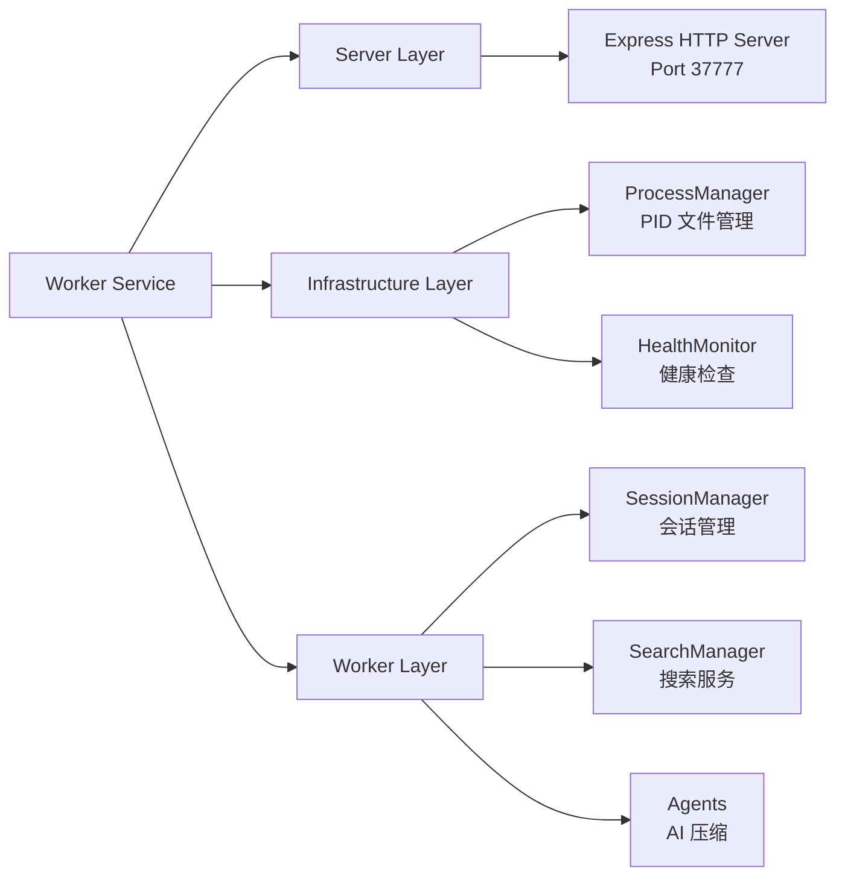
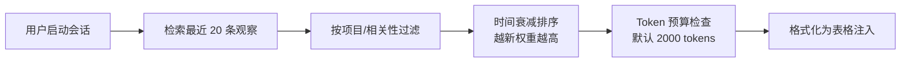

## 一、项目定位与核心能力

### 1.1 解决的核心问题

**Claude-Mem** 是 Claude Code 的持久化记忆插件，解决 AI 对话的**状态丢失**问题：

- **传统模式**: 每次会话独立，用户需反复交代项目背景
- **Claude-Mem 模式**: 自动捕获工具使用、生成语义摘要、建立知识图谱，实现跨会话的上下文连续

### 1.2 实现的核心能力

| 能力维度 | 具体功能 | 技术实现 |
|---------|---------|---------|
| **记忆捕获** | 自动记录每次工具使用 | 5 个生命周期钩子（Hook）触发捕获 |
| **语义压缩** | 将工具输出压缩为结构化观察 | Claude Agent SDK 智能摘要 |
| **存储系统** | 持久化到本地数据库 | SQLite + Chroma 混合存储 |
| **上下文注入** | 新会话自动加载历史 | Token 预算控制的分层检索 |
| **隐私控制** | 敏感内容不存储 | 边缘标签过滤系统 |
| **技能系统** | 自然语言查询历史 | mem-search / make-plan / do 三大技能 |

---

## 二、核心实现机制

### 2.1 五生命周期钩子架构

**文件**: `plugin/hooks/hooks.json`

Claude Code 在关键节点触发钩子，Claude-Mem 在这些节点插入记忆逻辑：

```
SessionStart → UserPromptSubmit → PostToolUse → Stop → SessionEnd
     ↓               ↓                  ↓          ↓
 启动 Worker    初始化会话        捕获观察    生成摘要
```

**Hook 配置示例**:

```json
{
  "PostToolUse": [{
    "matcher": "*",
    "hooks": [{
      "command": ".../worker-service.cjs hook claude-code observation",
      "timeout": 120
    }]
  }]
}
```

**关键设计**:
- **matcher**: `"*"` 匹配所有工具类型，也可正则过滤（如 `"read|write"`）
- **超时机制**: Setup 300s，Observation 120s，Session-complete 30s
- **退出码**: Exit 0（成功）、Exit 1（非阻塞错误）、Exit 2（阻塞错误）

### 2.2 Worker Service：编排器架构

**文件**: `src/services/worker-service.ts`

从 2000 行单体重构为 300 行编排器，模块职责清晰：



**进程管理核心逻辑**:

```typescript
// Windows 必须使用 Bun（因为使用 bun:sqlite）
export function resolveWorkerRuntimePath() {
  if (process.platform === 'win32') {
    // 按优先级搜索 Bun
    return env.BUN ||
           env.BUN_PATH ||
           path.join(homedir(), '.bun/bin/bun.exe') ||
           lookupBinaryInPath('bun', 'win32');
  }
  return process.execPath; // Unix 使用当前运行时
}
```

**启动保护机制**:
- **Windows 锁文件**: 启动失败 2 分钟内禁止重试，避免弹窗轰炸
- **PID 文件**: 防止重复启动，支持进程状态检查
- **孤儿进程清理**: 自动清理超过 30 分钟的僵尸进程

### 2.3 双存储架构：SQLite + Chroma

#### SQLite：关系型数据

**文件**: `src/services/sqlite/Database.ts`

使用 `bun:sqlite`（Bun 内置，零依赖）：

```typescript
export class ClaudeMemDatabase {
  constructor(dbPath: string = DB_PATH) {
    this.db = new Database(dbPath, { create: true, readwrite: true });

    // 性能优化配置
    this.db.run('PRAGMA journal_mode = WAL');      // Write-Ahead Logging
    this.db.run('PRAGMA synchronous = NORMAL');
    this.db.run('PRAGMA mmap_size = 268435456');   // 256MB 内存映射
    this.db.run('PRAGMA cache_size = 10000');      // 10000 页缓存

    new MigrationRunner(this.db).runAllMigrations();
  }
}
```

**核心表结构**:

| 表 | 关键字段 | 用途 |
|---|---------|------|
| **sessions** | content_session_id, project_name, status | 会话管理 |
| **observations** | tool_use_id, type, title, narrative, facts, concepts | 观察记录 |
| **summaries** | summary_text, token_count, model_used | 会话摘要 |

#### Chroma：向量语义搜索

**文件**: `src/services/sync/ChromaSync.ts`

存储观察的向量嵌入，支持语义相似度：

```typescript
export class ChromaSync {
  async syncObservation(obs: Observation) {
    const embedding = await this.generateEmbedding(
      `${obs.title} ${obs.narrative} ${obs.facts.join(' ')}`
    );

    await this.chroma.addDocument({
      id: obs.id.toString(),
      embedding,
      metadata: { type: obs.type, project: obs.project_name }
    });
  }
}
```

**混合搜索策略**:
1. **SQLite FTS5**: 关键词匹配（工具名、文件名精确匹配）
2. **Chroma**: 向量相似度（概念、意图模糊匹配）
3. **结果融合**: 加权排序（关键词权重 0.6，语义权重 0.4）

### 2.4 观察压缩系统

**核心问题**: 原始工具输出（5000+ tokens）→ 压缩为结构化观察（200-500 tokens）

**压缩流程**:

```
PostToolUse Hook
    ↓
提取 tool_input + tool_output
    ↓
Claude Agent SDK 压缩提示词
    ↓
生成结构化观察
    ↓
存储到 SQLite + 同步 Chroma
```

**观察数据结构**:

```typescript
interface Observation {
  id: number;
  tool_use_id: string;
  type: 'bugfix' | 'feature' | 'decision' | 'discovery' | 'change' | 'completed';

  // AI 压缩生成的内容
  title: string;           // 一句话概括（100 字符内）
  narrative: string;       // 详细描述
  facts: string[];         // 关键事实列表
  concepts: string[];      // 技术概念标签
  files: string[];         // 涉及文件路径

  token_count: number;     // 用于 Token 预算控制
  model_used: string;      // 压缩使用的模型
}
```

**压缩提示词核心**（`src/sdk/prompts.ts`）:

```
Analyze the tool usage and create a compact but complete summary.

Create structured observation with:
1. title: One sentence summary
2. narrative: What happened and why
3. facts: Array of objective facts
4. concepts: Technologies mentioned
5. files: File paths verbatim
6. type: bugfix/feature/decision/discovery/change/completed
```

**压缩率**: 80-90%（5000 tokens → 500 tokens）

### 2.5 隐私控制系统

**文件**: `src/utils/tag-stripping.ts`

**双标签系统**:

| 标签 | 层级 | 控制权 | 用途 |
|------|------|--------|------|
| `<private>` | 用户级 | 用户手动添加 | 敏感内容不存储 |
| `<claude-mem-context>` | 系统级 | 自动注入 | 防止递归存储 |

**边缘处理模式**:

```typescript
// 在 Hook 层过滤，不发送到 Worker
export function stripMemoryTags(content: string): string {
  // ReDoS 防护：最多处理 100 个标签
  if (countTags(content) > MAX_TAG_COUNT) {
    logger.warn('SYSTEM', 'tag count exceeds limit');
  }

  return content
    .replace(/<claude-mem-context>[\s\S]*?<\/claude-mem-context>/g, '')
    .replace(/<private>[\s\S]*?<\/private>/g, '')
    .trim();
}
```

**为什么边缘处理？**
- 性能：不占用 Worker 资源
- 安全：敏感数据不出本地进程
- 简单：Worker 专注业务，无需处理隐私逻辑

### 2.6 上下文注入系统

**文件**: `src/services/context/`

**分层检索策略**（渐进式披露）:



**Token 预算控制**:

```typescript
class TokenCalculator {
  estimateObservationTokens(obs: Observation): number {
    return Math.ceil(obs.title.length / 4) +      // 标题
           Math.ceil(obs.narrative.length / 3.5) + // 描述
           obs.facts.join(' ').length / 3 +        // 事实
           obs.concepts.length * 2;                // 概念
  }

  selectWithinBudget(observations: Observation[], budget: number): Observation[] {
    let used = 0;
    return observations.filter(obs => {
      const tokens = this.estimateObservationTokens(obs);
      if (used + tokens <= budget) {
        used += tokens;
        return true;
      }
      return false;
    });
  }
}
```

**注入格式**:

```markdown
<claude-mem-context>
# Recent Activity

### Mar 15, 2026
| ID | Time | T | Title | Read |
|----|------|---|-------|------|
| #39050 | 3:44 PM | 🔵 | Plugin commands directory is empty | ~255 |
| #23832 | 11:15 PM | 🔵 | Worker Service Lacks Admin Endpoints | ~393 |
</claude-mem-context>
```

**颜色标记**: 🔵信息 🔴修复 🟣发现 🟢完成 🟡决策

---

## 三、技能系统：用户交互接口

### 3.1 mem-search：三层工作流

**文件**: `plugin/skills/mem-search/SKILL.md`

**核心洞察**: 直接获取 20 条完整观察 = 16,000 tokens，三层工作流 = 3,200 tokens（节省 80%）

**工作流**:

1. **Search（索引）** - 获取 ID 列表
   ```
   search(query="authentication bug", limit=20)
   → [{id, title, type, timestamp, token_estimate}]
   ```

2. **Timeline（上下文）** - 获取时间线
   ```
   timeline(anchor=11131, depth_before=3, depth_after=3)
   → 前后 3 条观察的时间线
   ```

3. **Get Observations（详情）** - 批量获取完整内容
   ```
   get_observations(ids=[11131, 10942])
   → [完整观察对象]
   ```

### 3.2 make-plan：文档发现驱动

**核心机制**: Phase 0 强制文档发现，防止 AI 幻觉不存在的 API

```
Phase 0: Documentation Discovery
    ↓
子代理搜索真实 API、示例代码
    ↓
创建 "Allowed APIs" 列表
    ↓
Phase 1-N: 基于真实文档的实现
    ↓
Verification: 验证实现与文档匹配
```

**子代理报告契约**:
- 必须列出查阅的 Sources（文件/URL）
- 必须提供 Concrete findings（确切 API 签名）
- 必须包含 Confidence note + known gaps

### 3.3 do：分阶段执行

**核心机制**: 每 Phase 在新 Claude 上下文中执行

```
Checkpoint 1 → 执行 Phase 1 → 更新状态
     ↓
Checkpoint 2 → 执行 Phase 2 → 更新状态
     ↓
Checkpoint 3 → 执行 Phase 3 → 完成
```

**优势**:
- 防止上下文窗口膨胀
- 单 Phase 失败可重试
- 强制文档 carry-forward

---

## 四、关键技术决策

### 4.1 为什么选择 Bun？

| 因素 | Bun | Node.js |
|------|-----|---------|
| SQLite | 内置 `bun:sqlite` | 需 `better-sqlite3` |
| 启动速度 | ~50ms | ~200ms |
| TypeScript | 原生支持 | 需 tsx/ts-node |
| 进程管理 | 内置 `Bun.spawn` | `child_process` |

### 4.2 HTTP API vs Unix Socket

选择 HTTP（Port 37777）:
- ✅ 跨平台（Windows 不支持 Unix Socket）
- ✅ 易调试（curl 直接访问）
- ✅ 生态丰富（Express 中间件）
- ❌ 端口占用风险（使用 37777 避免冲突）

---

## 五、总结

### 核心实现机制

1. **Hook 驱动**: 5 个生命周期钩子捕获工具使用
2. **双存储**: SQLite 关系数据 + Chroma 向量语义
3. **边缘处理**: 隐私标签在 Hook 层过滤
4. **AI 压缩**: Agent SDK 将工具输出压缩 80-90%
5. **分层检索**: Token 预算控制的渐进式披露
6. **编排器架构**: Worker Service 协调 10+ 子模块

### 实现的核心能力

1. **自动记忆捕获**: 用户无感知，自动记录工作流
2. **语义搜索**: 自然语言查询历史观察
3. **上下文注入**: 新会话自动加载相关历史
4. **隐私控制**: 用户可控的标签级隐私保护
5. **计划执行**: 分阶段任务执行与 checkpoint
6. **跨平台**: Windows/macOS/Linux 全支持

### 工程亮点

- **Token 经济学**: 三层搜索节省 80% Token
- **重构实践**: 2000 行单体 → 300 行编排器
- **防御性编程**: ReDoS 防护、超时控制、启动锁
- **渐进式复杂性**: 简单场景自动工作，复杂场景 skill 支持