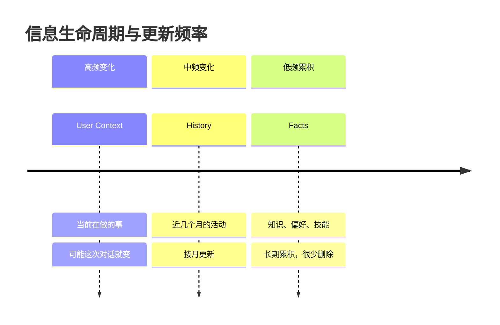
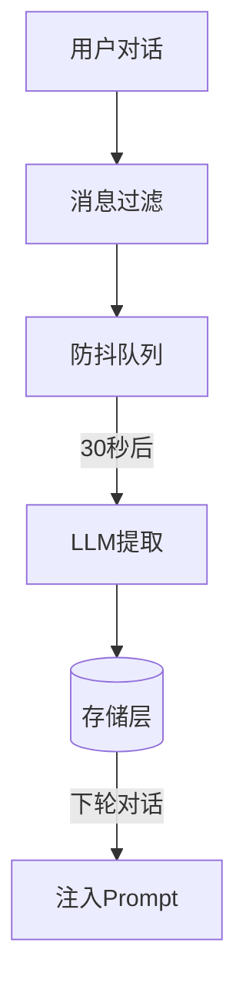

## Part 1: What（是什么）

### 1.1 系统定义

DeerFlow 的记忆系统是一个**长期用户画像系统**，目标是在多轮对话中记住用户的关键信息，让 AI 能够像"老朋友"一样了解用户。

**核心功能**:
- 从对话中自动提取关键信息（不是存储原始对话）
- 分层存储：当前状态、时间线历史、离散事实
- 异步更新：30秒防抖批量处理
- 智能注入：根据相关性选择记忆注入 Prompt

### 1.2 数据结构设计

```json
{
  "version": "1.0",
  "user": {
    "workContext": {"summary": "", "updatedAt": ""},
    "personalContext": {"summary": "", "updatedAt": ""},
    "topOfMind": {"summary": "", "updatedAt": ""}
  },
  "history": {
    "recentMonths": {"summary": "", "updatedAt": ""},
    "earlierContext": {"summary": "", "updatedAt": ""},
    "longTermBackground": {"summary": "", "updatedAt": ""}
  },
  "facts": [
    {"id": "", "content": "", "category": "", "confidence": 0.0, "createdAt": ""}
  ]
}
```

**三层存储对比**:

| 层级 | 字段 | 更新策略 | 内容类型 |
|------|------|----------|----------|
| User Context | workContext, personalContext, topOfMind | 覆盖更新 | 当前状态摘要 |
| History | recentMonths, earlierContext, longTermBackground | 覆盖更新 | 时间段活动总结 |
| Facts | 数组 | 增量追加+删除 | 离散知识点 |

---

## Part 2: Why（为什么这样设计）← 重点

### 2.1 核心问题：为什么要做记忆系统？

**没有记忆的问题**:
```
昨天: 用户: "我在用 Go 写微服务"
      AI: "好的，这是 Go 的优化建议..."

今天: 用户: "帮我看这段代码"
      AI: "这是 Python 的优化方案..."  ← 完全忘记用户用 Go
      用户: "我昨天说过用 Go 啊！"    ← 挫败感
```

**记忆系统的目标不是存档，而是构建用户画像**:
- 让用户不用重复自我介绍
- 让建议更精准（基于用户技术栈和偏好）
- 让对话有连续性（像老朋友一样）

### 2.2 关键决策 1: 为什么用结构化摘要，而不是存原始对话？

**方案对比分析**:

| 方案 | What | Why 不好 |
|------|------|----------|
| 存原始对话 | 保存每轮对话的完整文本 | 数据量爆炸，噪音多，AI 被无关信息淹没 |
| 向量数据库 | 向量化存储，相似度检索 | 检索不确定性，可能漏掉关键信息，需要额外搜索步骤 |
| 结构化摘要 ✅ | LLM 提取的关键信息摘要 | 精炼、确定性强、直接可用、Token 效率高 |

**核心洞察**:
> 人类不会记住和朋友的每句话，而是记住**印象**和**关键事实**。
>
> 例如：你不会记得朋友上周说的每句话，但你会记得"他最近在学 Kubernetes"、"他是做后端的"。

DeerFlow 用 LLM 模拟了这个"提炼印象"的过程。

**权衡**: 消耗 LLM Token 做摘要，但节省了存储成本和检索不确定性。

### 2.3 关键决策 2: 为什么分三层存储（User Context / History / Facts）？

**洞察：不同信息有不同的生命周期**:



**Why User Context（覆盖更新）？**

描述"当前状态"，旧状态不需要保留（保留在 History 里）。

```
昨天: "正在学 Kubernetes"
今天: "正在优化消息队列性能"  ← 直接覆盖，因为"当前焦点"变了
```

**Why History（时间线）？**

提供背景，了解用户如何走到现在。

```
recentMonths: "过去2个月在做 DeerFlow 分析"
→ 解释为什么他问记忆系统的问题
```

**Why Facts（增量累积）？**

知识和偏好是累积的，不会因为新技能而忘记旧技能。

```
Facts: ["会用 Go", "会用 Rust"]  ← 追加，不是覆盖
```

**Why 不是 3 层也不是 10 层，而是这 6 个字段？**

这是**最小完备集**:
- 3 个太少：无法区分"当前焦点"和"长期背景"
- 10 个太多：LLM 处理负担重，信息冗余，Prompt 膨胀
- 6 个正好：覆盖所有关键维度，又保持简洁

| 字段 | 覆盖维度 | Why 这个粒度 |
|------|----------|--------------|
| workContext | 职业身份 | 技术栈和角色决定建议方向 |
| personalContext | 沟通风格 | 决定回复的详细程度 |
| topOfMind | 当前焦点 | 主动关联用户正在做的事 |
| recentMonths | 近期历史 | 提供 1-3 个月的上下文 |
| earlierContext | 中期背景 | 了解转型和重要阶段 |
| longTermBackground | 长期根基 | 基本面，很少变 |

**Why 字段不能自定义？**

1. **与 LLM Prompt 强耦合**：Prompt 里要写清楚每个字段的含义和示例
2. **已覆盖绝大多数场景**：这 6 个维度已经构成完整的用户画像
3. **稳定性和简单性**：硬编码带来实现简单和稳定可靠

**如果真的需要灵活字段**：用 Facts 存储（见下文）。

### 2.4 关键决策 3: 为什么用 LLM 做摘要，而不是规则提取？

**Why 不用规则？**

```python
# 尝试用规则提取（失败案例）
if "工程师" in text:
    memory["job"] = "工程师"

# 用户说："我以前是工程师，现在做产品经理了"
# 规则系统：会出错或需要极其复杂的逻辑才能处理
```

规则系统的根本问题：
- 无法理解上下文和隐含信息
- 维护成本极高（需要穷尽所有表达方式）
- 无法处理复杂的语义关系

**Why LLM？**

- **语义理解**：能理解"我以前是工程师，现在做产品"的时态和转折
- **灵活性强**：不需要维护规则集，一个 Prompt 覆盖所有场景
- **自然语言生成**：生成的摘要流畅自然，可直接用于 Prompt

**权衡分析**:

| 维度 | 规则提取 | LLM 摘要 |
|------|----------|----------|
| 准确性 | 低（无法处理复杂语义） | 高（理解上下文） |
| 维护成本 | 高（不断加规则） | 低（调整 Prompt） |
| 运行成本 | 低（正则匹配） | 中（消耗 Token） |
| 扩展性 | 差 | 好 |

**结论**: 用 LLM 是值得的，尤其是加上 30 秒防抖后（见下文）。

### 2.5 关键决策 4: 为什么用 30 秒防抖？

**问题场景**：用户在 30 秒内连续发 3 条消息

**无防抖的情况**:
```
T+0s:  用户说第一句 → 触发 LLM 提取记忆（第1次调用）
T+8s:  用户说第二句 → 触发 LLM 提取记忆（第2次调用）
T+15s: 用户说第三句 → 触发 LLM 提取记忆（第3次调用）

结果: 3 次 LLM 调用，重复处理相同上下文
成本: $0.03 × 3 = $0.09
```

**有防抖的情况**:
```
T+0s:  用户说第一句 → 启动 30 秒定时器
T+8s:  用户说第二句 → 重置定时器（同一 thread 替换消息）
T+15s: 用户说第三句 → 重置定时器
T+45s: 30 秒无新消息 → 触发 LLM 提取（合并后的 3 条消息）

结果: 1 次 LLM 调用
成本: $0.03
节省: 75%
```

**Why 30 秒？**
- 5 秒太短：用户可能还在打字，错过信息
- 5 分钟太长：延迟太久，用户体验差
- 30 秒正好：一次连贯对话的窗口

**权衡**: 牺牲一点实时性（30 秒延迟），换取大幅成本降低（75% 节省）。

### 2.6 关键决策 5: 为什么注入时只选 15 个最相关的事实？

**问题**：Facts 可能积累到 100 条，全部注入会怎样？

**全量注入的问题**:
- Token 爆炸：100 条 × 20 token = 2000 token，占满预算
- 信息淹没：相关事实被无关事实淹没
- 模型困惑：太多信息导致注意力分散

**Why 15 个？**
- 足够覆盖：通常一轮对话只需要知道 10-15 个关键属性
- Token 可控：15 × 20 = 300 token，合理
- 认知科学：人类工作记忆也是 7±2 个组块

**Why TF-IDF 而不是向量数据库？**

| 方案 | Why 选择 / Why 不选 |
|------|-------------------|
| 向量数据库 | 需要外部依赖，增加部署复杂度，对于 100-500 条规模过度设计 |
| TF-IDF ✅ | 轻量级、纯 Python、对于关键词匹配效果好、100-500 条规模性能足够（<10ms） |

**TF-IDF 的具体做法**:
```
1. 提取最近 3 轮对话
2. 将每个事实和对话一起向量化
3. 计算余弦相似度
4. 综合评分 = 相似度 × 0.6 + 置信度 × 0.4
5. 排序取前 15 个
```

### 2.7 关键决策 6: 为什么用原子写入（temp + rename）？

**问题**：写入过程中程序崩溃会怎样？

**直接写入的风险**:
```
1. 打开 memory.json
2. 写入一半（只有 50% 数据）
3. 程序崩溃！
4. 文件损坏，用户记忆丢失
```

**原子写入的原理**:
```
1. 写入 memory.json.tmp（临时文件）
   ← 崩溃：原文件完好
2. rename(memory.json.tmp, memory.json)
   ← 原子操作：要么看到旧版本，要么看到完整新版本
3. 写入完成
```

**Why 重要**:
- 数据完整性是底线
- 不能因为程序崩溃丢失用户记忆
- 文件系统保证 rename 是原子的

**权衡**: 多一次磁盘操作（写临时文件），换取数据安全性。

### 2.8 设计哲学总结

**核心洞察**:
> **记忆不是为了记住过去，而是为了更好地服务现在。**

**关键设计原则**:

1. **模拟人类记忆**：分层存储，不同信息不同生命周期
2. **LLM 驱动摘要**：利用语义理解，而非死板规则
3. **工程 pragmatism**：防抖、缓存、原子写入，实用主义优化
4. **约束带来简洁**：6 个固定字段，覆盖 90% 场景，简单可靠

**Why 比 How 重要的体现**:
- 理解"为什么要分层"比"怎么实现分层"更重要
- 理解"为什么要用 LLM"比"怎么调用 LLM"更重要
- 理解"为什么要防抖"比"怎么实现定时器"更重要

---

## Part 3: How（如何实现）

> ⚠️ **注意**: 这部分讲实现细节。建议在理解 Part 2（Why）之后再读。

### 3.1 系统架构流程



### 3.2 消息过滤机制

**过滤什么？**

```python
# 原始消息（模型看到的）
[
  {"type": "human", "content": "<uploaded_files>...\n帮我看代码"},
  {"type": "ai", "content": "我来分析", "tool_calls": [...]},
  {"type": "tool", "content": "文件内容..."},
  {"type": "ai", "content": "这段代码的问题..."}
]

# 过滤后（用于记忆提取）
[
  {"type": "human", "content": "帮我看代码"},  # 移除 uploaded_files 标签
  {"type": "ai", "content": "这段代码的问题..."}  # 只保留无 tool_calls 的最终回复
]
```

**Why 这样过滤**（回到 Why）:
- Tool 调用结果是实现细节，不应长期存储
- 上传文件是临时的，不应跨会话保留
- 只有"用户提问 + AI 最终回复"是核心对话

**How 实现**:
```python
# memory_middleware.py
def _filter_messages_for_memory(messages):
    filtered = []
    for msg in messages:
        if msg.type == "human":
            # 移除 <uploaded_files> 标签
            content = re.sub(r"<uploaded_files>.*?</uploaded_files>", "", msg.content)
            if content.strip():  # 如果还有内容
                filtered.append(msg)
        elif msg.type == "ai" and not msg.tool_calls:
            # 只保留没有 tool_calls 的最终回复
            filtered.append(msg)
    return filtered
```

### 3.3 防抖队列实现

**How 实现 30 秒防抖**:

```python
# queue.py
class MemoryUpdateQueue:
    def __init__(self):
        self._queue = []
        self._timer = None
        self._lock = threading.Lock()

    def add(self, thread_id, messages):
        with self._lock:
            # 同一 thread 去重：替换旧消息
            self._queue = [c for c in self._queue if c.thread_id != thread_id]
            self._queue.append(ConversationContext(thread_id, messages))

            # 重置定时器
            if self._timer:
                self._timer.cancel()
            self._timer = threading.Timer(30.0, self._process_queue)
            self._timer.start()
```

**关键细节**:
- 同一线程的消息替换（去重）
- 线程安全（细粒度锁）
- 守护线程（不阻塞程序退出）

### 3.4 LLM 提取 Prompt

**Prompt 设计**（精简版）:

```
You are a memory management system.

Current Memory State:
{current_memory}

New Conversation to Process:
{conversation}

Instructions:
1. Analyze the conversation for important information
2. Update memory sections with shouldUpdate flag
3. Extract new facts with confidence scores

Output Format:
{
  "user": {
    "workContext": {"summary": "...", "shouldUpdate": true/false},
    "personalContext": {"summary": "...", "shouldUpdate": true/false},
    "topOfMind": {"summary": "...", "shouldUpdate": true/false}
  },
  "history": {
    "recentMonths": {"summary": "...", "shouldUpdate": true/false},
    ...
  },
  "newFacts": [
    {"content": "...", "category": "...", "confidence": 0.0-1.0}
  ],
  "factsToRemove": ["fact_id_1"]
}
```

**关键设计**:
- `shouldUpdate` 标志：让 LLM 决定是否需要更新
- 置信度：让 LLM 评估信息确定程度
- 具体示例：Prompt 里包含每个字段的示例

### 3.5 原子写入实现

```python
# updater.py
def _save_memory_to_file(memory_data, agent_name):
    file_path = _get_memory_file_path(agent_name)

    # 1. 写入临时文件
    temp_path = file_path.with_suffix(".tmp")
    with open(temp_path, "w") as f:
        json.dump(memory_data, f)

    # 2. 原子重命名
    temp_path.replace(file_path)  # 原子操作

    # 3. 更新缓存
    _memory_cache[agent_name] = (memory_data, file_path.stat().st_mtime)
```

### 3.6 记忆注入与 TF-IDF

**How 选择最相关的 15 个事实**:

```python
# prompt.py
def select_relevant_facts(facts, conversation, top_k=15):
    # 1. 提取最近 3 轮对话文本
    dialogue_text = extract_recent_turns(conversation, n=3)

    # 2. TF-IDF 向量化
    texts = [f["content"] for f in facts] + [dialogue_text]
    vectorizer = TfidfVectorizer()
    tfidf_matrix = vectorizer.fit_transform(texts)

    # 3. 计算相似度
    fact_vectors = tfidf_matrix[:-1]
    dialogue_vector = tfidf_matrix[-1]
    similarities = cosine_similarity(dialogue_vector, fact_vectors).flatten()

    # 4. 综合评分
    scored_facts = []
    for i, fact in enumerate(facts):
        score = similarities[i] * 0.6 + fact["confidence"] * 0.4
        scored_facts.append((fact, score))

    # 5. 排序取前 15
    scored_facts.sort(key=lambda x: x[1], reverse=True)
    return [f[0] for f in scored_facts[:top_k]]
```

---

## 总结

### What
记忆系统是一个长期用户画像系统，用结构化摘要（而非原始对话）存储用户的关键信息。

### Why（重点）
- **Why 结构化摘要**: 模拟人类记忆，精炼、确定性强、Token 效率高
- **Why 三层存储**: 不同信息有不同生命周期（User Context 高频变，Facts 低频累积）
- **Why LLM 驱动**: 语义理解能力强，规则系统无法比拟
- **Why 30 秒防抖**: 节省 75% 成本，用户体验和成本的平衡点
- **Why 15 个事实**: 避免信息淹没，符合认知科学
- **Why 原子写入**: 数据完整性是底线

### How
- 消息过滤（保留核心对话）
- 防抖队列（30 秒批量）
- LLM 提取（Prompt 工程）
- 原子写入（temp + rename）
- TF-IDF 选择（相关性排序）
