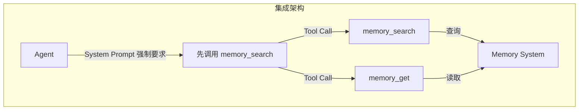
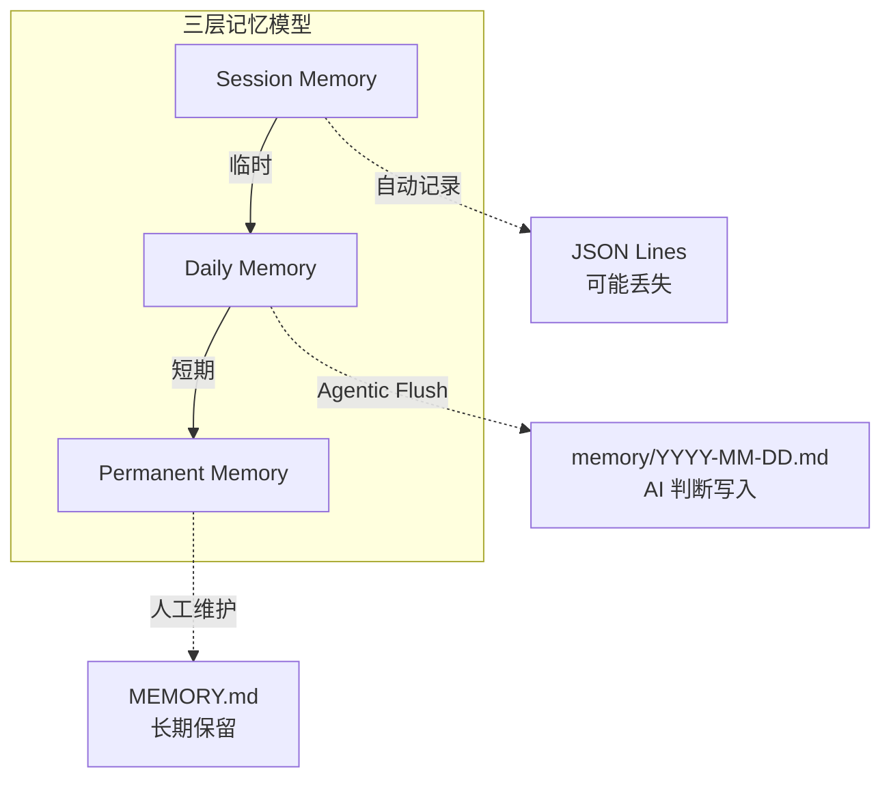
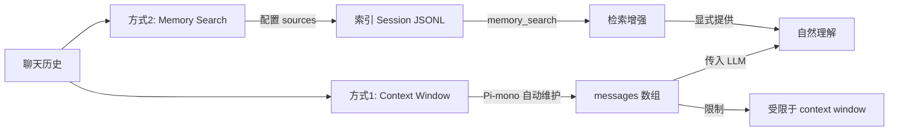
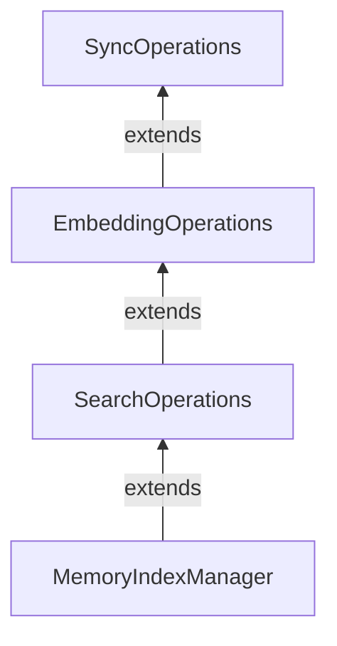
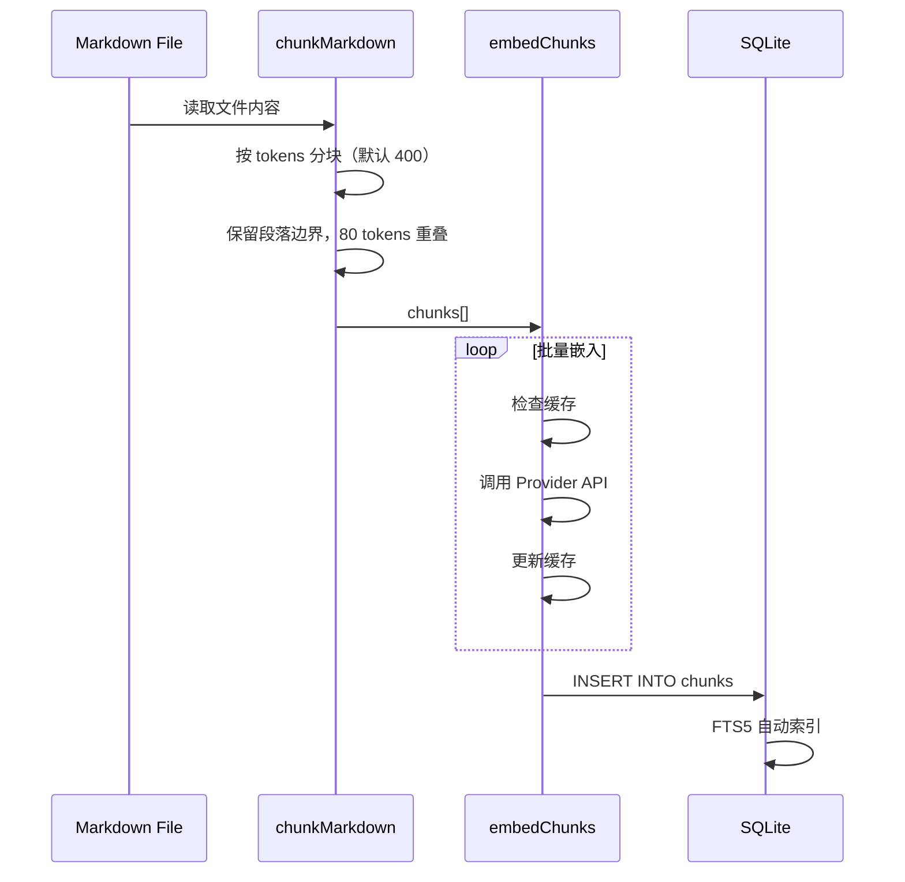
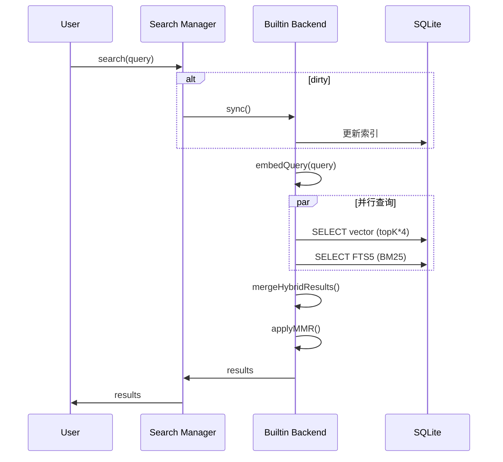

#openclaw #memory #source-code #implementation #sqlite #vector-search

> 深度解析 `openclaw/src/memory/` 目录下的核心实现

## 关键设计决策（宏观视角）

在深入源码之前，先理解 Memory 系统的三个核心设计问题。

### 1. Memory 如何与 Agent 集成？

**答案：作为 Tool 提供给 LLM，而非自动注入。**



**关键决策对比**：

| 方案                        | 机制         | 优点          | 缺点                  |
| ------------------------- | ---------- | ----------- | ------------------- |
| **Tool-based** (OpenClaw) | Agent 显式调用 | ✅ 可控、可观测、精确 | 需要 AI 配合            |
| **Auto-injection**        | 系统自动注入     | 无需 AI 参与    | ❌ 可能注入无关内容、Token 浪费 |

**System Prompt 强制要求** (`src/agents/system-prompt.ts`):
```typescript
"Before answering anything about prior work, decisions, dates, people, 
preferences, or todos: run memory_search on MEMORY.md + memory/*.md; 
then use memory_get to pull only the needed lines."
```

### 2. 什么东西写入了记忆？

**答案：三层分层架构，价值递减。**



| 层级 | 存储 | 写入方式 | 生命周期 |
|------|------|----------|----------|
| **Session** | `sessions/*.jsonl` | 自动记录 | 当前会话，可能丢失 |
| **Daily** | `memory/YYYY-MM-DD.md` | Agentic Flush | AI 判断写入，按日期组织 |
| **Permanent** | `MEMORY.md` | 人工/AI | 长期保留，精选知识 |

**Agentic Flush 机制**：上下文快满时，给 AI 一个特殊 Turn，让 AI 自主判断什么值得写入 `memory/YYYY-MM-DD.md`。如果无需写入，回复 `NO_REPLY` 静默跳过。

### 3. 聊天历史如何保留？

**答案：两种方式互补。**



- **Context Window**：Pi SDK 自动维护，适合当前会话
- **Memory Search**：配置 `sources: ["sessions"]`，通过 Tool 检索历史

---

## 目录结构

```
src/memory/
├── manager.ts                    # MemoryIndexManager 主类
├── manager-sync-ops.ts          # 同步操作基类
├── manager-embedding-ops.ts     # 嵌入操作基类
├── manager-search.ts            # 搜索实现
├── search-manager.ts            # 后端路由
├── hybrid.ts                    # 混合搜索算法
├── mmr.ts                       # MMR 多样性重排
├── temporal-decay.ts            # 时间衰减
├── embeddings*.ts               # 各 Provider 实现
├── memory-schema.ts             # 数据库 Schema
├── qmd-manager.ts               # QMD 后端
└── types.ts                     # 类型定义
```

## 核心类分析

### 1. MemoryIndexManager 主类

**文件**: `manager.ts`

**职责**: 索引管理器的主入口，协调同步、嵌入、搜索三大功能。

**类继承设计**:



**设计意图**: 通过继承链分离职责，避免"上帝类"。

```typescript
// manager.ts
class MemoryIndexManager extends SearchOperations {
  // 主入口方法
  async search(query: string, options?: SearchOptions): Promise<Result[]> {
    // 1. 检查脏数据
    if (this.dirty) await this.sync();
    
    // 2. 执行搜索（在父类 SearchOperations 中实现）
    return super.search(query, options);
  }
}

// manager-search.ts
class SearchOperations extends EmbeddingOperations {
  async search(query: string, options?: SearchOptions) {
    // 向量搜索 + 关键词搜索 + 融合
  }
}

// manager-embedding-ops.ts  
class EmbeddingOperations extends SyncOperations {
  async embedChunks(chunks: Chunk[]) {
    // 批量嵌入 + 缓存
  }
}

// manager-sync-ops.ts
class SyncOperations {
  async sync() {
    // 文件同步 + 索引更新
  }
}
```

**为什么这样设计？**

1. **单一职责**: 每个基类只负责一个方面
2. **可测试性**: 可以单独测试每个基类
3. **可扩展性**: 新增功能只需添加基类

### 2. 同步机制

**文件**: `manager-sync-ops.ts`

#### 核心方法: `sync()`

```typescript
async sync(force: boolean = false): Promise<void> {
  // 防止并发同步
  if (this.syncing) return;
  this.syncing = true;
  
  try {
    // 判断是否需要全量重建
    if (await this.needsFullReindex() || force) {
      await this.runSafeReindex();
    } else {
      // 增量同步
      await this.syncMemoryFiles();
      await this.syncSessionFiles();
    }
  } finally {
    this.syncing = false;
    this.dirty = false;
  }
}
```

**精妙之处**:
- `syncing` 标志防止并发冲突
- 自动判断全量重建 vs 增量同步
- `finally` 确保状态清理

#### 安全重建: `runSafeReindex()`

```typescript
private async runSafeReindex(): Promise<void> {
  const tmpPath = `${this.dbPath}.tmp-${uuid()}`;
  const backupPath = `${this.dbPath}.backup-${uuid()}`;
  
  try {
    // 1. 在临时数据库重建
    await this.rebuildInDatabase(tmpPath);
    
    // 2. 关闭原数据库连接
    await this.closeDatabase();
    
    // 3. 原子替换
    await rename(this.dbPath, backupPath);  // 旧 -> 备份
    await rename(tmpPath, this.dbPath);      // 新 -> 正式
    
    // 4. 删除备份
    await unlink(backupPath);
    
    // 5. 重新连接
    await this.openDatabase();
  } catch (err) {
    // 回滚：从备份恢复
    if (await fileExists(backupPath)) {
      await rename(backupPath, this.dbPath);
    }
    throw err;
  }
}
```

**为什么安全？**
- 原子性: 通过文件重命名实现原子操作
- 零停机: 重建时读旧库，完成后瞬间切换
- 可回滚: 任何步骤失败都能恢复原状

#### 文件监控

```typescript
private setupFileWatcher(): void {
  this.watcher = chokidar.watch([
    "MEMORY.md",
    "memory.md", 
    "memory/**/*.md"
  ], {
    ignoreInitial: true,
    awaitWriteFinish: {
      stabilityThreshold: 1500,  // 1.5秒防抖
      pollInterval: 100
    }
  });
  
  this.watcher.on("change", () => this.markDirty());
}

private markDirty(): void {
  this.dirty = true;
  // 防抖：1.5秒后触发同步
  setTimeout(() => {
    if (this.dirty && !this.syncing) {
      this.sync();
    }
  }, 1500);
}
```

**设计亮点**:
- `chokidar` 跨平台文件监控
- `awaitWriteFinish` 防抖，避免文件写入过程中触发
- `setTimeout` 二次防抖，批量处理文件变更

### 3. 嵌入管理

**文件**: `manager-embedding-ops.ts`

#### 批量嵌入策略

```typescript
private async embedChunksWithBatch(
  chunks: Chunk[],
  provider: EmbeddingProvider
): Promise<Embedding[]> {
  // 1. 检查缓存（关键性能优化）
  const uncachedChunks: Chunk[] = [];
  for (const chunk of chunks) {
    const cached = await this.getCachedEmbedding(chunk.hash);
    if (cached) {
      embeddings.push(cached);
    } else {
      uncachedChunks.push(chunk);
    }
  }
  
  // 2. 批量嵌入
  const batchSize = this.getBatchSize(provider);
  for (let i = 0; i < uncachedChunks.length; i += batchSize) {
    const batch = uncachedChunks.slice(i, i + batchSize);
    const batchEmbeddings = await this.embedWithRetry(batch, provider);
    
    // 3. 更新缓存
    for (let j = 0; j < batch.length; j++) {
      await this.cacheEmbedding(batch[j].hash, batchEmbeddings[j]);
    }
    
    embeddings.push(...batchEmbeddings);
  }
  
  return embeddings;
}
```

**缓存策略**:
- L1: 内存 LRU Cache（进程内）
- L2: SQLite `embedding_cache` 表（持久化）
- 基于内容 hash，内容不变永不过期

**为什么重要？**
- 嵌入 API 调用昂贵（$0.02/1K tokens）
- 缓存命中率通常 > 80%
- 成本降低 90%+

### 4. 搜索实现

**文件**: `manager-search.ts`, `hybrid.ts`

#### 混合搜索流程

```typescript
async search(query: string, options: SearchOptions): Promise<SearchResult[]> {
  // 1. 查询向量化
  const queryVector = await this.embedQueryWithTimeout(query);
  
  // 2. 向量搜索（Top K * 4 候选）
  const vectorResults = await this.searchVector(
    queryVector, 
    options.maxResults * options.candidateMultiplier  // 4x
  );
  
  // 3. 关键词搜索（BM25）
  const keywordResults = await this.searchKeyword(query);
  
  // 4. 融合（hybrid.ts）
  const merged = mergeHybridResults(
    vectorResults, 
    keywordResults,
    options.vectorWeight,    // 默认 0.7
    options.textWeight       // 默认 0.3
  );
  
  // 5. 可选：时间衰减
  if (options.temporalDecay?.enabled) {
    applyTemporalDecay(merged, options.temporalDecay.halfLifeDays);
  }
  
  // 6. 可选：MMR 多样性重排
  if (options.mmr?.enabled) {
    return applyMMRToHybridResults(merged, queryVector, options.mmr.lambda);
  }
  
  // 7. 截断返回
  return merged.slice(0, options.maxResults);
}
```

**候选池扩展策略**:
- 先召回 4 倍结果（默认 6 → 24）
- 给融合算法更多选择空间
- 最后截断到用户请求的 maxResults

## 数据库 Schema 设计

**文件**: `memory-schema.ts`

```sql
-- 元数据表
CREATE TABLE meta (
  key TEXT PRIMARY KEY,
  value TEXT NOT NULL
);
-- 存储: 模型名称、分块参数、schema 版本

-- 文件表
CREATE TABLE files (
  path TEXT PRIMARY KEY,
  source TEXT NOT NULL DEFAULT 'memory',
  hash TEXT NOT NULL,      -- SHA256 内容哈希
  mtime INTEGER NOT NULL,  -- 修改时间
  size INTEGER NOT NULL
);
-- 用于增量同步：对比 hash 判断文件是否变更

-- 块表（核心）
CREATE TABLE chunks (
  id TEXT PRIMARY KEY,
  path TEXT NOT NULL,
  source TEXT NOT NULL DEFAULT 'memory',
  start_line INTEGER NOT NULL,
  end_line INTEGER NOT NULL,
  hash TEXT NOT NULL,      -- 块内容哈希
  model TEXT NOT NULL,     -- 嵌入模型名称
  text TEXT NOT NULL,      -- 原始文本
  embedding TEXT NOT NULL, -- JSON 向量
  updated_at INTEGER NOT NULL
);
-- 向量存储为 JSON 文本，应用层解析计算

-- 嵌入缓存表
CREATE TABLE embedding_cache (
  provider TEXT NOT NULL,
  model TEXT NOT NULL,
  provider_key TEXT NOT NULL,
  hash TEXT NOT NULL,
  embedding TEXT NOT NULL,
  dims INTEGER,
  updated_at INTEGER NOT NULL,
  PRIMARY KEY (provider, model, provider_key, hash)
);
-- 复合主键避免重复计算

-- FTS5 全文搜索虚拟表
CREATE VIRTUAL TABLE chunks_fts USING fts5(
  text, id UNINDEXED, path UNINDEXED, source UNINDEXED
);
-- 自动分词索引
```

**设计决策**:
1. **JSON 存储向量**: 简单通用，不依赖 sqlite-vec 扩展
2. **hash 索引**: 快速判断内容是否变更
3. **FTS5 虚拟表**: SQLite 内置，无需额外依赖

## 关键数据流

### 索引创建流程



### 搜索流程



## 设计亮点总结

1. **分层继承**: 避免上帝类，职责分离清晰
2. **安全重建**: 原子替换，失败可回滚
3. **双重防抖**: 文件监控 + setTimeout
4. **缓存优先**: 嵌入缓存是关键性能优化
5. **候选池扩展**: 4x 召回给融合算法更多选择
6. **JSON 向量**: 简单通用，不依赖扩展

---