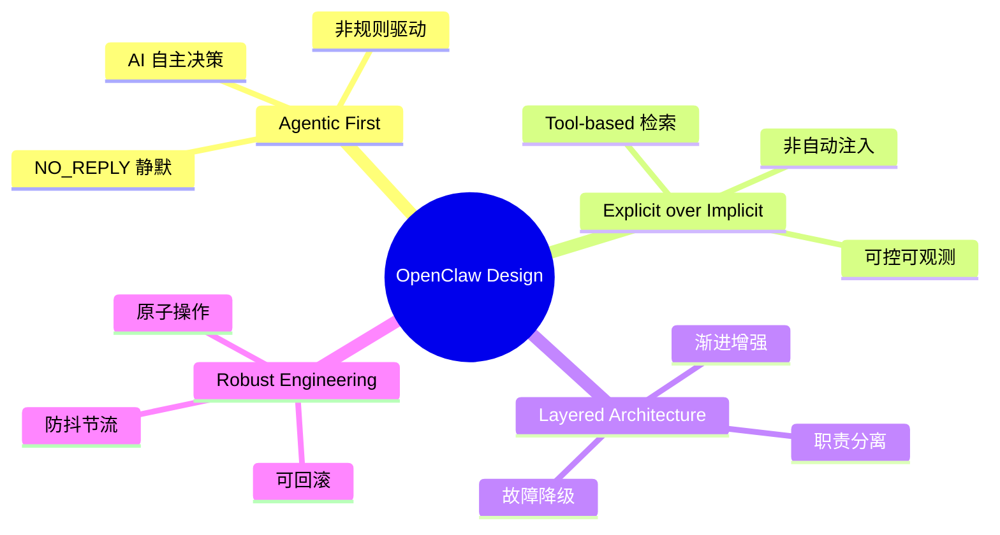
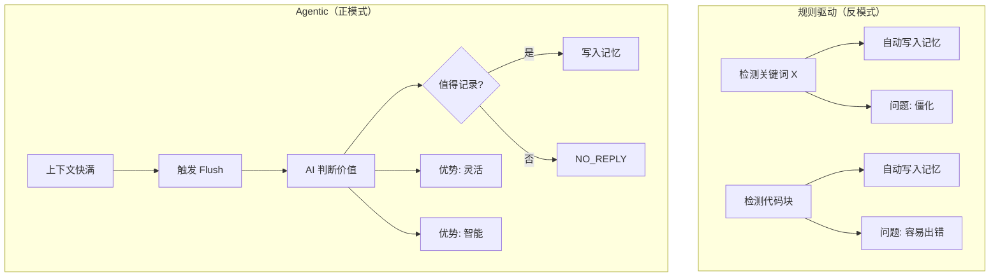
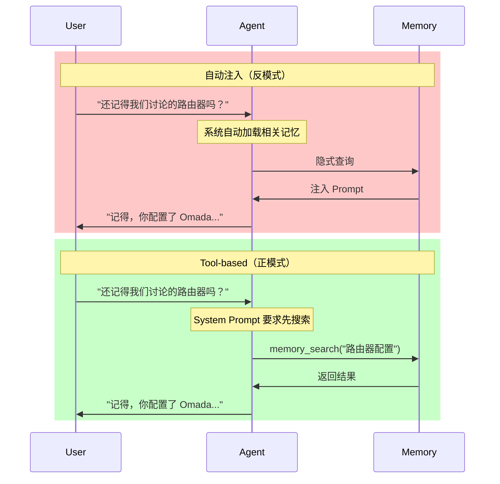
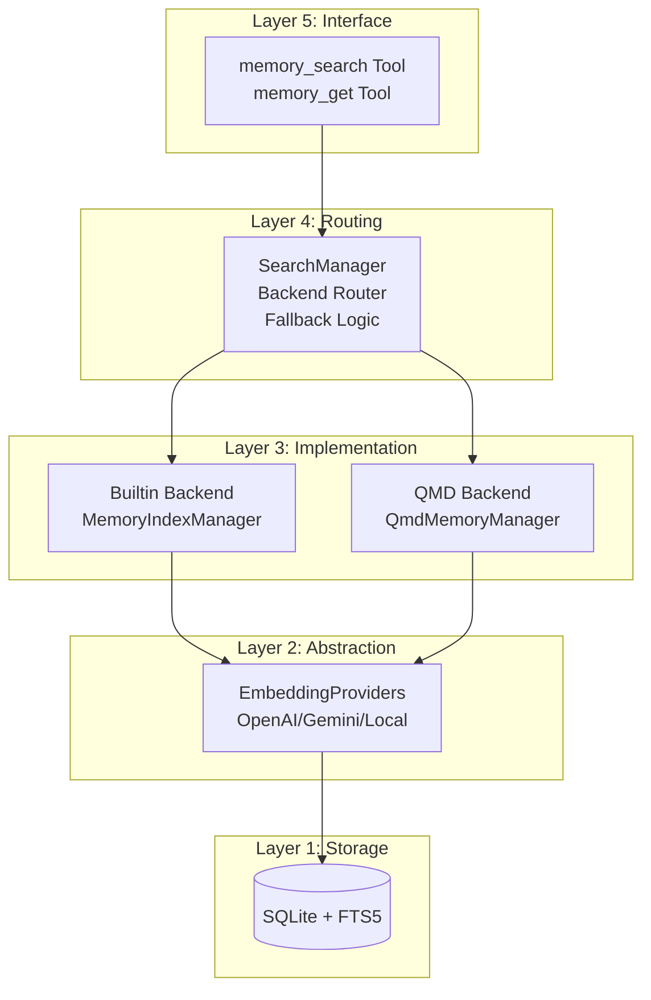
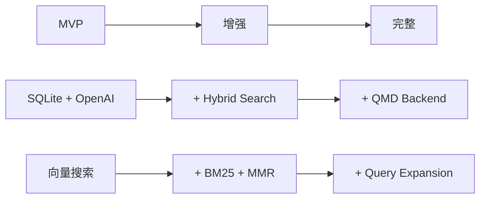
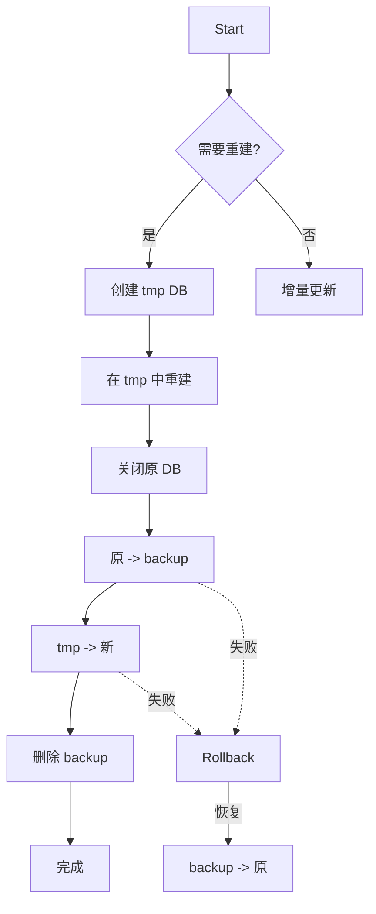
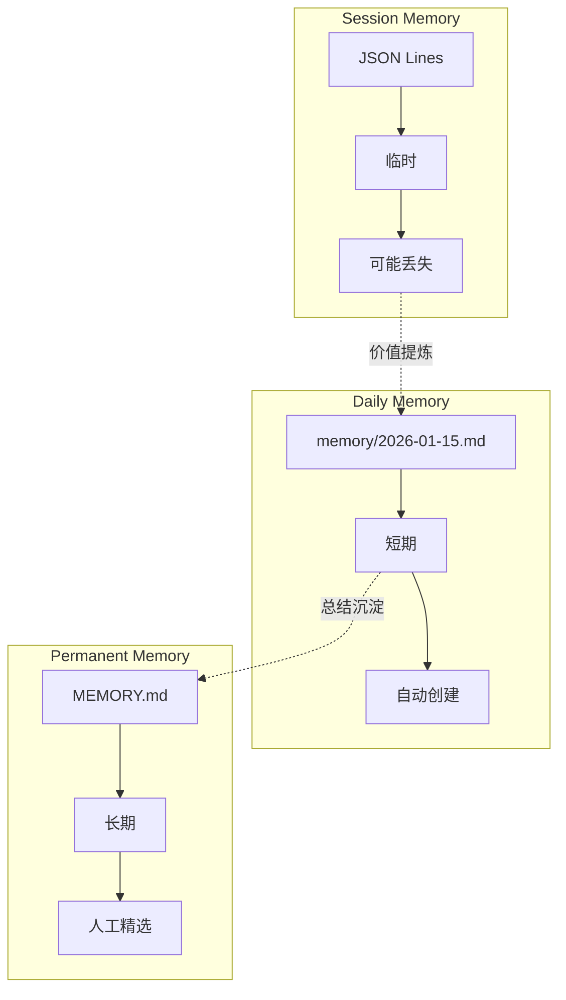
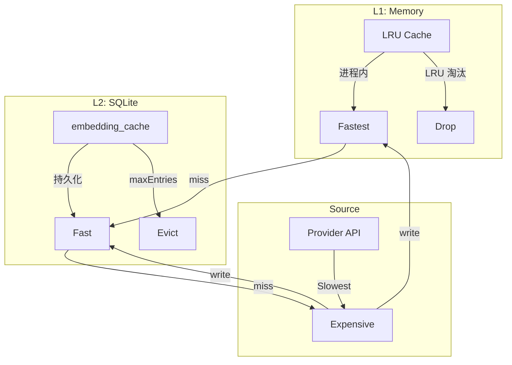
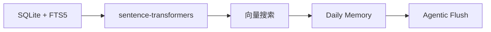

#openclaw #memory #design-principles #agentic #architecture

> 从 Memory 子系统看 OpenClaw 的架构设计哲学

## 核心设计原则



## 一、Agentic 设计：让 AI 自主决策

### 对比：规则驱动 vs Agentic



### Memory Flush 的 Agentic 设计

**场景**: 长会话上下文即将被压缩

**传统方案**:
```python
# 反模式：规则驱动
if "important" in message or "decision" in message:
    save_to_memory(message)
```

**OpenClaw 方案**:
```typescript
// 正模式：Agentic
async function memoryFlush() {
  // 1. 触发条件：上下文快满
  if (totalTokens > threshold) {
    // 2. 给 AI 一个特殊 Turn
    const prompt = `
      Pre-compaction memory flush.
      Store durable memories now (use memory/YYYY-MM-DD.md).
      If nothing to store, reply with NO_REPLY.
    `;
    
    // 3. AI 自主决定写什么
    const response = await agent.generate(prompt);
    
    if (response !== "NO_REPLY") {
      writeToMemory(response);
    }
    // 4. NO_REPLY = 静默跳过，不影响用户体验
  }
}
```

**关键洞察**:
- AI 比规则更懂什么值得记住
- NO_REPLY 让"不操作"也是有效决策
- 非侵入式设计，不打扰正常对话

## 二、显式优于隐式：Tool-based 架构

### 对比：自动注入 vs Tool 调用



### Tool-based 的优势

**1. 可控性**:
```typescript
// System Prompt 强制要求
"Before answering anything about prior work, decisions, dates, 
people, preferences, or todos: run memory_search..."
```

**2. 可观测性**:
- 每次记忆访问都记录在日志
- 可以分析 Agent 的检索策略
- 调试时清楚知道用了哪些上下文

**3. 成本可控**:
- 不每次都加载全部记忆
- 按需检索，减少 Token 消耗

**4. 准确性**:
- 显式检索比隐式注入更精确
- Agent 知道自己在找什么

## 三、分层架构：职责分离与渐进增强

### Memory 系统的五层架构



### 每层的设计意图

| 层级 | 职责 | 设计决策 |
|------|------|----------|
| **Tool** | LLM 接口 | 统一封装，参数校验 |
| **Routing** | 后端选择 | 故障降级，配置切换 |
| **Backend** | 核心逻辑 | 双实现，渐进采用 |
| **Embedding** | 向量化 | 多 Provider，自动回退 |
| **Storage** | 持久化 | SQLite，零依赖 |

### 渐进增强策略



**设计原则**: 基础版本可用，高级功能可选，不强制复杂性。

## 四、鲁棒性工程：故障处理与恢复

### 安全重建机制



**关键点**:
- 原子性: 文件重命名是原子操作
- 零停机: 读旧库，写新库
- 可回滚: 任何步骤失败都能恢复

### 故障降级

```typescript
// search-manager.ts
async search(query: string) {
  try {
    if (this.backend === "qmd") {
      return await this.qmdManager.search(query);
    }
  } catch (err) {
    // QMD 失败，记录日志
    log.warn("qmd failed; switching to builtin");
    
    // 切换到 Builtin
    this.fallbackToBuiltin();
  }
  
  // 使用 Builtin 兜底
  return this.builtinManager.search(query);
}
```

**设计原则**: 优雅降级，保证核心功能可用。

### 防抖与节流

**文件监控防抖**:
```typescript
// 双重防抖
watcher = chokidar.watch(patterns, {
  awaitWriteFinish: {
    stabilityThreshold: 1500,  // 第一层: 写入完成防抖
    pollInterval: 100
  }
});

markDirty() {
  this.dirty = true;
  setTimeout(() => {      // 第二层: 事件聚合防抖
    if (this.dirty) this.sync();
  }, 1500);
}
```

**为什么重要？**
- 避免文件写入过程中触发同步
- 批量处理文件变更（如 git checkout）
- 减少不必要的索引更新

## 五、分层存储：信息价值的生命周期

### 三层记忆架构



### 信息衰减策略

```
Session:    ████████████████████  临时，当前会话
               ↓ Flush
Daily:      ████████████████░░░░  短期，按日期组织  
               ↓ 总结
Permanent:  ██████████░░░░░░░░░░  长期，精选知识
```

**设计意图**: 不是所有信息都值得永久保存，分层衰减减少噪声。

## 六、缓存策略：性能优化的艺术

### 两级缓存设计



**为什么有效？**
- 命中率 > 80%（典型场景）
- 成本降低 90%+
- 搜索速度提升 10x+

**失效策略**: 基于内容 hash，内容不变永不过期。

## 七、设计决策权衡

### 关键决策回顾

| 决策 | 选择 | 理由 | 代价 |
|------|------|------|------|
| **后端架构** | Builtin + QMD | 渐进采用，故障降级 | 维护两套代码 |
| **向量存储** | JSON in SQLite | 简单，无依赖 | 查询性能 |
| **检索方式** | Tool-based | 可控，可观测 | Agent 需显式调用 |
| **写入策略** | Agentic Flush | 智能，灵活 | 实现复杂 |
| **缓存策略** | Hash-based | 永不过期 | 存储增长 |

### 取舍的艺术

**性能 vs 简单性**:
- 选择: JSON 存储而非专用向量数据库
- 理由: 简单性优先，性能通过缓存弥补

**自动化 vs 可控性**:
- 选择: Tool-based 而非自动注入
- 理由: 可控性优先，AI 更懂何时检索

**智能 vs 确定性**:
- 选择: Agentic 而非规则驱动
- 理由: 智能优先，接受一定的非确定性

## 八、给 dm_claw 的启示

### 值得借鉴的模式

1. **Agentic 设计**: 让 AI 自主决策写入内容
2. **Tool-based 检索**: 显式调用，可控可观测
3. **分层架构**: 5 层分离，职责清晰
4. **安全重建**: 原子操作，失败可回滚
5. **双后端**: 默认可用，高级功能可选
6. **两级缓存**: 内存 + 持久化，命中率 > 80%

### 可以改进的地方

1. **向量存储**: Python 可用更高效的方案（如 FAISS）
2. **查询扩展**: Python 生态有更多 IR 库可用
3. **多模态**: 可考虑支持图片、音频记忆

### 最小可行产品 (MVP)



**核心功能**:
- SQLite + Python embedding
- 向量搜索
- Daily Memory 写入
- Flush 触发机制

**不需要的功能（初期）**:
- Hybrid Search
- MMR 重排
- Session Indexing
- QMD Backend

## 总结

OpenClaw Memory 系统的设计哲学:

1. **Agentic**: 让 AI 做决策，而非硬编码规则
2. **Explicit**: 显式 Tool 调用，可控可观测
3. **Layered**: 分层架构，渐进增强
4. **Robust**: 原子操作，故障降级
5. **Smart**: 智能缓存，性能优化

这些原则不仅适用于 Memory 系统，也可以指导其他 AI 系统的设计。

---

*相关文档: [[openclaw_overview|项目概览]], [[openclaw_memory_源码|Memory 源码分析]], [[openclaw_混合搜索|混合搜索技术]]*
