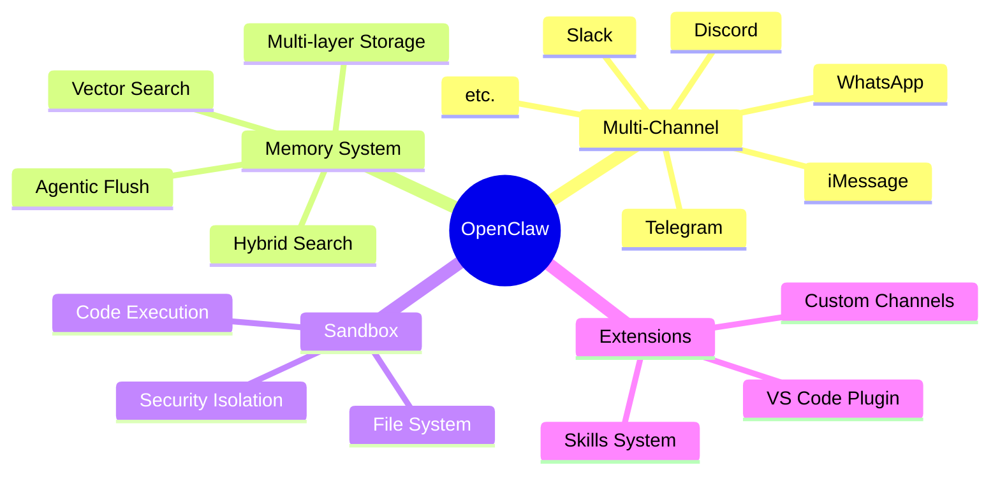
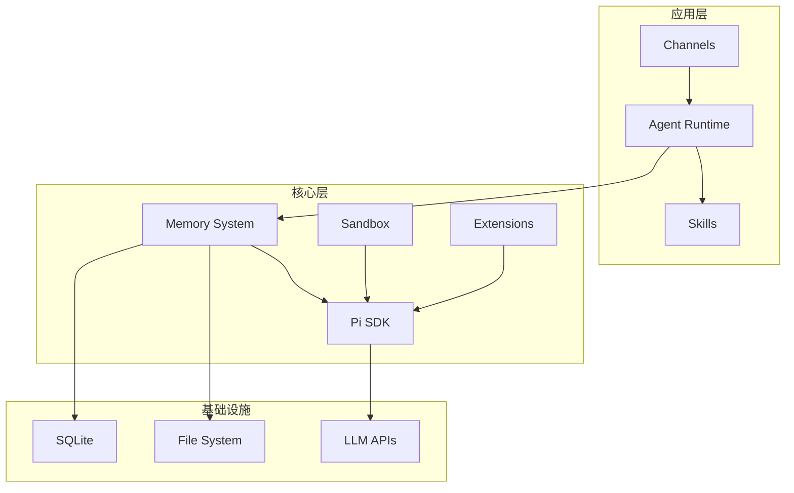
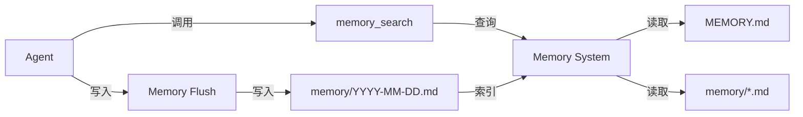

#openclaw #project-overview #architecture #ai-agent

## 项目背景

OpenClaw 是一个**多通道 AI Agent 平台**，基于 **Pi SDK** 构建。它允许开发者通过多种渠道（WhatsApp、Discord、Telegram 等）与 AI Agent 交互，并提供了完整的记忆、沙箱、扩展等生态系统。

## 核心功能



## 技术栈

| 层级 | 技术 | 说明 |
|------|------|------|
| **底层引擎** | Pi SDK | @mariozechner/pi-* 包 |
| **核心实现** | TypeScript | Node.js 22+ |
| **数据存储** | SQLite | FTS5, 可选 sqlite-vec |
| **嵌入模型** | OpenAI/Gemini/Local | 多 Provider 支持 |
| **外部服务** | QMD | TypeScript CLI 工具 |

## 架构特点

### 1. 分层架构



### 2. 依赖关系

```
pi-mono (底层引擎)
    ↓ npm 包
openclaw (集成层)
    ↓ 扩展
channels / skills / extensions
```

## Memory 子系统定位

在 OpenClaw 中，Memory 系统负责**长期记忆的存储和检索**，是 Agent 能够"记住"跨会话信息的关键组件。

### 核心职责

1. **向量索引**: 将 Markdown 文档索引为可语义搜索的向量
2. **混合搜索**: 结合向量相似度和 BM25 全文搜索
3. **智能同步**: 文件变更实时感知，增量索引
4. **Agentic Flush**: 上下文压缩前自动保存重要记忆

### 与其他组件的关系



## 与同类项目对比

| 特性 | OpenClaw | Claude Desktop | LangChain Memory |
|------|----------|----------------|------------------|
| 持久化 | ✅ 文件系统 | ❌ 会话级 | ⚠️ 依赖外部存储 |
| 语义搜索 | ✅ Hybrid | ❌ 无 | ✅ 向量存储 |
| 自动保存 | ✅ Agentic Flush | ❌ 无 | ❌ 无 |
| 多层级 | ✅ 3层 | ❌ 1层 | ⚠️ 可配置 |
| 双后端 | ✅ Builtin+QMD | ❌ 无 | ❌ 无 |

## 文档索引

### Memory 系统
- [[openclaw_memory_源码|Memory 源码分析]] - 源码实现细节
- [[openclaw_混合搜索|混合搜索技术]] - Hybrid Search + MMR 算法
- [[openclaw_memory_设计思想|Memory 设计思想]] - 架构设计哲学
- [[openclaw_qmd_backend|QMD 后端分析]] - TypeScript CLI 组件详解

### 其他模块（待补充）
- Sandbox 系统
- Channels 架构
- Skills 系统

